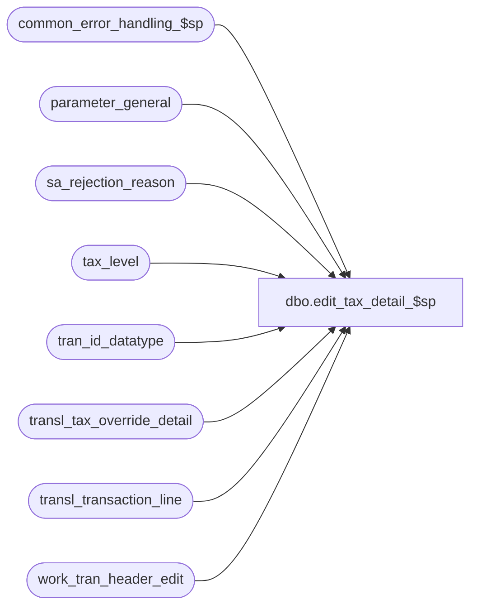

# dbo.edit_tax_detail_$sp

**Database:** auditworks  
**Server:** bedrockdb01  

## Architecture Diagram



## Table Dependencies

| Referenced Table |
|---|
| common_error_handling_$sp |
| parameter_general |
| sa_rejection_reason |
| tax_level |
| tran_id_datatype |
| transl_tax_override_detail |
| transl_transaction_line |
| work_tran_header_edit |

## Stored Procedure Code

```sql
create proc dbo.edit_tax_detail_$sp 


 @errmsg nvarchar(2000) OUTPUT,
 @edit_process_no	tinyint = 1

AS

/*
Proc Name: edit_tax_detail_$sp
Desc : (EDIT) post tax details.
  Called by edit_post_$sp.

HISTORY
DATE     NAME         DEF# DESC
Dec12,14 Paul    TFS-94103 use try catch
Sep01,06 Phu         76719 Want a non-null string when it's concatenated with null string.
Apr28,05 Paul      DV-1234 expand transaction_id to use tran_id_datatype
Dec14,04 Maryam    DV-1191 Improve performance.
Nov20,02 Paul         5183 call common_error_handling_$sp with abort_flag = 3 when logging warnings
Nov26,01 Winnie	   1-969YY Add logic for R3 error handling to pass @edit_process_no
Nov12,01 Sab          8900 TRANSL edit changes for Sybase
Aug28,01 Sab          8567 Prevent error -2601 by causing an SA reject for the transactions erroring during the tax level swap
Aug10,01 Maryam       8283 remove i/f reject logic for type 7.
Jun21,01 Paul         8192 remove i/f reject logic for type 8
May02,01 Maryam       7795 Support the translate functionality when they provide log tax-override 
                           records when there is absolutely no tax override involved in the 
                           transaction.It broke in defect 6795.
Jan23,01 Vicci        7277 Only verify merch, fee, tax, expense lines.
Mar24,00 Daphna       6087 add DISTINCT to inserts to work_interface_reject_edit
Dec08,99 Paul         5544 Check type 8 i/f rejects for tax overrides.
Dec08,99 JimC         5955 Bumped version (copied 1.09) to force re-save in B10 upgr.
Mar26,99 Vicci        v1.09 Last modified
Feb04,97 Paul         v1.08
Author   Paul
*/

DECLARE @entry_date_time			datetime,
	@errmsg2				nvarchar(2000),
	@errline				int,
	@errno				int,
	@exception_jurisdiction_check	tinyint,
	@open_cursor			tinyint,
	@register_no			smallint,
	@rows 				int,
	@store_no			int,
	@str_register_no		nvarchar(30),
	@str_store_no			nvarchar(30),
	@str_transaction_date 		nvarchar(30),
	@str_transaction_no 		nvarchar(30),
	@tax_override_lookup		tinyint,
	@transaction_id			tran_id_datatype,
	@transaction_no			int,
	@transaction_series		nchar(1),
	@message_id		        int,	
	@object_name	         	nvarchar(255),	
	@operation_name		         nvarchar(100),
	@process_name	          	nvarchar(100);  	

SET CONCAT_NULL_YIELDS_NULL OFF;

SELECT 	@open_cursor = 0,
        @process_name = 'edit_tax_detail_$sp',
        @message_id = 201068;

BEGIN TRY

/* Goal is to eliminate from the insert the transl_tax_override_details which the
   translate had left up to the edit_header_$sp to evaluate, for example sends to a store in
   the same jurisdiction or returns from a store in the same jurisdiction etc 
   THE pos_tax_jurisdiction IS NULL ... is used in the join to eliminate the case where 
   translate gave standard category tax override detail but no tax_jurisdiction_store nor
   pos_tax_jurisdiction.*/

   SELECT @errmsg = 'Failed to update transl_tax_override_detail',
          @object_name = 'transl_tax_override_detail',
          @operation_name = 'UPDATE';
UPDATE transl_tax_override_detail
   SET transaction_id = wh.transaction_id,
	exception_tax_jurisdiction = SUBSTRING((LTRIM(td.exception_tax_jurisdiction + pos_tax_jurisdiction)),1,5)
  FROM transl_tax_override_detail td, work_tran_header_edit wh WITH (NOLOCK)
 WHERE wh.store_no = td.store_no
   AND wh.register_no = td.register_no
   AND wh.entry_date_time = td.entry_date_time
   AND wh.transaction_series = td.transaction_series
   AND wh.transaction_no = td.transaction_no
   AND wh.tax_override_flag = 1
   AND (((wh.pos_tax_jurisdiction IS NULL OR pos_tax_jurisdiction = ' ') AND tax_category > 0)
        OR (pos_tax_jurisdiction IS NOT NULL AND pos_tax_jurisdiction <> ' ') );

SELECT @rows = @@rowcount;

IF @rows = 0
  RETURN;

   SELECT @errmsg = 'Failed to select tax_override_lookup',
          @object_name = 'parameter_general',
  @operation_name = 'SELECT';
SELECT @tax_override_lookup = tax_override_lookup
  FROM parameter_general;


/* Due to PST vs HST situation */
IF @tax_override_lookup >= 1
  BEGIN
    SELECT @errmsg = 'Failed to create temp table #work_tax',
          @object_name = '#work_tax',
          @operation_name = 'CREATE TABLE';
    CREATE TABLE #work_tax (transaction_id numeric(14,0) null, -- tran_id_datatype
	                store_no int not null,
	                register_no smallint not null,
	                entry_date_time datetime not null,
	                transaction_series nchar(1) not null,
	                transaction_no int not null,
	                orig_tax_level tinyint not null,
	                tax_level tinyint not null,
	                tax_category smallint not null);

	SELECT @errmsg = 'Failed to insert into temp table #work_tax',
               @object_name = '#work_tax',
               @operation_name = 'INSERT';
    INSERT INTO #work_tax(
           transaction_id,
           store_no,
           register_no,
           entry_date_time,
           transaction_series,
           transaction_no,
           orig_tax_level,
           tax_level,
           tax_category)
    SELECT DISTINCT td.transaction_id,
	   td.store_no,
	   td.register_no,
	   td.entry_date_time,
	   td.transaction_series,
	   td.transaction_no,
	   td.tax_level,
	   lv.tax_level,
	   td.tax_category      
      FROM transl_tax_override_detail td WITH (NOLOCK),
           transl_transaction_line tl WITH (NOLOCK),
           tax_level lv
     WHERE td.transaction_id IS NOT NULL
       AND td.store_no = tl.store_no
       AND td.register_no = tl.register_no
       AND td.entry_date_time = tl.entry_date_time
       AND td.transaction_series = tl.transaction_series
       AND td.transaction_no = tl.transaction_no
       AND td.line_id = tl.line_id
       AND tl.line_object_type = 5
       AND tl.line_object = lv.line_object;

   SELECT @errmsg = 'Failed to update transl_tax_override_detail from #work_tax',
                  @object_name = 'transl_tax_override_detail',
                  @operation_name = 'UPDATE',
                  @errno = 0;
   BEGIN TRY
    UPDATE transl_tax_override_detail
       SET tax_level = wt.tax_level
      FROM #work_tax wt WITH (NOLOCK), transl_tax_override_detail td
     WHERE td.store_no = wt.store_no
       AND td.register_no = wt.register_no
       AND td.entry_date_time = wt.entry_date_time
       AND td.transaction_series = wt.transaction_series
       AND td.transaction_no = wt.transaction_no
       AND td.tax_level = orig_tax_level
       AND td.tax_level != wt.tax_level;

   END TRY
   BEGIN CATCH;
        SELECT @errno = ERROR_NUMBER(),
		@errline = ERROR_LINE();

        SELECT @errmsg = CONVERT(nvarchar, @errno) + ':' + @process_name + ':' + CONVERT(nvarchar, @errline) + ':'
               + COALESCE(@errmsg, ' ') + ':' + ERROR_MESSAGE();
        IF @errno NOT IN (0, 2601)
          GOTO business_error;
   END CATCH;

   IF @errno = 2601
	 BEGIN
		SELECT @errmsg = 'Failed to open cursor duplicate_row_crsr',
                       @object_name = 'duplicate_row_crsr',
                       @operation_name = 'OPEN';
	   DECLARE duplicate_row_crsr CURSOR  FAST_FORWARD
            FOR	   
	   SELECT DISTINCT transaction_id
		  store_no,
		  register_no,
		  entry_date_time,
		  transaction_series,
		  transaction_no
	     FROM #work_tax WITH (NOLOCK)
	    WHERE orig_tax_level != tax_level;

	   OPEN duplicate_row_crsr;
	   SELECT @open_cursor = 1;

	   WHILE 1=1
	    BEGIN
	      FETCH duplicate_row_crsr INTO
			@transaction_id,
			@store_no,
			@register_no,
			@entry_date_time,
			@transaction_series,
			@transaction_no;

	      IF @@fetch_status <> 0
		BREAK;

	      SELECT @errno = 0,
	             @errmsg = 'Failed to set tax_level (cursor)',
                      @object_name = 'transl_tax_override_detail',
                      @operation_name = 'UPDATE';
	      BEGIN TRY
	      UPDATE transl_tax_override_detail
		 SET tax_level = wt.tax_level
		FROM #work_tax wt WITH (NOLOCK), transl_tax_override_detail td
	       WHERE td.store_no = @store_no
		 AND td.register_no = @register_no
		 AND td.entry_date_time = @entry_date_time
		 AND td.transaction_series = @transaction_series
		 AND td.transaction_no = @transaction_no
		 AND td.transaction_id = wt.transaction_id
		 AND td.tax_level = orig_tax_level
		 AND td.tax_level != wt.tax_level;

	      END TRY
	      BEGIN CATCH;
	        SELECT @errno = ERROR_NUMBER(),
			@errline = ERROR_LINE();

	        SELECT @errmsg = CONVERT(nvarchar, @errno) + ':' + @process_name + ':' + CONVERT(nvarchar, @errline) + ':'
	               + COALESCE(@errmsg, ' ') + ':' + ERROR_MESSAGE();	      
	        IF @errno NOT IN (0, 2601)
	          GOTO business_error;
	      END CATCH;

	      IF @errno = 2601 -- (inner)
		 BEGIN
			SELECT @errmsg = 'Failed to insert sa_rejection_reason (reason=15)',
                               @object_name = 'sa_rejection_reason',
                               @operation_name = 'INSERT';
		   INSERT sa_rejection_reason (
			  transaction_id,
			  line_id,
			  violated_sareject_rule )
		   VALUES (@transaction_id,
			  0,
			  15);

			SELECT @errmsg = 'Failed to update transaction_header (sa_rejection_flag)',
                               @object_name = 'work_tran_header_edit',
                               @operation_name = 'UPDATE';
		   UPDATE work_tran_header_edit
		      SET sa_rejection_flag = 1
		    WHERE transaction_id = @transaction_id
		      AND sa_rejection_flag = 0;

			SELECT @errmsg = 'Failed to select str_store_no from work_tran_header_edit',
                               @object_name = 'work_tran_header_edit',
                               @operation_name = 'SELECT';
		   SELECT @str_store_no = convert(nvarchar(30),store_no),
		   	  @str_register_no = convert(nvarchar(30),register_no),
		   	  @str_transaction_date = convert(nvarchar(30),transaction_date),
		   	  @str_transaction_no = convert(nvarchar(30),transaction_no)
		     FROM work_tran_header_edit WITH (NOLOCK)
		    WHERE transaction_id = @transaction_id;

		   SELECT @errmsg = 'Duplicate tax levels were found for store=>' + @str_store_no + ', date=>' + @str_transaction_date
				 + ' register=>' + @str_register_no + ' transaction_no=>' + @str_transaction_no;
		   EXEC common_error_handling_$sp 4, 201732, @errmsg, 3, 201732, 
	                   @process_name, @object_name, @operation_name, 1,  @edit_process_no, 0, null,0,
	                   @str_store_no, @str_register_no, @str_transaction_no, @str_transaction_date;
		   		   		   
		   SELECT @errmsg = NULL;  
   	            CONTINUE;

	       END; /* If @errno = 2601 (inner) */

	    END; /* WHILE 1=1 */

	   CLOSE duplicate_row_crsr;
	   DEALLOCATE duplicate_row_crsr;
	   SELECT @open_cursor = 0;

   END; /* If @errno = 2601 */


   IF @tax_override_lookup >= 2
      BEGIN
            SELECT @errmsg = 'Failed to update transl_tax_override_detail (tax_category)',
                   @object_name = 'transl_tax_override_detail',
                   @operation_name = 'UPDATE';
        UPDATE transl_tax_override_detail
           SET tax_category = wt.tax_category
          FROM #work_tax wt WITH (NOLOCK), transl_tax_override_detail td
	 WHERE td.store_no = wt.store_no
	   AND td.register_no = wt.register_no
	   AND td.entry_date_time = wt.entry_date_time
	   AND td.transaction_series = wt.transaction_series
	   AND td.transaction_no = wt.transaction_no
           AND td.tax_category != wt.tax_category;
      END;

   DROP TABLE #work_tax;

  END; /* If @tax_override_lookup >= 1 */


RETURN;

	
business_error:   /* Business Rule handler. */

	SELECT @errmsg2 = @errmsg;

	/* Could include similar cleanup code to system error trap when needed (example is from move_store_$sp).
	   However, could also exclude the cleanup code here since the outer system error catch should fire again after the exec below. */

	EXEC common_error_handling_$sp 4, @errno, @errmsg, 0, @message_id, 
	  @process_name, @object_name, @operation_name, 1,  @edit_process_no;
	  /* Note: when the exec above raises an error, that action also fires the system error trap (below) */
	RETURN;
END TRY

BEGIN CATCH; -- trap system errors
    /* common error handling. Appending proc name here because a rollback could occur if called within a transaction. */

        SELECT @errno = ERROR_NUMBER(),
		@errline = ERROR_LINE();

        SELECT @errmsg = CONVERT(nvarchar, @errno) + ':' + @process_name + ':' + CONVERT(nvarchar, @errline) + ':'
               + COALESCE(@errmsg, ' ') + ':' + ERROR_MESSAGE();

	 /* this condition will only be true when raise error in traps above fire this general catch */
	IF @errmsg2 IS NOT NULL
	  SELECT @errmsg = @errmsg2;

	IF @open_cursor = 1
	BEGIN
	   CLOSE duplicate_row_crsr
	   DEALLOCATE duplicate_row_crsr
	END
	
	EXEC common_error_handling_$sp 4, @errno, @errmsg, 0, @message_id, 
	  @process_name, @object_name, @operation_name, 1,  @edit_process_no;

	RETURN;
END CATCH;
```

