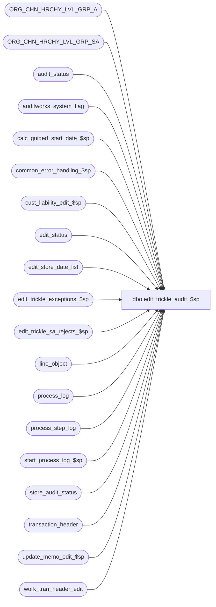

# dbo.edit_trickle_audit_$sp

**Database:** auditworks  
**Server:** bedrockdb01  

## Architecture Diagram



## Table Dependencies

| Referenced Table |
|---|
| ORG_CHN_HRCHY_LVL_GRP_A |
| ORG_CHN_HRCHY_LVL_GRP_SA |
| audit_status |
| auditworks_system_flag |
| calc_guided_start_date_$sp |
| common_error_handling_$sp |
| cust_liability_edit_$sp |
| edit_status |
| edit_store_date_list |
| edit_trickle_exceptions_$sp |
| edit_trickle_sa_rejects_$sp |
| line_object |
| process_log |
| process_step_log |
| start_process_log_$sp |
| store_audit_status |
| transaction_header |
| update_memo_edit_$sp |
| work_tran_header_edit |

## Stored Procedure Code

```sql
CREATE proc  dbo.edit_trickle_audit_$sp 
@process_id 		binary(16),
@edit_process_no	tinyint,
@trickle_polling_flag	tinyint,
@process_timestamp	float,
@prev_edit_status	tinyint = 0  --status:  0=done, 1=trans posting incomplete, 2=trans posting done, trickle-audit counts / C/L posting (orders or trickle) incomplete, 3=trickle-audit transaction release outstanding (must happen before edit header wipes out work table and after media rec done)
AS

/* 
PROC NAME: edit_trickle_audit_$sp
     DESC: EDIT posting program ( Phase I ) trickle audit handling of s/a rejects, i/f rejects, exceptions, 
           and stream1-on-behalf-of-all-streams C/L posting.

           Called twice from edit_post_$sp, once before media rec to get counts set, and once after to release transactions.

Please ensure that the proc script contains the following at the top in order to support scaleout:
SET ANSI_NULLS ON
SET ANSI_WARNINGS ON

     Unicode version.

HISTORY
Date     Name		Def# Desc
May20,16 Vicci      DAOM-730 Relocate missing-to-unused update to edit_trickle_sa_rejects_$sp;
May13,16 Vicci      DAOM-730 Don't set edit_progress_flag nor trickle_counts_flag if not in trickle audit mode (since this is also for order auto-completion).
                             This was accidentally cause by bad begin/end position.
                             Correct any missing status that should become unused as a result of another register with the same parent having arrived.
                             Use process timestamp passed by edit so that process log entry for C/L posting references the correct edit batch.
                             Double check whether a previously downgraded store reg date trickling in current batch can be marked as verified. 
                             Double check that store audit status to matches audit status.
                             Don't release transactions unless called with a @prev_edit_status of 3 (second pass after media rec).
Jan25,16 Vicci    TFS-155137 Cut and paste logic out of edit (with check on batch ended removed since batch is not ended until this runs) 
                             and into separate proc to allow it to be called in recovery mode.
*/

DECLARE 
	@errmsg				nvarchar(2000),
	@errmsg2			nvarchar(2000),
	@errno				int,
	@glc_timestamp			float,
	@object_name			nvarchar(255),
	@process_name			nvarchar(100),
	@operation_name			nvarchar(100),
	@message_id			int,
	@trace_msg			nvarchar(255),
	@process_no 			smallint,
	@step_no 			smallint,
	@transaction_date		smalldatetime,
	@user_id			int;

SELECT @process_no = 4, /* edit - phase 1 */
       @process_name = 'edit_trickle_audit_$sp',
       @message_id = 201068,
       @user_id = -1,  
       @operation_name = 'SELECT',
       @glc_timestamp = @process_timestamp;

BEGIN TRY

/* When in trickle audit mode, calculate the s/a rejects, i/f rejects, exceptions, 
   and glc posting from here rather then in phase2. */

SELECT @errmsg = 'Failed to determine if in trickle audit mode or order auto-completion is active. ',
       @object_name = 'line_object',
       @operation_name = 'SELECT';
IF @trickle_polling_flag >= 2 OR EXISTS (SELECT 1 FROM line_object WHERE line_object = -5 AND active_flag = 1)
BEGIN
  IF @prev_edit_status <= 2  
  BEGIN
    /* call GLC posting */
    SELECT @errmsg = 'Failed to execute stored procedure start_process_log_$sp. ',
           @object_name = 'start_process_log_$sp',
           @operation_name = 'EXECUTE';
    EXEC start_process_log_$sp 15, @glc_timestamp OUTPUT, @errmsg OUTPUT;

    SELECT @trace_msg = NCHAR(13) + NCHAR(10) + ':LOG && cust_liability_edit_$sp: ' + CONVERT(nchar, getdate(), 8),
           @step_no = 23;
    PRINT @trace_msg;

    SELECT @errmsg = 'Failed to update process_step_log to step_no ' + convert(nvarchar, @step_no) + '. ',
           @object_name = 'process_step_log',
           @operation_name = 'UPDATE';
    UPDATE process_step_log
       SET process_step_no = @step_no,
           process_step_start_time = getdate()
     WHERE process_no = 4
       AND stream_no = @edit_process_no;

    /* R3 customer liability */  
    SELECT @errmsg = 'Failed to execute stored procedure cust_liability_edit_$sp. ',
           @object_name = 'cust_liability_edit_$sp',
           @operation_name = 'EXECUTE';
    EXEC cust_liability_edit_$sp @process_id = @process_id, @current_user_id = @user_id,
                               @function_no = @process_no, @errmsg = @errmsg OUTPUT,
			       @log_error_flag = 1, @edit_process_no = @edit_process_no,
			       @glc_timestamp = @glc_timestamp;  

    --no need to bump edit_status since cust_liability_edit_$sp is rerunnable
    
    SELECT @errmsg = 'Failed to update process_log. ',
   	   @object_name = 'process_log',
	   @operation_name = 'UPDATE';
    UPDATE process_log
       SET process_end_time = getdate(),
  	   process_status_flag = 2
     WHERE process_timestamp = @glc_timestamp
       AND process_no = 15;

    /* set memo fields in if_rejection_reason */
    SELECT @step_no = 30;
    SELECT @errmsg = 'Failed to update process_step_log to step_no ' + convert(nvarchar, @step_no) + '. ',
           @object_name = 'process_step_log',
           @operation_name = 'UPDATE';
    UPDATE process_step_log
       SET process_step_no = @step_no,
           process_step_start_time = getdate()
     WHERE process_no = 4
       AND stream_no = @edit_process_no;
       
    SELECT @errmsg = 'Failed to execute stored procedure update_memo_edit_$sp. ',
           @object_name = 'update_memo_edit_$sp',
           @operation_name = 'EXECUTE';
    EXEC update_memo_edit_$sp @errmsg OUTPUT, @process_no, @edit_process_no;

    --no need to bump edit_status since update_memo_edit_$sp is rerunnable

    IF @trickle_polling_flag >= 2
    BEGIN
      /* set sa_rejection_qty, valid_qty, if_reject_qty in audit_status */
      SELECT @trace_msg = NCHAR(13) + NCHAR(10) + ':LOG && trickle_sa_rejects: ' + CONVERT(nchar, getdate(), 8),
             @step_no = 27;
      PRINT @trace_msg;
 
      SELECT @errmsg = 'Failed to update process_step_log to step_no ' + convert(nvarchar, @step_no) + '. ',
             @object_name = 'process_step_log',
             @operation_name = 'UPDATE';
      UPDATE process_step_log
         SET process_step_no = @step_no,
	     process_step_start_time = getdate()
       WHERE process_no = 4
         AND stream_no = @edit_process_no;
        
      SELECT @errmsg = 'Failed to execute stored procedure edit_trickle_sa_rejects_$sp. ',
             @object_name = 'edit_trickle_sa_rejects_$sp',
             @operation_name = 'EXECUTE';
      EXEC edit_trickle_sa_rejects_$sp @errmsg OUTPUT, @edit_process_no;

      --no need to bump edit_status since edit_trickle_sa_rejects_$sp is rerunnable
    
      --create exceptions where necessary 
      SELECT @trace_msg = NCHAR(13) + NCHAR(10) + ':LOG && edit_trickle_exceptions: ' + CONVERT(nchar, getdate(), 8),
             @step_no = 66;
      PRINT @trace_msg;
    
      SELECT @errmsg = 'Failed to update process_step_log to step_no ' + convert(nvarchar, @step_no) + '. ',
             @object_name = 'process_step_log',
             @operation_name = 'UPDATE';
      UPDATE process_step_log
         SET process_step_no = @step_no,
    	     process_step_start_time = getdate()
       WHERE process_no = 4
         AND stream_no = @edit_process_no;
    
      SELECT @errmsg = 'Failed to execute stored procedure edit_trickle_exceptions_$sp. ',
             @object_name = 'edit_trickle_exceptions_$sp',
             @operation_name = 'EXECUTE';
      EXEC edit_trickle_exceptions_$sp @process_id, @user_id, @errmsg OUTPUT, @edit_process_no;
      
      SELECT @errmsg = 'Failed to UPDATE edit_status (trickle_audit exceptions complete)';
      UPDATE edit_status -- flag trickle-audit exceptions as already done since if we try them again we will get dup key on insert
         SET edit_status = 3,
             edit_timestamp = @process_timestamp
       WHERE edit_process_no = @edit_process_no
         AND edit_function_no = 1;

    END;  --IF @trickle_polling_flag >= 2
  END;  --IF @prev_edit_status <= 2
   
  IF @trickle_polling_flag >= 2 AND @prev_edit_status = 3  --i.e. don't do this on first pass, wait for second pass which calls this with a 3 after media rec posting
  BEGIN       
    --Note:  doesn't take unreconciled media rec being beyond tolerance into consideration (this will wait until phase2 run the "real" register verification)
    --       for the purposes of moving the status up to 200, but it would already have started at 200 so if it is 100 for this reason only it is 
    --       because a prior phase2 or a manual function ran the "real" verify.
    --       also, missing transactions have not yet been evaluated at this stage and are therefore not taken into considerationl.
    --       This is only done in case the edit fixed a prior issue by virtue of a S/A rejection being reprocessed or a count being received (otherwise status should already be at 200).

    SELECT @errmsg = 'Failed to mark clean entries as verified. ',
           @object_name = 'audit_status',
           @operation_name = 'UPDATE';
    UPDATE a  --UPDATE audit_status
       SET audit_status = 200
      FROM edit_store_date_list esdl WITH (NOLOCK)
           INNER JOIN audit_status a
              ON a.store_no = esdl.store_no
             AND a.register_no = esdl.register_no
             AND a.sales_date = esdl.transaction_date
             AND a.date_reject_id = esdl.date_reject_id
             AND a.audit_status = 100
             AND a.valid_qty > 0
             AND a.date_reject_id = 0
             AND (a.exception_qty = 0 OR a.exceptions_verified = 1)
             AND (a.translate_error_qty = 0 OR a.translate_error_verified = 1)
             AND (a.missing_qty = 0 OR a.missing_verified = 1)
             AND a.sa_reject_qty = 0 
             AND a.if_reject_qty = 0 
             AND (a.duplicate_qty = 0 OR a.duplicate_verified = 1)
             AND (a.short_by_tender_over_limit = 0 OR a.media_rec_verified = 1)
             AND a.opening_drawer_discrepancy = 0
             AND COALESCE(a.unreconciled_media_present,0) = 0  --note:  since media rec doesn't verify registers that are trickling in, the assessment of whether within tolerance won't happen until phase2, but if this were the only issue, the status would already have been verified unless a prior manual function or phase2 had downgraded it following a "real" verify.
     WHERE esdl.date_reject_id = 0
       AND esdl.trickle_counts_flag = 1  --exclude those already handled by rec_update_audit_status_$sp which will have bumped them to 3
       AND esdl.batch_process_no = @edit_process_no;
         
    SELECT @errmsg = 'Failed to correct store audit status. ',
           @object_name = 'store_audit_status',
           @operation_name = 'UPDATE';
    UPDATE sas  --UPDATE store_audit_status
       SET store_audit_status = q.store_audit_status,
           store_status_date = getdate()
      FROM (SELECT s.store_no, s.sales_date, s.date_reject_id, MIN(a.audit_status) store_audit_status
              FROM
           (SELECT DISTINCT esdl.store_no, esdl.transaction_date, esdl.date_reject_id
              FROM edit_store_date_list esdl WITH (NOLOCK)
             WHERE esdl.date_reject_id = 0
               AND esdl.trickle_counts_flag = 1  --exclude those already handled by rec_update_audit_status_$sp which will have bumped them to 3
               AND esdl.batch_process_no = @edit_process_no
            ) esdl
             INNER JOIN store_audit_status s
                ON s.store_no = esdl.store_no
               AND s.sales_date = esdl.transaction_date
               AND s.date_reject_id = esdl.date_reject_id
      INNER JOIN audit_status a
                ON a.store_no = s.store_no
               AND a.sales_date = s.sales_date
               AND a.date_reject_id = s.date_reject_id
               AND a.audit_status <= 300  --if there are no such entries then we won't touch sas because of having clause below
             GROUP BY s.store_no, s.sales_date, s.date_reject_id
            HAVING MIN(s.store_audit_status) <> MIN(a.audit_status)) q
      INNER JOIN store_audit_status sas
         ON q.store_no = sas.store_no
        AND q.sales_date = sas.sales_date
        AND q.date_reject_id = sas.date_reject_id;

    SELECT @errmsg = 'Failed to update edit_store_date_list with trickle_counts_flag (2). ',
           @object_name = 'edit_store_date_list';
    BEGIN TRAN /* use a lock row to prevent deadlocks */
    UPDATE auditworks_system_flag
       SET flag_datetime_value = getdate(),
           flag_numeric_value = @edit_process_no
     WHERE flag_name = 'last_edit_list_update';

    UPDATE edit_store_date_list
       SET trickle_counts_flag = 2 --2=already counted and released (prevents next trickle batch from counting store-date again unless more transactions come in for it)
     WHERE trickle_counts_flag = 1  --1=current batch
       AND batch_process_no = @edit_process_no;
    COMMIT;

    SELECT @trace_msg = NCHAR(13) + NCHAR(10) + ':LOG && edit trickle audit transaction release: ' + CONVERT(nchar, getdate(), 8);
    PRINT @trace_msg;

    /* unlock transactions for trickle batch */
    SELECT @errmsg = 'Failed to update transaction_header. ',
           @object_name = 'transaction_header',
           @operation_name = 'UPDATE';
    UPDATE transaction_header
       SET edit_progress_flag = 0
      FROM work_tran_header_edit wh WITH (NOLOCK), transaction_header th
     WHERE wh.transaction_id = th.transaction_id
       AND th.edit_progress_flag = 1;
  
    SELECT @errmsg = 'Failed to select min of transaction_date.',
           @object_name = 'work_tran_header_edit',
           @operation_name = 'SELECT';
    SELECT @transaction_date = MIN(transaction_date)
      FROM work_tran_header_edit WITH (NOLOCK);
 
    SELECT @errmsg = 'Failed to execute stored procedure calc_guided_start_date_$sp. ',
           @object_name = 'calc_guided_start_date_$sp',
           @operation_name = 'EXECUTE';
    EXEC calc_guided_start_date_$sp @process_id, @user_id, @transaction_date, @errmsg OUTPUT, 1, @edit_process_no;
 
    /* trigger a gui refresh for stores in this trickle edit batch because store-dates are not unlocked here */

    SELECT @errmsg = 'Failed to create temp table #edit_store_list',
       @object_name = '#edit_store_list',
       @operation_name = 'CREATE';
    CREATE TABLE #edit_store_list (store_no int not null);

      SELECT @errmsg = 'Failed to insert #edit_store_list',
             @object_name = '#edit_store_list',
             @operation_name = 'INSERT';
    INSERT INTO #edit_store_list (store_no)
    SELECT DISTINCT store_no
      FROM work_tran_header_edit;

      SELECT @errmsg         = 'Failed to update ORG_CHN_HRCHY_LVL_GRP_SA. ',
             @object_name    = 'ORG_CHN_HRCHY_LVL_GRP_SA',
             @operation_name = 'UPDATE';
    UPDATE ORG_CHN_HRCHY_LVL_GRP_SA
      SET GRP_MBR_CHNG = getdate()
      FROM ORG_CHN_HRCHY_LVL_GRP_SA lg
      WHERE EXISTS ( SELECT 1
	                    FROM #edit_store_list es, ORG_CHN_HRCHY_LVL_GRP_A lga
	                   WHERE lga.ORG_CHN_NUM = es.store_no
	                     AND lg.HRCHY_ID = lga.HRCHY_ID
	                     AND lg.HRCHY_LVL_GRP_ID = lga.HRCHY_LVL_GRP_ID)
       AND GRP_MBR_CHNG IS NOT NULL;
     
    SELECT @trace_msg = NCHAR(13) + NCHAR(10) + ':LOG && edit_trickle_unlock ends: ' + CONVERT(nchar, getdate(), 8);
    PRINT @trace_msg;

  END;  --IF @trickle_polling_flag >= 2 AND @prev_edit_status = 3

  IF @trickle_polling_flag < 2 OR @prev_edit_status = 3  --not trickle audit or pass 2 (release) of trickle audit
  BEGIN
    SELECT @errmsg = 'Failed to UPDATE edit_status (trickle transaction release or order C/L posting complete)';
    UPDATE edit_status -- flag trickle-audit exceptions as already done since if we try them again we will get dup key on insert
       SET edit_status = 0,
           edit_timestamp = @process_timestamp
     WHERE edit_process_no = @edit_process_no
       AND edit_function_no = 1;
  END; 

END; -- IF @trickle_polling_flag >= 2 OR EXISTS (SELECT 1 FROM line_object WHERE line_object = -5 AND active_flag = 1)

RETURN;
END TRY

BEGIN CATCH
  SELECT @errno = ERROR_NUMBER();
  IF @errmsg2 IS NULL
  BEGIN
    SELECT @errmsg2 = @process_name + ':  ' + COALESCE(@errmsg, '') + ERROR_MESSAGE() + ' Line: ' + CONVERT(nvarchar, ERROR_LINE());
  END;
  SELECT @errmsg = @errmsg2;  


  EXEC common_error_handling_$sp @process_no, @errno, @errmsg2, 0, @message_id, @process_name, @object_name, @operation_name, 1, @edit_process_no,
       0, null, 0, null, null, null, null, null, null, 0, @process_id, @user_id;
  
  RETURN;
END CATCH;
```

