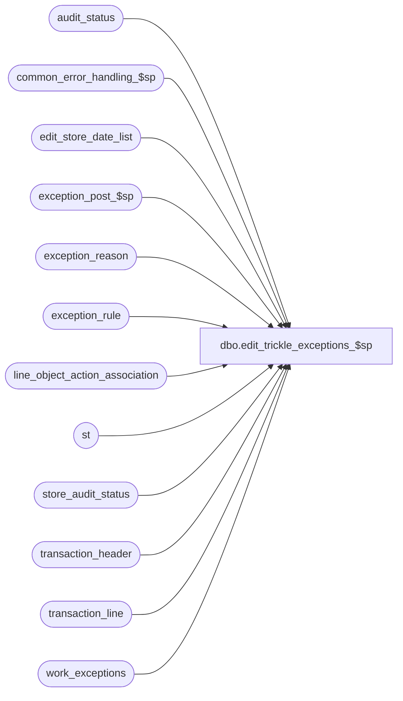

# dbo.edit_trickle_exceptions_$sp

**Database:** auditworks  
**Server:** bedrockdb01  

## Architecture Diagram



## Table Dependencies

| Referenced Table |
|---|
| audit_status |
| common_error_handling_$sp |
| edit_store_date_list |
| exception_post_$sp |
| exception_reason |
| exception_rule |
| line_object_action_association |
| st |
| store_audit_status |
| transaction_header |
| transaction_line |
| work_exceptions |

## Stored Procedure Code

```sql
CREATE proc  dbo.edit_trickle_exceptions_$sp
 @process_id binary(16),
 @user_id	int,
 @errmsg nvarchar(2000) OUTPUT,
 @edit_process_no	tinyint = 1

AS

  /* Proc Name: edit_trickle_exceptions_$sp
     Desc : To create entries in exception_reason for any transactions containing
               line_object/action/tran_category that are flagged as exceptions.
               Calculate/Recalculate exception_qty in audit_status.
               Called by edit_post_$sp (phase1) when trickle_polling_flag is set >= 2 in parameter_general
               Otherwise, edit_phase2_$sp calls edit_exceptions_$sp.
     Unicode version.
  
    HISTORY

    Date     Name           Def#  Desc
    May25,16 Vicci      DAOM-730 Downgrade status if adding new exceptions for trickle audit.
    Dec08,14 Paul          94103  use try catch, process txn for current edit stream only, added nolock hints
    Apr29,05 Paul        DV-1234  expand transaction_id to use tran_id_datatype
    Dec14,04 Maryam      DV-1191  Improve performance.
    Dec02,04 Paul        DV-1181  look at actv flag in exception_rule, added nolock hints
    Sep23,04 David       DV-1146  Use user_id.
    May05,04 Maryam      DV-1071  Receive @process_id 
    Nov26,01 Winnie      1-969YY  Add logic for R3 error handling 
    Nov27,01 Ian K       1-97UU6  Edit Phase 2 batching for R3
    Oct12,00 ShuZ           6494  properly log process_error_log
    Mar01,00 Phu            5900  Change @@fetch_status > 0 to @@fetch_status <> 0 for MS SQL compatibility
  
  */

DECLARE 

  @cursor_open                  tinyint,
  @errmsg2                      nvarchar(2000),
  @errline                      int,
  @errno                        int,
  @rows                         int,
  @store_no                     int,
  @object_name                  nvarchar(255),
  @process_name                 nvarchar(100),
  @operation_name               nvarchar(100),
  @process_no                   int,
  @message_id                   int;
  
  SELECT @process_name     = 'edit_trickle_exceptions_$sp',
         @process_no       = 5,
         @message_id       = 201068;

  BEGIN TRY

    SELECT @errmsg         = 'Failed to create temp table #exception_list',
           @object_name    = '#exception_list',
           @operation_name = 'CREATE TABLE';
  CREATE TABLE #exception_list(transaction_id numeric(14,0) not null, -- tran_id_datatype
                               line_id numeric(5,0) not null,
                               exception_reason smallint null,
                               exception_type tinyint not null);

    SELECT @errmsg         = 'Failed to create temp table #transaction_list',
           @object_name    = '#transaction_list'; 
  CREATE TABLE #transaction_list (transaction_id numeric(14,0) not null); -- tran_id_datatype

    SELECT @errmsg         = 'Failed to create temp table #exception_counts',
           @object_name    = '#exception_counts';
  CREATE TABLE #exception_counts(store_no int not null,
                                 register_no smallint not null,
                                 transaction_date smalldatetime not null,
                                 exception_count smallint not null);
                           
    SELECT @errmsg         = 'Failed to create temp table #current_edit_exception_counts',
           @object_name    = '#current_edit_exception_counts';
  CREATE TABLE #current_edit_exception_counts(store_no int not null,
                                              register_no smallint not null,
                                              transaction_date smalldatetime not null,
                                              exception_count smallint not null);
           
    SELECT @errmsg         = 'Failed to insert into temp table #exception_list',
           @object_name    = '#exception_list',
           @operation_name = 'INSERT';
  INSERT INTO #exception_list(
         transaction_id,
         line_id,
         exception_reason,
         exception_type)
  SELECT tl.transaction_id,
         tl.line_id,
         la.exception_reason,
         er.exception_type 
    FROM edit_store_date_list sl WITH (NOLOCK), 
         transaction_header th WITH (NOLOCK),
         transaction_line tl WITH (NOLOCK), 
         line_object_action_association la, 
         exception_rule er 
   WHERE sl.date_reject_id       = 0
     AND sl.trickle_counts_flag  = 1
     AND sl.transaction_date     = th.transaction_date
     AND sl.store_no             = th.store_no
     AND sl.register_no          = th.register_no
     AND th.sa_rejection_flag    = 0
     AND th.transaction_id       = tl.transaction_id
     AND tl.line_object          = la.line_object
     AND tl.line_action          = la.line_action
     AND th.transaction_category = la.transaction_category
     AND la.exception_reason    >= 1 
     AND la.exception_reason     = er.exception_rule 
     AND er.exception_type    >= 1
     AND er.ACTV = 1
     AND sl.batch_process_no = @edit_process_no;

  SELECT @rows = @@rowcount;

  IF @rows >= 1
  BEGIN
    -- Get list of exception transactions
      SELECT @errmsg         = 'Failed to insert into temp table #transaction_list',
             @object_name    = '#transaction_list',
             @operation_name = 'INSERT';
      INSERT INTO #transaction_list(
             transaction_id)
      SELECT DISTINCT transaction_id
      FROM #exception_list WITH (NOLOCK)
     WHERE exception_type = 1;

    --
    -- Avoid duplicating exceptions which already exist
    -- e.g. when a day has previously been partially edited
    --
      SELECT @errmsg         = 'Failed to delete from #exception_list',
             @object_name    = '#exception_list',
             @operation_name = 'DELETE';
    DELETE #exception_list
      FROM #exception_list el, 
           exception_reason er 
     WHERE el.transaction_id = er.transaction_id;

      SELECT @errmsg         = 'Failed to update transaction_line',
             @object_name    = 'transaction_line',
             @operation_name = 'UPDATE';
    UPDATE transaction_line
       SET exception_flag = 1
      FROM #exception_list el WITH (NOLOCK), 
           transaction_line tl WITH (NOLOCK)
     WHERE el.transaction_id = tl.transaction_id
       AND el.line_id        = tl.line_id 
       AND el.exception_type  = 1;

      SELECT @errmsg         = 'Failed to update transaction_header',
             @object_name    = 'transaction_header',
             @operation_name = 'UPDATE';
    UPDATE transaction_header
       SET exception_flag = 1
      FROM #transaction_list ls WITH (NOLOCK), 
           transaction_header th WITH (NOLOCK)
     WHERE ls.transaction_id  = th.transaction_id
       AND th.edit_progress_flag = 1;

      SELECT @errmsg         = 'Failed to insert exception_reason',
             @object_name    = 'exception_reason',
             @operation_name = 'INSERT';
    INSERT exception_reason 
          (transaction_id,
           line_id,
           violated_exception_rule,
           exception_type)
    SELECT transaction_id,
           line_id,
           exception_reason,
           exception_type
      FROM #exception_list WITH (NOLOCK);

      SELECT @errmsg         = 'Failed to drop temp table #transaction_list',
             @object_name    = '#transaction_list',
             @operation_name = 'DROP';
    DROP TABLE #transaction_list;
  END; -- If @rows >= 1

      SELECT @errmsg         = 'Failed to drop temp table #exception_list',
             @object_name    = '#exception_list',
             @operation_name = 'DROP';
  DROP TABLE #exception_list;

    SELECT @errmsg         = 'Failed to delete from work_exceptions',
           @object_name    = 'work_exceptions',
           @operation_name = 'DELETE';
  DELETE work_exceptions
   WHERE process_id = @process_id;

SELECT @errmsg         = 'Failed to open cursor exception_crsr',
           @object_name    = 'exception_crsr',
           @operation_name = 'OPEN'
  DECLARE exception_crsr CURSOR FAST_FORWARD
      FOR
    SELECT DISTINCT store_no
      FROM edit_store_date_list WITH (NOLOCK)
     WHERE trickle_counts_flag = 1
       AND batch_process_no = @edit_process_no;

  OPEN exception_crsr;
  SELECT @cursor_open = 1;

  WHILE 1=1
  BEGIN

    FETCH exception_crsr 
     INTO @store_no;

    IF @@fetch_status <> 0
      BREAK;

    --
    -- Get list of transactions to evaluate
    --
      SELECT @errmsg         = 'Failed to insert work_exceptions',
             @object_name    = 'work_exceptions',
             @operation_name = 'INSERT';  
    INSERT work_exceptions 
          (process_id,
           transaction_id )
    SELECT @process_id,
           th.transaction_id
      FROM edit_store_date_list sl WITH (NOLOCK), 
           transaction_header th WITH (NOLOCK)
     WHERE sl.store_no         = @store_no
       AND trickle_counts_flag = 1
       AND sl.transaction_date = th.transaction_date
       AND sl.store_no         = th.store_no
       AND sl.register_no      = th.register_no
       AND sl.date_reject_id   = th.date_reject_id
       AND sa_rejection_flag   = 0
       AND th.edit_progress_flag  = 1
       AND sl.batch_process_no = @edit_process_no;

    --
    -- Call user exception procedure
    --
      SELECT @errmsg       = 'Failed to execute stored procedure exception_post_$sp',
             @object_name    = 'exception_post_$sp',
             @operation_name = 'EXECUTE'  
    EXEC exception_post_$sp @process_id, @user_id, @errmsg OUTPUT;

      SELECT @errmsg         = 'Failed to delete work_exceptions',
             @object_name    = 'work_exceptions',
             @operation_name = 'DELETE';
    DELETE work_exceptions
     WHERE process_id = @process_id;

  END; -- While 1=1 exception cursor loop

  CLOSE exception_crsr;
  DEALLOCATE exception_crsr;
  SELECT @cursor_open = 0;

  --
  -- Recalculate audit_status exception_qty
  --
    SELECT @errmsg     = 'Failed to insert into temp table #exception_counts',
           @object_name    = '#exception_counts',
           @operation_name = 'INSERT';
  INSERT INTO #exception_counts(
         store_no,
         register_no,
         transaction_date,
         exception_count)
  SELECT sl.store_no,
         sl.register_no,
         sl.transaction_date,
         COUNT(transaction_id)
    FROM edit_store_date_list sl WITH (NOLOCK), 
         transaction_header th WITH (NOLOCK)
   WHERE sl.date_reject_id   = 0
     AND sl.trickle_counts_flag = 1 
     AND sl.transaction_date = th.transaction_date
     AND sl.store_no         = th.store_no
     AND sl.register_no      = th.register_no
     AND th.exception_flag      = 1
     AND sl.batch_process_no = @edit_process_no
   GROUP BY sl.store_no, sl.transaction_date, sl.register_no;


    SELECT @errmsg         = 'Failed to insert into temp table #current_edit_exception_counts',
           @object_name    = '#current_edit_exception_counts',
           @operation_name = 'INSERT'; 
  INSERT INTO #current_edit_exception_counts(
         store_no,
         register_no,
         transaction_date,
         exception_count)
  SELECT sl.store_no,
         sl.register_no,
         sl.transaction_date,
         COUNT(transaction_id)
    FROM edit_store_date_list sl WITH (NOLOCK), 
         transaction_header th WITH (NOLOCK)
   WHERE sl.date_reject_id   = 0 
     AND sl.trickle_counts_flag = 1
     AND sl.transaction_date = th.transaction_date
     AND sl.store_no         = th.store_no
     AND sl.register_no      = th.register_no
     AND th.exception_flag   = 1
     AND sl.batch_process_no = @edit_process_no
     AND th.edit_progress_flag  = 1
   GROUP BY sl.store_no, sl.transaction_date, sl.register_no
  HAVING COUNT(transaction_id) > 0;

  SELECT @errmsg         = 'Failed to update audit_status exception_qty',
         @object_name    = 'audit_status',
         @operation_name = 'UPDATE';
  UPDATE audit_status
     SET exception_qty = ec.exception_count
    FROM #exception_counts ec WITH (NOLOCK), 
         audit_status st
   WHERE ec.store_no         = st.store_no
     AND ec.register_no      = st.register_no
     AND ec.transaction_date = st.sales_date
     AND st.date_reject_id      = 0;

  SELECT @errmsg         = 'Failed to update audit_status exceptions_verified',
         @object_name    = 'audit_status',
         @operation_name = 'UPDATE';
  UPDATE audit_status
     SET exceptions_verified = 0 
    FROM #current_edit_exception_counts ec WITH (NOLOCK), 
         audit_status st
   WHERE ec.store_no             = st.store_no
     AND ec.register_no          = st.register_no
     AND ec.transaction_date     = st.sales_date
     AND date_reject_id          = 0
     AND st.exceptions_verified != 0;
 
  SELECT @errmsg         = 'Failed to update audit_status status',
         @object_name    = 'audit_status',
         @operation_name = 'UPDATE';
  UPDATE audit_status
     SET audit_status = 100,
         status_date = getdate()
    FROM #current_edit_exception_counts ec WITH (NOLOCK), 
         audit_status st
   WHERE ec.store_no         = st.store_no
     AND ec.register_no      = st.register_no
     AND ec.transaction_date = st.sales_date
     AND st.date_reject_id   = 0
     AND st.exceptions_verified  = 0
     AND st.exception_qty > 0
     AND st.audit_status IN (200, 300);
  SELECT @rows = @@rowcount;

  IF @rows > 0  --i.e. an audit status was changed.
  BEGIN
    SELECT @errmsg         = 'Failed to update store_audit_status status',
           @object_name    = 'store_audit_status',
           @operation_name = 'UPDATE';
    UPDATE st --UPDATE store_audit_status
       SET store_audit_status = 100,
           store_status_date   = getdate()
      FROM (SELECT DISTINCT a.sales_date, a.store_no
              FROM #current_edit_exception_counts ec
                   INNER JOIN audit_status a
                      ON a.audit_status = 100
                     AND a.sales_date = ec.transaction_date
                     AND a.store_no = ec.store_no
                     AND a.register_no = ec.register_no) q
           INNER JOIN store_audit_status st
              ON st.sales_date = q.sales_date
             AND st.store_no = q.store_no
             AND st.date_reject_id = 0
             AND st.store_audit_status IN (200, 300);
  END;  --IF @rows > 0, i.e. an audit status was changed.
  
  RETURN;


business_error:   /* Business Rule handler. */

	SELECT @errmsg2 = @errmsg;

	/* Could include similar cleanup code to system error trap when needed (example is from move_store_$sp).
	   However, could also exclude the cleanup code here since the outer system error catch should fire again after the exec below. */

	EXEC common_error_handling_$sp @process_no, @errno, @errmsg, 0, @message_id, @process_name,
	       @object_name, @operation_name, 1, @edit_process_no, 0, null, 0, null, null, null,
	       null, null, null, 0, @process_id, @user_id;
	  /* Note: when the exec above raises an error, that action also fires the system error trap (below) */
	RETURN;
END TRY

BEGIN CATCH; -- trap system errors
    /* common error handling. Appending proc name here because a rollback could occur if called within a transaction. */

        SELECT @errno = ERROR_NUMBER(),
		@errline = ERROR_LINE();

        SELECT @errmsg = CONVERT(nvarchar, @errno) + ':' + @process_name + ':' + CONVERT(nvarchar, @errline) + ':'
               + COALESCE(@errmsg, ' ') + ':' + ERROR_MESSAGE();

	 /* this condition will only be true when raise error in traps above fire this general catch */
	IF @errmsg2 IS NOT NULL
	  SELECT @errmsg = @errmsg2;

	IF @cursor_open = 1
	  BEGIN
	    CLOSE exception_crsr;
	    DEALLOCATE exception_crsr;
	  END;
  
	EXEC common_error_handling_$sp @process_no, @errno, @errmsg, 0, @message_id, @process_name,
	       @object_name, @operation_name, 1, @edit_process_no, 0, null, 0, null, null, null,
	       null, null, null, 0, @process_id, @user_id;

	RETURN;
END CATCH;
```

