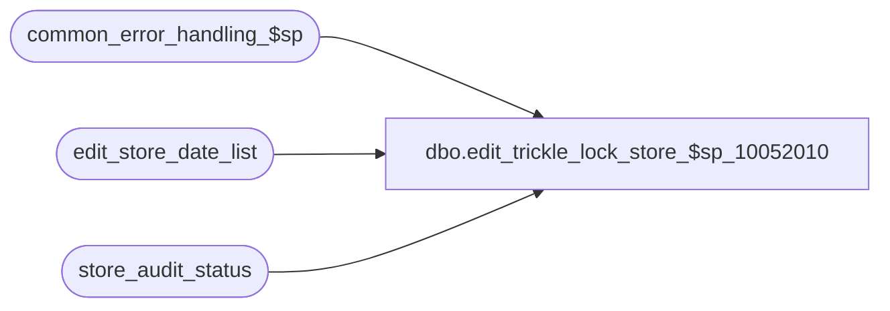

# dbo.edit_trickle_lock_store_$sp_10052010

**Database:** auditworks  
**Server:** bedrockdb01  

## Architecture Diagram



## Table Dependencies

| Referenced Table |
|---|
| common_error_handling_$sp |
| edit_store_date_list |
| store_audit_status |

## Stored Procedure Code

```sql
create proc [dbo].[edit_trickle_lock_store_$sp_10052010] 

 
@errmsg varchar(255) OUTPUT
AS


/* Version:1  Date:1999/04/13 */
/* Author: Louise M. */
/* HISTORY :

Date     Name		Def#  	Desc
Dec15,04 Maryam         DV-1191 Improve performance.
Nov26,01 Winnie    	1-969YY	Add logic for R3 error handling
Mar01,00 Phu		5900  	Change @@fetch_status > 0 to @@fetch_status <> 0 for MS SQL compatibility
*/
/* Desc: Locks the stores/dates in edit_store_date_list before running phase2 */
/*       This is needed during trickle edit as the store/dates are not locked in */
/*       phase1 in this mode */


DECLARE
	@cursor_open		tinyint,
	@date_reject_id		tinyint,
	@errno			int,
	@store_no		int,
	@transaction_date	smalldatetime,
	@object_name		varchar(255),
	@process_name		varchar(100),
	@operation_name		varchar(100),
	@message_id		int


SELECT 	@process_name = 'edit_trickle_lock_store_$sp',
        @message_id = 201068


CREATE TABLE #trickle_edit_store_date_list (
	store_no 			int			not null,
	transaction_date	smalldatetime	not null,
	date_reject_id		tinyint		not null)
	
SELECT @errno=@@error
IF @errno != 0
BEGIN
  SELECT @errmsg = 'Failed to create temporary table #trickle_edit_store_date_list.',
         @object_name = '#trickle_edit_store_date_list',
   	 @operation_name = 'CREATE'    
  GOTO error
END
	
	
INSERT #trickle_edit_store_date_list (
	store_no,
	transaction_date,
	date_reject_id)
SELECT DISTINCT store_no, transaction_date, date_reject_id
FROM edit_store_date_list
WHERE posted_flag = 1
ORDER BY store_no, transaction_date, date_reject_id

SELECT @errno=@@error
IF @errno != 0
BEGIN
  SELECT @errmsg = 'Failed to insert into temp table #trickle_edit_store_date_list.',
         @object_name = '#trickle_edit_store_date_list',
   	 @operation_name = 'INSERT'    
  GOTO error
END


DECLARE trickle_store_list_crsr CURSOR FAST_FORWARD
    FOR
 SELECT store_no,
        transaction_date,
	date_reject_id
   FROM #trickle_edit_store_date_list WITH (NOLOCK)

OPEN trickle_store_list_crsr
SELECT @errno=@@error
IF @errno != 0
BEGIN
  SELECT @errmsg = 'Failed to open trickle_store_list_crsr.',
         @object_name = 'trickle_store_list_crsr',
   	 @operation_name = 'OPEN'    
  GOTO error
END


SELECT @cursor_open = 1

WHILE 1=1
BEGIN
 FETCH trickle_store_list_crsr INTO
    @store_no, 
    @transaction_date, 
    @date_reject_id
    
 IF @@fetch_status <> 0
    BREAK  

 UPDATE store_audit_status
    SET update_in_progress = 1
  WHERE store_no = @store_no
    AND sales_date = @transaction_date
    AND date_reject_id = @date_reject_id
    AND update_in_progress != 1
    
 SELECT @errno=@@error
 IF @errno != 0 and @errno != 201550
 BEGIN  
  SELECT @errmsg = 'Failed to lock store_audit_status (update_in_progress).',
         @object_name = 'store_audit_status',
   	 @operation_name = 'UPDATE'  
  GOTO error 
 END

 /* if store is locked, remove it store from the list of stores to be processed 
    and it will be picked up by the next run of phase2. */
 IF @errno = 201550
 BEGIN
  UPDATE edit_store_date_list
     SET posted_flag = 0 
   WHERE store_no = @store_no
     AND transaction_date = @transaction_date
     AND date_reject_id = @date_reject_id
     
  SELECT @errno=@@error
  IF @errno != 0
  BEGIN
   SELECT @errmsg = 'Failed to update edit_store_date_list with posted_flag = 0',
          @object_name = 'edit_store_date_list',
   	  @operation_name = 'UPDATE'     
   GOTO error
  END
 END    
           
END /* while 1=1 */

CLOSE trickle_store_list_crsr
DEALLOCATE trickle_store_list_crsr
SELECT @cursor_open = 0

RETURN

error:
	
	IF @cursor_open = 1
	BEGIN
          CLOSE trickle_store_list_crsr
          DEALLOCATE trickle_store_list_crsr
        END 

	EXEC common_error_handling_$sp 5, @errno, @errmsg, 0, @message_id, 
	@process_name, @object_name, @operation_name, 1, 1
	RETURN
```

