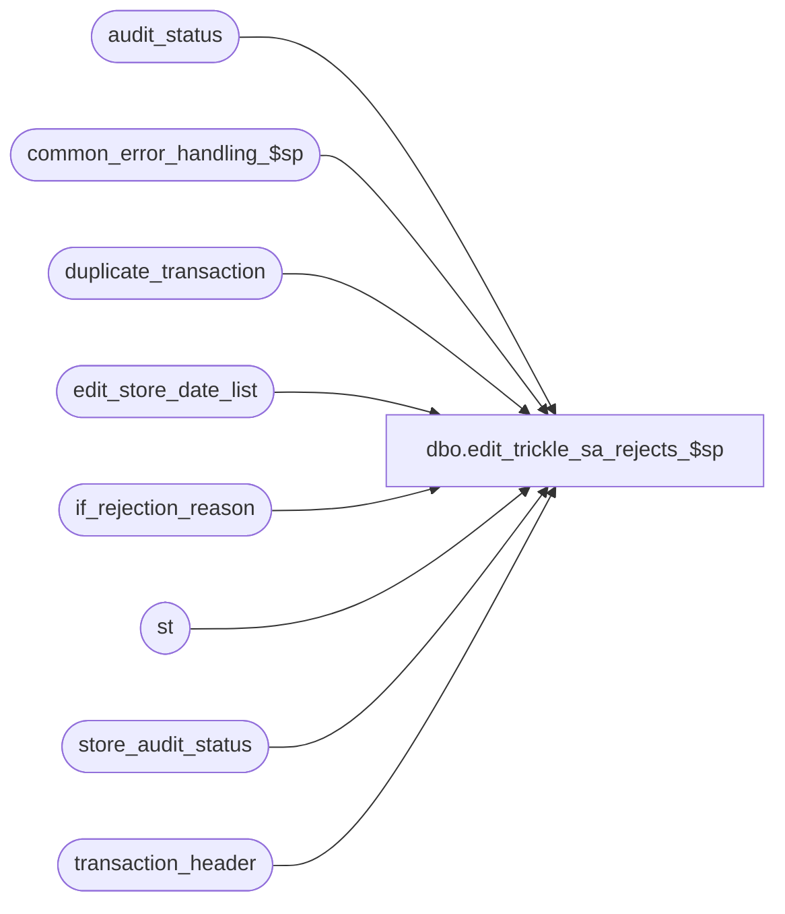

# dbo.edit_trickle_sa_rejects_$sp

**Database:** auditworks  
**Server:** bedrockdb01  

## Architecture Diagram



## Table Dependencies

| Referenced Table |
|---|
| audit_status |
| common_error_handling_$sp |
| duplicate_transaction |
| edit_store_date_list |
| if_rejection_reason |
| st |
| store_audit_status |
| transaction_header |

## Stored Procedure Code

```sql
CREATE proc  dbo.edit_trickle_sa_rejects_$sp 
@errmsg	nvarchar(2000) OUTPUT,
@edit_process_no	tinyint = 1

AS

  /* 
    
    Proc Name : edit_trickle_sa_rejects_$sp
         Desc : To set sa rejection quantity, valid_qty and duplicate_qty 
                in audit status for store-dates trickle edited. This is done in phase2 if
                not trickle. 
                Called by edit_post_$sp via edit_trickle_audit_$sp only if trickle_polling_flag >= 2 in parameter_general.
    Unicode version.

    HISTORY:
    Date     Name         Def# Desc
    Jun01,16 Vicci    DAOM-730 Upgrade audit status to 200 if starting > 900 and there are no issues being introduced by the current counts but there are valid transactions.
                               Downgrade store audit status to 100 if starting with 5 or >= 900 for bad dates too.
                               Downgrade status to 100 if introducing issues;  
                               Upgrade status to 200 if only adding valid transactions to a previously missing/unused/deleted/moved status.
                               Correct status 5 to status 900 for other registers on same loop.
    Dec05,14 Paul        94103 use try catch, process txn for current edit stream only
    Dec15,04 Maryam    DV-1191 Improve performance.
    Jan15,02 Henry     1-A1CTQ Correctly set the duplicate_verified flag in audit_status.
    Nov26,01 Winnie    1-969YY Add logic for R3 error handling to pass @edit_process_no
    Nov27,01 Ian K     1-97UU6 Edit Phase 2 batching for R3
    Dec11,00 Paul         7110 combine multiple queries into one search of transaction_header
    Mar30,00 Phu          6158 Missing group by in select .. into #new_duplicate_flag
    Apr08,99 Louise            author

  */

DECLARE 
  @errmsg2                      nvarchar(2000),
  @errline                      int,
  @errno                        int,
  @dup_rows                     int,
  @object_name                  nvarchar(255),
  @process_name                 nvarchar(100),
  @operation_name               nvarchar(100),
  @process_no                   int,
  @message_id                   int,
  @prior_audit_status  		smallint,
  @register_poll_id		nvarchar(15),
  @min_audit_status		smallint;
  
  SELECT @process_name     = 'edit_trickle_sa_rejects_$sp',
         @process_no       = 5,
         @message_id       = 201068;     

BEGIN TRY

    SELECT @errmsg         = 'Failed to create table #tran_counts',
           @object_name    = '#tran_counts',
           @operation_name = 'CREATE TABLE';
  CREATE TABLE #tran_counts(store_no int not null,
                            register_no smallint not null,
                            transaction_date smalldatetime not null,
                            date_reject_id tinyint not null,
                            sa_reject_count smallint DEFAULT 0 not null,
                            if_rejects_exist smallint DEFAULT 0 not null,
                            valid_count smallint DEFAULT 0 not null,
                            nondeferred_count smallint DEFAULT 0 not null,
                            duplicate_count smallint DEFAULT 0 not null,
                            new_verified tinyint DEFAULT 0 not null);

    SELECT @errmsg         = 'Failed to create table #status_update',
           @object_name    = '#status_update',
           @operation_name = 'CREATE TABLE';
  CREATE TABLE #status_update(store_no int not null,
                            register_no smallint not null,
                            sales_date smalldatetime not null,
                            date_reject_id tinyint not null,
                            sa_reject_count smallint not null,
                            valid_count smallint not null,
                            nondeferred_count smallint not null,
                            duplicate_count smallint not null,
                            new_verified tinyint not null,
                            prior_audit_status smallint not null,
                            new_audit_status smallint not null,
                            register_poll_id nvarchar(15) null);

    SELECT @errmsg         = 'Failed to insert entries for all store reg dates trickling in current batch into #tran_counts',
           @object_name    = '#tran_counts',
           @operation_name = 'INSERT';
  INSERT INTO #tran_counts(
         store_no,
         register_no,
         transaction_date,
         date_reject_id,
         sa_reject_count,
         if_rejects_exist,
         valid_count)
  SELECT sl.store_no,
         sl.register_no,
         sl.transaction_date,
         sl.date_reject_id,
         SUM(SIGN(COALESCE(th.sa_rejection_flag, 0))),
         MAX(SIGN(COALESCE(th.if_rejection_flag, 0))),
         SUM(CASE WHEN th.sa_rejection_flag = 0 THEN 1 ELSE 0 END)
    FROM edit_store_date_list sl WITH (NOLOCK)
         LEFT OUTER JOIN transaction_header th WITH (NOLOCK)
           ON sl.store_no            = th.store_no
          AND sl.register_no         = th.register_no
          AND sl.transaction_date    = th.transaction_date
          AND sl.date_reject_id      = th.date_reject_id
   WHERE sl.trickle_counts_flag = 1
     AND sl.batch_process_no = @edit_process_no
   GROUP BY sl.store_no, sl.register_no, sl.transaction_date, sl.date_reject_id;

  --
  -- Calculate counts of if_rejections which are not deferred
  --
    SELECT @errmsg         = 'Failed to add extra rows for store reg dates with non-deferred if_reject counts into #tran_counts',
           @object_name    = '#tran_counts',
           @operation_name = 'INSERT';
  INSERT INTO #tran_counts(
         store_no,
         register_no,
         transaction_date,
         date_reject_id,
         nondeferred_count)
  SELECT rc.store_no,
         rc.register_no,
         rc.transaction_date,
         rc.date_reject_id,
         COUNT(DISTINCT ir.transaction_id)
    FROM #tran_counts rc WITH (NOLOCK), 
         transaction_header th WITH (NOLOCK) , 
         if_rejection_reason ir 
   WHERE rc.if_rejects_exist > 0
     AND rc.store_no          = th.store_no
     AND rc.register_no       = th.register_no
     AND rc.transaction_date  = th.transaction_date
     AND rc.date_reject_id    = th.date_reject_id
     AND th.if_rejection_flag = 1
     AND th.transaction_id    = ir.transaction_id
     AND ir.deferred = 0
   GROUP BY rc.store_no, rc.register_no, rc.transaction_date, rc.date_reject_id;

    SELECT @errmsg         = 'Failed to add extra entries for store reg dates with duplicates into #tran_counts',
           @object_name    = '#tran_counts',
           @operation_name = 'INSERT';
  INSERT INTO #tran_counts(
         store_no,
         register_no,
         transaction_date,
         date_reject_id,
         duplicate_count,
         new_verified)
  SELECT sl.store_no,
         sl.register_no,
         sl.transaction_date,
         sl.date_reject_id,
         COUNT(transaction_no),
         MIN(CONVERT(tinyint,dt.verified))
    FROM edit_store_date_list sl WITH (NOLOCK), 
         duplicate_transaction dt
   WHERE sl.trickle_counts_flag = 1
     AND sl.batch_process_no = @edit_process_no
     AND sl.store_no            = dt.store_no
     AND sl.register_no         = dt.register_no
     AND sl.transaction_date    = dt.transaction_date
     AND sl.date_reject_id      = dt.date_reject_id
   GROUP BY sl.store_no, sl.register_no, sl.transaction_date, sl.date_reject_id;

    SELECT @errmsg         = 'Failed to insert rows for audit_status update into #status_update',
           @object_name    = '#tran_counts',
           @operation_name = 'INSERT';
  INSERT INTO #status_update(
         store_no,
         register_no,
         sales_date,
         date_reject_id,
         sa_reject_count,
         valid_count,
         nondeferred_count,
         duplicate_count,
         new_verified,
         prior_audit_status,
         new_audit_status,
         register_poll_id)
  SELECT a.store_no,
         a.register_no,
         a.sales_date,
         a.date_reject_id,
         tc.sa_reject_count,
         tc.valid_count,
         tc.nondeferred_count,
         tc.duplicate_count,
         tc.new_verified,
         a.audit_status,
         CASE WHEN      (a.audit_status IN (5, 200, 300) OR a.audit_status >= 900)
	            AND (tc.sa_reject_count > 0 OR tc.nondeferred_count > 0 OR (tc.duplicate_count > 0 AND tc.new_verified = 0))
	      THEN 100
	      ELSE CASE WHEN (a.audit_status = 5 OR a.audit_status >= 900) AND tc.valid_count > 0
	                THEN 200
	                ELSE a.audit_status  --otherwise leave it alone.
	           END
	 END,
         a.register_poll_id
    FROM (SELECT store_no, register_no, transaction_date, date_reject_id, 
                 MAX(sa_reject_count) sa_reject_count,
                 MAX(valid_count) valid_count,
                 MAX(nondeferred_count) nondeferred_count,
                 MAX(duplicate_count) duplicate_count,
                 MAX(new_verified) new_verified
            FROM #tran_counts WITH (NOLOCK)
           GROUP BY store_no, register_no, transaction_date, date_reject_id) tc, 
         audit_status a
   WHERE tc.store_no            = a.store_no
     AND tc.register_no         = a.register_no
     AND tc.transaction_date    = a.sales_date
     AND tc.date_reject_id      = a.date_reject_id;

  SELECT @errmsg         = 'Failed to update audit_status.  ',
         @object_name    = 'audit_status',
         @operation_name = 'UPDATE';
  UPDATE audit_status
     SET sa_reject_qty = tc.sa_reject_count,
         valid_qty     = tc.valid_count,
         if_reject_qty = tc.nondeferred_count,
         duplicate_qty = tc.duplicate_count,
         duplicate_verified = tc.new_verified,
         audit_status = tc.new_audit_status,
         status_date = CASE WHEN tc.new_audit_status <> tc.prior_audit_status THEN getdate() ELSE st.status_date END
    FROM #status_update tc, 
         audit_status st
   WHERE st.store_no       = tc.store_no
     AND st.register_no    = tc.register_no
     AND st.sales_date     = tc.sales_date
     AND st.date_reject_id = tc.date_reject_id;

  SELECT @errmsg         = 'Failed to update audit_status for log-parent-as-missing / child-as-unused option.  ',
         @object_name    = 'audit_status',
         @operation_name = 'UPDATE';
  UPDATE audit_status
     SET audit_status = 900,
         status_date = getdate()
    FROM (SELECT DISTINCT store_no, sales_date, date_reject_id, register_poll_id
            FROM #status_update tc
           WHERE prior_audit_status = 900 
             AND LEN(register_poll_id) = 15
             AND date_reject_id = 0) tc,
         audit_status st
   WHERE st.store_no       = tc.store_no
     AND st.sales_date     = tc.sales_date
     AND st.date_reject_id = tc.date_reject_id
     AND st.audit_status = 5
     AND st.register_poll_id = tc.register_poll_id;

  SELECT @errmsg         = 'Failed to update store_audit_status.  ',
         @object_name    = 'store_audit_status',
         @operation_name = 'UPDATE';
  UPDATE st --UPDATE store_audit_status
     SET store_audit_status = CASE WHEN tc.store_audit_status = 9999 THEN 901 ELSE tc.store_audit_status END,
         store_status_date = getdate()
    FROM (SELECT a.store_no, a.sales_date, a.date_reject_id, MIN(CASE WHEN a.audit_status = 900 THEN 9999 ELSE a.audit_status END) store_audit_status
            FROM (SELECT DISTINCT store_no, sales_date, date_reject_id
                    FROM #status_update
                   WHERE new_audit_status <> prior_audit_status) w
                 INNER JOIN audit_status a
                    ON w.store_no = a.store_no
                   AND w.sales_date = a.sales_date
                   AND w.date_reject_id = a.date_reject_id
           GROUP BY a.store_no, a.sales_date, a.date_reject_id ) tc
         INNER JOIN store_audit_status st
            ON st.store_no       = tc.store_no
           AND st.sales_date     = tc.sales_date
           AND st.date_reject_id = tc.date_reject_id
           AND st.store_audit_status <> CASE WHEN tc.store_audit_status = 9999 THEN 901 ELSE tc.store_audit_status END;
  
  RETURN;


business_error:   /* Business Rule handler. */

	SELECT @errmsg2 = @errmsg;

	EXEC common_error_handling_$sp @process_no, @errno, @errmsg, 0, @message_id, 
                                 @process_name, @object_name, @operation_name, 1, @edit_process_no;
	  /* Note: when the exec above raises an error, that action also fires the system error trap (below) */
	RETURN;
END TRY

BEGIN CATCH; -- trap system errors
    /* common error handling. Appending proc name here because a rollback could occur if called within a transaction. */

        SELECT @errno = ERROR_NUMBER(),
		@errline = ERROR_LINE();

        SELECT @errmsg = CONVERT(nvarchar, @errno) + ':' + @process_name + ':' + CONVERT(nvarchar, @errline) + ':'
               + COALESCE(@errmsg, ' ') + ':' + ERROR_MESSAGE();

	 /* this condition will only be true when raise error in traps above fire this general catch */
	IF @errmsg2 IS NOT NULL
	  SELECT @errmsg = @errmsg2;

	EXEC common_error_handling_$sp @process_no, @errno, @errmsg, 0, @message_id, 
                                 @process_name, @object_name, @operation_name, 1, @edit_process_no;

	RETURN;
END CATCH;
```

