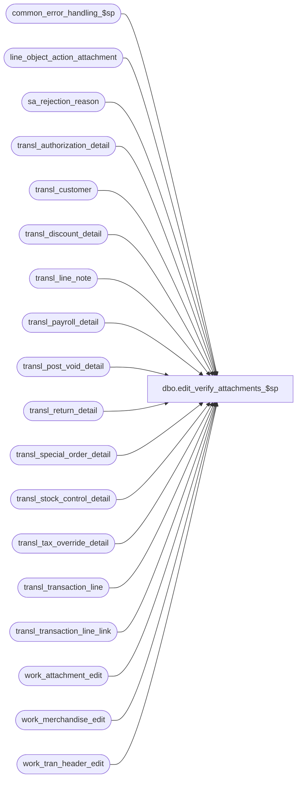

# dbo.edit_verify_attachments_$sp

**Database:** auditworks  
**Server:** bedrockdb01  

## Architecture Diagram



## Table Dependencies

| Referenced Table |
|---|
| common_error_handling_$sp |
| line_object_action_attachment |
| sa_rejection_reason |
| transl_authorization_detail |
| transl_customer |
| transl_discount_detail |
| transl_line_note |
| transl_payroll_detail |
| transl_post_void_detail |
| transl_return_detail |
| transl_special_order_detail |
| transl_stock_control_detail |
| transl_tax_override_detail |
| transl_transaction_line |
| transl_transaction_line_link |
| work_attachment_edit |
| work_merchandise_edit |
| work_tran_header_edit |

## Stored Procedure Code

```sql
create proc dbo.edit_verify_attachments_$sp 


     @errmsg               nvarchar(2000) OUTPUT,
     @edit_process_no	tinyint = 1

AS


/* Proc name: edit_verify_attachments_$sp
   Desc: To reject transactions that are missing attachment rows
    due to translate error. Do not check for void lines or void transactions.
   Called by edit_post_$sp.

HISTORY
Date     Name            Def Desc
Dec17,14 Paul          94103 use try catch
Mar16,09 Vicci        106158 Take into account header level attachments.
Mar19,07 Paul        DV-1356 Ignore tax attachment type since it should never be mandatory (setup mistake)
Dec19,05 Paul          64545 apply 57838 to SA5 (1-F8GOD is obsolete)
May06,05 Maryam      DV-1202 Delete work_attachment_edit for attachment_type = 13. Rename from_line_id to line_id.
Dec15,04 Maryam      DV-1191 Improve performance.  
Dec07,05 Daphna  57838/64487 do not log SA rej for missing cust attach when not mandatory (now IF rej)
Sep15,03 ShuZ        1-G7A5F Remove all references to the interface_directory '... _check' 
                             fields from stored procedures/triggers and replace with usage 
                             of if_rejection_applicability table.
Dec05,02 Maryam      1-H4BYR Fix the bug which is introduced in defect 1-F8GOD. 
                             where attachment is not mandatory just ensure customer attachment
                             (TYPE 11) not all the attachments.
OCT10,02 Daphna      1-F8GOD Where attachment is mandatory, ensure correct customer_role
                             where NOT mandatory, ensure customer attachment, but any role
Jan18,02 Vicci	     1-A9Z28 Adjust join to line_object_action_attachment to take new 
			     transaction_category into account.
Nov26,01 Winnie	     1-969YY Add logic for R3 error handling to pass @edit_process_no
Nov01,01 ShuZ		8900 TRANSL edit changes for Sybase
Nov18,97 Paul                author
*/

DECLARE @errno				int,
	@errmsg2				nvarchar(2000),
	@errline				int,
	@message_id			int,	
	@object_name			nvarchar(255),	
	@operation_name			nvarchar(100),
	@process_name			nvarchar(100);       

SELECT @process_name = 'edit_verify_attachments_$sp',
       @message_id = 201068;   

BEGIN TRY

   SELECT @errmsg = 'Failed to truncate work_attachment_edit',
          @object_name = 'work_attachment_edit',
          @operation_name = 'TRUNCATE';
TRUNCATE TABLE work_attachment_edit;

/* get a list of the attachments that should exist for each transaction */
    SELECT @errmsg = 'where attachment_mandatory = 1',
          @object_name = 'work_attachment_edit',
          @operation_name = 'INSERT';
INSERT work_attachment_edit (
	transaction_id,
	store_no,
	register_no,
	entry_date_time,
	transaction_series,
	transaction_no,
	line_id,
	attachment_type,
	note_type )
SELECT	wh.transaction_id,
	tl.store_no,
	tl.register_no,
	tl.entry_date_time,
	tl.transaction_series,
	tl.transaction_no,
	line_id,
	attachment_type,
	note_type
  FROM work_tran_header_edit wh WITH (NOLOCK), transl_transaction_line tl WITH (NOLOCK), line_object_action_attachment la
 WHERE transaction_void_flag IN (0,8)
   AND wh.store_no = tl.store_no
   AND wh.register_no = tl.register_no
   AND wh.entry_date_time = tl.entry_date_time
   AND wh.transaction_series = tl.transaction_series
   AND wh.transaction_no = tl.transaction_no
   AND tl.transaction_id IS NOT NULL 
   AND line_void_flag = 0
   AND tl.transaction_category = ISNULL(la.transaction_category, tl.transaction_category)
   AND tl.line_object = la.line_object
   AND tl.line_action = la.line_action
   AND la.attachment_mandatory = 1
   AND la.attachment_type >= 1
   AND la.attachment_type != 12; -- ignore attachments that should never be mandatory (setup mistake)

/* 106158:  get a list of the header level attachments that should exist for each transaction */
   SELECT @errmsg = 'where attachment_mandatory = 1 at header level',
          @object_name = 'work_attachment_edit',
          @operation_name = 'INSERT';
INSERT work_attachment_edit (
	transaction_id,
	store_no,
	register_no,
	entry_date_time,
	transaction_series,
	transaction_no,
	line_id,
	attachment_type,
	note_type )
SELECT	wh.transaction_id,
	wh.store_no,
	wh.register_no,
	wh.entry_date_time,
	wh.transaction_series,
	wh.transaction_no,
	0 line_id,
	la.attachment_type,
	la.note_type
  FROM work_tran_header_edit wh WITH (NOLOCK), line_object_action_attachment la
 WHERE wh.transaction_void_flag IN (0,8)
   AND wh.transaction_category = ISNULL(la.transaction_category, wh.transaction_category)
   AND la.line_object = -1
   AND la.line_action = 0
   AND la.attachment_mandatory = 1
   AND la.attachment_type >= 1
   AND la.attachment_type NOT IN (7, 12, 13); -- ignore attachments that should never be mandatory (setup mistake)

/* Exclude transactions for which the attachments actually exist */

-- MERCH ATTACHMENT
    SELECT @errmsg = 'Failed to delete rows from work_attachment_edit where attachment_type =1',
          @object_name = 'work_attachment_edit',
          @operation_name = 'DELETE';
DELETE work_attachment_edit
  FROM work_attachment_edit we, work_merchandise_edit md WITH (NOLOCK)
 WHERE we.attachment_type = 1
   AND we.store_no = md.store_no
   AND we.register_no = md.register_no
   AND we.entry_date_time = md.entry_date_time
   AND we.transaction_series = md.transaction_series
   AND we.transaction_no = md.transaction_no
   AND we.line_id = md.line_id;

-- AUTHORIZATION ATTACHMENT
    SELECT @errmsg = 'Failed to delete rows from work_attachment_edit where attachment_type =2';
DELETE work_attachment_edit
  FROM work_attachment_edit we, transl_authorization_detail ad WITH (NOLOCK)
  WHERE attachment_type = 2
  AND ad.store_no = we.store_no
  AND ad.register_no = we.register_no
  AND ad.entry_date_time = we.entry_date_time
  AND ad.transaction_series = we.transaction_series
  AND ad.transaction_no = we.transaction_no
  AND we.line_id = ad.line_id;

--DISCOUNT ATTACHMENT
   SELECT @errmsg = 'Failed to delete rows from work_attachment_edit where attachment_type =7'
DELETE work_attachment_edit
  FROM work_attachment_edit we, transl_discount_detail dd WITH (NOLOCK)
  WHERE attachment_type = 7
  AND dd.store_no = we.store_no
  AND dd.register_no = we.register_no
  AND dd.entry_date_time = we.entry_date_time
  AND dd.transaction_series = we.transaction_series
  AND dd.transaction_no = we.transaction_no
  AND we.line_id = dd.line_id;

-- TAX OVERRIDE ATTACHMENT
    SELECT @errmsg = 'Failed to delete rows from work_attachment_edit where attachment_type =8';
DELETE work_attachment_edit
  FROM work_attachment_edit we, transl_tax_override_detail td WITH (NOLOCK)
  WHERE attachment_type = 8
  AND td.store_no = we.store_no
  AND td.register_no = we.register_no
  AND td.entry_date_time = we.entry_date_time
  AND td.transaction_series = we.transaction_series
  AND td.transaction_no = we.transaction_no
  AND we.line_id = td.line_id;

-- RETURN ATTACHMENT
    SELECT @errmsg = 'Failed to delete rows from work_attachment_edit where attachment_type =9';
DELETE work_attachment_edit
  FROM work_attachment_edit we, transl_return_detail rd WITH (NOLOCK)
  WHERE attachment_type = 9
  AND rd.store_no = we.store_no
  AND rd.register_no = we.register_no
  AND rd.entry_date_time = we.entry_date_time
  AND rd.transaction_series = we.transaction_series
  AND rd.transaction_no = we.transaction_no
  AND we.line_id = rd.line_id;

-- STOCK CONTROL ATTACHMENT
    SELECT @errmsg = 'Failed to delete rows from work_attachment_edit where attachment_type =3';
DELETE work_attachment_edit
  FROM work_attachment_edit we, transl_stock_control_detail sc WITH (NOLOCK)
  WHERE attachment_type = 3
  AND sc.store_no = we.store_no
  AND sc.register_no = we.register_no
  AND sc.entry_date_time = we.entry_date_time
  AND sc.transaction_series = we.transaction_series
  AND sc.transaction_no = we.transaction_no
  AND we.line_id = sc.line_id
  AND we.note_type = sc.display_def_id;

-- SPECIAL ORDER ATTACHMENT
    SELECT @errmsg = 'Failed to delete rows from work_attachment_edit where attachment_type =4';
DELETE work_attachment_edit
  FROM work_attachment_edit we, transl_special_order_detail so WITH (NOLOCK)
  WHERE attachment_type = 4
  AND so.store_no = we.store_no
  AND so.register_no = we.register_no
  AND so.entry_date_time = we.entry_date_time
  AND so.transaction_series = we.transaction_series
  AND so.transaction_no = we.transaction_no
  AND we.line_id = so.line_id;

-- PAYROLL ATTACHMENT
    SELECT @errmsg = 'Failed to delete rows from work_attachment_edit where attachment_type =6';
DELETE work_attachment_edit
  FROM work_attachment_edit we, transl_payroll_detail pd WITH (NOLOCK)
  WHERE attachment_type = 6
  AND pd.store_no = we.store_no
  AND pd.register_no = we.register_no
  AND pd.entry_date_time = we.entry_date_time
  AND pd.transaction_series = we.transaction_series
  AND pd.transaction_no = we.transaction_no
  AND we.line_id = pd.line_id;

-- POST VOID ATTACHMENT
    SELECT @errmsg = 'Failed to delete rows (type 5) from work_attachment_edit';
DELETE work_attachment_edit
  FROM work_attachment_edit we, transl_post_void_detail pv WITH (NOLOCK)
  WHERE attachment_type = 5
  AND pv.store_no = we.store_no
  AND pv.register_no = we.register_no
  AND pv.entry_date_time = we.entry_date_time
  AND pv.transaction_series = we.transaction_series
  AND pv.transaction_no = we.transaction_no
  AND we.line_id = pv.line_id;

-- CUSTOMER ATTACHMENT: allow specific cust role for mandatory attachment or ANY cust role
    SELECT @errmsg = 'Failed to delete rows (type 11) from work_attachment_edit';
DELETE work_attachment_edit
  FROM work_attachment_edit we, transl_customer c WITH (NOLOCK)
  WHERE attachment_type = 11
  AND c.store_no = we.store_no
  AND c.register_no = we.register_no
  AND c.entry_date_time = we.entry_date_time
  AND c.transaction_series = we.transaction_series
  AND c.transaction_no = we.transaction_no
  AND c.line_id = we.line_id   -- DEF 1-F8GOD
  AND (note_type = customer_role OR note_type = 0);

/* user defined types */
    SELECT @errmsg = 'Failed to delete rows (type 10) from work_attachment_edit';
DELETE work_attachment_edit
  FROM work_attachment_edit we, transl_line_note ln WITH (NOLOCK)
  WHERE attachment_type = 10
  AND ln.store_no = we.store_no
  AND ln.register_no = we.register_no
  AND ln.entry_date_time = we.entry_date_time
  AND ln.transaction_series = we.transaction_series
  AND ln.transaction_no = we.transaction_no
  AND we.line_id = ln.line_id
  AND we.note_type = ln.note_type;

-- LINKED LINE ATTACHMENT
    SELECT @errmsg = 'Failed to delete rows from work_attachment_edit where attachment_type = 13',
          @object_name = 'work_attachment_edit',
          @operation_name = 'DELETE';
DELETE work_attachment_edit
  FROM work_attachment_edit we, transl_transaction_line_link k WITH (NOLOCK), transl_transaction_line l WITH (NOLOCK)
  WHERE attachment_type = 13
  AND k.store_no = we.store_no
  AND k.register_no = we.register_no
  AND k.entry_date_time = we.entry_date_time
  AND k.transaction_series = we.transaction_series
  AND k.transaction_no = we.transaction_no
  AND we.line_id = k.line_id
  AND k.store_no = l.store_no
  AND k.register_no = l.register_no
  AND k.entry_date_time = l.entry_date_time
  AND k.transaction_series = l.transaction_series
  AND k.transaction_no = l.transaction_no
  AND k.linked_line_id = l.line_id
  AND l.line_object * 1000 + l.line_action = we. note_type;


/* The remaining rows are missing attachments */
    SELECT @errmsg = 'Failed to insert rows into sa_rejection_reason',
          @object_name = 'sa_rejection_reason',
          @operation_name = 'INSERT'; 
INSERT sa_rejection_reason (
 	transaction_id,
	line_id,
	violated_sareject_rule )
SELECT DISTINCT transaction_id,
	line_id,
	attachment_type + 20
  FROM work_attachment_edit WITH (NOLOCK);

   SELECT @errmsg = 'Failed to update work_tran_header_edit',
          @object_name = 'work_tran_header_edit',
          @operation_name = 'UPDATE';
UPDATE work_tran_header_edit
  SET sa_rejection_flag = 1
  FROM work_attachment_edit we WITH (NOLOCK), work_tran_header_edit wh
  WHERE we.transaction_id = wh.transaction_id
  AND sa_rejection_flag = 0;


RETURN;


business_error:   /* Business Rule handler. */

	SELECT @errmsg2 = @errmsg;

	/* Could include similar cleanup code to system error trap when needed (example is from move_store_$sp).
	   However, could also exclude the cleanup code here since the outer system error catch should fire again after the exec below. */

	EXEC common_error_handling_$sp 4, @errno, @errmsg, 0, @message_id, 
	  @process_name, @object_name, @operation_name, 1, @edit_process_no;
	  /* Note: when the exec above raises an error, that action also fires the system error trap (below) */
	RETURN;
END TRY

BEGIN CATCH; -- trap system errors
    /* common error handling. Appending proc name here because a rollback could occur if called within a transaction. */

        SELECT @errno = ERROR_NUMBER(),
		@errline = ERROR_LINE();

        SELECT @errmsg = CONVERT(nvarchar, @errno) + ':' + @process_name + ':' + CONVERT(nvarchar, @errline) + ':'
               + COALESCE(@errmsg, ' ') + ':' + ERROR_MESSAGE();

	 /* this condition will only be true when raise error in traps above fire this general catch */
	IF @errmsg2 IS NOT NULL
	  SELECT @errmsg = @errmsg2;

	EXEC common_error_handling_$sp 4, @errno, @errmsg, 0, @message_id, 
	  @process_name, @object_name, @operation_name, 1, @edit_process_no;

	RETURN;
END CATCH;
```

