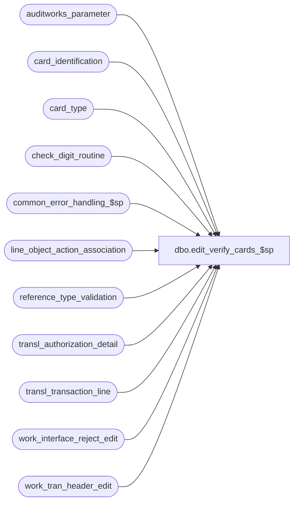

# dbo.edit_verify_cards_$sp

**Database:** auditworks  
**Server:** bedrockdb01  

## Architecture Diagram



## Table Dependencies

| Referenced Table |
|---|
| auditworks_parameter |
| card_identification |
| card_type |
| check_digit_routine |
| common_error_handling_$sp |
| line_object_action_association |
| reference_type_validation |
| transl_authorization_detail |
| transl_transaction_line |
| work_interface_reject_edit |
| work_tran_header_edit |

## Stored Procedure Code

```sql
create proc dbo.edit_verify_cards_$sp 
 @errmsg          nvarchar(2000) OUTPUT,
 @edit_process_no	tinyint = 1

AS

/* Proc name: edit_verify_cards_$sp
   Desc: To verify credit card account numbers ( leading digits, length and check digit )
    and to correct card type and line object if necessary.
    Called by edit_authorization_$sp.

HISTORY
 Date    Name           Def# Desc
Mar02,15 Vicci    TFS-108677 Refix 144304. When the translate_card_validation parameter is set to 0, the Edit is only supposed to be validating 
                             unencrypted credit cards and rejecting them if invalid regardless of their being numeric or alpha-numeric.
Dec17,14 Paul          94103 use try catch
May29,13 Vicci        144304 If the Translate is not set to validate credit cards but the Edit/Translate validation
                             is on for the credit card, reject it if it is alphanumeric, even if encryption is not active.
Jun02,10 Paul         118310 Uplift 118326 to SA5
Jun02,10 Paul         118326 Avoid duplicate error when inserting encrypted cards and card_type = '?'
Apr08,08 Paul          97584/1-3XTW6I If encrypted_reference_no is not null and card_type = '?' then create rejects
Oct25,06 Phu           77931 Fix outer join for SQL 2005 Mode 90.
Dec09,05 David       DV-1319 Log reference_type in temp table (60266 in 4.0). Also applied 62921,64589 to 5.0.
Nov02,05 Paul          62153 apply 60266, 61728 to SA5, removed joins to ORG_CHN since not needed for new media rec
Jul19,05 David       DV-1294 Use invalid_reference_no.
Apr29,05 Paul        DV-1234 expand transaction_id to use tran_id_datatype
Feb23,05 David       DV-1206 apply DV-1298 to SA5, change datatypes in temp table to match CDM datatypes
Dec15,04 Maryam      DV-1191 Improve performance.
Oct28,04 David       DV-1159 Check for ORG_CHN active flag. 
Aug23,04 Sab	     DV-1120 hardcode aplctn_id to 300.
May18,04 David       DV-1071 Use ORG_CHN table instead of store_salesaudit
Apr19,04 Sab	     DV-1068 remove variable old media rec logic
Oct27,05 David         61728 Log invalid_reference_no if reject 2 and not logged by translate.
                             Use encrypted_reference_no instead of invalid_reference_no.
Sep16,05 David         60266 Check for reference_type when identifying card_type.
Jul14,05 David       DV-1298 Skip validation if it was done by Translate. Log new I/F reject 113.
Aug22,03 Paul          13215 correctly set @rows (fixes 9250)
Jun18,03 Winnie		9250 Media Reconciliation enhancements.
Nov26,01 Winnie	     1-969YY Add logic for R3 error handling to pass @edit_process_no 
Nov12,01 Sab		8900 TRANSL edit changes for Sybase
Nov10,00 Phu		6943 Correct I/F reject due to leading/trailing spaces in card numbers
Oct23,00 Paul		6839 Ignore voided lines. Translate will flag nonnumeric card numbers
				as voids to avoid edit error when converting to numeric.
May19,99 Paul		4681 avoid arithmetic overflow
Apr06,99 Paul		4446 avoid division by zero
Apr04,97 Paul
         Paul		Author
*/

DECLARE
 @calculated_card_type		nchar(1),
 @calculated_line_object		smallint,
 @digit				smallint,
 @errno				int,
 @errmsg2			nvarchar(2000),
 @errline			int,
 @rows				int,
 @rows1				int,
 @sum_digit			smallint,
 @message_id		         int,	
 @object_name	         	nvarchar(255),	
 @operation_name			nvarchar(100),
 @process_name	        		nvarchar(100),
 @translate_validation		tinyint;


SELECT @calculated_card_type = '?',
	@calculated_line_object = 0,
	@digit = 0,
	@sum_digit = 0,
	@process_name = 'edit_verify_cards_$sp',
        @message_id = 201068,
        @rows = 0,
        @translate_validation = 0;

BEGIN TRY

-- @translate_validation: 
-- 0 = Edit has to do card validation; 
-- 1 = Bypass validation because Translate has already done it.
  SELECT @errmsg = 'Failed to get translate_validation flag.',
         @object_name = 'auditworks_parameter',
         @operation_name = 'SELECT';

SELECT @translate_validation = CONVERT(tinyint, par_value) 
  FROM auditworks_parameter
 WHERE par_name = 'translate_card_validation';

      SELECT @errmsg = 'Failed to create temp table #credit_card_edit',                   
          @object_name = '#credit_card_edit',
          @operation_name = 'CREATE';             
CREATE TABLE #credit_card_edit (
transaction_id numeric(14,0) not null, -- tran_id_datatype
line_id numeric(5,0) not null,
store_no int not null,
register_no smallint not null,
entry_date_time datetime not null,
transaction_series nchar(1) not null,
transaction_category tinyint not null,
transaction_no int not null,
orig_line_object smallint not null,
line_action tinyint not null,
line_object_type tinyint not null,
check_digit_routine tinyint null,
card_no numeric(20,0) null,
card_no_char nchar(20) null,
calculated_card_type nchar(1) not null,
calculated_line_object smallint not null,
reference_type tinyint null,
digit1 smallint not null,
digit2 smallint not null,
digit3 smallint not null,
digit4 smallint not null,
digit5 smallint not null,
digit6 smallint not null,
digit7 smallint not null,
digit8 smallint not null,
digit9 smallint not null,
digit10 smallint not null,
digit11 smallint not null,
digit12 smallint not null,
digit13 smallint not null,
digit14 smallint not null,
digit15 smallint not null,
digit16 smallint not null,
digit17 smallint not null,
digit18 smallint not null,
digit19 smallint not null,
digit20 smallint not null,
sum_of_digits smallint not null,
remainder_value smallint not null);

/* Insert non-encrypted card numbers and any encrypted card numbers where the translate also logged a non-encrypted
     value in reference_no (will be reset to null later if card is valid). */
    SELECT @errmsg = 'Failed to build temp table #credit_card_edit',                   
	   @object_name = '#credit_card_edit',
	   @operation_name = 'INSERT';
INSERT #credit_card_edit
       (transaction_id,
	line_id,
	store_no,
	register_no,
	entry_date_time,
	transaction_series,
	transaction_category,
	transaction_no,
	orig_line_object,
	line_action,
	line_object_type,
	check_digit_routine,
	card_no,
	card_no_char,
	calculated_card_type,
	calculated_line_object,
	reference_type,
	digit1,
	digit2,
	digit3,
	digit4,
	digit5,
	digit6,
	digit7,
	digit8,
	digit9,
	digit10,
	digit11,
	digit12,
	digit13,
	digit14,
	digit15,
	digit16,
	digit17,
	digit18,
	digit19,
	digit20,
	sum_of_digits,
	remainder_value)
 SELECT tl.transaction_id,
	tl.line_id,
	tl.store_no,
	tl.register_no,
	tl.entry_date_time,
	tl.transaction_series,
	tl.transaction_category,
	tl.transaction_no,
	tl.line_object,
	line_action,
	line_object_type,
	0,
	CONVERT(numeric(20,0), reference_no),
 	RIGHT('00000000000000000000'+LTRIM(RTRIM(reference_no)),20),
	IsNull(ad.card_type, @calculated_card_type),
	@calculated_line_object,
	tl.reference_type,
	@digit,
	@digit,
	@digit,
	@digit,
	@digit,
	@digit,
	@digit,
	@digit,
	@digit,
	@digit,
	@digit,
	@digit,
	@digit,
	@digit,
	@digit,
	@digit,
	@digit,
	@digit,
	@digit,
	@digit,
	@sum_digit,
	@digit
   FROM transl_transaction_line tl WITH (NOLOCK)
        INNER JOIN reference_type_validation r ON (tl.reference_type  = r.reference_type)
        INNER JOIN work_tran_header_edit w WITH (NOLOCK) ON (w.transaction_id = tl.transaction_id)
        LEFT JOIN transl_authorization_detail ad WITH (NOLOCK) ON (tl.transaction_id = ad.transaction_id AND tl.line_id = ad.line_id)
  WHERE tl.line_void_flag = 0
    AND tl.transaction_id IS NOT NULL --  
    AND r.edit_active_flag = 1
    AND r.validation_type  = 1
    AND w.sa_rejection_flag = 0
    AND w.date_reject_id    = 0
    AND tl.reference_no IS NOT NULL --
    AND IsNumeric(tl.reference_no) = 1;

 SELECT @rows = @@rowcount;

IF @rows > 0 AND @translate_validation = 0
BEGIN

--identify card type
     SELECT @errmsg = 'Failed to update #credit_card_edit (calculated_card_type)',
           @object_name = '#credit_card_edit',
           @operation_name = 'UPDATE';
  UPDATE #credit_card_edit
     SET calculated_card_type = card_type
    FROM #credit_card_edit ec,
         card_identification ci
  WHERE ec.card_no >= ci.from_account_no
     AND ec.card_no <= ci.to_account_no
     AND ec.reference_type = ci.reference_type;

     SELECT @errmsg = 'Failed to update transl_authorization_detail',
           @object_name = 'transl_authorization_detail';
  UPDATE transl_authorization_detail
     SET card_type = calculated_card_type
    FROM #credit_card_edit ec WITH (NOLOCK), transl_authorization_detail ad
   WHERE calculated_card_type != '?'
     AND ec.store_no = ad.store_no
     AND ec.register_no = ad.register_no
     AND ec.entry_date_time = ad.entry_date_time
     AND ec.transaction_series = ad.transaction_series
     AND ec.transaction_no = ad.transaction_no
     AND ec.line_id = ad.line_id
     AND ad.card_type != calculated_card_type;

--Validate check digit
     SELECT @errmsg = 'Failed to SET check_digit_routine.',
           @object_name = '#credit_card_edit';
  UPDATE #credit_card_edit
     SET check_digit_routine = check_digit_routine_number
    FROM #credit_card_edit ec, card_type ct
   WHERE calculated_card_type = card_type;

     SELECT @errmsg = 'Failed to SET digits 11-20.';
  UPDATE #credit_card_edit
     SET digit20= ISNULL(CONVERT(tinyint, SUBSTRING(card_no_char, 20, 1 )),0) * multiplier20,
  	digit19= (ISNULL(CONVERT(tinyint, SUBSTRING(card_no_char, 19, 1 )),0) * multiplier19)
	- (sum_of_product_digits * SIGN(SIGN(ISNULL(CONVERT(tinyint, SUBSTRING(card_no_char, 19, 1 )),0) - 5)+1)),
	digit18= ISNULL(CONVERT(tinyint, SUBSTRING(card_no_char, 18, 1 )),0) * multiplier18,
	digit17= (ISNULL(CONVERT(tinyint, SUBSTRING(card_no_char, 17, 1 )),0) * multiplier17)
	- (sum_of_product_digits * SIGN(SIGN(ISNULL(CONVERT(tinyint, SUBSTRING(card_no_char, 17, 1 )),0) - 5)+1)),
	digit16= ISNULL(CONVERT(tinyint, SUBSTRING(card_no_char, 16, 1 )),0) * multiplier16,
	digit15= (ISNULL(CONVERT(tinyint, SUBSTRING(card_no_char, 15, 1 )),0) * multiplier15)
	- (sum_of_product_digits * SIGN(SIGN(ISNULL(CONVERT(tinyint, SUBSTRING(card_no_char, 15, 1 )),0) - 5)+1)),
	digit14= ISNULL(CONVERT(tinyint, SUBSTRING(card_no_char, 14, 1 )),0) * multiplier14,
	digit13= (ISNULL(CONVERT(tinyint, SUBSTRING(card_no_char, 13, 1 )),0) * multiplier13)
	- (sum_of_product_digits * SIGN(SIGN(ISNULL(CONVERT(tinyint, SUBSTRING(card_no_char, 13, 1 )),0) - 5)+1)),
	digit12= ISNULL(CONVERT(tinyint, SUBSTRING(card_no_char, 12, 1 )),0) * multiplier12,
	digit11= (ISNULL(CONVERT(tinyint, SUBSTRING(card_no_char, 11, 1 )),0) * multiplier11)
	- (sum_of_product_digits * SIGN(SIGN(ISNULL(CONVERT(tinyint, SUBSTRING(card_no_char, 11, 1 )),0) - 5)+1))
    FROM #credit_card_edit, check_digit_routine
   WHERE check_digit_routine = check_digit_routine_no;

      SELECT @errmsg = 'Failed to SET digits 1-10.';
  UPDATE #credit_card_edit
     SET digit10= ISNULL(CONVERT(tinyint, SUBSTRING(card_no_char, 10, 1 )),0) * multiplier10,
	digit9= (ISNULL(CONVERT(tinyint, SUBSTRING(card_no_char, 9, 1 )),0) * multiplier9)
	- (sum_of_product_digits * SIGN(SIGN(ISNULL(CONVERT(tinyint, SUBSTRING(card_no_char, 9, 1 )),0) - 5)+1)),
	digit8= ISNULL(CONVERT(tinyint, SUBSTRING(card_no_char, 8, 1 )),0) * multiplier8,
	digit7= (ISNULL(CONVERT(tinyint, SUBSTRING(card_no_char, 7, 1 )),0) * multiplier7)
	- (sum_of_product_digits * SIGN(SIGN(ISNULL(CONVERT(tinyint, SUBSTRING(card_no_char, 7, 1 )),0) - 5)+1)),
	digit6= ISNULL(CONVERT(tinyint, SUBSTRING(card_no_char, 6, 1 )),0) * multiplier6,
	digit5= (ISNULL(CONVERT(tinyint, SUBSTRING(card_no_char, 5, 1 )),0) * multiplier5)
	- (sum_of_product_digits * SIGN(SIGN(ISNULL(CONVERT(tinyint, SUBSTRING(card_no_char, 5, 1 )),0) - 5)+1)),
	digit4= ISNULL(CONVERT(tinyint, SUBSTRING(card_no_char, 4, 1 )),0) * multiplier4,
	digit3= (ISNULL(CONVERT(tinyint, SUBSTRING(card_no_char, 3, 1 )),0) * multiplier3)
	- (sum_of_product_digits * SIGN(SIGN(ISNULL(CONVERT(tinyint, SUBSTRING(card_no_char, 3, 1 )),0) - 5)+1)),
	digit2= ISNULL(CONVERT(tinyint, SUBSTRING(card_no_char, 2, 1 )),0) * multiplier2,
	digit1= (ISNULL(CONVERT(tinyint, SUBSTRING(card_no_char, 1, 1 )),0) * multiplier1)
	- (sum_of_product_digits * SIGN(SIGN(ISNULL(CONVERT(tinyint, SUBSTRING(card_no_char, 1, 1 )),0) - 5)+1))
    FROM #credit_card_edit, check_digit_routine
   WHERE check_digit_routine = check_digit_routine_no;

      SELECT @errmsg = 'Failed to SET sum_of_digits.';
  UPDATE #credit_card_edit
     SET sum_of_digits = digit1 + digit2 + digit3 + digit4 + digit5 + digit6
	+ digit7 + digit8 + digit9 + digit10 + digit11 + digit12 + digit13
	+ digit14 + digit15 + digit16 + digit17 + digit18 + digit19 + digit20
    FROM #credit_card_edit, check_digit_routine
   WHERE check_digit_routine = check_digit_routine_no
     AND sum_of_products = 1;

      SELECT @errmsg = 'Failed to SET remainder_value.';
  UPDATE #credit_card_edit
     SET remainder_value = sum_of_digits % divisor
    FROM #credit_card_edit, check_digit_routine
   WHERE check_digit_routine = check_digit_routine_no
     AND divisor >= 1;

END; -- IF @rows > 0 AND @translate_validation = 0

/* Insert all the encrypted credit cards (that were not already inserted above) to the work table to allow 
     line_object manipulation and to allow reporting i/f rejects */

     SELECT @errmsg = 'Failed to insert #credit_card_edit (encrypted cards) ',
          @object_name = '#credit_card_edit',
          @operation_name = 'INSERT';
INSERT #credit_card_edit
       (transaction_id,
	line_id,
	store_no,
	register_no,
	entry_date_time,
	transaction_series,
	transaction_category,
	transaction_no,
	orig_line_object,
	line_action,
	line_object_type,
	check_digit_routine,
	card_no,
	card_no_char,
	calculated_card_type,
	calculated_line_object,
	digit1,
	digit2,
	digit3,
	digit4,
	digit5,
	digit6,
	digit7,
	digit8,
	digit9,
	digit10,
	digit11,
	digit12,
	digit13,
	digit14,
	digit15,
	digit16,
	digit17,
	digit18,
	digit19,
	digit20,
	sum_of_digits,
	remainder_value)
 SELECT tl.transaction_id,
	tl.line_id,
	tl.store_no,
	tl.register_no,
	tl.entry_date_time,
	tl.transaction_series,
	tl.transaction_category,
	tl.transaction_no,
	tl.line_object,
	line_action,
	line_object_type,
	0,
	NULL, -- card_no
	NULL, -- card_no_char
	IsNull(ad.card_type,'?'),
	@calculated_line_object,
	@digit,
	@digit,
	@digit,
	@digit,
	@digit,
	@digit,
	@digit,
	@digit,
	@digit,
	@digit,
	@digit,
	@digit,
	@digit,
	@digit,
	@digit,
	@digit,
	@digit,
	@digit,
	@digit,
	@digit,
	@sum_digit,
	CASE WHEN @translate_validation = 0 AND tl.encrypted_reference_no IS NULL THEN 1 ELSE @digit END  --If translate didn't validate and card is non-numeric then cause it to reject
   FROM transl_transaction_line tl WITH (NOLOCK)
        INNER JOIN reference_type_validation r ON (tl.reference_type  = r.reference_type)
        INNER JOIN work_tran_header_edit w WITH (NOLOCK) ON (w.store_no = tl.store_no AND w.transaction_id = tl.transaction_id)
        LEFT JOIN transl_authorization_detail ad WITH (NOLOCK) ON (tl.transaction_id = ad.transaction_id AND tl.line_id = ad.line_id)
  WHERE tl.line_void_flag = 0
    AND tl.transaction_id IS NOT NULL --  
    AND r.edit_active_flag = 1
    AND r.validation_type  = 1
    AND w.sa_rejection_flag = 0
    AND w.date_reject_id    = 0
--    AND tl.encrypted_reference_no IS NOT NULL -- translate encryption is active
    AND (tl.reference_no IS NULL OR IsNumeric(tl.reference_no) = 0); -- exclude rows already inserted

SELECT @rows1 = @@rowcount;

IF (@rows + @rows1) = 0
  RETURN;

/* change tender line_object only if the resulting object-action is valid */
     SELECT @errmsg = 'Failed to update #credit_card_edit (calculated_line_object) ',
   @operation_name = 'UPDATE';
UPDATE #credit_card_edit
   SET calculated_line_object = cd.line_object
  FROM #credit_card_edit ec, card_type cd, line_object_action_association la
 WHERE ec.line_object_type = 6
   AND calculated_card_type != '?'
  AND calculated_card_type = cd.card_type
  AND ec.transaction_category = la.transaction_category
   AND cd.line_object = la.line_object
   AND ec.line_action = la.line_action;

/* change payment line_object only if the resulting object-action is valid */
     SELECT @errmsg = 'Failed to update #credit_card_edit (calculated_line_object) ';
UPDATE #credit_card_edit
   SET calculated_line_object = cd.payment_line_object
  FROM #credit_card_edit ec, card_type cd, line_object_action_association la
 WHERE ec.line_object_type IN (4, 8)
   AND calculated_card_type != '?'
   AND calculated_card_type = cd.card_type
   AND ec.transaction_category = la.transaction_category
   AND cd.payment_line_object = la.line_object
   AND ec.line_action = la.line_action;

   SELECT @errmsg = 'Failed to update transl_transaction_line',
          @object_name = 'transl_transaction_line';
UPDATE transl_transaction_line
   SET line_object = calculated_line_object
  FROM #credit_card_edit ec WITH (NOLOCK), transl_transaction_line tl
 WHERE calculated_line_object != orig_line_object
   AND calculated_line_object >= 1
   AND tl.store_no = ec.store_no
   AND tl.register_no = ec.register_no
   AND tl.entry_date_time = ec.entry_date_time
   AND tl.transaction_series = ec.transaction_series
   AND tl.transaction_no = ec.transaction_no
   AND tl.line_id = ec.line_id;

  /* Overlay reference_no with null if card number is valid (only keep encrypted#). Handles translates that may log
     both encrypted and non-encrypted numbers. */
        SELECT @errmsg = 'Failed to cleanup reference_no.';
UPDATE transl_transaction_line
   SET reference_no = NULL --
  FROM transl_transaction_line tl, #credit_card_edit ec WITH (NOLOCK)
 WHERE ec.calculated_card_type <> '?'
   AND ec.remainder_value = 0
   AND ec.calculated_line_object > 0
   AND tl.reference_no IS NOT NULL --
   AND tl.encrypted_reference_no IS NOT NULL --
   AND tl.store_no           = ec.store_no
   AND tl.register_no        = ec.register_no
   AND tl.entry_date_time    = ec.entry_date_time
   AND tl.transaction_series = ec.transaction_series
   AND tl.transaction_no     = ec.transaction_no
   AND tl.line_id            = ec.line_id;

--Log encrypted_reference_no to make sure invalid ref# is set in edit_insert_header_lines_$sp. 
--Needed in case translate is not doing validation and the bad card is reassigned to another reference type that requires encryption.
    SELECT @errmsg = 'Failed to set encrypted_reference_no.';
UPDATE transl_transaction_line
   SET encrypted_reference_no = reference_no
  FROM transl_transaction_line tl, #credit_card_edit ec WITH (NOLOCK)
 WHERE (ec.calculated_card_type = '?' OR ec.remainder_value <> 0)
   AND tl.encrypted_reference_no IS NULL --
   AND tl.store_no           = ec.store_no
   AND tl.register_no        = ec.register_no
   AND tl.entry_date_time    = ec.entry_date_time
   AND tl.transaction_series = ec.transaction_series
   AND tl.transaction_no     = ec.transaction_no
   AND tl.line_id            = ec.line_id;

-- Reject if card type cannot be determined or card_no did not pass the check digit routine
     SELECT @errmsg = 'Failed to insert rows for i/f reject reason 2.',
           @object_name = 'work_interface_reject_edit',
           @operation_name = 'INSERT';
INSERT work_interface_reject_edit (
	if_reject_reason,
	transaction_id,
	line_id )
SELECT DISTINCT 
       2,
       transaction_id,  
       line_id
  FROM #credit_card_edit WITH (NOLOCK)
 WHERE calculated_card_type = '?' 
    OR remainder_value <> 0;

-- Reject if invalid line-object/action is associated with a valid card
     SELECT @errmsg = 'Failed to insert rows for i/f reject reason 113.';
INSERT work_interface_reject_edit (
	if_reject_reason,
	transaction_id,
	line_id )
SELECT DISTINCT 
       113,
       transaction_id,  
       line_id
  FROM #credit_card_edit WITH (NOLOCK)
 WHERE calculated_card_type <> '?'
   AND remainder_value = 0
   AND calculated_line_object = 0


RETURN;

	
business_error:   /* Business Rule handler. */

	SELECT @errmsg2 = @errmsg;

	/* Could include similar cleanup code to system error trap when needed (example is from move_store_$sp).
	   However, could also exclude the cleanup code here since the outer system error catch should fire again after the exec below. */

	EXEC common_error_handling_$sp 4, @errno, @errmsg, 0, @message_id, 
	  @process_name, @object_name, @operation_name, 1, @edit_process_no;
	  /* Note: when the exec above raises an error, that action also fires the system error trap (below) */
	RETURN;
END TRY

BEGIN CATCH; -- trap system errors
    /* common error handling. Appending proc name here because a rollback could occur if called within a transaction. */

        SELECT @errno = ERROR_NUMBER(),
		@errline = ERROR_LINE();

        SELECT @errmsg = CONVERT(nvarchar, @errno) + ':' + @process_name + ':' + CONVERT(nvarchar, @errline) + ':'
               + COALESCE(@errmsg, ' ') + ':' + ERROR_MESSAGE();

	 /* this condition will only be true when raise error in traps above fire this general catch */
	IF @errmsg2 IS NOT NULL
	  SELECT @errmsg = @errmsg2;

	EXEC common_error_handling_$sp 4, @errno, @errmsg, 0, @message_id, 
	  @process_name, @object_name, @operation_name, 1, @edit_process_no;

	RETURN;
END CATCH;
```

