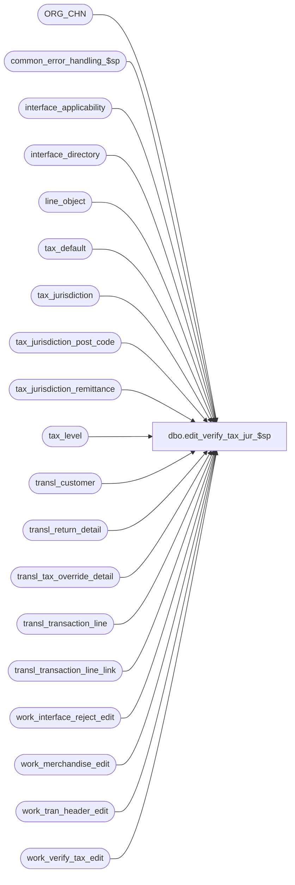

# dbo.edit_verify_tax_jur_$sp

**Database:** auditworks  
**Server:** bedrockdb01  

## Architecture Diagram



## Table Dependencies

| Referenced Table |
|---|
| ORG_CHN |
| common_error_handling_$sp |
| interface_applicability |
| interface_directory |
| line_object |
| tax_default |
| tax_jurisdiction |
| tax_jurisdiction_post_code |
| tax_jurisdiction_remittance |
| tax_level |
| transl_customer |
| transl_return_detail |
| transl_tax_override_detail |
| transl_transaction_line |
| transl_transaction_line_link |
| work_interface_reject_edit |
| work_merchandise_edit |
| work_tran_header_edit |
| work_verify_tax_edit |

## Stored Procedure Code

```sql
create proc dbo.edit_verify_tax_jur_$sp @exception_jurisdiction_check	tinyint,
@tax_default_check		tinyint,
@function_no			tinyint,
@edit_process_no		tinyint = 1,
@errmsg				nvarchar(255) OUTPUT

AS

/* Proc Name: edit_verify_tax_jur_$sp
   DESCRIPTION : This routine will verify if the tax jurisdiction exists on tax override trans.
                 Also checks default tax jurisdiction for all line_objects in the trans.
   Called by edit_lines_validation_$sp.
   NOTE: Any changes made to this proc should also be done for verify_tax_jurisdiction_$sp.

IMPORTANT:
1) If you want to resave this proc, run this SELECT manually:
   SELECT * INTO #tax_post_main FROM work_tax_post_template

2) If you script out this proc, please add two SQL statements:

SELECT * INTO #tax_post_main FROM work_tax_post_template
GO--

before beginning of 'create proc ...'
and

DROP TABLE #tax_post_main
GO--

after the end of this proc in the script   

Date     Author   	Def#   Action
Feb12,14 Vicci        149810   Exclude inactive jurisdictions.  
Oct05,11 Vicci      1-47N6AB   When not using interface-applicability, don't complain about line-object with a line-object-type of 0 not being in the tax-default table (they shouldn't be...).
Nov24,09 Vicci        114269   Cause transaction to reject if tax line has a tax level that does not exist in the tax jurisdiction of any item in the transaction.
Nov20,09 Vicci        109078   Recognize fulfillment_store_no;  also, since some attachments are not on
                                tax lines but only on merch to which tax line is applied don't reject tax
                                lines as invalid level for jurisdiction is the level exists in the jurisdiction
                                applicable to the merch to which the tax is applied.
Oct25,06 Phu           77931   Fix outer join for SQL 2005 Mode 90.
Apr28,05 Maryam      DV-1202   Handle the indirect association via line links. Handle sent to customer as from_line_id
                               changed to line_id. expand transaction_id to use tran_id_datatype (Paul)
Dec15,04 Maryam      DV-1191   Improve performance.
May18,04 David       DV-1071   Use ORG_CHN table instead of store_salesaudit
Jan23,03 Phu            5933   Retrieve sent tax jurisdiction if zip code is defined
Aug01,02 Phu         1-E3LUO   Retrieve tax_jurisdiction of sent transaction
Apr25,02 Phu         1-C9P5S   Pre audit tax
Nov26,01 Winnie	     1-969YY   Add logic for R3 error handling to pass @edit_process_no to procedure
Oct15,01 Maryam   	8840   Author


*/

DECLARE
  @errno		int,
  @applicability_method tinyint,
  @include_expense      tinyint,
  @rows                 int,
  @row_count            int,
  @message_id		int,
  @object_name		nvarchar(255),
  @operation_name	nvarchar(100),
  @process_name		nvarchar(100)

SELECT @process_name = 'edit_verify_tax_jur_$sp',
       @message_id = 201068,
       @rows = 0,
       @include_expense = 0

IF @exception_jurisdiction_check <> 1 AND @tax_default_check <> 1
  RETURN

CREATE TABLE #tax_remit(
           store_no int not null,
           transaction_date smalldatetime not null,
	   transaction_id numeric(14,0) not null, -- tran_id_datatype
	   line_id numeric(5,0) not null,
	   line_object smallint not null,
	   tax_jurisdiction nchar(5) not null,
	   tax_level tinyint null,
	   tax_rate_code tinyint null,
	   remittance_tax_level tinyint null)

SELECT @errno = @@error
IF @errno <> 0
BEGIN
  SELECT @errmsg = 'Unable to create temp table #tax_remit.',
         @object_name = '#tax_remit',
         @operation_name = 'CREATE TABLE'
  GOTO error
END

TRUNCATE TABLE work_verify_tax_edit

SELECT @errno = @@error
IF @errno <> 0
BEGIN
  SELECT @errmsg = 'Unable to truncate work_verify_tax_edit.',
         @object_name = 'work_verify_tax_edit',
         @operation_name = 'TRUNCATE'
  GOTO error
END


IF @function_no = 38 -- pre audit tax
BEGIN
  INSERT work_verify_tax_edit(
      store_no,
      register_no,
      entry_date_time,
      transaction_series,
      transaction_no,
      transaction_date,
      transaction_id,
      line_id,
      line_object,
      tax_jurisdiction,
      tax_level,
      exception_flag )
  SELECT
      store_no,
      register_no,
      entry_date_time,
      transaction_series,
      transaction_no,
      transaction_date,
      transaction_id,
      line_id,
      tpm.line_object,
      tax_jurisdiction,
      l.tax_level,
      SIGN(override_tax_category)
  FROM #tax_post_main tpm WITH (NOLOCK)
       LEFT JOIN tax_level l ON (tpm.line_object = l.line_object)

  SELECT @errno = @@error, @rows = @@rowcount
  IF @errno <> 0
  BEGIN
    SELECT @errmsg = 'Unable to insert work_verify_tax_edit.',
           @object_name = 'work_verify_tax_edit',
           @operation_name = 'INSERT'
    GOTO error
  END
END -- if @function_no = 38
ELSE
BEGIN
  SELECT @applicability_method = applicability_method
  FROM interface_directory
  WHERE interface_id = 12

  SELECT @errno = @@error
  IF @errno <> 0
  BEGIN
    SELECT @errmsg = 'Unable to select from interface_directory.',
           @object_name = 'interface_directory',
           @operation_name = 'SELECT'         
GOTO error
  END

  IF @applicability_method IN (6,7)
    SELECT @include_expense = 1
      
  IF @applicability_method = 0 
      INSERT work_verify_tax_edit(
             store_no,
             register_no,
             entry_date_time,
             transaction_series,
             transaction_no,
             transaction_date,
             transaction_id,
             line_id,
             line_object,
             tax_jurisdiction,
             tax_level)
      SELECT wt.store_no,
             wt.register_no,
             wt.entry_date_time,
             wt.transaction_series,
             wt.transaction_no,
             transaction_date,
             wt.transaction_id,
	     line_id,
	     tl.line_object,
	     s.TAX_JRSDCTN_CODE,
	     tax_level
        FROM work_tran_header_edit wt WITH (NOLOCK)
	     INNER JOIN ORG_CHN s ON (wt.store_no = s.ORG_CHN_NUM)
	     INNER JOIN transl_transaction_line tl WITH (NOLOCK) ON (wt.store_no = tl.store_no
                                                                   AND wt.register_no = tl.register_no
                                                                   AND wt.entry_date_time = tl.entry_date_time
                                                                   AND wt.transaction_series = tl.transaction_series
                                                                   AND wt.transaction_no = tl.transaction_no)
             INNER JOIN interface_applicability ia ON (wt.transaction_category = ia.transaction_category
                                                     AND tl.line_object = ia.line_object
                                                     AND tl.line_action = ia.line_action)
	     LEFT JOIN tax_level l ON (tl.line_object = l.line_object)
       WHERE sa_rejection_flag = 0
	 AND transaction_void_flag IN (0,8)
	 AND date_reject_id = 0
	 AND tl.line_object_type IN (1, 2, 5, 7)
	 AND tl.line_void_flag = 0
	 AND ia.interface_id = 12
    ELSE
      INSERT work_verify_tax_edit(
	     store_no,
             register_no,
             entry_date_time,
             transaction_series,
             transaction_no,
	     transaction_date,
	     transaction_id,
	     line_id,
	     line_object,
	     tax_jurisdiction,
	     tax_level)
      SELECT wt.store_no,
             wt.register_no,
             wt.entry_date_time,
             wt.transaction_series,
             wt.transaction_no,
	     transaction_date,
	     wt.transaction_id,
	     line_id,
	     tl.line_object,
	     s.TAX_JRSDCTN_CODE,
	     tax_level
        FROM work_tran_header_edit wt WITH (NOLOCK)
	     INNER JOIN ORG_CHN s ON (wt.store_no = s.ORG_CHN_NUM)
	     INNER JOIN transl_transaction_line tl WITH (NOLOCK) ON (wt.store_no = tl.store_no
                                                                   AND wt.register_no = tl.register_no
                                                  AND wt.entry_date_time = tl.entry_date_time
                                                                   AND wt.transaction_series = tl.transaction_series
                                                                   AND wt.transaction_no = tl.transaction_no)
	     INNER JOIN interface_applicability ia ON (wt.transaction_category = ia.transaction_category
                                                     AND tl.line_object = ia.line_object
                                                     AND tl.line_action = ia.line_action)
	     LEFT JOIN tax_level l ON (tl.line_object = l.line_object)
       WHERE sa_rejection_flag = 0
	 AND transaction_void_flag IN (0,8)
	 AND date_reject_id = 0
	 AND tl.line_object_type IN (1, 2, 5, 7 * @include_expense)
	 AND tl.line_object_type <> 0
	 AND tl.line_void_flag = 0
	 AND ia.interface_id = 12

    SELECT @errno = @@error, @row_count = @@rowcount
    IF @errno != 0
      BEGIN
       SELECT @errmsg = 'Failed to insert into work_verify_tax_edit.',
              @object_name = 'work_verify_tax_edit',
              @operation_name = 'INSERT'        
       GOTO error
      END

  IF @row_count = 0
    RETURN

-- for oracle will not work because of multiple level
  UPDATE work_verify_tax_edit
  SET tax_jurisdiction = exception_tax_jurisdiction,
      exception_flag = 1
  FROM work_verify_tax_edit t, transl_tax_override_detail tod WITH (NOLOCK)
  WHERE t.transaction_no = tod.transaction_no
  AND t.entry_date_time = tod.entry_date_time
  AND t.store_no = tod.store_no
  AND t.register_no = tod.register_no
  AND t.transaction_series = tod.transaction_series
  AND (t.line_id = tod.line_id OR tod.line_id = 0)
  AND exception_tax_jurisdiction IS NOT NULL --
  AND t.tax_jurisdiction != tod.exception_tax_jurisdiction
     
  SELECT @rows = @rows + @@rowcount,
         @errno = @@error
  IF @errno != 0
  BEGIN
     SELECT @errmsg = 'Failed to update work_verify_tax_edit (tax_override_detail).',
            @object_name = 'work_verify_tax_edit',
            @operation_name = 'UPDATE'         
     GOTO error
  END           

  UPDATE work_verify_tax_edit
  SET tax_jurisdiction = f.TAX_JRSDCTN_CODE,
       exception_flag = 1
  FROM work_verify_tax_edit t
       INNER JOIN work_merchandise_edit m
          ON t.transaction_id = m.transaction_id
         AND t.line_id = m.line_id
       INNER JOIN ORG_CHN f
          ON m.fulfillment_store_no = f.ORG_CHN_NUM
  WHERE t.exception_flag <> 1
    AND t.tax_jurisdiction != f.TAX_JRSDCTN_CODE
  SELECT @rows = @rows + @@rowcount,
          @errno = @@error
  IF @errno <> 0
  BEGIN
  SELECT @errmsg = 'Failed to update work_verify_tax_edit (fulfillment store).',
         @object_name = 'work_verify_tax_edit',
         @operation_name = 'UPDATE'
      GOTO error
  END

  UPDATE work_verify_tax_edit
  SET tax_jurisdiction = ss.TAX_JRSDCTN_CODE,
      exception_flag = 1
  FROM work_verify_tax_edit t, ORG_CHN ss, transl_return_detail rd WITH (NOLOCK)
  WHERE t.transaction_no = rd.transaction_no
  AND t.entry_date_time = rd.entry_date_time
  AND t.store_no = rd.store_no
  AND t.register_no = rd.register_no
  AND t.transaction_series = rd.transaction_series
  AND (rd.line_id = t.line_id OR rd.line_id = 0)
  AND rd.return_from_store = ss.ORG_CHN_NUM 
  AND t.tax_jurisdiction != ss.TAX_JRSDCTN_CODE
  AND t.exception_flag <> 1
    
  SELECT @rows = @rows + @@rowcount,
         @errno = @@error
  IF @errno != 0
  BEGIN
    SELECT @errmsg = 'Failed to update work_verify_tax_edit (return_detail).',
           @object_name = 'work_verify_tax_edit',
           @operation_name = 'UPDATE'   
    GOTO error
  END           

  UPDATE work_verify_tax_edit
     SET tax_jurisdiction = ss.TAX_JRSDCTN_CODE,
         exception_flag = 1
    FROM work_verify_tax_edit t, ORG_CHN ss, transl_return_detail rd WITH (NOLOCK), transl_transaction_line_link k WITH (NOLOCK)
   WHERE t.transaction_no =k.transaction_no
     AND t.entry_date_time = k.entry_date_time
     AND t.store_no = k.store_no
     AND t.register_no = k.register_no
     AND t.transaction_series = k.transaction_series
     AND t.line_id = k.line_id 
     AND t.exception_flag <> 1
     AND k.transaction_no = rd.transaction_no
     AND k.entry_date_time = rd.entry_date_time
     AND k.store_no = rd.store_no
     AND k.register_no = rd.register_no
     AND k.transaction_series = rd.transaction_series
     AND k.linked_line_id = rd.line_id
     AND rd.return_from_store = ss.ORG_CHN_NUM 
     AND t.tax_jurisdiction != ss.TAX_JRSDCTN_CODE

  SELECT @rows = @rows + @@rowcount,
         @errno = @@error
  IF @errno != 0
  BEGIN
    SELECT @errmsg = 'Failed to update work_verify_tax_edit (return_detail) via transaction line link.',
           @object_name = 'work_verify_tax_edit',
           @operation_name = 'UPDATE'           
    GOTO error
  END


/* Set tax_jurisdiction based on send-to customer */

  UPDATE work_verify_tax_edit
     SET tax_jurisdiction = tj.tax_jurisdiction,
         exception_flag = 1
    FROM work_verify_tax_edit vt,
         transl_customer c WITH (NOLOCK),
         tax_jurisdiction tj
   WHERE vt.transaction_no = c.transaction_no
     AND vt.entry_date_time = c.entry_date_time
     AND vt.store_no = c.store_no
     AND vt.register_no = c.register_no
     AND vt.transaction_series = c.transaction_series
     AND (vt.line_id = c.line_id OR c.line_id = 0)
     AND c.customer_role = 2
     AND c.pos_tax_jurisdiction_code = tj.pos_tax_jurisdiction_code
     AND tj.pos_tax_jurisdiction_code IS NOT NULL
     AND vt.tax_jurisdiction != tj.tax_jurisdiction

    SELECT @rows = @rows + @@rowcount,
           @errno = @@error
    IF @errno <> 0
    BEGIN
      SELECT @errmsg = 'Failed to set tax_jurisdiction for sent customer from tax jurisdiction.',
             @object_name = 'work_verify_tax_edit',
             @operation_name = 'UPDATE'
      GOTO error
    END

  UPDATE work_verify_tax_edit
     SET tax_jurisdiction = tj.tax_jurisdiction,
         exception_flag = 1
    FROM work_verify_tax_edit vt,
         transl_transaction_line_link k WITH (NOLOCK),
         transl_customer c WITH (NOLOCK),
         tax_jurisdiction tj
   WHERE vt.transaction_no = k.transaction_no
     AND vt.entry_date_time = k.entry_date_time
     AND vt.store_no = k.store_no
   AND vt.register_no = k.register_no
     AND vt.transaction_series = k.transaction_series
     AND vt.line_id = k.line_id
     AND k.transaction_no = c.transaction_no
     AND k.entry_date_time = c.entry_date_time
     AND k.store_no = c.store_no
     AND k.register_no = c.register_no
     AND k.transaction_series = c.transaction_series
     AND k.linked_line_id = c.line_id
     AND c.customer_role = 2
     AND c.pos_tax_jurisdiction_code = tj.pos_tax_jurisdiction_code
     AND tj.pos_tax_jurisdiction_code IS NOT NULL
     AND vt.tax_jurisdiction != tj.tax_jurisdiction

    SELECT @rows = @rows + @@rowcount,
           @errno = @@error
    IF @errno <> 0
    BEGIN
      SELECT @errmsg = 'Failed to set tax_jurisdiction for sent customer from tax jurisdiction via transaction line link.',
             @object_name = 'work_verify_tax_edit',
             @operation_name = 'UPDATE'
      GOTO error
    END
    
  UPDATE work_verify_tax_edit
     SET tax_jurisdiction = tjp.tax_jurisdiction,
         exception_flag = 1
    FROM work_verify_tax_edit vt,
         transl_customer c WITH (NOLOCK),
         tax_jurisdiction_post_code tjp
   WHERE vt.transaction_no = c.transaction_no
     AND vt.entry_date_time = c.entry_date_time
     AND vt.store_no = c.store_no
     AND vt.register_no = c.register_no
     AND vt.transaction_series = c.transaction_series
     AND (vt.line_id = c.line_id OR c.line_id = 0)    
     AND c.customer_role = 2
     AND c.post_code >= tjp.from_post_code
     AND c.post_code <= tjp.to_post_code
     AND c.pos_tax_jurisdiction_code IS NULL 
     AND vt.tax_jurisdiction != tjp.tax_jurisdiction


    SELECT @rows = @rows + @@rowcount, @errno = @@error
    IF @errno <> 0
    BEGIN
      SELECT @errmsg = 'Failed to set tax_jurisdiction for sent customer from tax jurisdiction post code.',
             @object_name = 'work_verify_tax_edit',
             @operation_name = 'UPDATE'
      GOTO error
    END 

  UPDATE work_verify_tax_edit
     SET tax_jurisdiction = tjp.tax_jurisdiction,
         exception_flag = 1
    FROM work_verify_tax_edit vt,
         transl_customer c WITH (NOLOCK),
         transl_transaction_line_link k WITH (NOLOCK),
         tax_jurisdiction_post_code tjp
   WHERE vt.transaction_no = k.transaction_no
     AND vt.entry_date_time = k.entry_date_time
     AND vt.store_no = k.store_no
     AND vt.register_no = k.register_no
     AND vt.transaction_series = k.transaction_series
     AND vt.line_id = k.line_id
     AND k.transaction_no = c.transaction_no
     AND k.entry_date_time = c.entry_date_time
     AND k.store_no = c.store_no
     AND k.register_no = c.register_no
     AND k.transaction_series = c.transaction_series
     AND k.linked_line_id = c.line_id     
     AND c.customer_role = 2
     AND c.post_code >= tjp.from_post_code
     AND c.post_code <= tjp.to_post_code
     AND c.pos_tax_jurisdiction_code IS NULL 
     AND vt.tax_jurisdiction != tjp.tax_jurisdiction


    SELECT @rows = @rows + @@rowcount, @errno = @@error
    IF @errno <> 0
    BEGIN
      SELECT @errmsg = 'Failed to set tax_jurisdiction for sent customer from tax jurisdiction post code.',
             @object_name = 'work_verify_tax_edit',
             @operation_name = 'UPDATE'
      GOTO error
    END
     
END -- else of if @function_no = 38

IF @tax_default_check = 0 AND @rows = 0
  RETURN 

    --114269
    UPDATE work_verify_tax_edit
       SET tax_jurisdiction = t.max_tax_jurisdiction
      FROM (SELECT v.transaction_id, v.tax_level, max(CASE WHEN o.line_object_type = 5 THEN '' ELSE tax_jurisdiction END) item_tax_jurisdiction
              FROM work_verify_tax_edit v
                   INNER JOIN line_object o
                      ON v.line_object = o.line_object
             GROUP BY v.transaction_id, v.tax_level
            HAVING max(CASE WHEN o.line_object_type = 5 THEN '' ELSE tax_jurisdiction END) = '') q,
           (SELECT itm.transaction_id, max(itm.tax_jurisdiction) max_tax_jurisdiction
              FROM work_verify_tax_edit itm
                   INNER JOIN line_object io
                      ON itm.line_object = io.line_object
                     AND io.line_object_type <> 5
             GROUP BY itm.transaction_id) t
     WHERE work_verify_tax_edit.transaction_id = q.transaction_id
       AND work_verify_tax_edit.tax_level = q.tax_level
       AND q.transaction_id = t.transaction_id
    SELECT @errno = @@error
    IF @errno <> 0
    BEGIN
      SELECT @errmsg = 'Failed to modify tax jurisdiction of tax rows whose tax level does not exist in the tax jurisdiction of any items in the transaction',
             @object_name = 'work_verify_tax_edit',
             @operation_name = 'UPDATE'
      GOTO error
    END


    INSERT INTO #tax_remit(
           store_no,
           transaction_date,
	   transaction_id,
	   line_id,
	   line_object,
	   t.tax_jurisdiction,
	   t.tax_level,
	   tax_rate_code,
	   remittance_tax_level)
    SELECT store_no,
	   transaction_date,
	   transaction_id,
	   line_id,
	   line_object,
	   t.tax_jurisdiction,
	   t.tax_level,
	   tax_rate_code,
	   CASE WHEN COALESCE(j.active_flag, 0) = 1 THEN tjr.tax_level ELSE NULL END
      FROM work_verify_tax_edit t WITH (NOLOCK)
           LEFT JOIN tax_jurisdiction_remittance tjr ON (t.tax_jurisdiction = tjr.tax_jurisdiction
                                                         AND (t.tax_level IS NULL OR t.tax_level = tjr.tax_level ))
           LEFT JOIN tax_jurisdiction j
             ON t.tax_jurisdiction = j.tax_jurisdiction
     WHERE (t.exception_flag = 1 OR @tax_default_check = 1)
     
    SELECT @errno = @@error
    IF @errno <> 0
      BEGIN
	SELECT @errmsg = 'Failed to insert into #tax_remit.',
               @object_name = '#tax_remit',
               @operation_name = 'INSERT'   	
	GOTO error
      END
   
   UPDATE #tax_remit
      SET tax_rate_code = td.tax_rate_code
     FROM #tax_remit tr , tax_default td
    WHERE tr.tax_jurisdiction = td.tax_jurisdiction
      AND tr.line_object = td.line_object
      AND tr.remittance_tax_level = td.tax_level 
      AND tr.transaction_date >= td.effective_from_date 
      AND (tr.transaction_date <= td.effective_until_date OR td.effective_until_date IS NULL)      

    SELECT @errno = @@error
    IF @errno <> 0
      BEGIN
        SELECT @errmsg = 'Failed to update #tax_remit.',
               @object_name = '#tax_remit',
               @operation_name = 'UPDATE'   	        
        GOTO error
      END
    
    INSERT work_interface_reject_edit (
	   transaction_id,
	   line_id,
	   if_reject_reason,
	   memo1,
	   memo2)
    SELECT tr1.transaction_id,
           tr1.line_id,
           7,
	   MAX(tr1.tax_jurisdiction),
	   CONVERT(nvarchar, MAX(tr1.tax_level))
      FROM #tax_remit tr1 WITH (NOLOCK)
     WHERE tr1.remittance_tax_level IS NULL --
       AND NOT EXISTS (SELECT 1 FROM #tax_remit tr2 WHERE tr1.transaction_id = tr2.transaction_id and tr1.tax_level = tr2.remittance_tax_level)  --since some attachments are not on tax lines but only on merch to which tax line is applied 
     GROUP BY tr1.transaction_id, tr1.line_id
      
    SELECT @errno = @@error
    IF @errno != 0
      BEGIN
        SELECT @errmsg = 'Failed to INSERT work_interface_reject_edit (type 7)',
               @object_name = 'work_interface_reject_edit',
               @operation_name = 'INSERT'   	        
        GOTO error
      END
      
    INSERT work_interface_reject_edit (
	   transaction_id,
	   line_id,
	   if_reject_reason,
	   memo1,
	   memo2,
	   memo3)
    SELECT transaction_id,
           line_id,
           8,
	   MAX(tax_jurisdiction),
	   CONVERT(nvarchar, MAX(remittance_tax_level)),
	   CONVERT(nvarchar, MAX(line_object))
      FROM #tax_remit WITH (NOLOCK)
     WHERE tax_rate_code IS NULL --
     AND remittance_tax_level IS NOT NULL --
     GROUP BY transaction_id, line_id          
       
    SELECT @errno = @@error
    IF @errno != 0
      BEGIN
        SELECT @errmsg = 'Failed to INSERT work_interface_reject_edit (type 8)',
               @object_name = 'work_interface_reject_edit',
               @operation_name = 'INSERT'           
        GOTO error
      END      

DROP TABLE #tax_remit
SELECT @errno = @@error
IF @errno <> 0
BEGIN
  SELECT @errmsg = 'Unable to drop temp table #tax_remit.',
         @object_name = '#tax_remit',
         @operation_name = 'DROP'
  GOTO error
END

 
RETURN 

error:
	EXEC common_error_handling_$sp 4, @errno, @errmsg, 0, @message_id, 
	@process_name, @object_name, @operation_name, 1, @edit_process_no
	
	RETURN
```

