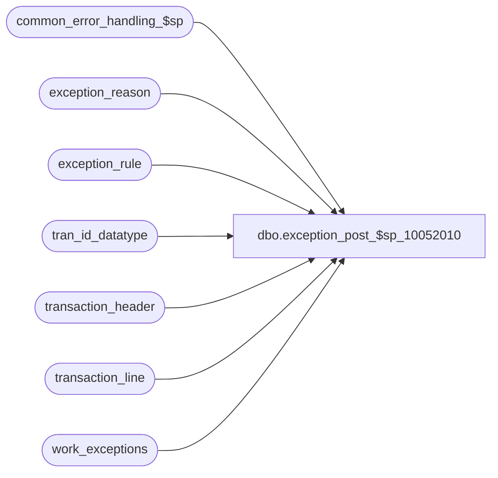

# dbo.exception_post_$sp_10052010

**Database:** auditworks  
**Server:** bedrockdb01  

## Architecture Diagram



## Table Dependencies

| Referenced Table |
|---|
| common_error_handling_$sp |
| exception_reason |
| exception_rule |
| tran_id_datatype |
| transaction_header |
| transaction_line |
| work_exceptions |

## Stored Procedure Code

```sql
create proc [dbo].[exception_post_$sp_10052010] 
@process_id     binary(16), 
@user_id        int,
@errmsg         varchar(255)            OUTPUT,
@transaction_id tran_id_datatype = NULL

AS

/* Procedure Name: exception_post_$sp
   Desc: Identify transactions that are exceptions. SQL_QRY is generated using metadata and maintained via tm.
   Called by edit_exceptions_$sp, edit_trickle_exceptions_$sp, move_register_$sp, transaction_add_$sp, transaction_modify_$sp

HISTORY
Date     Name            Defect Desc
May06,09 Phu 		 110085 Fix exception count is not calculated.
Feb06,09 Paul		  81222 always update tran header so @rows will be correct
Jul11,07 Paul           DV-1363 uplift 88929 to SA5
Mar28,06 David          DV-1332 Change @SQL_QRY to Nvarchar since it is used in sp_executesql.
Jul05,05 Paul           DV-1239 Use new sql column (only one sql query allowed per exception reason), receive @transaction_id
Mar24,05 Paul           DV-1218 removed reference to dropped column to support SA5 tm
Dec02,04 Paul           DV-1181 look at ACTV column in exception_rule, added nolock hints
Sep16,04 Maryam         DV-1146 Receive @user_id
Apr22,04 Maryam         DV-1071 Receive @process_id and pass it to common_error_handling_$sp
Jul05,07 Vicci            88929  Execute even when query id is null, i.e. when non-smartview generated query code
				     has been inserted into the exception_sql table.
Apr19,02 ShuZ           1-CD0IX Standardize  R3.5 Common error handling
Jul06,00 Phu               6428 Ported from Oracle for MS SQL

*/


DECLARE
        @cursor_open            tinyint,
        @errno                  int,
        @exception_rule         smallint,
	@object_name            varchar(255),
	@process_name           varchar(100),
	@operation_name         varchar(100),
	@message_id		int,
	@rows			int,
	@SQL_QRY		nvarchar(3000)

SELECT @process_name = 'exception_post_$sp',
       @message_id = 201068,
       @process_id = COALESCE(@process_id, @@spid), -- required for smartview exception query
       @cursor_open = 0          

IF @transaction_id IS NOT NULL -- modify and add
BEGIN
  DELETE work_exceptions
   WHERE process_id = @process_id

  SELECT @errno = @@error
  IF @errno != 0
  BEGIN
    SELECT @errmsg = 'Failed to cleanup work_exceptions',
           @object_name = 'work_exceptions',
           @operation_name = 'DELETE'
    GOTO error
  END

  INSERT work_exceptions (
	process_id,
	transaction_id)
  SELECT @process_id,
	@transaction_id

  SELECT @errno = @@error
  IF @errno != 0
  BEGIN
    SELECT @errmsg = 'Failed to INSERT on work_exceptions',
         @object_name = 'work_exceptions',
         @operation_name = 'INSERT'
    GOTO error
  END

END -- If @transaction_id IS NOT NULL


DECLARE user_exception_crsr CURSOR FAST_FORWARD
FOR
SELECT exception_rule,
       SQL_QRY
FROM exception_rule WITH (NOLOCK)
WHERE exception_type >= 1
  AND ACTV = 1
  AND SQL_QRY IS NOT NULL
ORDER BY exception_rule

OPEN user_exception_crsr

SELECT @errno = @@error
IF @errno != 0
BEGIN
  SELECT @errmsg         = 'Failed to open user_exception_crsr',
         @object_name    = 'user_exception_crsr',
         @operation_name = 'OPEN'
  GOTO error
END

SELECT @cursor_open = 1

WHILE 1 = 1
  BEGIN
      FETCH user_exception_crsr INTO
        @exception_rule,
        @SQL_QRY

      IF @@fetch_status <> 0
        BREAK

      EXEC sp_executesql @SQL_QRY, N'@process_id binary(16)', @process_id

      SELECT @errno = @@error
      IF @errno <> 0
        BEGIN
         SELECT @object_name = 'sp_executesql',
		@operation_name = 'EXECUTE',
		@errmsg = 'Failed to execute exception sql: ' + CONVERT(varchar,@exception_rule)
         GOTO error
        END

  END -- while 1 = 1

CLOSE user_exception_crsr
DEALLOCATE user_exception_crsr
SELECT @cursor_open = 0

/* Only exceptions where exception_type_flag = 1 (Guided Audit) will
   be reflected in the exception_qty in audit_status
*/


UPDATE transaction_header
  SET exception_flag = 1
  FROM work_exceptions we WITH (NOLOCK),
         exception_reason er WITH (NOLOCK),
          exception_rule el WITH (NOLOCK),
          transaction_header h
 WHERE we.process_id = @process_id
   AND we.transaction_id = er.transaction_id
   AND we.transaction_id = h.transaction_id
   AND er.violated_exception_rule = el.exception_rule
   AND el.exception_type = 1
   AND el.ACTV = 1

SELECT @errno = @@error, @rows = @@rowcount
IF @errno != 0
  BEGIN
   SELECT @errmsg = 'Failed to set exception_flag in transaction_header.',
                @object_name = 'transaction_header',
                @operation_name = 'UPDATE'
   GOTO error
  END

IF @rows > 0 -- if any type 1 exceptions were created above
  BEGIN
   UPDATE transaction_line
     SET exception_flag = 1
     FROM work_exceptions we WITH (NOLOCK),
          exception_reason er WITH (NOLOCK),
          exception_rule el WITH (NOLOCK),
          transaction_line l
    WHERE we.process_id = @process_id
      AND we.transaction_id = er.transaction_id
      AND we.transaction_id = l.transaction_id
      AND er.violated_exception_rule = el.exception_rule
      AND el.exception_type = 1
      AND el.ACTV = 1
      AND er.line_id <> 0
      AND er.line_id = l.line_id
      AND l.exception_flag = 0

   SELECT @errno = @@error
   IF @errno != 0
     BEGIN
      SELECT @errmsg = 'Failed to set exception_flag in transaction_line.',
                @object_name = 'transaction_line',
                @operation_name = 'UPDATE'
      GOTO error
     END
  END -- If @rows > 0

IF @transaction_id IS NOT NULL -- cleanup
BEGIN
  DELETE work_exceptions 
   WHERE process_id = @process_id

  SELECT @errno = @@error
  IF @errno != 0
  BEGIN
    SELECT @errmsg = 'Failed to DELETE work_exceptions',
         @object_name = 'work_exceptions',
         @operation_name = 'DELETE'
    GOTO error
  END
END -- cleanup

RETURN


error:   /* Common error handler */

  IF @cursor_open = 1
  BEGIN
    CLOSE user_exception_crsr
    DEALLOCATE user_exception_crsr
  END

  EXEC common_error_handling_$sp 5, @errno, @errmsg, 0, @message_id, @process_name,
       @object_name, @operation_name, 1, 1, 0, null, 0, null, null, null, null, null,
       null, 0, @process_id, @user_id
        
  RETURN
```

