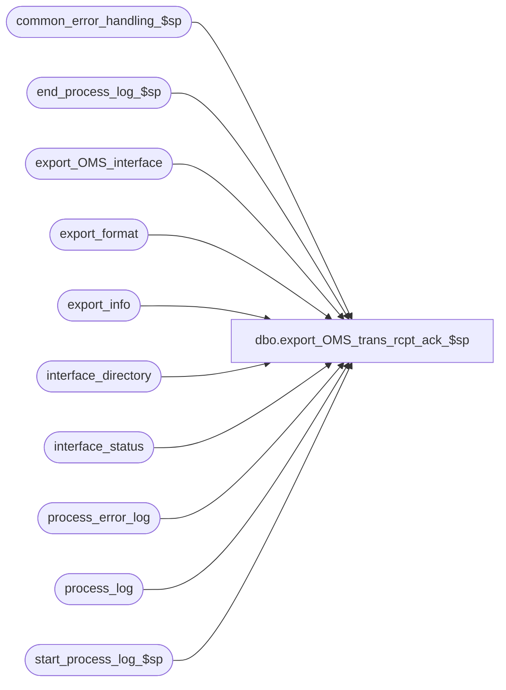

# dbo.export_OMS_trans_rcpt_ack_$sp

**Database:** auditworks  
**Server:** bedrockdb01  

## Architecture Diagram



## Table Dependencies

| Referenced Table |
|---|
| common_error_handling_$sp |
| end_process_log_$sp |
| export_OMS_interface |
| export_format |
| export_info |
| interface_directory |
| interface_status |
| process_error_log |
| process_log |
| start_process_log_$sp |

## Stored Procedure Code

```sql
CREATE proc  [dbo].[export_OMS_trans_rcpt_ack_$sp] (@interface_id	tinyint  --97
)
AS

DECLARE
@errmsg 			nvarchar(255),
@errno				int,
@process_log_entry 	tinyint,
@process_no 		smallint,
@process_timestamp 	float,
@process_start_time	datetime, 
@transaction_line_count	int,
@rows				int,
@message_id		    int,	
@object_name		nvarchar(255),
@operation_name		nvarchar(100),
@process_name		nvarchar(100),
@immediate_posting_requested	tinyint,
@stream_no          tinyint,
@batch_size			int,
@max_rows_avalara_accepts	int,
@export_format		tinyint,
@object_id			int,
@retrieval_in_progress          tinyint,
@current_db_name 	nvarchar(30),
@function_name 		varbinary(128),
@db_id              int,
@last_posting_datetime          datetime,
@min_serial_no      numeric(14,0),
@max_serial_no      numeric(14,0),
@current_rows       int,
@excess_rows		int,
@avg_lines_per_trans float,
@one				tinyint,
@excess_trans_estimate		int,
@excess_rows_deferred		int,
@transaction_count	int,
@company_code		nvarchar(25),
@aggregate			tinyint,
@cursor_open 		tinyint,
@Ref2				nvarchar(50),
@avalara_multi_cmp	tinyint,  --0=use 012_company_code as Avalara company code, 1=use G/L company assigned to each store as Avalara company
@export_tbl_name	nvarchar(50),
@export_vw_name		nvarchar(50),
@SQL_QRY		    nvarchar(max);

/* Proc Name: export_OMS_trans_rcpt_ack_$sp
   Desc: Export acknowledgement of receipt of OMS transactions to OMS.
         Called by ICT_EXPORTXX.
         Edit populates edit_OMS_trans_rcpt_ack.
         Immediate_posting_requested is set assuming export-format "auto-set-posting request" is left active (value 1=Upon edit interface status posting datetime update).
         This triggers ICT_EXPORT01 to:
		a)  call the OMS trans export proc specified in export format (e.g. export_OMS_trans_rcpt_ack_$sp).
		b)  transfer it to OMS via a call to their web-service (if export format configured with FTP flag = 2 
		    and export destination set to web-service-caller exe (OMSInterface.exe -S? -U? -P? -F?
		    where -S the OMS web service URL without the https:// prefix, -U and -P are the user-name/password and
		          -F is the name of the file to be transmitted (usually OMS_trans_rcpt_ackYYYYMMDDHHMMSS.json).  
		    The ? specifies that smartload will swap in the FTP Host, HostId, HostPassword, OutputFilePrefixAndTimestamp export_format
		    settings for -S, -U, -P, -F respectively.
                or
		    copy it to OUTPUT directory (if export format configured with FTP flag = 0 and destination set to ../OUTPUT)

   Pre-requisites:  
	- Interface 97 (OMS Transaction Receipt acknowledgement) must have an update-timing of 6 (Edit) and an ascii export selected.
	- Sufficient space available in ICT_EXPORT01 directory to hold the number of days of BK (backup files) desired.
	- OMS WebServiceURL(without the https:// prefix), Account/User and Key/Password configured in export-format table-maintenance (under FTP Host, FTP Host Id and FTP Host Password) if web-service transfer is being used.
	- The export_OMS_trans_rcpt_ack and export_OMS_trans_rcpt_ack_vw must exist, since the work table and view for the requested interface_id are based on these existing objects
NOTE:  Although there is a possibility that the export might end up running concurrently with the Edit,
       the transactions in the midst of being logged by the Edit would not be visible until commited.
	   In multiple instances event acknowlegement if store-to-interface is not defined for a store, data for that store will be accumulated in edit_OMS_trans_rcpt_ack table

Unicode compliant version.

HISTORY:
Date     Name           Def# Desc
Jul10,18 Kiri       DAOM-3694 Added self-correct feature to resolve issues in multi acknowledgement processing
May23,18 Kiri       DAOM-3572 Corrected export's default view name for interface 97 in multiple acknowlegement instances
Apr20,18 Kiri       DAOM-3356 Fix JSON view to correct out of sequence txns in order to avoid error in the transfer of the file
Jan20,17 Kiri       DAOM-1953 Add multiple EOM instances support for JSON event acknowlegement
Jul12,16 Vicci      DAOM-914  Author.

*/

SET CONCAT_NULL_YIELDS_NULL OFF

SELECT @process_no = 209,  --ad hoc export
       @process_name = 'export_OMS_trans_rcpt_ack_$sp',
       @message_id = 201068,
       @process_start_time = getdate(),
       @current_db_name = db_name(),
       @function_name = convert(varbinary(128), 'export_OMS_trans_rcpt_ack_$sp'),
       @max_rows_avalara_accepts = 100000,
       @one = 1,
       @excess_rows_deferred = 0,
       @transaction_line_count = 0
       

/* immediate_posting_requested:  0=abort, 
				 1=populate interface export from edit work (ict will bcp and set to 0)
				 2=populate interface export from edit work (ict will bcp but not reset)
				 3=populate interface export from edit work (ict will bcp but not reset)
*/
IF NOT EXISTS (SELECT 1 FROM export_OMS_interface)
BEGIN
  IF @interface_id IS NULL OR @interface_id <> 97
  BEGIN
    SELECT @message_id = 201684,
         @errno = 201684,
         @object_name = @process_name,
         @errmsg = 'Invalid Argument(s) passed to the stored procedure ' + @process_name + '. Expecting 97.'
    GOTO error
  END
  SELECT @export_tbl_name = 'export_OMS_trans_rcpt_ack';
  SELECT @export_vw_name = 'export_OMS_trans_rcpt_ack_vw';
END
ELSE 
BEGIN
  IF @interface_id IS NULL OR ((SELECT count(1) FROM export_OMS_interface WHERE interface_id = @interface_id) = 0)
  BEGIN
    SELECT @message_id = 201684,
      @errno = 201684,
      @object_name = @process_name,
      @errmsg = 'Invalid Argument(s) passed to the stored procedure ' + @process_name + '. Not defined in export interface table.';
      GOTO error
  END
  -- set the work table and view for the requested interface  The base name is specified in export_info.export_table_name
  SELECT @Ref2 = (SELECT TOP(1) export_table_name from export_info WHERE interface_id = @interface_id);
  IF(@Ref2 = '' OR @Ref2 IS NULL)
    SELECT @Ref2 = 'export_OMS_trans_rcpt_ack_vw';
  SELECT @export_vw_name = RTRIM(@Ref2) + '_' + LTRIM(STR(@interface_id));
  SELECT @export_tbl_name = REPLACE(RTRIM(@Ref2),'_vw', '') + '_' + LTRIM(STR(@interface_id));
  SELECT @one = 0;
END

SELECT @immediate_posting_requested = ISNULL(immediate_posting_requested,0),
       @retrieval_in_progress = retrieval_in_progress,
       @last_posting_datetime = last_posting_datetime
  FROM interface_status WITH (NOLOCK)
 WHERE interface_id = @interface_id
SELECT @errno = @@error
IF @errno <> 0
BEGIN
  SELECT @errmsg = 'Unable to select immediate_posting_request, retrieval_in_progress, last_posting_datetime from interface status',
         @object_name = 'interface_status',
         @operation_name = 'SELECT'      
  GOTO error
END

IF @immediate_posting_requested = 0  --abort requested
  RETURN

SET CONTEXT_INFO @function_name

IF @retrieval_in_progress <> 0
BEGIN
  SELECT @db_id = dbid
    FROM master..sysprocesses
   WHERE spid = @@spid
  SELECT @errno = @@error
  IF @errno != 0
  BEGIN
    SELECT @errmsg = 'Unable to select from master..sysprocesses',
           @object_name = 'master..sysprocesses',
           @operation_name = 'SELECT'
    GOTO error
  END

  IF EXISTS (SELECT 1
               FROM master..sysprocesses
              WHERE context_info = @function_name
                AND spid <> @@spid
                AND dbid = @db_id
                AND db_name(dbid) = @current_db_name)
  BEGIN
    SELECT @message_id = 201682,
           @errno = 201682,
           @object_name = @process_name,
           @errmsg = 'The stored procedure ' + @process_name + ' is currently running. Please verify.'
    GOTO error
  END
END

  EXEC start_process_log_$sp @process_no, @process_timestamp OUTPUT, @errmsg OUTPUT
  SELECT @errno = @@error
  IF @errno <> 0
  BEGIN
    SELECT @errmsg = @errmsg + ' Unable to execute start_process_log_$sp',
           @object_name = 'start_process_log_$sp',
           @operation_name = 'EXECUTE'
    GOTO error
  END
  SELECT @process_log_entry = 1

UPDATE interface_status
   SET retrieval_in_progress  = 1, last_retrieval_datetime = @process_start_time
 WHERE interface_id = @interface_id
SELECT @errno = @@error
IF @errno <> 0
BEGIN
  SELECT @errmsg = 'Unable to set last_retrieval_datetime in interface_status',
         @object_name = 'interface_status',
         @operation_name = 'UPDATE'
  GOTO error
END

-- Create temp table based on export_OMS_trans_rcpt_ack for the selected interface_id if it does not exit
IF NOT EXISTS (SELECT 1
                 FROM sysobjects
                 WHERE type = 'U'
                   AND name = @export_tbl_name)
BEGIN
  SET @SQL_QRY = N'  
     SELECT * INTO ' + @export_tbl_name + ' FROM export_OMS_trans_rcpt_ack WHERE 1=2;';
  EXEC sp_executesql @SQL_QRY
  SELECT @errno = @@error
  IF @errno <> 0
  BEGIN
    SELECT @errmsg = 'The export work table does not exit and Create failed',
         @errno = 201068,
         @object_name = @export_tbl_name,
         @operation_name = 'CREATE'
    GOTO error
  END;
END;

-- Create the JSON view based on export_OMS_trans_rcpt_ack_vw for the interface_id if it does not exit
IF  NOT EXISTS (SELECT 1
                  FROM sysobjects
                  WHERE type = 'V'
                    AND name = @export_vw_name)
BEGIN
  SELECT @SQL_QRY = REPLACE(OBJECT_DEFINITION (OBJECT_ID('export_OMS_trans_rcpt_ack_vw')), 'export_OMS_trans_rcpt_ack', @export_tbl_name);
  SELECT @SQL_QRY = REPLACE(@SQL_QRY, @export_tbl_name + '_vw', @export_vw_name);

  EXEC sp_executesql @SQL_QRY
  SELECT @errno = @@error
  IF @errno <> 0
  BEGIN
    SELECT @errmsg = 'The export JSON view does not exit and create JSON custom view failed',
         @errno = 201068,
         @object_name = @export_vw_name,
         @operation_name = 'SELECT'
    GOTO error
  END;
END;


SELECT @transaction_line_count = 0;
SET @SQL_QRY = N'                 
		SELECT @transaction_line_count=COUNT(1) FROM ' + @export_tbl_name +' WHERE RIGHT(delimited_field_col1, 1) = '',''  ;';
EXEC sp_executesql @SQL_QRY, N'@transaction_line_count int OUTPUT', @transaction_line_count=@transaction_line_count OUTPUT;

SELECT @errno = @@error
IF @errno <> 0
BEGIN
  SELECT @errmsg = 'Failed to determine if rows requiring re-transmission left behind as a result of prior bcp/file-transfer version failure.',
         @object_name = @export_tbl_name,
         @operation_name = 'SELECT'
  GOTO error
END  

IF @transaction_line_count > 0
BEGIN
	SET @SQL_QRY = N'                 	
		UPDATE ' + @export_tbl_name + '
			SET delimited_field_col1 = SUBSTRING(delimited_field_col1, 1, len(delimited_field_col1) - 1)
			WHERE RIGHT(delimited_field_col1, 1) = '',''  ;';
	EXEC sp_executesql @SQL_QRY;

  SELECT @errno = @@error
  IF @errno <> 0
  BEGIN
    SELECT @errmsg = 'Unable to remove trailing comma from existing entries of list to be exported.  ',
           @object_name = @export_tbl_name,
           @operation_name = 'UPDATE'
    GOTO error
  END
END

BEGIN TRANSACTION

  IF @one = 0
     SET @SQL_QRY = N'  
        INSERT INTO ' + @export_tbl_name + '(delimited_field_col1, transaction_no)
          SELECT ''{"TransactionId": "'' + convert(nvarchar, transaction_no) + ''", "ProcessedDate": "'' + process_start_time_formatted + ''" }'' , transaction_no
          FROM edit_OMS_trans_rcpt_ack
               WHERE store_no in (select store_no from export_OMS_interface where interface_id = '+ LTRIM(STR(@interface_id)) + ');';
  ELSE
     SET @SQL_QRY = N'  
        INSERT INTO ' + @export_tbl_name + '(delimited_field_col1, transaction_no)
          SELECT ''{"TransactionId": "'' + convert(nvarchar, transaction_no) + ''", "ProcessedDate": "'' + process_start_time_formatted + ''" }'' , transaction_no
          FROM edit_OMS_trans_rcpt_ack;';

  EXEC sp_executesql @SQL_QRY;
  SELECT @errno = @@error, @transaction_line_count = @transaction_line_count + @@rowcount
  IF @errno <> 0
  BEGIN
    SELECT @errmsg = 'Unable to copy rows from edit to export',
           @object_name = @export_tbl_name,
           @operation_name = 'INSERT'
    GOTO error
  END

  SET @SQL_QRY = N'  
     DELETE edit_OMS_trans_rcpt_ack
        WHERE transaction_no IN (SELECT transaction_no FROM ' + @export_tbl_name + ')';
  EXEC sp_executesql @SQL_QRY;
  SELECT @errno = @@error
  IF @errno <> 0
  BEGIN
    SELECT @errmsg = 'Unable to remove rows from outstanding list.  ',
           @object_name = 'edit_OMS_trans_rcpt_ack',
           @operation_name = 'DELETE'
    GOTO error
  END
COMMIT

SELECT @export_format = ascii_export
  FROM interface_directory WITH (NOLOCK)
 WHERE interface_id = @interface_id
SELECT @errno = @@error 
IF @errno <> 0 
BEGIN
  SELECT @errmsg = 'Unable to select export format and object ID',
	 @object_name = 'interface_directory',
	 @operation_name = 'SELECT'
  GOTO error
END
  
SELECT @stream_no = stream_no 
  FROM export_format WITH (NOLOCK)
 WHERE interface_id = @interface_id
   AND export_format = @export_format
   AND copy_no = 1
SELECT @errno = @@error 
IF @errno <> 0 
BEGIN
  SELECT @errmsg = 'Unable to determine batch size and stream#',
	 @object_name = 'export_format',
	 @operation_name = 'SELECT'
  GOTO error
END
  
IF @stream_no IS NULL
  SELECT @stream_no = 1

IF @process_log_entry = 1
BEGIN
  EXEC end_process_log_$sp @process_no, @process_timestamp, @transaction_line_count
  SELECT @errno = @@error
  IF @errno <> 0
  BEGIN
    SELECT @errmsg = 'Unable to exec end_process_log_$sp',
           @object_name = 'end_process_log_$sp',
           @operation_name = 'EXECUTE'
    GOTO error
  END

  UPDATE process_error_log
     SET verified = 1,
         verified_by_user_id = null -- system
   WHERE process_no = @process_no
     AND verified = 0
     AND process_name = @process_name
  SELECT @errno = @@error
  IF @errno <> 0
  BEGIN
    SELECT @errmsg = 'Unable to update process_error_log',
	   @object_name = 'process_error_log',
   	   @operation_name = 'UPDATE'
    GOTO error
  END

  UPDATE process_log
     SET process_status_flag = 3
   WHERE process_start_time = process_end_time
     AND process_no = @process_no
     AND process_timestamp = @process_timestamp
     AND process_status_flag = 1
  SELECT @errno = @@error
  IF @errno <> 0
  BEGIN
    SELECT @errmsg = 'Unable to update process_log',
           @object_name = 'process_log',
           @operation_name = 'UPDATE'
    GOTO error
  END

END -- If @process_log_entry = 1  

-- Mark the interface as complete
BEGIN TRAN
  BEGIN
    UPDATE interface_status
       SET last_retrieval_datetime = getdate(),
           retrieval_in_progress = 0,
           immediate_posting_requested = 1  --in case the prior run bumped it to 2
     WHERE last_posting_datetime = @last_posting_datetime
       AND interface_id = @interface_id
    SELECT @errno = @@error, @rows = @@rowcount
    IF @errno <> 0
    BEGIN
      SELECT @errmsg = 'Unable to set retrieval_in_progress in interface_status for interface_id ' + CONVERT(nvarchar, @interface_id),
             @object_name = 'interface_status',
           @operation_name = 'UPDATE'
     GOTO error
    END
  END --ELSE of IF @excess_rows_deferred > 0 

  IF @rows = 0
  BEGIN
    UPDATE interface_status
       SET retrieval_in_progress = 0,
           immediate_posting_requested = 2
     WHERE interface_id = @interface_id
    SELECT @errno = @@error
    IF @errno <> 0
    BEGIN
      SELECT @errmsg = 'Unable to set immediate_posting_requested in interface_status for interface_id ' + CONVERT(nvarchar, @interface_id),
             @object_name = 'interface_status',
             @operation_name = 'UPDATE'
      GOTO error
    END
  END

COMMIT

SELECT @function_name = convert(varbinary(128), 'Unknown')
SET CONTEXT_INFO @function_name

RETURN 

error:   /* Common error handler */
         IF @@trancount > 0
           ROLLBACK -- need in order to update interface_status

         UPDATE interface_status
            SET retrieval_in_progress = 0
          WHERE interface_id = @interface_id

         SELECT @function_name = convert(varbinary(128), 'Unknown')
         SET CONTEXT_INFO @function_name
 
         EXEC common_error_handling_$sp @process_no, @errno, @errmsg, 0, @message_id, 
  	    @process_name, @object_name, @operation_name, 1, @stream_no, 
  	    @process_log_entry, @process_timestamp, @transaction_line_count	  

	RETURN;
```

