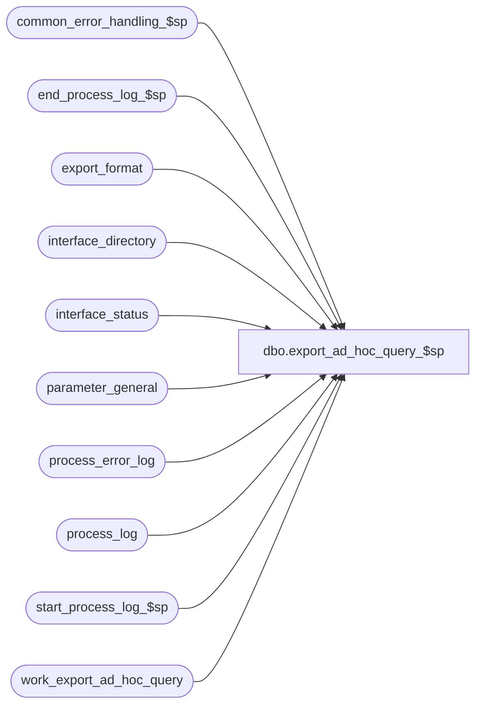

# dbo.export_ad_hoc_query_$sp

**Database:** auditworks  
**Server:** bedrockdb01  

## Architecture Diagram



## Table Dependencies

| Referenced Table |
|---|
| common_error_handling_$sp |
| end_process_log_$sp |
| export_format |
| interface_directory |
| interface_status |
| parameter_general |
| process_error_log |
| process_log |
| start_process_log_$sp |
| work_export_ad_hoc_query |

## Stored Procedure Code

```sql
create proc dbo.export_ad_hoc_query_$sp @interface_id tinyint = 20
AS
/* 
Proc Name: export_ad_hoc_query_$sp 
Desc:   Dump of grid displayed in UI in tab-delimited format.  Called by ICT_EXPORT01.
        UI first populates work_export_ad_hoc_query specifying a sql_command which
        creates and populates a work_export_ad_hoc_query_data table via a "select into", and optionally an output_file_name
        if the user wishes to override that in export_format.  This procedure will perform the command and drop the
        work_export_ad_hoc_query_data table.

HISTORY:  
Date     Name           Def#  Desc
Mar26,12 Vicci        134047  Correct process_error_log update to reflect the fact that memo2 is a string;  handle null concatenation.
Mar17,08 Vicci         98332  Author
*/


SET NOCOUNT ON
DECLARE
  @current_db_name              nvarchar(30),
  @cursor_open			tinyint,
  @db_id                        int,
  @errmsg                       nvarchar(255),
  @errno     			int,
  @errno2			int,
  @function_name	        varbinary(128),
  @last_posting_datetime        datetime,
  @message_id                   int,
  @object_name                  nvarchar(255),
  @operation_name               nvarchar(100),
  @process_log_entry            tinyint,
  @process_name 		nvarchar(100),
  @process_no                   int,
  @process_timestamp            float,
  @process_start_time           datetime,
  @rows                         int,
  @current_export_rows           int,
  @retrieval_in_progress        tinyint,
  @stream_no                    tinyint,
  @transaction_count            int,
  @user_name                    nvarchar(30),
  @sql_command 			nvarchar(max),
  @sql_command_hdr 	        nvarchar(max),
  @sa_company_no		int,
  @trace_msg			nvarchar(255),
  @temp_export_table_name	nvarchar(30),
  @more_requests_outstanding 	tinyint,
  @delimitor			nchar(1),
  @col_name 			nvarchar(255),
  @col_hdr 			nvarchar(255),
  @output_file_name		nvarchar(255),
  @app_id                       smallint,
  @comp_id                      smallint,
  @user_id                      numeric(10,0),
  @request_datetime             datetime

SELECT @current_db_name = db_name(),
       @function_name = convert(varbinary(128), 'export_ad_hoc_query_$sp'),
       @message_id = 201068,
       @operation_name = 'Unknown',
       @process_log_entry = 0,
       @process_name = 'export_ad_hoc_query_$sp',
       @process_no = 209,  --standard export
       @process_start_time = getdate(),
       @stream_no = 1,
       @user_name = suser_sname(),
       @errno = 0,
       @transaction_count = 0,
       @temp_export_table_name = 'work_export_ad_hoc_query_data',
       @delimitor = '	'

SET CONTEXT_INFO @function_name

IF @interface_id IS NULL OR @interface_id <> 20
BEGIN
  SELECT @message_id = 201684,
         @errno = 201684,
         @object_name = @process_name,
         @errmsg = 'Invalid Argument(s) passed to the stored procedure ' + @process_name + '. Unable to proceed.'
  GOTO error
END
SELECT @retrieval_in_progress = retrieval_in_progress,
       @last_posting_datetime = last_posting_datetime
FROM interface_status
WHERE interface_id = @interface_id
SELECT @errno = @@error
IF @errno <> 0
BEGIN
  SELECT @errmsg = 'Unable to select retrieval_in_progress from interface_status',
         @object_name = 'interface_status',
         @operation_name = 'SELECT'
  GOTO error
END
IF @retrieval_in_progress <> 0
BEGIN
  SELECT @db_id = dbid
  FROM master..sysprocesses
  WHERE spid = @@spid
  SELECT @errno = @@error
  IF @errno != 0
  BEGIN
    SELECT @errmsg = 'Unable to select from master..sysprocesses',
           @object_name = 'master..sysprocesses',
           @operation_name = 'SELECT'
    GOTO error
  END

  IF EXISTS (SELECT 1
             FROM master..sysprocesses
         WHERE context_info = @function_name
             AND spid <> @@spid
             AND dbid = @db_id
             AND db_name(dbid) = @current_db_name)
  BEGIN
    SELECT @message_id = 201682,
           @errno = 201682,
          @object_name = @process_name,
           @errmsg = 'The stored procedure ' + @process_name + ' is currently running. Please verify.'
    GOTO error
  END
END

UPDATE interface_status
   SET retrieval_in_progress = 1, 
      last_retrieval_datetime = @process_start_time, 
    immediate_posting_requested = 1
 WHERE interface_id = @interface_id
SELECT @errno = @@error
IF @errno <> 0
BEGIN
  SELECT @errmsg = 'Unable to set retrieval_in_progress in interface_status',
         @object_name = 'interface_status',
         @operation_name = 'UPDATE'
  GOTO error
END

IF @process_log_entry = 0
BEGIN
  EXEC start_process_log_$sp @process_no, @process_timestamp OUTPUT, @errmsg OUTPUT
  SELECT @errno = @@error
  IF @errno <> 0
  BEGIN
    SELECT @errmsg = @errmsg + ' Unable to execute start_process_log_$sp',
           @object_name = 'start_process_log_$sp',
           @operation_name = 'EXECUTE'
    GOTO error  
  END
  SELECT @process_log_entry = 1
END

SELECT @stream_no = e.stream_no
  FROM export_format e, interface_directory i
 WHERE i.interface_id = @interface_id
   AND i.interface_id = e.interface_id
   AND i.ascii_export = e.export_format
SELECT @errno = @@error
IF @errno <> 0
BEGIN
  SELECT @errmsg = 'Unable to select stream_no from export_format',
         @object_name = 'export_format',
         @operation_name = 'SELECT'
  GOTO error
END

SELECT @stream_no = ISNULL(@stream_no, 1)

SELECT @sa_company_no = sa_company_no
  FROM parameter_general
SELECT @errno = @@error
IF @errno <> 0
BEGIN
  SELECT @errmsg = 'Unable to select S/A company number',
         @object_name = 'parameter_general',
         @operation_name = 'SELECT'
  GOTO error
END
  
IF @sa_company_no IS NULL 
  SELECT @sa_company_no = 1

DECLARE ad_hoc_export_cursor CURSOR
    FOR
 SELECT sql_command, output_file_name, app_id, comp_id, user_id, request_datetime
   FROM work_export_ad_hoc_query
  ORDER BY request_datetime

OPEN ad_hoc_export_cursor
SELECT @cursor_open = 1

FETCH ad_hoc_export_cursor
 INTO @sql_command, @output_file_name, @app_id, @comp_id, @user_id, @request_datetime

IF @@fetch_status = 0
BEGIN
  IF EXISTS (SELECT 1 FROM sysobjects t   
              WHERE t.type = 'U' 
               AND t.id = object_id(@temp_export_table_name))  -- to handle dbo. vx support. etc
  BEGIN
    SELECT @sql_command_hdr = 'DROP TABLE ' + @temp_export_table_name + ' SELECT @errno = @@error '
--    PRINT @sql_command_hdr
    EXEC sp_executesql @sql_command_hdr, N'@errno int OUT', @errno OUT              
    SELECT @errno2 = @@error
    IF @errno <> 0 OR @errno2 <> 0
    BEGIN
      PRINT @sql_command
      IF @errno2 <> 0 
        SELECT @errno = @errno2
      SELECT @errmsg = 'Failed to drop left behind work table via dynamic SQL',
             @object_name = 'sp_executesql',
             @operation_name = 'EXEC'
      GOTO error
    END
  END
  SELECT @sql_command = @sql_command + ' SELECT @errno = @@error, @transaction_count = @@rowcount '
  SELECT @trace_msg = NCHAR(13) + NCHAR(10) + ':LOG && Build table of ad-hoc query data to be exported: ' + CONVERT(nchar, getdate(), 8)
  PRINT @trace_msg
--  PRINT @sql_command
  EXEC sp_executesql @sql_command, N'@transaction_count int OUT, @errno int OUT', @transaction_count OUT, @errno OUT              
  SELECT @errno2 = @@error
  IF @errno <> 0 OR @errno2 <> 0
  BEGIN
    PRINT @sql_command
    IF @errno2 <> 0 
      SELECT @errno = @errno2
    SELECT @errmsg = 'Failed to build table of UI selected rows for export via dynamic SQL',
           @object_name = 'sp_executesql',
           @operation_name = 'EXEC'
    GOTO error
  END

SELECT @trace_msg = NCHAR(13) + NCHAR(10) + ':LOG && Merge and delimit columns of ad-hoc query data to be exported: ' + CONVERT(nchar, getdate(), 8)
PRINT @trace_msg
SELECT @sql_command = 'INSERT into export_ad_hoc_query(delimited_field_col1) SELECT '
SELECT @sql_command_hdr = @sql_command
DECLARE ad_hoc_export_table_col_cursor CURSOR
    FOR
 SELECT CASE WHEN c.xtype in (167, 231, 175, 239) THEN 'COALESCE(' + c.name + ', '''')' ELSE 'COALESCE(convert(nvarchar, ' + c.name + '), '''')' END,
        '''' + c.name + ''''
   FROM sysobjects t, syscolumns c
  WHERE t.type = 'U' 
    AND t.id = object_id(@temp_export_table_name)  -- to handle dbo. vx support. etc
    AND t.id = c.id
    AND c.xtype <> 173  --not binary
  ORDER by colorder

OPEN ad_hoc_export_table_col_cursor
SELECT @cursor_open = 2

FETCH ad_hoc_export_table_col_cursor
 INTO @col_name, @col_hdr

WHILE @@fetch_status = 0 
BEGIN
  SELECT @sql_command = @sql_command + @col_name,
         @sql_command_hdr = @sql_command_hdr + @col_hdr
	
  FETCH ad_hoc_export_table_col_cursor
  INTO @col_name, @col_hdr
  IF @@fetch_status = 0 
    SELECT @sql_command = @sql_command + ' + @delimitor + ',
           @sql_command_hdr = @sql_command_hdr + ' + @delimitor + '
END /* while not end of cursor */

CLOSE ad_hoc_export_table_col_cursor
DEALLOCATE ad_hoc_export_table_col_cursor 
SELECT @cursor_open = 1

IF @sql_command <> @sql_command_hdr
BEGIN
  SELECT @sql_command_hdr = @sql_command_hdr + ' SELECT @errno = @@error '
--  PRINT @sql_command_hdr
  EXEC sp_executesql @sql_command_hdr, N'@delimitor nchar(1), @errno int OUT', @delimitor, @errno OUT              
  SELECT @errno2 = @@error
  IF @errno <> 0 OR @errno2 <> 0
  BEGIN
    PRINT @sql_command_hdr
    IF @errno2 <> 0 
      SELECT @errno = @errno2
    SELECT @errmsg = 'Failed log column header row to final export table via dynamic SQL',
           @object_name = 'sp_executesql',
           @operation_name = 'EXEC'
      GOTO error
  END
  SELECT @sql_command = @sql_command + ' FROM ' + @temp_export_table_name
  SELECT @sql_command = @sql_command + ' SELECT @errno = @@error '

--  PRINT @sql_command
  EXEC sp_executesql @sql_command, N'@delimitor nchar(1), @errno int OUT', @delimitor, @errno OUT              
  SELECT @errno2 = @@error
  IF @errno <> 0 OR @errno2 <> 0
  BEGIN
    PRINT @sql_command
    IF @errno2 <> 0 
      SELECT @errno = @errno2
    SELECT @errmsg = 'Failed to merge and delimit columns of temporary table of UI selected rows into final export table via dynamic SQL',
           @object_name = 'sp_executesql',
           @operation_name = 'EXEC'
      GOTO error
  END
END


SELECT @sql_command = 'DROP TABLE ' + @temp_export_table_name    
SELECT @sql_command = @sql_command + ' SELECT @errno = @@error '

--PRINT @sql_command
EXEC sp_executesql @sql_command, N'@errno int OUT', @errno OUT              
SELECT @errno2 = @@error
IF @errno <> 0 OR @errno2 <> 0
BEGIN
  PRINT @sql_command
  IF @errno2 <> 0 
    SELECT @errno = @errno2
  SELECT @errmsg = 'Failed to drop temporary table of UI selected rows for export via dynamic SQL',
         @object_name = 'sp_executesql',
         @operation_name = 'EXEC'
    GOTO error
END

DELETE work_export_ad_hoc_query
 WHERE app_id = @app_id
   AND comp_id = @comp_id
   AND user_id = @user_id
   AND request_datetime = @request_datetime
SELECT @errno = @@error
IF @errno <> 0
BEGIN
  SELECT @errmsg = 'Unable to mark request which has been completed as done',
         @object_name = 'work_export_ad_hoc_query',
         @operation_name = 'DELETE'
  GOTO error
END
	
IF IsNull(@output_file_name, '') <> ''
BEGIN
  SELECT @sql_command = ':LOG && change variable expt_pfx=' + @output_file_name
  PRINT @sql_command
  SELECT @sql_command = ':VAR expt_pfx=' + @output_file_name
  PRINT @sql_command
END

CLOSE ad_hoc_export_cursor
DEALLOCATE ad_hoc_export_cursor 
SELECT @cursor_open = 0

IF @process_log_entry = 1
BEGIN
  EXEC end_process_log_$sp @process_no, @process_timestamp, @transaction_count
  SELECT @errno = @@error
  IF @errno <> 0
  BEGIN
    SELECT @errmsg = 'Unable to exec end_process_log_$sp',
           @object_name = 'end_process_log_$sp',
           @operation_name = 'EXECUTE'
    GOTO error
  END

   UPDATE process_log
      SET process_status_flag = 3
    WHERE process_start_time = process_end_time
      AND process_no = @process_no
      AND process_status_flag = 1
   SELECT @errno = @@error
   IF @errno <> 0
     BEGIN
	SELECT @errmsg = 'Unable to update process_log',
               @object_name = 'process_log',
               @operation_name = 'UPDATE'
	GOTO error
     END
END -- If @process_log_entry = 1
END  --IF @@fetch_status = 0

-- Mark the interface as complete
BEGIN TRAN
UPDATE interface_status
   SET last_retrieval_datetime = getdate(),
       retrieval_in_progress = 0
 WHERE last_posting_datetime = @last_posting_datetime
   AND interface_id = @interface_id
SELECT @errno = @@error, @rows = @@rowcount
IF @errno <> 0
BEGIN
  SELECT @errmsg = 'Unable to set retrieval_in_progress in interface_status for interface_id ' + CONVERT(nvarchar, @interface_id),
         @object_name = 'interface_status',
         @operation_name = 'UPDATE'
  GOTO error
END

IF @rows = 0
BEGIN
  UPDATE interface_status
     SET last_retrieval_datetime = getdate(),
         retrieval_in_progress = 0,
         immediate_posting_requested = 2
   WHERE interface_id = @interface_id
  SELECT @errno = @@error
  IF @errno <> 0
  BEGIN
    SELECT @errmsg = 'Unable to set immediate_posting_requested in interface_status for interface_id ' + CONVERT(nvarchar, @interface_id),
           @object_name = 'interface_status',
           @operation_name = 'UPDATE'
    GOTO error
  END
END
COMMIT

UPDATE process_error_log
   SET verified = 1
 WHERE error_timestamp >= dateadd(dd, -30, getdate())
   AND (process_no = @process_no --ict_export
        AND (process_name like '%export_ad_hoc_query%'
             OR object_name like '%export_ad_hoc_query%'
             OR error_msg like '%export_ad_hoc_query%'
             OR (error_code = 201685 --max retry exceeded
                 AND memo2 = '20') --interface 20=export_ad_hoc_query
            )
       )
  AND verified = 0
SELECT @errno = @@error
IF @errno <> 0
BEGIN
  SELECT @errmsg = 'Unable to mark prior errors as verified',
         @object_name = 'process_error_log',
         @operation_name = 'UPDATE'
  GOTO error
END
  
SELECT @function_name = convert(varbinary(128), 'Unknown')
SET CONTEXT_INFO @function_name

RETURN

error:
  IF @cursor_open = 2
  BEGIN
    CLOSE ad_hoc_export_table_col_cursor
    DEALLOCATE ad_hoc_export_table_col_cursor 
    SELECT @cursor_open = 1
  END
  IF @cursor_open = 1
  BEGIN
    CLOSE ad_hoc_export_cursor
    DEALLOCATE ad_hoc_export_cursor 
    SELECT @cursor_open = 0
  END

  SELECT @function_name = convert(varbinary(128), 'Unknown')
  SET CONTEXT_INFO @function_name

  EXEC common_error_handling_$sp @process_no, @errno, @errmsg, 0, @message_id, @process_name, @object_name, @operation_name, 1, @stream_no
  RETURN
```

