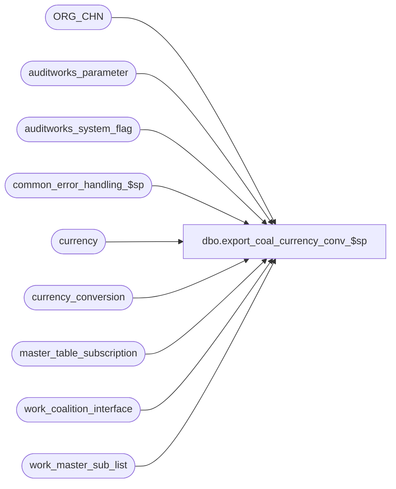

# dbo.export_coal_currency_conv_$sp

**Database:** auditworks  
**Server:** bedrockdb01  

## Architecture Diagram



## Table Dependencies

| Referenced Table |
|---|
| ORG_CHN |
| auditworks_parameter |
| auditworks_system_flag |
| common_error_handling_$sp |
| currency |
| currency_conversion |
| master_table_subscription |
| work_coalition_interface |
| work_master_sub_list |

## Stored Procedure Code

```sql
create proc dbo.export_coal_currency_conv_$sp (@interface_id	tinyint,
 @process_no 	smallint,
 @task_server	nvarchar(255),
 @runtime_datetime	datetime,
 @export_status	tinyint,
 @task_no	int OUTPUT,
 @errmsg 	nvarchar(255) OUTPUT
)
AS

DECLARE
@block_type			smallint,
@coal_curr_conv			tinyint,
@curr_id                        int,
@conv_id                        int,
@cursor_open			tinyint,
@cutoff_date			datetime,
@data_header			nvarchar(255),
@errno				int,
@process_log_entry 		tinyint,
@record_sequence		int,
@table_name			nvarchar(30),
@task_module			nvarchar(255),
@task_header			nvarchar(255),
@task_operation 		nvarchar(255),
@export_module_name		nvarchar(255),
@message_id		        int,	
@store_no			int,
@object_name			nvarchar(255),
@operation_name			nvarchar(100),
@process_name		        nvarchar(100),
@time_stamp			datetime,
@action				tinyint,
@posting_datetime		datetime,
@rows				int,
@common_currency_id 		numeric(12,0),
@multiple_store_currencies	tinyint,
@one				numeric(12,6)


/* Proc Name: export_coal_currency_conv_$sp
   Desc: Coalition Tax Exports.
         Called by coalition_interface_main_$sp.
         If there are no stores with a currency other than the common currency or 
           the common currency has not been created on the conversion type to be downloaded with a rate of 1 to 1
           then the same rates are exported for "all stores", i.e. the export DCN does not include store number
         Otherwise triangulation between the store currency and the common currency is used to export the rates and rates for each store are in the DCN.
           Note that under this scenario, if the base currency is USD and the rate for MXN is changed then all stores will get the new MXN rate appropriate 
           for their local currency, and the Mexican stores will additionally get the revised rates for all other currencies they accept (since the 
           triangulation rate change will have impacted all of them).
         In the case of audit-trail changes (as opposed to a full download), there will be a separate DCN Data section for each change made.
         In the DCN, the first rate listed is how much the customer would have to pay in the foreign currency listed to be a 1.00 store-currency item.
         In the DCN, the second rate listed is much 1.00 of the foreign currency listed would be worth in store-currency.
   Note: In the S/A currency_conversion table, the rates listed are what to multiply foreign currency amount by to get what it is worth in base currency.
HISTORY:
Date     Name           Def# Desc
Jan26,15 Vicci    TFS-101947 Avoid exporting same data twice (in 2 Data sections), since when adding a new exhange rate for a new effective date the 
                             audit trail will always have 2 entries (one for the new row and one for the expiry of the preceding row).  Since we are 
                             not using the audit trail but are simply export the most current unexpired information for the currency, no sorting by
                             entry_id is required, and removing references to it will avoid the duplication.
Mar17,14 Phu        1-4CDP8E Fix partial export that has result in the wrong order.
Feb26,13 Vicci        142088 To avoid deadlocks, lock a shared flag prior to work_master_sub_list deletions.
Feb22,13 Vicci        142020 Do not hold a lock on the work_master_sub_list table while reading it in a cursor, since this causes the 
                             audit_trail_header_$trI work_master_sub_list cleanup of prior configuration changes for the table/key upon 
                             additional change to the same table/key to die as victim of a deadlock.
Jul20,12 Vicci        136925 Remove references to store_salesaudit.  
                             Remove extra "side-affected-by-triangulation-currency" retrieval from the full dump since all are already being dumped.
    Ensure ALL "side-affected-by-triangulation-currencies" are retrieved when another currency is modified, not just use by a store as its native currency.
Apr07,11 Vicci        126078 Take master_table_subscription active flag into account.
Jul26,06 Tim           69753 Apply 68253 to SA5
Feb24,06 Vicci	       68253 The buy-rate should be set to 1/sell-rate;  
			     in multi-country store environments the rates must be triangulated
			     prior to download;  in environments with different effective-dates
			     for different currencies, only pickup applicable (current/future) 
			     rows in full download scenario (not all rows for effective-date);
			     don't double up download rows when multiple work_master_sub_list rows
			     exist for same currency_id/conversion_type_id combo.
Aug03,05 Daphna        58339 Parse currency_conversion_type_id from object key and determine whether TM changes need to
                             be exported to coalition 
Jun30,05 Daphna        56814 author
*/


SELECT @process_name = 'export_coal_currency_conv_$sp',
       @message_id = 201068,
       @task_module = 'Module=StoreCurrency',
       @export_module_name = 'StoreCurrency',
       @time_stamp = getdate(),
       @cutoff_date	= convert(datetime, convert(nvarchar, dateadd(dd,-1, getdate()), 101)),
       @rows = 0,
       @multiple_store_currencies = 0,
       @one = 1

SELECT @coal_curr_conv = CONVERT(tinyint, par_value)
FROM auditworks_parameter
WHERE par_name = 'coal_currency_conv_type'

CREATE TABLE #active_currency (store_currency_id numeric(12,0) not null, 
                               base_exchange_rate numeric(12,6) not null)
IF EXISTS (SELECT 1 
	     FROM auditworks_parameter p, currency_conversion c
            WHERE p.par_name = 'common_currency'
              AND p.par_value = convert(nvarchar, c.currency_id)
              AND c.currency_conversion_type_id = @coal_curr_conv
              AND c.exchange_rate = 1)
BEGIN
  SELECT @common_currency_id = convert(numeric(12,0), par_value)
    FROM auditworks_parameter 
   WHERE par_name = 'common_currency'

 IF EXISTS (SELECT 1
	       FROM ORG_CHN OC
	            INNER JOIN currency cu 
	               ON OC.DFLT_CRNCY_CODE = cu.currency_code
	              AND cu.currency_id <> @common_currency_id
 	      WHERE OC.DFLT_CRNCY_CODE IS NOT NULL 
  	    )
  BEGIN
    INSERT INTO #active_currency(store_currency_id, base_exchange_rate)
    SELECT DISTINCT cu.currency_id, 1
      FROM ORG_CHN OC
	   INNER JOIN currency cu 
	      ON OC.DFLT_CRNCY_CODE = cu.currency_code
	     AND cu.currency_id <> @common_currency_id
    UNION
    SELECT @common_currency_id, 1

    SELECT @multiple_store_currencies = 1
  END
END
  

IF @export_status = 2 --full table export requested
BEGIN
   
   -- list of effective_from_dates for current and future rates         
  DECLARE curr_date_crsr CURSOR 
  FOR SELECT DISTINCT effective_date_from
  FROM currency_conversion 
  WHERE currency_conversion_type_id = @coal_curr_conv
  AND (effective_date_to IS NULL  OR effective_date_to > @cutoff_date)
  ORDER BY effective_date_from
  
  SELECT @errno = @@error
  IF @errno <> 0
  BEGIN
    SELECT @errmsg = 'Failed to declare curr_date_crsr from currency_conversion',
           @object_name = 'curr_date_crsr',
           @operation_name = 'DECLARE'      
    GOTO error
  END    

  OPEN curr_date_crsr

  SELECT @errno = @@error
  IF @errno <> 0
  BEGIN
    SELECT @errmsg = 'Unable to open cursor curr_date_crsr',
           @object_name = 'curr_date_crsr',
           @operation_name = 'OPEN'      
    GOTO error
  END

  SELECT  @cursor_open = 1

  WHILE 1 = 1
  BEGIN
    FETCH curr_date_crsr
    INTO @runtime_datetime

    IF @@fetch_status <> 0
       BREAK

    SELECT @block_type = 2, 
           @task_no = @task_no + 1
    SELECT @task_header = '[Task.' + CONVERT(nvarchar, @task_no) + ']',
  @task_operation = 'Operation=AddUpdate',
           @record_sequence = 0

    -- Build the reinsertion task
  
    INSERT work_coalition_interface
           (runtime_datetime, record_content, block_type, 
            task_no, record_sequence_no, export_module_name)
    VALUES (@runtime_datetime, @task_header, @block_type, 
            @task_no, @record_sequence, @export_module_name)                               

    SELECT @errno = @@error
    IF @errno <> 0
    BEGIN
       SELECT @errmsg = 'Failed to insert into work_coalition_interface with task_header for StoreCurrency AddUpdate',
               @object_name = 'work_coalition_interface',
               @operation_name = 'INSERT'                      
        GOTO error
    END             
                       
    SELECT @record_sequence = @record_sequence + 1      

    INSERT work_coalition_interface
           (runtime_datetime, record_content, block_type, 
            task_no, record_sequence_no, export_module_name)
    VALUES (@runtime_datetime, 'Server=TENDER', @block_type, 
            @task_no, @record_sequence, @export_module_name)                               

    SELECT @errno = @@error
    IF @errno <> 0
    BEGIN
      SELECT @errmsg = 'Failed to insert into work_coalition_interface with task_server for StoreCurrency AddUpdate',
              @object_name = 'work_coalition_interface',
              @operation_name = 'INSERT'                      
      GOTO error
    END             
         
    SELECT @record_sequence = @record_sequence + 1

    INSERT work_coalition_interface
            (runtime_datetime, record_content, block_type, 
            task_no, record_sequence_no, export_module_name)
    VALUES (@runtime_datetime, @task_module, @block_type, 
             @task_no, @record_sequence, @export_module_name)                               

    SELECT @errno = @@error
    IF @errno <> 0
    BEGIN
        SELECT @errmsg = 'Failed to insert into work_coalition_interface with task_module for StoreCurrency AddUpdate',
               @object_name = 'work_coalition_interface',
               @operation_name = 'INSERT'                      
        GOTO error
    END             
                       
    SELECT @record_sequence = @record_sequence + 1

    INSERT work_coalition_interface
           (runtime_datetime, record_content, block_type, 
            task_no, record_sequence_no, export_module_name)
    VALUES (@runtime_datetime, @task_operation, @block_type, 
            @task_no, @record_sequence, @export_module_name)                               

    SELECT @errno = @@error
    IF @errno <> 0
    BEGIN
        SELECT @errmsg = 'Failed to insert into work_coalition_interface with task_operation for StoreCurrency AddUpdate',
               @object_name = 'work_coalition_interface',
               @operation_name = 'INSERT'                        
        GOTO error
    END             
  
    -- Build the reinsertion data
    SELECT @data_header = '[Data.' + CONVERT(nvarchar, @task_no) + ']',
           @record_sequence = 0,
           @block_type = 3 -- Data

    INSERT work_coalition_interface
          (runtime_datetime, record_content, block_type, 
           task_no, record_sequence_no, export_module_name)
    VALUES (@runtime_datetime, @data_header, @block_type, 
            @task_no, @record_sequence, @export_module_name)                               

    SELECT @errno = @@error
    IF @errno <> 0
    BEGIN
        SELECT @errmsg = 'Failed to insert into work_coalition_interface with data_header for StoreCurrency AddUpdate',
               @object_name = 'work_coalition_interface',
               @operation_name = 'INSERT'      
        GOTO error
    END             

    SELECT @record_sequence = @record_sequence + 1

    IF @multiple_store_currencies = 0
    BEGIN
      INSERT work_coalition_interface(
             runtime_datetime,
             record_content,
             block_type, task_no, record_sequence_no, export_module_name)
      SELECT @runtime_datetime,
             @export_module_name + ',' + c.currency_code + ',,'
             + CONVERT(nvarchar, convert(numeric(12,6),@one/cc.exchange_rate)) + ',' + CONVERT(nvarchar,cc.exchange_rate) 
             + ',,,,,,,' ,
             @block_type, @task_no, @record_sequence, @export_module_name                               
        FROM currency_conversion cc, currency c
       WHERE cc.currency_conversion_type_id = @coal_curr_conv
         AND effective_date_from = @runtime_datetime
         AND cc.currency_id = c.currency_id
         AND (cc.effective_date_to IS NULL OR cc.effective_date_to > @cutoff_date)  --required since different effective dates apply to different currencies and cursor is not currency dependent
      SELECT @errno = @@error, @rows = @@rowcount
      IF @errno <> 0
      BEGIN
        SELECT @errmsg = 'Failed to insert into work_coalition_interface from currency_conversions for StoreCurrency',
               @object_name = 'work_coalition_interface',
               @operation_name = 'INSERT'                    
        GOTO error
      END                    
    END --IF @multiple_store_currencies = 0
    ELSE
    BEGIN
      UPDATE #active_currency  /* find triangulation rates for current date */
         SET base_exchange_rate = exchange_rate
        FROM currency_conversion cc
       WHERE #active_currency.store_currency_id = cc.currency_id
         AND cc.currency_conversion_type_id = @coal_curr_conv
         AND cc.effective_date_from <= convert(datetime, convert(nvarchar, getdate(), 101))
         AND (cc.effective_date_to is null or cc.effective_date_to >= convert(datetime, convert(nvarchar, getdate(), 101)))

      IF @runtime_datetime > getdate()
      BEGIN
      UPDATE #active_currency  /* find triangulation rate adjustments if any for future date */
         SET base_exchange_rate = exchange_rate
        FROM currency_conversion cc
       WHERE #active_currency.store_currency_id = cc.currency_id
         AND cc.currency_conversion_type_id = @coal_curr_conv
         AND cc.effective_date_from <= @runtime_datetime
         AND (cc.effective_date_to is null or cc.effective_date_to >= @runtime_datetime)
      END

      /* Adjust the exchange rates for the common currency to be those applicable to the store currency */
      INSERT work_coalition_interface(
             runtime_datetime,
             record_content,
             block_type, task_no, record_sequence_no, export_module_name)
      SELECT @runtime_datetime,
             @export_module_name + ',' + c.currency_code + ',' + convert(nvarchar, s.ORG_CHN_NUM) + ','
             + CONVERT(nvarchar, convert(numeric(12,6),@one/(cc.exchange_rate/b.base_exchange_rate))) + ',' + CONVERT(nvarchar,convert(numeric(12,6), cc.exchange_rate/b.base_exchange_rate)) 
             + ',,,,,,,' ,
             @block_type, @task_no, @record_sequence, @export_module_name                               
        FROM ORG_CHN s
             LEFT OUTER JOIN currency cu
                ON s.DFLT_CRNCY_CODE = cu.currency_code
             INNER JOIN #active_currency b
                ON COALESCE(cu.currency_id, @common_currency_id) = b.store_currency_id
             INNER JOIN currency_conversion cc
                ON cc.currency_conversion_type_id = @coal_curr_conv
               AND cc.effective_date_from = @runtime_datetime 
               AND (cc.effective_date_to IS NULL OR cc.effective_date_to > @cutoff_date)
             INNER JOIN currency c
                ON c.currency_id = cc.currency_id
      SELECT @errno = @@error, @rows = @@rowcount
      IF @errno <> 0
      BEGIN
        SELECT @errmsg = 'Failed to insert into work_coalition_interface by store from currency_conversions for StoreCurrency',
               @object_name = 'work_coalition_interface',
               @operation_name = 'INSERT'                    
        GOTO error
      END                    
    END --ELSE of IF @multiple_store_currencies = 0
    
    IF @rows = 0 
    BEGIN
       DELETE work_coalition_interface
        WHERE task_no = @task_no
          AND runtime_datetime = @runtime_datetime      
          AND export_module_name = @export_module_name  

       SELECT @errno = @@error
       IF @errno <> 0
       BEGIN
         SELECT @errmsg = 'Failed to delete from  work_coalition_interface if no details for StoreCurrency AddUpdate',
                @object_name = 'work_coalition_interface',
                @operation_name = 'DELETE'      
         GOTO error
       END
     END -- IF @rows = 0 
     
  END  -- while 1=1

  CLOSE curr_date_crsr
  SELECT @errno = @@error
  IF @errno <> 0
  BEGIN
     SELECT @errmsg = 'Unable to close cursor curr_date_crsr',
            @object_name = 'curr_date_crsr',
            @operation_name = 'CLOSE'      
     GOTO error
   END

  DEALLOCATE curr_date_crsr

  SELECT @cursor_open = 0
       
END
ELSE
BEGIN

  DECLARE conv_crsr CURSOR FAST_FORWARD 
  FOR  SELECT DISTINCT substring(table_key,1, (charindex('/', table_key, 0)-1)) curr_id, 
    		       substring(table_key,(charindex('/', table_key, 0)+1), (charindex('/', table_key, (charindex('/', table_key, 0)+1))-(charindex('/', table_key, 0)+1))) conv_id
  FROM work_master_sub_list w
   WHERE interface_id = @interface_id
   AND table_name = 'currency_conversion'
   AND posting_datetime <= @time_stamp

  SELECT @errno = @@error
  IF @errno <> 0
  BEGIN
    SELECT @errmsg = 'Unable to declare cursor conv_crsr',
           @object_name = 'conv_crsr',
           @operation_name = 'DECLARE'      
    GOTO error
  END

  OPEN conv_crsr

  SELECT @errno = @@error
  IF @errno <> 0
  BEGIN
    SELECT @errmsg = 'Unable to open cursor conv_crsr',
           @object_name = 'conv_crsr',
           @operation_name = 'OPEN'      
    GOTO error
  END

  SELECT  @cursor_open = 2

  WHILE 2 = 2
  BEGIN
    FETCH conv_crsr
     INTO @curr_id, 
    	  @conv_id

    IF @@fetch_status <> 0
      BREAK
 
    IF @conv_id <> @coal_curr_conv
      CONTINUE  -- next fetch
      
    SELECT @rows = 0
    
    SELECT @rows = COUNT(effective_date_from)
    FROM currency_conversion cc
    WHERE currency_id = @curr_id
    AND currency_conversion_type_id = @coal_curr_conv
    AND (effective_date_to IS NULL  OR effective_date_to > @cutoff_date)
    
    IF @rows = 0   --- no current or future rows, same as delete
    BEGIN

      SELECT @block_type = 2, -- Task
             @task_header = '[Task.' + CONVERT(nvarchar, @task_no) + ']',
             @task_operation = 'Operation=Delete',
             @record_sequence = 0
              
      -- Build the deletion task
      INSERT work_coalition_interface
             (runtime_datetime, record_content, block_type, 
              task_no, record_sequence_no, export_module_name)
      VALUES (@time_stamp, @task_header, @block_type, 
              @task_no, @record_sequence, @export_module_name)

      SELECT @errno = @@error
      IF @errno <> 0
      BEGIN
        SELECT @errmsg = 'Failed to insert into work_coalition_interface with task header for StoreCurrency Delete',
               @object_name = 'work_coalition_interface',
               @operation_name = 'INSERT'      
        GOTO error
      END             
                       
      SELECT @record_sequence = @record_sequence + 1
 
      INSERT work_coalition_interface
             (runtime_datetime, record_content, block_type, 
             task_no, record_sequence_no, export_module_name)
      VALUES (@time_stamp, 'Server=TENDER', @block_type,  
             @task_no, @record_sequence, @export_module_name)                               

      SELECT @errno = @@error
      IF @errno <> 0
      BEGIN
        SELECT @errmsg = 'Failed to insert into work_coalition_interface with task_server for StoreCurrency Delete',
               @object_name = 'work_coalition_interface',
               @operation_name = 'INSERT'      
        GOTO error
      END             
                       
      SELECT @record_sequence = @record_sequence + 1

      INSERT work_coalition_interface
             (runtime_datetime, record_content, block_type, 
             task_no, record_sequence_no, export_module_name)
      VALUES (@time_stamp, @task_module, @block_type, 
             @task_no, @record_sequence, @export_module_name)                               

      SELECT @errno = @@error
      IF @errno <> 0
      BEGIN
        SELECT @errmsg = 'Failed to insert into work_coalition_interface with task_module for StoreCurrency Delete',
               @object_name = 'work_coalition_interface',
               @operation_name = 'INSERT'      
        GOTO error
      END            
                       
      SELECT @record_sequence = @record_sequence + 1
   
      INSERT work_coalition_interface
             (runtime_datetime, record_content, block_type, 
             task_no, record_sequence_no, export_module_name)
      VALUES (@time_stamp, @task_operation, @block_type, 
             @task_no, @record_sequence, @export_module_name)                               

      SELECT @errno = @@error
      IF @errno <> 0
      BEGIN
        SELECT @errmsg = 'Failed to insert into work_coalition_interface with task_operation for StoreCurrency Delete',
               @object_name = 'work_coalition_interface',
               @operation_name = 'INSERT'      
        GOTO error
      END             

      SELECT @data_header = '[Data.' + CONVERT(nvarchar, @task_no) + ']',
             @record_sequence = 0,
             @block_type = 3 -- Data

   INSERT work_coalition_interface
             (runtime_datetime, record_content, block_type, 
             task_no, record_sequence_no, export_module_name)
VALUES (@time_stamp, @data_header, @block_type, 
             @task_no, @record_sequence, @export_module_name)                               

      SELECT @errno = @@error
      IF @errno <> 0
      BEGIN
        SELECT @errmsg = 'Failed to insert into work_coalition_interface with data_header for StoreCurrency Delete',
               @object_name = 'work_coalition_interface',
      @operation_name = 'INSERT'      
        GOTO error
      END             

      SELECT @record_sequence = @record_sequence + 1

      INSERT work_coalition_interface
             (runtime_datetime,
              record_content,
              block_type, task_no, record_sequence_no, export_module_name)
      SELECT @time_stamp,
             @export_module_name + ',' + currency_code  + ',,,,,,,,,',
             @block_type, @task_no, @record_sequence, @export_module_name
        FROM currency
       WHERE currency_id = @curr_id

      SELECT @errno = @@error
      IF @errno <> 0
      BEGIN
        SELECT @errmsg = 'Failed to insert into work_coalition_interface from work_master_sub_list for StoreCurrency Delete',
               @object_name = 'work_coalition_interface',
               @operation_name = 'INSERT'      
        GOTO error
      END       
       
    END
    ELSE   -- rows exists: do add/update by effective_date_from
    BEGIN     
      DECLARE date_crsr CURSOR
      FOR  SELECT DISTINCT effective_date_from
      FROM currency_conversion 
      WHERE currency_id = @curr_id
      AND currency_conversion_type_id = @coal_curr_conv
      AND (effective_date_to IS NULL  OR effective_date_to > @cutoff_date)
      ORDER BY effective_date_from
    
    
      SELECT @errno = @@error
      IF @errno <> 0
      BEGIN
        SELECT @errmsg = 'Unable to declare cursor date_crsr',
               @object_name = 'date_crsr',
               @operation_name = 'DECLARE'      
        GOTO error
      END

    OPEN date_crsr

      SELECT @errno = @@error
      IF @errno <> 0
      BEGIN
        SELECT @errmsg = 'Unable to open cursor date_crsr',
               @object_name = 'date_crsr',
               @operation_name = 'OPEN'      
        GOTO error
      END

      SELECT  @cursor_open = 3

      WHILE 3=3
      BEGIN
        FETCH date_crsr
        INTO @runtime_datetime

        IF @@fetch_status <> 0
          BREAK

        -- use runtime_datetime =  @time_stamp when effective_date_from is older than timestamp
            
        IF @runtime_datetime < @time_stamp
          SELECT @runtime_datetime = @time_stamp     

        SELECT @task_no = @task_no + 1,
               @block_type = 2, 
               @task_header = '[Task.' + CONVERT(nvarchar, @task_no) + ']',
               @task_operation = 'Operation=AddUpdate',
               @record_sequence = 0

         -- Build the reinsertion task
        INSERT work_coalition_interface
          (runtime_datetime, record_content, block_type, 
          task_no, record_sequence_no, export_module_name)
        VALUES (@runtime_datetime, @task_header, @block_type, 
           @task_no, @record_sequence, @export_module_name)                               

        SELECT @errno = @@error
        IF @errno <> 0
        BEGIN
          SELECT @errmsg = 'Failed to insert into work_coalition_interface with task_header for StoreCurrency AddUpdate (2)',
                 @object_name = 'work_coalition_interface',
                 @operation_name = 'INSERT'                      
          GOTO error
        END             
                       
        SELECT @record_sequence = @record_sequence + 1      

        INSERT work_coalition_interface
          (runtime_datetime, record_content, block_type, 
          task_no, record_sequence_no, export_module_name)
        VALUES (@runtime_datetime, 'Server=TENDER', @block_type, 
           @task_no, @record_sequence, @export_module_name)                   

        SELECT @errno = @@error
        IF @errno <> 0
        BEGIN
          SELECT @errmsg = 'Failed to insert into work_coalition_interface with task_server for StoreCurrency AddUpdate (2)',
                 @object_name = 'work_coalition_interface',
                 @operation_name = 'INSERT'                      
          GOTO error
        END       
         
        SELECT @record_sequence = @record_sequence + 1

        INSERT work_coalition_interface
               (runtime_datetime, record_content, block_type, 
                task_no, record_sequence_no, export_module_name)
        VALUES (@runtime_datetime, @task_module, @block_type, 
                @task_no, @record_sequence, @export_module_name)                               

        SELECT @errno = @@error
        IF @errno <> 0
        BEGIN
          SELECT @errmsg = 'Failed to insert into work_coalition_interface with task_module for StoreCurrency AddUpdate (2)',
                 @object_name = 'work_coalition_interface',
                 @operation_name = 'INSERT'                      
          GOTO error
        END             
                       
        SELECT @record_sequence = @record_sequence + 1

        INSERT work_coalition_interface
               (runtime_datetime, record_content, block_type, 
                task_no, record_sequence_no, export_module_name)
        VALUES (@runtime_datetime, @task_operation, @block_type, 
                @task_no, @record_sequence, @export_module_name)                               

        SELECT @errno = @@error
        IF @errno <> 0
        BEGIN
          SELECT @errmsg = 'Failed to insert into work_coalition_interface with task_operation for StoreCurrency AddUpdate (2)',
                 @object_name = 'work_coalition_interface',
                 @operation_name = 'INSERT'                
          GOTO error
        END             
  
        -- Build the reinsertion data
        SELECT @data_header = '[Data.' + CONVERT(nvarchar, @task_no) + ']',
               @record_sequence = 0,
               @block_type = 3 -- Data

        INSERT work_coalition_interface
               (runtime_datetime, record_content, block_type, 
               task_no, record_sequence_no, export_module_name)
        VALUES (@runtime_datetime, @data_header, @block_type, 
                @task_no, @record_sequence, @export_module_name)                               

        SELECT @errno = @@error
        IF @errno <> 0
        BEGIN
          SELECT @errmsg = 'Failed to insert into work_coalition_interface with data_header for StoreCurrency AddUpdate (2)',
                 @object_name = 'work_coalition_interface',
                 @operation_name = 'INSERT'      
          GOTO error
        END             

        SELECT @record_sequence = @record_sequence + 1

        IF @multiple_store_currencies = 0
        BEGIN
          INSERT work_coalition_interface(
                 runtime_datetime,
                 record_content,
                 block_type, task_no, record_sequence_no, export_module_name)
          SELECT @runtime_datetime,
                 @export_module_name + ',' + c.currency_code + ',,' + 
                 CONVERT(nvarchar, convert(numeric(12,6),@one/cc.exchange_rate)) + ',' + CONVERT(nvarchar,cc.exchange_rate) 
                 + ',,,,,,,' ,
                 @block_type, @task_no, @record_sequence, @export_module_name                               
            FROM currency_conversion cc, currency c
           WHERE cc.currency_conversion_type_id = @coal_curr_conv
             AND cc.currency_id = @curr_id
             AND (effective_date_to IS NULL  OR effective_date_to > @cutoff_date)  -- rate is current or future         
             AND ((effective_date_from < @runtime_datetime AND @runtime_datetime = @time_stamp)  -- current
                   OR (effective_date_from = @runtime_datetime AND @time_stamp < @runtime_datetime)  -- future
                 )
             AND cc.currency_id = c.currency_id

          SELECT @errno = @@error,
                 @rows = @@rowcount
          IF @errno <> 0
          BEGIN
            SELECT @errmsg = 'Failed to insert from currency_conversion for StoreCurrency AddUpdate (2)',
                   @object_name = 'work_coalition_interface',
                   @operation_name = 'INSERT'                      
            GOTO error
          END                    
        END --IF @multiple_store_currencies = 0
        ELSE
        BEGIN
          UPDATE #active_currency  /* find triangulation rates for current date */
             SET base_exchange_rate = exchange_rate
            FROM currency_conversion cc
           WHERE #active_currency.store_currency_id = cc.currency_id
             AND cc.currency_conversion_type_id = @coal_curr_conv
             AND cc.effective_date_from <= convert(datetime, convert(nvarchar, getdate(), 101))
             AND (cc.effective_date_to is null or cc.effective_date_to >= convert(datetime, convert(nvarchar, getdate(), 101)))

          IF @runtime_datetime > getdate()
          BEGIN
          UPDATE #active_currency  /* find triangulation rate adjustments if any for future date */
             SET base_exchange_rate = exchange_rate
            FROM currency_conversion cc
           WHERE #active_currency.store_currency_id = cc.currency_id
             AND cc.currency_conversion_type_id = @coal_curr_conv
             AND cc.effective_date_from <= @runtime_datetime
             AND (cc.effective_date_to is null or cc.effective_date_to >= @runtime_datetime)
          END

          /* Adjust the exchange rates for the common currency to be those applicable to the store currency */
          INSERT work_coalition_interface(
                 runtime_datetime,
                 record_content,
                 block_type, task_no, record_sequence_no, export_module_name)
          SELECT @runtime_datetime,
                 @export_module_name + ',' + c.currency_code + ',' + convert(nvarchar, s.ORG_CHN_NUM) + ','
                 + CONVERT(nvarchar, convert(numeric(12,6),@one/(cc.exchange_rate/b.base_exchange_rate))) + ',' + CONVERT(nvarchar,convert(numeric(12,6), cc.exchange_rate/b.base_exchange_rate)) 
                 + ',,,,,,,' ,
                 @block_type, @task_no, @record_sequence, @export_module_name                               
            FROM ORG_CHN s
            	 LEFT OUTER JOIN currency cu 
	            ON s.DFLT_CRNCY_CODE = cu.currency_code
                 INNER JOIN currency_conversion cc
                    ON cc.currency_conversion_type_id = @coal_curr_conv
                   AND cc.currency_id = @curr_id
                   AND (cc.effective_date_to IS NULL OR cc.effective_date_to > @cutoff_date)  -- rate is current or future
                   AND ((effective_date_from < @runtime_datetime AND @runtime_datetime = @time_stamp)  -- current
                        OR (effective_date_from = @runtime_datetime AND @time_stamp < @runtime_datetime)  -- future
                       )
                 INNER JOIN currency c
                    ON cc.currency_id = c.currency_id
                 INNER JOIN #active_currency b
                    ON COALESCE(cu.currency_id, @common_currency_id) = b.store_currency_id
           UNION  /* If the current store's currency exchange rate has changed let it know about the impact of this change on the triangulated rates of other currencies for it) */
          SELECT @runtime_datetime,
                 @export_module_name + ',' + c.currency_code + ',' + convert(nvarchar, s.ORG_CHN_NUM) + ','
                 + CONVERT(nvarchar, convert(numeric(12,6),@one/(cc.exchange_rate/b.base_exchange_rate))) + ',' + CONVERT(nvarchar,convert(numeric(12,6), cc.exchange_rate/b.base_exchange_rate)) 
                 + ',,,,,,,' ,
                 @block_type, @task_no, @record_sequence, @export_module_name                               
            FROM ORG_CHN s
            	 INNER JOIN currency cu 
	            ON (s.DFLT_CRNCY_CODE = cu.currency_code OR (s.DFLT_CRNCY_CODE IS NULL AND cu.currency_id = @common_currency_id))
	           AND cu.currency_id = @curr_id
                 INNER JOIN currency_conversion cc
                    ON cc.currency_conversion_type_id = @coal_curr_conv
                   AND cc.currency_id <> @curr_id
                   AND (cc.effective_date_to IS NULL OR cc.effective_date_to > @cutoff_date)  -- rate is current or future
                   AND ((effective_date_from < @runtime_datetime AND @runtime_datetime = @time_stamp)  -- current
                        OR (effective_date_from = @runtime_datetime AND @time_stamp < @runtime_datetime)  -- future
                       )
                 INNER JOIN currency c
                    ON cc.currency_id = c.currency_id
                 INNER JOIN #active_currency b
                    ON cu.currency_id = b.store_currency_id
          SELECT @errno = @@error, @rows = @@rowcount
          IF @errno <> 0
          BEGIN
            SELECT @errmsg = 'Failed to insert into work_coalition_interface by store from currency_conversions update for StoreCurrency',
                   @object_name = 'work_coalition_interface',
                   @operation_name = 'INSERT'                    
            GOTO error
          END                    
        END --ELSE of IF @multiple_store_currencies = 0

        IF @rows = 0 
        BEGIN
          DELETE work_coalition_interface
           WHERE task_no = @task_no
             AND runtime_datetime = @time_stamp      
             AND export_module_name = @export_module_name  

          SELECT @errno = @@error
          IF @errno <> 0
          BEGIN
            SELECT @errmsg = 'Failed to delete from  work_coalition_interface if no details for StoreCurrency AddUpdate (2)',
                   @object_name = 'work_coalition_interface',
                   @operation_name = 'DELETE'      
            GOTO error
          END
              
              
        END -- IF @rows = 0 
      END -- WHILE 3=3  

      CLOSE date_crsr
      SELECT @errno = @@error
      IF @errno <> 0
      BEGIN
        SELECT @errmsg = 'Unable to close cursor date_crsr',
               @object_name = 'date_crsr',
               @operation_name = 'CLOSE'      
        GOTO error
      END

      DEALLOCATE date_crsr
  
      SELECT @cursor_open = 2
    END -- if @rows <> 0 (current/future rates exist)  

  END -- WHILE 2 = 2             

  CLOSE conv_crsr
  SELECT @errno = @@error
  IF @errno <> 0
  BEGIN
    SELECT @errmsg = 'Unable to close cursor conv_crsr',
           @object_name = 'conv_crsr',
           @operation_name = 'close'      
    GOTO error
  END

  DEALLOCATE conv_crsr

  SELECT @cursor_open = 0

END -- IF @export_status = 1

BEGIN TRANSACTION  --142088
  /* Prevent possible deadlocks when audit trail published change retraction deletion and this export 
     simultaneously attempt to clean up the same work_master_sublist rows, by updating a shared system flag. */ 
  UPDATE auditworks_system_flag
     SET flag_datetime_value = getdate()
   WHERE flag_name = 'work_master_sublist_access'
  SELECT @errno = @@error
  IF @errno != 0 
  BEGIN
    SELECT @errmsg = 'Set flag to force concurrent processes to run sequentially',
           @object_name = 'auditworks_system_flag',
           @operation_name = 'UPDATE'
    GOTO error
  END

  DELETE work_master_sub_list
   WHERE interface_id = @interface_id
     AND table_name = 'currency_conversion'
     AND posting_datetime <= @time_stamp 
  SELECT @errno = @@error
  IF @errno <> 0
  BEGIN
    SELECT @errmsg = 'Failed to delete from work_master_sub_list',
           @object_name = 'work_master_sub_list',
           @operation_name = 'DELETE'                 
    GOTO error
  END    
COMMIT

IF NOT EXISTS (SELECT export_module_name
               FROM work_coalition_interface
               WHERE export_module_name = @export_module_name)
BEGIN               
  UPDATE master_table_subscription
     SET export_status = 0
   WHERE export_module_name = @export_module_name 
   AND interface_id = @interface_id
   AND active_flag > 0

  SELECT @errno = @@error
  IF @errno <> 0
  BEGIN
    SELECT @errmsg = 'Unable to update master_table_subscription',
           @object_name = 'master_table_subscription',
           @operation_name = 'UPDATE'      
    GOTO error
  END
END

RETURN 

error:   /* Common error handler */
 
IF @cursor_open = 1
BEGIN
  CLOSE curr_date_crsr
  DEALLOCATE curr_date_crsr
END

IF @cursor_open = 2
BEGIN
  CLOSE conv_crsr
  DEALLOCATE conv_crsr
END 

IF @cursor_open = 3
BEGIN

  CLOSE date_crsr
  DEALLOCATE date_crsr
  
  CLOSE conv_crsr
  DEALLOCATE conv_crsr

END 

	  EXEC common_error_handling_$sp @process_no, @errno, @errmsg, 0, @message_id, 
  	    @process_name, @object_name, @operation_name, 1, 1

	RETURN
```

