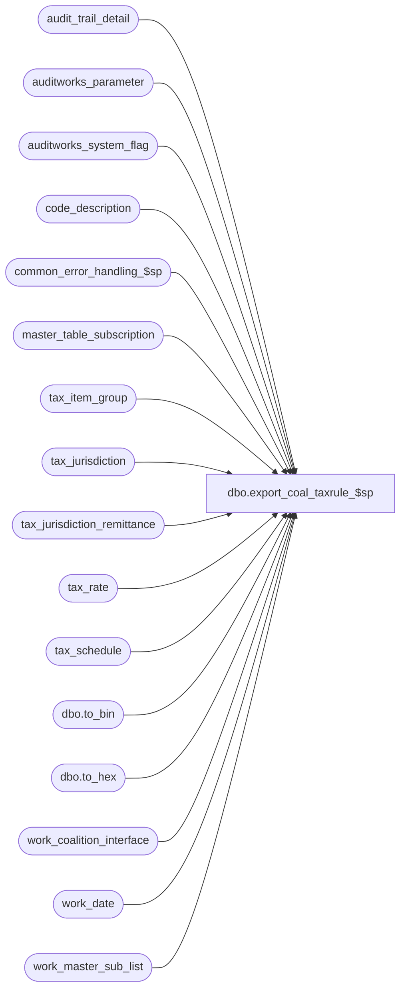

# dbo.export_coal_taxrule_$sp

**Database:** auditworks  
**Server:** bedrockdb01  

## Architecture Diagram



## Table Dependencies

| Referenced Table |
|---|
| audit_trail_detail |
| auditworks_parameter |
| auditworks_system_flag |
| code_description |
| common_error_handling_$sp |
| master_table_subscription |
| tax_item_group |
| tax_jurisdiction |
| tax_jurisdiction_remittance |
| tax_rate |
| tax_schedule |
| dbo.to_bin |
| dbo.to_hex |
| work_coalition_interface |
| work_date |
| work_master_sub_list |

## Stored Procedure Code

```sql
create proc dbo.export_coal_taxrule_$sp (@interface_id	tinyint,
 @process_no 	smallint,
 @task_server	nvarchar(255),
 @runtime_datetime	datetime,
 @export_status	tinyint,
 @new_release	tinyint,
 @task_no	int OUTPUT,
 @errmsg 	nvarchar(2000) OUTPUT,
 @tax_dcn_exp_hist int  
)
AS

DECLARE
@block_type			smallint,
@cursor_open			tinyint,
@data_header			nvarchar(255),
@errno				int,
@length				smallint,
@process_log_entry 		tinyint,
@record_sequence		int,
@table_name			nvarchar(30),
@table_key			nvarchar(255),
@task_module			nvarchar(255),
@task_header			nvarchar(255),
@task_operation 		nvarchar(255),
@export_module_name		nvarchar(255),
@message_id		        int,	
@object_name			nvarchar(255),
@operation_name			nvarchar(100),
@process_name		        nvarchar(100),
@action				tinyint,
@posting_datetime		datetime,
@rows				int,
@entry_id			numeric(12,0),
@tax_jurisdiction		nchar(5),
@tax_level			tinyint,
@tax_rate_code			tinyint,
@effective_from_date		datetime,
@start_pos			tinyint,
@end_pos			tinyint,
@tax_rate_id 			numeric(10,0),
@delete_task_no			int,
@tax_rounding_method		nvarchar(255),
@tax_type			nvarchar(10),
@transaction_level_tax_calc	tinyint,
@tax_schedule_id 		binary(16),
@today				datetime 


/*  Proc Name: export_coal_taxrule_$sp
   Desc: Coalition Tax Exports.
     Called by coalition_interface_main_$sp.

HISTORY:
Date     Name           Def# Desc
Mar30,16 Vicci      DAOM-213 When exporting redundant informat for ValueAddedTax module convert the tax rate id to hex before logging it as a string
                             since STORE only supports 6 characters.  Although not sufficient, it allows tax rate ID of up to 16777215 to be exported
                             (as VAT CODE FFFFFF) which is better than the current max of 999999.
Sep09,15 Vicci    TFS-139820 Split tax_schedule_id and tax_rate_id based retrievals from tax rate so that index can be used;  add index on #check_tax_rate_id.
Mar17,14 Phu        1-4CDP8E Fix partial export that has result in the wrong order.
Feb07,14 Vicci        149810 Exclude inactive jurisdictions.
Feb26,13 Vicci        142088 To avoid deadlocks, lock a shared flag prior to work_master_sub_list deletions.
Feb22,13 Vicci        142020 Do not hold a lock on the work_master_sub_list table while reading it in a cursor, since this causes the 
                             audit_trail_header_$trI work_master_sub_list cleanup of prior configuration changes for the table/key upon 
                             additional change to the same table/key to die as victim of a deadlock.
Apr07,11 Vicci        126078 Take master_table_subscription active flag into account.
Jun12,09 Vicci      1-3ZQZ3F If expired rate history days is > 0 then download the first effective date for the rule as 01/01/1970
                             to avoid it being later than the effective date of the rule assignment.
Feb20,09 Vicci         86072 Take into account parameter for whether or not to export expired information.
Aug15,08 Paul         104050 Use left outer join syntax since proc is shared between SA4.1 and SA5
Mar20,08 Vicci      1-38MDAZ Include export tax-type tax_schedule table and use compound order instead of tax_on_tax_level
                             to support tax on multiple taxes.
Mar14,06 Vicci	       68918 substitute reference to obsolete work table for non-taxable rate-code
                             export with usage of tax_jurisdiction_remittance
Aug18,04 Daphna        40007 use ISNULL '01/01/2038' for Year portion of effective_until_date 
                             on insert from tax_rule(13)
Mar11,04 Daphna        25374 increment counter inside cursor loop to prevent multiple insert error
Aug26,03 Vicci	 13513/13514 The tax-rule type must be downloaded as IRC, IRT instead of RC, RT
			     for threshhold tax to be calculated at item level in Coalition 5.0+
Jul17,03 Vicci   11567/11569 In the case of the full download only, include expired rates in the export
			     in order to avoid error whereby tax-rule-assign has earlier 
			     runtime than tax-rule.
Jun19,03 Vicci	 10041/10047 set expiry date for Non-Taxable entry to 01/01/2038
May27,03 Vicci	1-LMFGH/9130 eliminate dummy tax_rate table entry from export, i.e. where 
			     tax_jurisdiction is '_____' and set the expiry date of the
			     current rate to '01/01/2038' and set time portion of expiry date to 23:59:59.
Apr10,03 Vicci          7544 send tax-level description as tax rule description since Coalition 
                             prints it at bottom of receipt beside the sum of tax collected per level.
Nov12,02 Winnie         5124 update export_status to 0 if no data in work_coalition_interface
Oct21,02 Winnie	     1-G3UJD Only check integrity when export_format = 1
Aug06,02 Winnie      1-DZ2SY To support export_status = 1 (for coalition update/delete)
May02,02 Winnie	     1-CFFPT To standardize the coalition for Tax export.
*/

CREATE TABLE #tax_rule_effective_date(
       tax_rate_id numeric(10,0) not null, 
       min_effective_from_date smalldatetime not null)
SELECT @errno = @@error
IF @errno <> 0
BEGIN
  SELECT @errmsg = 'Failed to create table to list first effective date for each tax rule',
	 @object_name = '#tax_rule_effective_date',
         @operation_name = 'CREATE'      
  GOTO error
END             
create unique clustered
 index #tax_rule_effective_date_x0
    on #tax_rule_effective_date ( tax_rate_id )
SELECT @errno = @@error
IF @errno <> 0
BEGIN
  SELECT @errmsg = 'Failed to create index on table to list first effective date for each tax rule',
	 @object_name = '#tax_rule_effective_date_x0',
         @operation_name = 'CREATE'      
  GOTO error
END             

SELECT @process_name = 'export_coal_taxrule_$sp',
       @message_id = 201068,
       @task_module = 'Module=TaxRule' ,
       @export_module_name = 'TaxRule',
       @rows = 0,
       @today = convert(datetime, convert(nvarchar, getdate(), 101))

SELECT @tax_rounding_method = par_value
  FROM auditworks_parameter
 WHERE par_name = 'tax_rounding_method'
SELECT @errno = @@error
    IF @errno <> 0
      BEGIN
        SELECT @errmsg = 'Failed to determine tax rounding method',
	       @object_name = 'auditworks_parameter',
               @operation_name = 'SELECT'      
        GOTO error
      END             

IF @tax_rounding_method = '1'
BEGIN
  SELECT @transaction_level_tax_calc = 1,
   @tax_type = ',R,'
END
ELSE
BEGIN
  SELECT @transaction_level_tax_calc = 0,
         @tax_type = ',IR,'
END

IF @export_status = 2
BEGIN
  SELECT @block_type = 2, -- Task
         @task_no = @task_no + 1
  SELECT @task_header = '[Task.' + CONVERT(nvarchar, @task_no) + ']',
         @task_operation = 'Operation=DeleteAll',
         @record_sequence = 0

  -- Build the deletion task

  TRUNCATE TABLE work_date
  SELECT @errno = @@error
  IF @errno <> 0
  BEGIN
    SELECT @errmsg = 'Failed to truncate work_date table for TaxRule DeleteAll',
           @object_name = 'work_date',
           @operation_name = 'TRUNCATE'      
    GOTO error
  END             

--86072
  INSERT work_date(effective_from_date)
  SELECT IsNull(MIN(CASE WHEN @tax_dcn_exp_hist = 0 AND t.effective_from_date <= @today THEN '01/01/1970' ELSE t.effective_from_date END), '01/01/1970')
    FROM tax_rate t, tax_jurisdiction j
   WHERE t.tax_jurisdiction <> '_____' 
     AND (t.effective_until_date IS NULL 
          OR @tax_dcn_exp_hist = -1 
          OR t.effective_until_date >= dateadd(dd, -1 * @tax_dcn_exp_hist, @today))
     AND t.tax_jurisdiction = j.tax_jurisdiction
     AND j.active_flag = 1
   UNION 
  SELECT '01/01/1970'
  SELECT @errno = @@error
  IF @errno <> 0
  BEGIN
    SELECT @errmsg = 'Failed to insert to work_date table for TaxRule DeleteAll',
           @object_name = 'work_date',
           @operation_name = 'INSERT'      
    GOTO error
  END             

    INSERT work_coalition_interface
           (runtime_datetime, record_content, block_type,
            task_no, record_sequence_no, export_module_name)
    SELECT MIN(effective_from_date), @task_header, @block_type,
           @task_no, @record_sequence, @export_module_name
      FROM work_date       
    SELECT @errno = @@error
    IF @errno <> 0
      BEGIN
        SELECT @errmsg = 'Failed to insert into work_coalition_interface with task header for TaxRule DeleteAll',
               @object_name = 'work_coalition_interface',
               @operation_name = 'INSERT'      
        GOTO error
      END             
                       
    SELECT @record_sequence = @record_sequence + 1
  
    INSERT work_coalition_interface
           (runtime_datetime, record_content, block_type,
            task_no, record_sequence_no, export_module_name)
    SELECT  MIN(effective_from_date), @task_server, @block_type,
            @task_no, @record_sequence, @export_module_name
      FROM work_date

    SELECT @errno = @@error
    IF @errno <> 0
      BEGIN
        SELECT @errmsg = 'Failed to insert into work_coalition_interface with task_server for TaxRule DeleteAll',
               @object_name = 'work_coalition_interface',
            @operation_name = 'INSERT'      
        GOTO error
      END   
    
    SELECT @record_sequence = @record_sequence + 1

    INSERT work_coalition_interface
           (runtime_datetime, record_content, block_type,
            task_no, record_sequence_no, export_module_name)
    SELECT MIN(effective_from_date), @task_module, @block_type,
           @task_no, @record_sequence, @export_module_name
     FROM work_date

    SELECT @errno = @@error
    IF @errno <> 0
     BEGIN
       SELECT @errmsg = 'Failed to insert into work_coalition_interface with task_module for TaxRule DeleteAll',
              @object_name = 'work_coalition_interface',
              @operation_name = 'INSERT'      
       GOTO error
     END             
                       
    SELECT @record_sequence = @record_sequence + 1
  
    INSERT work_coalition_interface
           (runtime_datetime, record_content, block_type,
            task_no, record_sequence_no, export_module_name)
    SELECT MIN(effective_from_date), @task_operation, @block_type,
           @task_no, @record_sequence, @export_module_name
     FROM work_date

    SELECT @errno = @@error
    IF @errno <> 0
      BEGIN
        SELECT @errmsg = 'Failed to insert into work_coalition_interface with task_operation for TaxRule DeleteAll',
               @object_name = 'work_coalition_interface',
               @operation_name = 'INSERT'      
         GOTO error
      END             

    SELECT @data_header = '[Data.' + CONVERT(nvarchar, @task_no) + ']',
           @record_sequence = 0,
           @block_type = 3 -- Data

    INSERT work_coalition_interface
           (runtime_datetime, record_content, block_type,
            task_no, record_sequence_no, export_module_name)
    SELECT MIN(effective_from_date), @data_header, @block_type,
            @task_no, @record_sequence, @export_module_name
      FROM work_date
    SELECT @errno = @@error
    IF @errno <> 0
      BEGIN
        SELECT @errmsg = 'Failed to insert into work_coalition_interface with data_header for TaxRule DeleteAll',
               @object_name = 'work_coalition_interface',
               @operation_name = 'INSERT'      
        GOTO error
      END             

    SELECT @record_sequence = @record_sequence + 1

    INSERT work_coalition_interface
           (runtime_datetime, record_content, block_type,
            task_no, record_sequence_no, export_module_name)
    SELECT MIN(effective_from_date), 'AllTaxRules', @block_type,
           @task_no, @record_sequence, @export_module_name
      FROM work_date
            
    SELECT @errno = @@error
    IF @errno <> 0
      BEGIN
        SELECT @errmsg = 'Failed to insert into work_coalition_interface for TaxRule DeleteAll',
               @object_name = 'work_coalition_interface',
               @operation_name = 'INSERT'      
        GOTO error
      END

    SELECT @block_type = 2,
           @task_no = @task_no + 1
    SELECT @task_header = '[Task.' + CONVERT(nvarchar, @task_no) + ']',
           @task_operation = 'Operation=AddUpdate',
           @record_sequence = 0

     -- Build the reinsertion task
    TRUNCATE TABLE work_date 
    SELECT @errno = @@error
    IF @errno <> 0
      BEGIN
        SELECT @errmsg = 'Failed to truncate work_date table for TaxRule',
               @object_name = 'work_date',
               @operation_name = 'TRUNCATE'      
        GOTO error
      END             

   IF @tax_dcn_exp_hist <> 0
   BEGIN
     INSERT into #tax_rule_effective_date(tax_rate_id, min_effective_from_date)
     SELECT t.tax_rate_id, min(t.effective_from_date) min_effective_from_date
       FROM tax_rate t, tax_jurisdiction j
      WHERE t.tax_jurisdiction = j.tax_jurisdiction
        AND j.active_flag = 1
        AND t.tax_jurisdiction <> '_____' 
        AND (t.effective_until_date IS NULL 
             OR @tax_dcn_exp_hist = -1 
             OR t.effective_until_date >= dateadd(dd, -1 * @tax_dcn_exp_hist, @today))
      GROUP BY t.tax_rate_id
     SELECT @errno = @@error
     IF @errno <> 0
     BEGIN
       SELECT @errmsg = 'Failed to determine earliest effective from date for each tax rule',
              @object_name = '#tax_rule_effective_date',
              @operation_name = 'INSERT'      
       GOTO error
     END                          
   END  --IF @tax_dcn_exp_hist > 0
   
   INSERT work_date(effective_from_date)
   SELECT DISTINCT CASE WHEN (@tax_dcn_exp_hist = 0 AND r.effective_from_date <= @today) OR (r.effective_from_date = ed.min_effective_from_date) THEN '01/01/1970' ELSE r.effective_from_date END from_date
     FROM tax_jurisdiction j
          INNER JOIN tax_rate r
             ON j.tax_jurisdiction = r.tax_jurisdiction
            AND r.tax_jurisdiction <> '_____' 
            AND (   r.effective_until_date IS NULL 
                 OR @tax_dcn_exp_hist = -1 
                 OR r.effective_until_date >= dateadd(dd, -1 * @tax_dcn_exp_hist, @today))
          LEFT OUTER JOIN #tax_rule_effective_date ed
            ON r.tax_rate_id = ed.tax_rate_id
    WHERE j.active_flag = 1
     UNION
    SELECT '01/01/1970' from_date
    SELECT @errno = @@error
    IF @errno <> 0
      BEGIN
        SELECT @errmsg = 'Failed to insert to work_date table for TaxRule AddUpdate',
               @object_name = 'work_date',
               @operation_name = 'INSERT'      
        GOTO error
      END             

    INSERT work_coalition_interface
          (runtime_datetime, record_content, block_type,
           task_no, record_sequence_no, export_module_name)
    SELECT DISTINCT effective_from_date, @task_header, @block_type,
           @task_no, @record_sequence, @export_module_name
      FROM work_date

    SELECT @errno = @@error
    IF @errno <> 0
      BEGIN
        SELECT @errmsg = 'Failed to insert into work_coalition_interface with task_header for TaxRule AddUpdate',
               @object_name = 'work_coalition_interface',
               @operation_name = 'INSERT'      
        GOTO error
      END             
                       
    SELECT @record_sequence = @record_sequence + 1      

    INSERT work_coalition_interface
           (runtime_datetime, record_content, block_type,
           task_no, record_sequence_no, export_module_name)
    SELECT DISTINCT effective_from_date, @task_server, @block_type,
           @task_no, @record_sequence, @export_module_name
      FROM work_date
    SELECT @errno = @@error
    IF @errno <> 0
    BEGIN
      SELECT @errmsg = 'Failed to insert into work_coalition_interface with task_server for TaxRule AddUpdate',
             @object_name = 'work_coalition_interface',
             @operation_name = 'INSERT'      
      GOTO error
    END             
                       
    SELECT @record_sequence = @record_sequence + 1

    INSERT work_coalition_interface(
           runtime_datetime, record_content, block_type,
           task_no, record_sequence_no, export_module_name)
    SELECT DISTINCT effective_from_date, @task_module, @block_type,
           @task_no, @record_sequence, @export_module_name
      FROM work_date
    SELECT @errno = @@error
    IF @errno <> 0
    BEGIN
      SELECT @errmsg = 'Failed to insert into work_coalition_interface with task_module for TaxRule AddUpdate',
             @object_name = 'work_coalition_interface',
             @operation_name = 'INSERT'      
      GOTO error
    END             
                       
    SELECT @record_sequence = @record_sequence + 1

    INSERT work_coalition_interface(
           runtime_datetime, record_content, block_type,
           task_no, record_sequence_no, export_module_name)
    SELECT DISTINCT effective_from_date, @task_operation, @block_type,
        @task_no, @record_sequence, @export_module_name
      FROM work_date
    SELECT @errno = @@error
    IF @errno <> 0
    BEGIN
      SELECT @errmsg = 'Failed to insert into work_coalition_interface with task_operation for TaxRule AddUpdate',
             @object_name = 'work_coalition_interface',
             @operation_name = 'INSERT'      
      GOTO error
    END             
  
    -- Build the reinsertion data
    SELECT @data_header = '[Data.' + CONVERT(nvarchar, @task_no) + ']',
           @record_sequence = 0,
           @block_type = 3 -- Data

    INSERT work_coalition_interface(
           runtime_datetime, record_content, block_type,
           task_no, record_sequence_no, export_module_name)
    SELECT DISTINCT effective_from_date, @data_header, @block_type,
           @task_no, @record_sequence, @export_module_name
      FROM work_date
    SELECT @errno = @@error
    IF @errno <> 0
    BEGIN
      SELECT @errmsg = 'Failed to insert into work_coalition_interface with data_header for TaxRule AddUpdate',
             @object_name = 'work_coalition_interface',
             @operation_name = 'INSERT'      
      GOTO error
    END             

    SELECT @record_sequence = @record_sequence + 1

    INSERT work_coalition_interface(
           runtime_datetime, 
           record_content, 
           block_type, 
           task_no, 
           record_sequence_no, 
           export_module_name )
    SELECT DISTINCT CASE WHEN (@tax_dcn_exp_hist = 0 AND t.effective_from_date <= @today) OR (t.effective_from_date = ed.min_effective_from_date) THEN '01/01/1970' ELSE t.effective_from_date END, 
           @export_module_name + ',' +  CONVERT(nvarchar, (t.tax_rate_id)) +',V,' + 
           SUBSTRING(t.tax_rate_code_description,1,30) + ',' + SUBSTRING(c.code_display_descr,1,50) + ',' + 
           CONVERT(nvarchar,datepart(yy, t.effective_from_date)) + '-' + 
           RIGHT('00' + CONVERT(nvarchar,datepart(mm, t.effective_from_date)), 2) + '-' + 
           RIGHT('00' + CONVERT(nvarchar,datepart(dd, t.effective_from_date)), 2) + ' 00:00:00,' +  
           CONVERT(nvarchar,datepart(yy, IsNull(t.effective_until_date,'01/01/2038'))) + '-' + 
           RIGHT('00' + CONVERT(nvarchar,datepart(mm, IsNull(t.effective_until_date,'01/01/2038'))), 2) + '-' + 
           RIGHT('00' + CONVERT(nvarchar,datepart(dd, IsNull(t.effective_until_date,'01/01/2038'))), 2) + ' 23:59:59,ACTV,,HALF,' + 
           CONVERT(nvarchar, t.combined_rate) + ',' + RIGHT(dbo.to_hex(convert(bigint, t.tax_rate_id)), 6) + ',' + 
           CONVERT(nvarchar, t.compound_order), 
           @block_type, 
           @task_no, 
           @record_sequence, 
           @export_module_name  
      FROM tax_jurisdiction j
          INNER JOIN tax_rate t
              ON j.tax_jurisdiction = t.tax_jurisdiction
             AND ISNULL(t.item_tax_strip_flag, 0) <> 0 
             AND t.tax_jurisdiction <> '_____' 
             AND (   t.effective_until_date IS NULL 
                  OR @tax_dcn_exp_hist = -1 
                  OR t.effective_until_date >= dateadd(dd, -1 * @tax_dcn_exp_hist, @today))
           INNER JOIN code_description c
              ON c.code_type = 41
             AND t.tax_level = c.code
           LEFT OUTER JOIN #tax_rule_effective_date ed
             ON t.tax_rate_id = ed.tax_rate_id
    WHERE j.active_flag = 1
    SELECT @errno = @@error, @rows = @rows + @@rowcount
    IF @errno <> 0
    BEGIN
      SELECT @errmsg = 'Failed to insert into work_coalition_interface from tax_rate for TaxRule(1)',
             @object_name = 'work_coalition_interface',
             @operation_name = 'INSERT'      
      GOTO error
    END                    

    INSERT work_coalition_interface(
           runtime_datetime, 
           record_content, 
           block_type, 
           task_no, 
           record_sequence_no, 
           export_module_name)
    SELECT DISTINCT CASE WHEN (@tax_dcn_exp_hist = 0 AND t.effective_from_date <= @today) OR (t.effective_from_date = ed.min_effective_from_date) THEN '01/01/1970' ELSE t.effective_from_date END, 
           @export_module_name + ',' + CONVERT(nvarchar, (t.tax_rate_id))+
           CASE WHEN IsNull(t.transaction_level_tax_calc, @transaction_level_tax_calc) = 1 THEN ',' ELSE ',I' END + IsNull(s.tax_schedule_type, 'R') + ',' + 
           SUBSTRING(t.tax_rate_code_description,1,30) + ',' + SUBSTRING(c.code_display_descr,1,50) + ',' + 
           CONVERT(nvarchar,datepart(yy, CASE WHEN @tax_dcn_exp_hist = 0 AND t.effective_from_date <= @today THEN '01/01/1970' ELSE t.effective_from_date END)) + '-' + 
           RIGHT('00' + CONVERT(nvarchar,datepart(mm, CASE WHEN @tax_dcn_exp_hist = 0 AND t.effective_from_date <= @today THEN '01/01/1970' ELSE t.effective_from_date END )), 2) + '-' + 
           RIGHT('00' + CONVERT(nvarchar,datepart(dd, CASE WHEN @tax_dcn_exp_hist = 0 AND t.effective_from_date <= @today THEN '01/01/1970' ELSE t.effective_from_date END )), 2) + 
           ' 00:00:00,' + CONVERT(nvarchar,datepart(yy, IsNull(t.effective_until_date,'01/01/2038'))) + '-' + 
           RIGHT('00' + CONVERT(nvarchar,datepart(mm, IsNull(t.effective_until_date,'01/01/2038'))), 2) + '-' + 
           RIGHT('00' + CONVERT(nvarchar,datepart(dd, IsNull(t.effective_until_date,'01/01/2038'))), 2) + 
           ' 23:59:59,ACTV,,HALF,' + CONVERT(nvarchar,t.combined_rate)+',,' + 
           CONVERT(nvarchar, t.compound_order), 
           @block_type, 
           @task_no, 
           @record_sequence, 
           @export_module_name 
      FROM tax_jurisdiction j
           INNER JOIN tax_rate t 
              ON j.tax_jurisdiction = t.tax_jurisdiction
             AND COALESCE(t.item_tax_strip_flag, 0) = 0 
             AND t.threshold_amount = 0
             AND t.tax_jurisdiction <> '_____' 
             AND (   t.effective_until_date IS NULL 
                  OR @tax_dcn_exp_hist = -1 
                  OR t.effective_until_date >= dateadd(dd, -1 * @tax_dcn_exp_hist, @today))
           LEFT OUTER JOIN #tax_rule_effective_date ed 
             ON t.tax_rate_id = ed.tax_rate_id
          INNER JOIN code_description c ON (t.tax_level = c.code AND c.code_type = 41)
           LEFT JOIN tax_schedule s ON (t.tax_schedule_id = s.tax_schedule_id)
     WHERE j.active_flag = 1
    SELECT @errno = @@error, @rows = @rows + @@rowcount
    IF @errno <> 0
      BEGIN
        SELECT @errmsg = 'Failed to insert into work_coalition_interface from tax_rate for TaxRule(3)',
               @object_name = 'work_coalition_interface',
               @operation_name = 'INSERT'      
        GOTO error
      END                   

    IF @new_release = 0 
      BEGIN
        INSERT work_coalition_interface
               (runtime_datetime, 
                record_content, 
                block_type, 
                task_no, 
                record_sequence_no, 
                export_module_name)
        SELECT DISTINCT '01 JAN 1970', 
               @export_module_name + ',' + '0' + CONVERT(nvarchar,g.tax_item_group_id * 10000 
               + j.tax_jurisdiction_id * 10 + t.tax_level)+ @tax_type + 
               'Non Taxable,Non Taxable,1970-01-01 00:00:00,2038-01-01 00:00:00,ACTV,,HALF,' + 
               '0.0000'+ ',,' , 
               @block_type, 
               @task_no, 
               @record_sequence, 
               @export_module_name 
          FROM tax_item_group g, tax_jurisdiction_remittance t, tax_jurisdiction j
         WHERE t.tax_jurisdiction = j.tax_jurisdiction
           AND j.active_flag = 1
        SELECT @errno = @@error
        IF @errno <> 0
          BEGIN
            SELECT @errmsg = 'Failed to insert into work_coalition_interface from for non taxable rate_code (1)',
                   @object_name = 'work_coalition_interface',
                   @operation_name = 'INSERT'      
            GOTO error
          END                   
      END
    ELSE
    BEGIN
      INSERT work_coalition_interface(
             runtime_datetime, 
             record_content, 
             block_type, 
             task_no, 
             record_sequence_no, 
             export_module_name)
      VALUES ('01 JAN 1970', 
             @export_module_name + ',' + '0' +@tax_type + 
             'Non Taxable,Non Taxable,1970-01-01 00:00:00,2038-01-01 00:00:00,ACTV,,HALF,' + 
             '0.0000'+ ',,' , 
             @block_type, 
             @task_no, 
             @record_sequence, 
             @export_module_name)
      SELECT @errno = @@error
      IF @errno <> 0
      BEGIN
        SELECT @errmsg = 'Failed to insert into work_coalition_interface from for non taxable rate_code (2)',
               @object_name = 'work_coalition_interface',
               @operation_name = 'INSERT'      
        GOTO error
      END                   
    END
         
    INSERT work_coalition_interface(
           runtime_datetime,  
           record_content, 
           block_type, 
           task_no, 
           record_sequence_no, 
           export_module_name)
    SELECT DISTINCT CASE WHEN (@tax_dcn_exp_hist = 0 AND t.effective_from_date <= @today) OR (t.effective_from_date = ed.min_effective_from_date) THEN '01/01/1970' ELSE t.effective_from_date END, 
           @export_module_name + ',' + CONVERT(nvarchar, (t.tax_rate_id))+',IRC,' + 
           SUBSTRING(tax_rate_code_description,1,30) + ',' + SUBSTRING(code_display_descr,1,50) + ',' + 
           CONVERT(nvarchar,datepart(yy, CASE WHEN @tax_dcn_exp_hist = 0 AND t.effective_from_date <= @today THEN '01/01/1970' ELSE t.effective_from_date END )) + '-' + 
           RIGHT('00' + CONVERT(nvarchar,datepart(mm, CASE WHEN @tax_dcn_exp_hist = 0 AND t.effective_from_date <= @today THEN '01/01/1970' ELSE t.effective_from_date END )), 2) + '-' + 
           RIGHT('00' + CONVERT(nvarchar,datepart(dd, CASE WHEN @tax_dcn_exp_hist = 0 AND t.effective_from_date <= @today THEN '01/01/1970' ELSE t.effective_from_date END )), 2) + ' 00:00:00,' + 
           CONVERT(nvarchar,datepart(yy, IsNull(effective_until_date,'01/01/2038'))) + '-' + 
           RIGHT('00' + CONVERT(nvarchar,datepart(mm, IsNull(effective_until_date,'01/01/2038'))), 2) + '-' + 
           RIGHT('00' + CONVERT(nvarchar,datepart(dd, IsNull(effective_until_date,'01/01/2038'))), 2) + ' 23:59:59,ACTV,,HALF,,,' +
           CONVERT(nvarchar, t.compound_order), 
           @block_type, 
           @task_no, 
           @record_sequence, 
           @export_module_name  
      FROM tax_rate t
           INNER JOIN tax_jurisdiction j
              ON t.tax_jurisdiction = j.tax_jurisdiction
             AND j.active_flag = 1
           INNER JOIN code_description c
              ON c.code_type = 41
             AND t.tax_level = c.code
            LEFT OUTER JOIN #tax_rule_effective_date ed
              ON t.tax_rate_id = ed.tax_rate_id
     WHERE ISNULL(t.item_tax_strip_flag, 0) = 0  
       AND t.threshold_amount > 0 
       AND t.tax_on_threshold_excess = 0
       AND t.tax_jurisdiction <> '_____' 
       AND (t.effective_until_date IS NULL 
            OR @tax_dcn_exp_hist = -1 
            OR t.effective_until_date >= dateadd(dd, -1 * @tax_dcn_exp_hist, @today))
    SELECT @errno = @@error, @rows = @rows + @@rowcount
    IF @errno <> 0
    BEGIN
      SELECT @errmsg = 'Failed to insert into work_coalition_interface from tax_rate for TaxRule(5)',
             @object_name = 'work_coalition_interface',
             @operation_name = 'INSERT'      
      GOTO error
    END                   

    INSERT work_coalition_interface(
           runtime_datetime, 
           record_content, 
           block_type, 
           task_no, 
           record_sequence_no, 
           export_module_name)
    SELECT DISTINCT CASE WHEN (@tax_dcn_exp_hist = 0 AND t.effective_from_date <= @today) OR (t.effective_from_date = ed.min_effective_from_date) THEN '01/01/1970' ELSE t.effective_from_date END, 
           @export_module_name + ',' + CONVERT(nvarchar, (t.tax_rate_id))+',IRT,' + 
           SUBSTRING(t.tax_rate_code_description,1,30) + ',' + SUBSTRING(c.code_display_descr,1,50) + ',' + 
           CONVERT(nvarchar,datepart(yy, CASE WHEN (@tax_dcn_exp_hist = 0 AND t.effective_from_date <= @today) OR (t.effective_from_date = ed.min_effective_from_date) THEN '01/01/1970' ELSE t.effective_from_date END )) + '-' + 
           RIGHT('00' + CONVERT(nvarchar,datepart(mm, CASE WHEN (@tax_dcn_exp_hist = 0 AND t.effective_from_date <= @today) OR (t.effective_from_date = ed.min_effective_from_date) THEN '01/01/1970' ELSE t.effective_from_date END )), 2) + '-' + 
           RIGHT('00' + CONVERT(nvarchar,datepart(dd, CASE WHEN (@tax_dcn_exp_hist = 0 AND t.effective_from_date <= @today) OR (t.effective_from_date = ed.min_effective_from_date) THEN '01/01/1970' ELSE t.effective_from_date END )), 2) + ' 00:00:00,' + 
           CONVERT(nvarchar,datepart(yy, IsNull(t.effective_until_date,'01/01/2038'))) + '-' + 
           RIGHT('00' + CONVERT(nvarchar,datepart(mm, IsNull(t.effective_until_date,'01/01/2038'))), 2) + '-' + 
           RIGHT('00' + CONVERT(nvarchar,datepart(dd, IsNull(t.effective_until_date,'01/01/2038'))), 2) + ' 23:59:59,ACTV,,HALF,,,' +
           CONVERT(nvarchar, t.compound_order), 
           @block_type, 
           @task_no, 
           @record_sequence, 
           @export_module_name 
      FROM tax_rate t
           INNER JOIN tax_jurisdiction j
              ON t.tax_jurisdiction = j.tax_jurisdiction
             AND j.active_flag = 1
           INNER JOIN code_description c
              ON c.code_type = 41
             AND t.tax_level = c.code
           LEFT OUTER JOIN #tax_rule_effective_date ed
             ON t.tax_rate_id = ed.tax_rate_id
     WHERE ISNULL(t.item_tax_strip_flag, 0) = 0 
       AND t.threshold_amount > 0 
       AND t.tax_on_threshold_excess = 1
       AND t.tax_jurisdiction <> '_____' 
       AND (t.effective_until_date IS NULL 
            OR @tax_dcn_exp_hist = -1 
            OR t.effective_until_date >= dateadd(dd, -1 * @tax_dcn_exp_hist, @today))
    SELECT @errno = @@error, @rows = @rows + @@rowcount
    IF @errno <> 0
    BEGIN
      SELECT @errmsg = 'Failed to insert into work_coalition_interface from tax_rate for TaxRule(7)',
             @object_name = 'work_coalition_interface',
             @operation_name = 'INSERT'      
      GOTO error
    END     

    IF @rows = 0 
    BEGIN
      DELETE work_coalition_interface
       WHERE task_no = @task_no
         AND export_module_name = @export_module_name  
  SELECT @errno = @@error
    IF @errno <> 0
      BEGIN
        SELECT @errmsg = 'Failed to delete from  work_coalition_interface if no details for TaxRule AddUpdate',
               @object_name = 'work_coalition_interface',
               @operation_name = 'DELETE'      
        GOTO error
      END
    END -- IF @rows = 0 

    TRUNCATE TABLE work_date
    SELECT @errno = @@error
    IF @errno <> 0
      BEGIN
        SELECT @errmsg = 'Failed to truncate work_date table for TaxRule',
               @object_name = 'work_date',
               @operation_name = 'TRUNCATE'      
        GOTO error
      END            
  END -- IF @export_status = 2
ELSE
  BEGIN
    DECLARE taxrule_crsr CURSOR FAST_FORWARD
        FOR
     SELECT table_name, 
            table_key,
            action,
            posting_datetime,
            entry_id
       FROM work_master_sub_list
      WHERE interface_id = @interface_id
        AND table_name in ('tax_rate', 'tax_schedule')
        AND posting_datetime <= @runtime_datetime
      ORDER BY table_name, entry_id ASC

    SELECT @errno = @@error
    IF @errno <> 0
    BEGIN
      SELECT @errmsg = 'Unable to declare cursor taxrule_crsr',
             @object_name = 'taxrule_crsr',
             @operation_name = 'DECLARE'      
      GOTO error
    END

    CREATE TABLE #check_tax_rate_id
         (tax_rate_id numeric(10,0))
    SELECT @errno = @@error
    IF @errno <> 0
    BEGIN
      SELECT @errmsg = 'Unable to create temp table #check_tax_rate_id',
             @object_name = '#check_tax_rate_id',
             @operation_name = 'CREATE'      
      GOTO error
    END
    CREATE INDEX #check_tax_rate_id_x0
       ON  #check_tax_rate_id ( tax_rate_id )
    SELECT @errno = @@error
    IF @errno <> 0
    BEGIN
      SELECT @errmsg = 'Failed to create index on table to check tax rate id',
	     @object_name = '#check_tax_rate_id_x0',
             @operation_name = 'CREATE'      
      GOTO error
    END             

    OPEN taxrule_crsr
    SELECT @errno = @@error
    IF @errno <> 0
    BEGIN
      SELECT @errmsg = 'Unable to open cursor taxrule_crsr',
             @object_name = 'taxrule_crsr',
             @operation_name = 'OPEN'      
      GOTO error
    END

    SELECT @cursor_open = 1

    WHILE 1 = 1
    BEGIN
      FETCH taxrule_crsr
       INTO @table_name,
            @table_key,
            @action,
            @posting_datetime,
            @entry_id

      IF @@fetch_status <> 0
        BREAK

      SELECT @length = LEN(@table_key),
             @start_pos = 1,
             @rows = 0,
             @delete_task_no = @task_no + 1,  
             @task_no = @task_no + 2 
       
      IF @table_name = 'tax_rate'
      BEGIN
        SELECT @end_pos = CHARINDEX('/',@table_key)
        SELECT @tax_jurisdiction = SUBSTRING(@table_key, 1, @end_pos -1 ),
               @start_pos = @end_pos + 1
        SELECT @end_pos = CHARINDEX('/', SUBSTRING(@table_key, @start_pos, @length))
        SELECT @tax_level = CONVERT(tinyint, SUBSTRING(@table_key,@start_pos, @end_pos -1)),
               @start_pos = @start_pos + @end_pos 
        SELECT @end_pos = CHARINDEX('/', SUBSTRING(@table_key, @start_pos, @length))
        SELECT @tax_rate_code = CONVERT(TINYINT,SUBSTRING(@table_key, @start_pos, @end_pos -1 )),
               @start_pos = @start_pos + @end_pos 
        SELECT @effective_from_date = CONVERT(DATETIME,SUBSTRING(@table_key, @start_pos, @length - @start_pos + 1))
        IF @action <> 3 AND 
          EXISTS (SELECT 1
                  FROM tax_jurisdiction t
                 WHERE @tax_jurisdiction = tax_jurisdiction
                   AND t.active_flag = 0)
          SELECT @action = 3
      END
      ELSE
      BEGIN
        SELECT @tax_schedule_id = dbo.to_bin(@table_key)
      END

      IF @action = 3
      BEGIN
        IF @table_name = 'tax_rate'  --deleting tax-schedule doesn't matter since point-deletion is what matters.
        BEGIN
          SELECT @tax_rate_id = CONVERT(NUMERIC(10,0),before_value)
            FROM audit_trail_detail
           WHERE entry_id = @entry_id
             AND column_name = 'tax_rate_id'
          SELECT @errno = @@error
          IF @errno <> 0
          BEGIN
            SELECT @errmsg = 'Failed to select before_value from audit_trail_detail for ValueAddedTax Delete',
@object_name = 'audit_trail_detail',
                   @operation_name = 'SELECT'      
            GOTO error
          END         

          IF EXISTS (SELECT 1
                FROM tax_rate r, tax_jurisdiction j
               WHERE r.tax_rate_id = @tax_rate_id
                 AND r.tax_jurisdiction <> '_____'
                 AND r.tax_jurisdiction = j.tax_jurisdiction
                 AND j.active_flag = 1 )
            SELECT @rows = 1          
                 
          IF @rows = 0 
        BEGIN
            SELECT @block_type = 2, -- Task
                   @task_header = '[Task.' + CONVERT(nvarchar, @delete_task_no) + ']',
                   @task_operation = 'Operation=Delete',
                   @record_sequence = 0
               -- Build the deletion task

            INSERT work_coalition_interface(
                   runtime_datetime, record_content, block_type,
                   task_no, record_sequence_no, export_module_name)
            VALUES (@effective_from_date, @task_header, @block_type,
                   @delete_task_no, @record_sequence, @export_module_name)
            SELECT @errno = @@error
            IF @errno <> 0 
            BEGIN
              SELECT @errmsg = 'Failed to insert into work_coalition_interface with task header for TaxRule Delete',
                     @object_name = 'work_coalition_interface',
                     @operation_name = 'INSERT'      
              GOTO error
            END             
                       
            SELECT @record_sequence = @record_sequence + 1
    
            INSERT work_coalition_interface(
                   runtime_datetime, record_content, block_type,
                   task_no, record_sequence_no, export_module_name)
            VALUES (@effective_from_date, @task_server, @block_type,
                   @delete_task_no, @record_sequence, @export_module_name)
            SELECT @errno = @@error
            IF @errno <> 0
            BEGIN
              SELECT @errmsg = 'Failed to insert into work_coalition_interface with task_server for TaxRule Delete',
                     @object_name = 'work_coalition_interface',
                     @operation_name = 'INSERT'      
              GOTO error
            END             
                       
            SELECT @record_sequence = @record_sequence + 1
  
            INSERT work_coalition_interface(
                   runtime_datetime, record_content, block_type,
                   task_no, record_sequence_no, export_module_name)
            VALUES (@effective_from_date, @task_module, @block_type,
                    @delete_task_no, @record_sequence, @export_module_name)
            SELECT @errno = @@error
            IF @errno <> 0 
            BEGIN
              SELECT @errmsg = 'Failed to insert into work_coalition_interface with task_module for TaxRule Delete',
                     @object_name = 'work_coalition_interface',
                     @operation_name = 'INSERT'      
              GOTO error
            END             
                        
            SELECT @record_sequence = @record_sequence + 1
     
            INSERT work_coalition_interface(
                   runtime_datetime, record_content, block_type,
                   task_no, record_sequence_no, export_module_name)
            VALUES (@effective_from_date, @task_operation, @block_type,
                   @delete_task_no, @record_sequence, @export_module_name)  
  SELECT @errno = @@error
            IF @errno <> 0 
          BEGIN
              SELECT @errmsg = 'Failed to insert into work_coalition_interface with task_operation for TaxRule Delete',
                     @object_name = 'work_coalition_interface',
                     @operation_name = 'INSERT'      
              GOTO error
            END             

            SELECT @data_header = '[Data.' + CONVERT(nvarchar, @delete_task_no) + ']',
                   @record_sequence = 0,
                   @block_type = 3 -- Data

            INSERT work_coalition_interface(
                   runtime_datetime, record_content, block_type,
                   task_no, record_sequence_no, export_module_name)
            VALUES (@effective_from_date, @data_header, @block_type,
                    @delete_task_no, @record_sequence, @export_module_name)
            SELECT @errno = @@error
            IF @errno <> 0 
            BEGIN
SELECT @errmsg = 'Failed to insert into work_coalition_interface with data_header for TaxRule Delete',
      @object_name = 'work_coalition_interface',
                     @operation_name = 'INSERT'      
              GOTO error
            END             

            SELECT @record_sequence = @record_sequence + 1
  
            INSERT work_coalition_interface(
                   runtime_datetime, record_content, block_type,
                   task_no, record_sequence_no, export_module_name)
            VALUES (@effective_from_date, @export_module_name + ',' + CONVERT(nvarchar, @tax_rate_id),
                    @block_type, @delete_task_no, @record_sequence, @export_module_name)           
           SELECT @errno = @@error
           IF @errno <> 0 
           BEGIN
             SELECT @errmsg = 'Failed to insert into work_coalition_interface for TaxRule Delete',
                    @object_name = 'work_coalition_interface',
                    @operation_name = 'INSERT'      
             GOTO error
           END
         END -- IF @rows = 0    
      END --IF @table_name = 'tax_rate'
     END -- IF @action = 3
     ELSE
     BEGIN
       /* Need to download all distinct effective_from_date for the new tax_rate_id, 
         since coalition does not maintain history */
       SELECT @block_type = 2,
              @task_header = '[Task.' + CONVERT(nvarchar, @task_no) + ']',
              @task_operation = 'Operation=AddUpdate',
              @record_sequence = 0,
              @rows = 0

       IF @table_name = 'tax_rate'
       BEGIN
         SELECT @tax_rate_id = CONVERT(NUMERIC(10,0),after_value)
           FROM audit_trail_detail
          WHERE entry_id = @entry_id
            AND column_name = 'tax_rate_id'
         SELECT @errno = @@error
         IF @errno <> 0
         BEGIN
           SELECT @errmsg = 'Failed to select after_value from audit_trail_detail for TaxRule AddUpdate',
                  @object_name = 'audit_trail_detail',
                  @operation_name = 'SELECT'      
           GOTO error
         END             
      
         IF EXISTS (SELECT tax_rate_id 
                      FROM tax_rate r
                     WHERE tax_rate_id = @tax_rate_id  --known to be active since would have been converted to action 3 otherwise above
                       AND (effective_until_date >= @today
                            OR effective_until_date IS NULL))
           IF EXISTS (SELECT tax_rate_id
                        FROM #check_tax_rate_id
                       WHERE tax_rate_id = @tax_rate_id)
             SELECT @rows = 2  
           ELSE 
           BEGIN
             SELECT @rows = 1
             INSERT INTO #check_tax_rate_id(tax_rate_id)
             VALUES (@tax_rate_id)
             SELECT @errno = @@error
             IF @errno <> 0 
             BEGIN
               SELECT @errmsg = 'Failed to insert into #check_tax_rate_id for TaxRule AddUpdate (2)',
                      @object_name = '#check_tax_rate_id',
                      @operation_name = 'INSERT'      
               GOTO error
             END                      
           END
       END  --IF @table_name = 'tax_rate'
       ELSE  
       BEGIN
         IF @table_name = 'tax_schedule' AND EXISTS (SELECT 1 
                                                       FROM tax_rate r
                                                            INNER JOIN tax_jurisdiction j
                                                               ON r.tax_jurisdiction = j.tax_jurisdiction
                                                              AND j.active_flag = 1
                                                      WHERE r.tax_schedule_id = @tax_schedule_id)
           SELECT @rows = 1
       END --ELSE of IF @table_name = 'tax_rate'

       IF @rows = 1
       BEGIN

         IF @table_name = 'tax_rate'
         BEGIN
           INSERT work_coalition_interface(
                  runtime_datetime, record_content, block_type,
                  task_no, record_sequence_no, export_module_name)
           SELECT CASE WHEN @tax_dcn_exp_hist = 0 AND t.effective_from_date <= @today THEN '01/01/1970' ELSE t.effective_from_date END, @task_header, @block_type,
                  @task_no, @record_sequence, @export_module_name
             FROM tax_rate t
                  INNER JOIN tax_jurisdiction j
                     ON t.tax_jurisdiction = j.tax_jurisdiction
                    AND j.active_flag = 1
            WHERE t.tax_rate_id = @tax_rate_id
              AND (   t.effective_until_date >= @today 
                   OR t.effective_until_date IS NULL)  
      	      AND t.tax_jurisdiction <> '_____'        	     
           SELECT @errno = @@error
           IF @errno <> 0 
           BEGIN
             SELECT @errmsg = 'Failed to insert into work_coalition_interface with task_header for TaxRule AddUpdate (2 tax_rate)',
                    @object_name = 'work_coalition_interface',
                    @operation_name = 'INSERT'      
             GOTO error
           END
         END            
         
         IF @table_name = 'tax_schedule'
         BEGIN
           INSERT work_coalition_interface(
                  runtime_datetime, record_content, block_type,
                  task_no, record_sequence_no, export_module_name)
           SELECT CASE WHEN @tax_dcn_exp_hist = 0 AND t.effective_from_date <= @today THEN '01/01/1970' ELSE t.effective_from_date END, @task_header, @block_type,
                  @task_no, @record_sequence, @export_module_name
             FROM tax_rate t
                  INNER JOIN tax_jurisdiction j
                     ON t.tax_jurisdiction = j.tax_jurisdiction
                    AND j.active_flag = 1
            WHERE t.tax_schedule_id = @tax_schedule_id
              AND (   t.effective_until_date >= @today 
                   OR t.effective_until_date IS NULL)  
      	      AND t.tax_jurisdiction <> '_____'        	     
           SELECT @errno = @@error
           IF @errno <> 0 
           BEGIN
             SELECT @errmsg = 'Failed to insert into work_coalition_interface with task_header for TaxRule AddUpdate (2 tax_schedule)',
                    @object_name = 'work_coalition_interface',
                    @operation_name = 'INSERT'      
             GOTO error
           END
         END            
                       
         SELECT @record_sequence = @record_sequence + 1     

         IF @table_name = 'tax_rate'
         BEGIN
           INSERT work_coalition_interface(
                  runtime_datetime, record_content, block_type,
                  task_no, record_sequence_no, export_module_name)
           SELECT CASE WHEN @tax_dcn_exp_hist = 0 AND t.effective_from_date <= @today THEN '01/01/1970' ELSE t.effective_from_date END , @task_server, @block_type,
                 @task_no, @record_sequence, @export_module_name
        FROM tax_rate t
                  INNER JOIN tax_jurisdiction j
                     ON t.tax_jurisdiction = j.tax_jurisdiction
                    AND j.active_flag = 1
            WHERE t.tax_rate_id = @tax_rate_id
              AND (   t.effective_until_date >= @today
                   OR t.effective_until_date IS NULL) 
              AND t.tax_jurisdiction <> '_____' 
           SELECT @errno = @@error
           IF @errno <> 0
           BEGIN
             SELECT @errmsg = 'Failed to insert into work_coalition_interface with task_server for TaxRule AddUpdate (2 tax_rate)',
                    @object_name = 'work_coalition_interface',
                    @operation_name = 'INSERT'      
             GOTO error
           END
         END
                       
         IF @table_name = 'tax_schedule'
         BEGIN
           INSERT work_coalition_interface(
                  runtime_datetime, record_content, block_type,
                  task_no, record_sequence_no, export_module_name)
           SELECT CASE WHEN @tax_dcn_exp_hist = 0 AND t.effective_from_date <= @today THEN '01/01/1970' ELSE t.effective_from_date END , @task_server, @block_type,
                 @task_no, @record_sequence, @export_module_name
             FROM tax_rate t
                  INNER JOIN tax_jurisdiction j
                     ON t.tax_jurisdiction = j.tax_jurisdiction
                    AND j.active_flag = 1
            WHERE t.tax_schedule_id = @tax_schedule_id
              AND (   t.effective_until_date >= @today
                   OR t.effective_until_date IS NULL) 
              AND t.tax_jurisdiction <> '_____' 
           SELECT @errno = @@error
           IF @errno <> 0
           BEGIN
             SELECT @errmsg = 'Failed to insert into work_coalition_interface with task_server for TaxRule AddUpdate (2 tax_schedule)',
                    @object_name = 'work_coalition_interface',
                    @operation_name = 'INSERT'      
             GOTO error
           END
         END

         SELECT @record_sequence = @record_sequence + 1

         IF @table_name = 'tax_rate'
         BEGIN
           INSERT work_coalition_interface(
                  runtime_datetime, record_content, block_type,
                  task_no, record_sequence_no, export_module_name)
           SELECT CASE WHEN @tax_dcn_exp_hist = 0 AND t.effective_from_date <= @today THEN '01/01/1970' ELSE t.effective_from_date END , @task_module, @block_type,
                  @task_no, @record_sequence, @export_module_name
             FROM tax_rate t
                  INNER JOIN tax_jurisdiction j
                     ON t.tax_jurisdiction = j.tax_jurisdiction
                    AND j.active_flag = 1
            WHERE t.tax_rate_id = @tax_rate_id
              AND (   t.effective_until_date >= @today
                   OR t.effective_until_date IS NULL) 
              AND t.tax_jurisdiction <> '_____' 
           SELECT @errno = @@error
           IF @errno <> 0
           BEGIN
             SELECT @errmsg = 'Failed to insert into work_coalition_interface with task_module for TaxRule AddUpdate (2 tax_rate)',
                    @object_name = 'work_coalition_interface',
                    @operation_name = 'INSERT'      
             GOTO error
           END             
         END
                       
         IF @table_name = 'tax_schedule'
         BEGIN
           INSERT work_coalition_interface(
                  runtime_datetime, record_content, block_type,
                  task_no, record_sequence_no, export_module_name)
           SELECT CASE WHEN @tax_dcn_exp_hist = 0 AND t.effective_from_date <= @today THEN '01/01/1970' ELSE t.effective_from_date END , @task_module, @block_type,
                  @task_no, @record_sequence, @export_module_name
             FROM tax_rate t
                  INNER JOIN tax_jurisdiction j
                     ON t.tax_jurisdiction = j.tax_jurisdiction
                    AND j.active_flag = 1
            WHERE t.tax_schedule_id = @tax_schedule_id
              AND (   t.effective_until_date >= @today
                   OR t.effective_until_date IS NULL) 
              AND t.tax_jurisdiction <> '_____' 
           SELECT @errno = @@error
           IF @errno <> 0
           BEGIN
             SELECT @errmsg = 'Failed to insert into work_coalition_interface with task_module for TaxRule AddUpdate (2 tax_schedule)',
                    @object_name = 'work_coalition_interface',
                    @operation_name = 'INSERT'      
             GOTO error
           END             
         END
                       
         SELECT @record_sequence = @record_sequence + 1

         IF @table_name = 'tax_rate'
         BEGIN
           INSERT work_coalition_interface(
                  runtime_datetime, record_content, block_type,
                  task_no, record_sequence_no, export_module_name)
           SELECT CASE WHEN @tax_dcn_exp_hist = 0 AND t.effective_from_date <= @today THEN '01/01/1970' ELSE t.effective_from_date END , @task_operation, @block_type,
                  @task_no, @record_sequence, @export_module_name
             FROM tax_rate t
                  INNER JOIN tax_jurisdiction j
                     ON t.tax_jurisdiction = j.tax_jurisdiction
                    AND j.active_flag = 1
            WHERE t.tax_rate_id = @tax_rate_id
              AND (   t.effective_until_date >= @today
                   OR t.effective_until_date IS NULL)
       	      AND t.tax_jurisdiction <> '_____' 
           SELECT @errno = @@error
           IF @errno <> 0
           BEGIN
             SELECT @errmsg = 'Failed to insert into work_coalition_interface with task_operation for TaxRule AddUpdate (2 tax_rate)',
                    @object_name = 'work_coalition_interface',
                    @operation_name = 'INSERT'      
             GOTO error
           END
         END
 
         IF @table_name = 'tax_schedule'
         BEGIN
           INSERT work_coalition_interface(
                  runtime_datetime, record_content, block_type,
                  task_no, record_sequence_no, export_module_name)
           SELECT CASE WHEN @tax_dcn_exp_hist = 0 AND t.effective_from_date <= @today THEN '01/01/1970' ELSE t.effective_from_date END , @task_operation, @block_type,
                  @task_no, @record_sequence, @export_module_name
             FROM tax_rate t
                  INNER JOIN tax_jurisdiction j
                     ON t.tax_jurisdiction = j.tax_jurisdiction
                    AND j.active_flag = 1
            WHERE t.tax_schedule_id = @tax_schedule_id
              AND (   t.effective_until_date >= @today
                   OR t.effective_until_date IS NULL)
       	      AND t.tax_jurisdiction <> '_____' 
           SELECT @errno = @@error
           IF @errno <> 0
           BEGIN
             SELECT @errmsg = 'Failed to insert into work_coalition_interface with task_operation for TaxRule AddUpdate (2 tax_schedule)',
                    @object_name = 'work_coalition_interface',
                    @operation_name = 'INSERT'      
             GOTO error
           END
         END
  
      -- Build the reinsertion data
         SELECT @data_header = '[Data.' + CONVERT(nvarchar, @task_no) + ']',
                @record_sequence = 0,
                @block_type = 3 -- Data

         IF @table_name = 'tax_rate'
         BEGIN
           INSERT work_coalition_interface(
                  runtime_datetime, record_content, block_type,
                  task_no, record_sequence_no, export_module_name)
           SELECT CASE WHEN @tax_dcn_exp_hist = 0 AND t.effective_from_date <= @today THEN '01/01/1970' ELSE t.effective_from_date END , @data_header, @block_type,
                  @task_no, @record_sequence, @export_module_name
             FROM tax_rate t
             INNER JOIN tax_jurisdiction j
                 ON t.tax_jurisdiction = j.tax_jurisdiction
                    AND j.active_flag = 1
            WHERE t.tax_rate_id = @tax_rate_id
              AND (   t.effective_until_date >= @today
                   OR t.effective_until_date IS NULL)
              AND t.tax_jurisdiction <> '_____' 
           SELECT @errno = @@error
           IF @errno <> 0
           BEGIN
     SELECT @errmsg = 'Failed to insert into work_coalition_interface with data_header for TaxRule AddUpdate (2 tax_rate)',
                    @object_name = 'work_coalition_interface',
                    @operation_name = 'INSERT'      
             GOTO error
           END
         END

         IF @table_name = 'tax_schedule'
         BEGIN
           INSERT work_coalition_interface(
                  runtime_datetime, record_content, block_type,
                  task_no, record_sequence_no, export_module_name)
           SELECT CASE WHEN @tax_dcn_exp_hist = 0 AND t.effective_from_date <= @today THEN '01/01/1970' ELSE t.effective_from_date END , @data_header, @block_type,
                  @task_no, @record_sequence, @export_module_name
             FROM tax_rate t
                  INNER JOIN tax_jurisdiction j
                     ON t.tax_jurisdiction = j.tax_jurisdiction
                    AND j.active_flag = 1
            WHERE t.tax_schedule_id = @tax_schedule_id
              AND (   t.effective_until_date >= @today
                   OR t.effective_until_date IS NULL)
              AND t.tax_jurisdiction <> '_____' 
           SELECT @errno = @@error
           IF @errno <> 0
           BEGIN
             SELECT @errmsg = 'Failed to insert into work_coalition_interface with data_header for TaxRule AddUpdate (2 tax_schedule)',
                    @object_name = 'work_coalition_interface',
                    @operation_name = 'INSERT'      
             GOTO error
           END
         END

         SELECT @record_sequence = @record_sequence + 1
 
         IF @table_name = 'tax_rate'
         BEGIN
           INSERT work_coalition_interface(
                  runtime_datetime, 
                  record_content, 
                  block_type, 
                  task_no, 
                  record_sequence_no, 
                  export_module_name)
           SELECT DISTINCT CASE WHEN @tax_dcn_exp_hist = 0 AND t.effective_from_date <= @today THEN '01/01/1970' ELSE t.effective_from_date END, 
                  @export_module_name + ',' + CONVERT(nvarchar, (t.tax_rate_id)) 
                  + CASE WHEN IsNull(t.transaction_level_tax_calc, @transaction_level_tax_calc) = 1 THEN ',' ELSE ',I' END + IsNull(s.tax_schedule_type, 'R') + ',' + 
                  SUBSTRING(t.tax_rate_code_description,1,30) + ',' + SUBSTRING(c.code_display_descr,1,50) + ',' + 
                  CONVERT(nvarchar,datepart(yy, CASE WHEN @tax_dcn_exp_hist = 0 AND t.effective_from_date <= @today THEN '01/01/1970' ELSE t.effective_from_date END )) + '-' + 
                  RIGHT('00' + CONVERT(nvarchar,datepart(mm, CASE WHEN @tax_dcn_exp_hist = 0 AND t.effective_from_date <= @today THEN '01/01/1970' ELSE t.effective_from_date END )), 2) + '-' + 
                  RIGHT('00' + CONVERT(nvarchar,datepart(dd, CASE WHEN @tax_dcn_exp_hist = 0 AND t.effective_from_date <= @today THEN '01/01/1970' ELSE t.effective_from_date END )), 2) + 
                  ' 00:00:00,' + CONVERT(nvarchar,datepart(yy, IsNull(t.effective_until_date,'01/01/2038'))) + '-' + 
                  RIGHT('00' + CONVERT(nvarchar,datepart(mm, IsNull(t.effective_until_date,'01/01/2038'))), 2) + '-' + 
                  RIGHT('00' + CONVERT(nvarchar,datepart(dd, IsNull(t.effective_until_date,'01/01/2038'))), 2) + 
                  ' 23:59:59,ACTV,,HALF,' + CONVERT(nvarchar,t.combined_rate)+',,' + 
                  CONVERT(nvarchar, t.compound_order), 
                  @block_type, 
@task_no, 
                  @record_sequence, 
                  @export_module_name 
             FROM tax_rate t
                  INNER JOIN tax_jurisdiction j
                     ON t.tax_jurisdiction = j.tax_jurisdiction
                    AND j.active_flag = 1
                  INNER JOIN code_description c ON (t.tax_level = c.code AND c.code_type = 41)
                  LEFT JOIN tax_schedule s ON (t.tax_schedule_id = s.tax_schedule_id)
            WHERE COALESCE(t.item_tax_strip_flag, 0) = 0 
              AND t.threshold_amount = 0
              AND t.tax_rate_id = @tax_rate_id AND @table_name = 'tax_rate'
  	      AND (t.effective_until_date >= @today OR t.effective_until_date IS NULL) 
      	      AND t.tax_jurisdiction <> '_____' 
           SELECT @errno = @@error
           IF @errno <> 0
           BEGIN
             SELECT @errmsg = 'Failed to insert into work_coalition_interface from tax_rate for TaxRule(11 tax_rate)',
                    @object_name = 'work_coalition_interface',
                    @operation_name = 'INSERT'      
             GOTO error
           END
         END

         IF @table_name = 'tax_schedule'
         BEGIN
           INSERT work_coalition_interface(
                  runtime_datetime, 
                  record_content, 
                  block_type, 
                  task_no, 
                  record_sequence_no, 
                  export_module_name)
           SELECT DISTINCT CASE WHEN @tax_dcn_exp_hist = 0 AND t.effective_from_date <= @today THEN '01/01/1970' ELSE t.effective_from_date END, 
                  @export_module_name + ',' + CONVERT(nvarchar, (t.tax_rate_id)) 
                  + CASE WHEN IsNull(t.transaction_level_tax_calc, @transaction_level_tax_calc) = 1 THEN ',' ELSE ',I' END + IsNull(s.tax_schedule_type, 'R') + ',' + 
                  SUBSTRING(t.tax_rate_code_description,1,30) + ',' + SUBSTRING(c.code_display_descr,1,50) + ',' + 
                  CONVERT(nvarchar,datepart(yy, CASE WHEN @tax_dcn_exp_hist = 0 AND t.effective_from_date <= @today THEN '01/01/1970' ELSE t.effective_from_date END )) + '-' + 
                  RIGHT('00' + CONVERT(nvarchar,datepart(mm, CASE WHEN @tax_dcn_exp_hist = 0 AND t.effective_from_date <= @today THEN '01/01/1970' ELSE t.effective_from_date END )), 2) + '-' + 
                  RIGHT('00' + CONVERT(nvarchar,datepart(dd, CASE WHEN @tax_dcn_exp_hist = 0 AND t.effective_from_date <= @today THEN '01/01/1970' ELSE t.effective_from_date END )), 2) + 
                  ' 00:00:00,' + CONVERT(nvarchar,datepart(yy, IsNull(t.effective_until_date,'01/01/2038'))) + '-' + 
                  RIGHT('00' + CONVERT(nvarchar,datepart(mm, IsNull(t.effective_until_date,'01/01/2038'))), 2) + '-' + 
                  RIGHT('00' + CONVERT(nvarchar,datepart(dd, IsNull(t.effective_until_date,'01/01/2038'))), 2) + 
                  ' 23:59:59,ACTV,,HALF,' + CONVERT(nvarchar,t.combined_rate)+',,' + 
                  CONVERT(nvarchar, t.compound_order), 
                  @block_type, 
                  @task_no, 
                  @record_sequence, 
                  @export_module_name 
             FROM tax_rate t
                  INNER JOIN tax_jurisdiction j
                     ON t.tax_jurisdiction = j.tax_jurisdiction
                    AND j.active_flag = 1
                  INNER JOIN code_description c ON (t.tax_level = c.code AND c.code_type = 41)
                  LEFT JOIN tax_schedule s ON (t.tax_schedule_id = s.tax_schedule_id)
            WHERE COALESCE(t.item_tax_strip_flag, 0) = 0 
              AND t.threshold_amount = 0
              AND t.tax_schedule_id = @tax_schedule_id
  	      AND (t.effective_until_date >= @today OR t.effective_until_date IS NULL) 
      	      AND t.tax_jurisdiction <> '_____' 
           SELECT @errno = @@error
           IF @errno <> 0
           BEGIN
             SELECT @errmsg = 'Failed to insert into work_coalition_interface from tax_rate for TaxRule(11 tax_schedule)',
       @object_name = 'work_coalition_interface',
                    @operation_name = 'INSERT'      
             GOTO error
           END
         END

         IF @table_name = 'tax_rate'
         BEGIN
           INSERT work_coalition_interface(
                  runtime_datetime, 
                  record_content, 
                  block_type, 
                  task_no, 
                  record_sequence_no, 
                  export_module_name )
           SELECT DISTINCT CASE WHEN @tax_dcn_exp_hist = 0 AND t.effective_from_date <= @today THEN '01/01/1970' ELSE t.effective_from_date END , 
                  @export_module_name + ',' +  CONVERT(nvarchar, (t.tax_rate_id)) +',V,' + 
                  SUBSTRING(t.tax_rate_code_description,1,30) + ',' + SUBSTRING(c.code_display_descr,1,50) + ',' + 
                  CONVERT(nvarchar,datepart(yy, CASE WHEN @tax_dcn_exp_hist = 0 AND t.effective_from_date <= @today THEN '01/01/1970' ELSE t.effective_from_date END )) + '-' + 
                  RIGHT('00' + CONVERT(nvarchar,datepart(mm, CASE WHEN @tax_dcn_exp_hist = 0 AND t.effective_from_date <= @today THEN '01/01/1970' ELSE t.effective_from_date END )), 2) + '-' + 
                  RIGHT('00' + CONVERT(nvarchar,datepart(dd, CASE WHEN @tax_dcn_exp_hist = 0 AND t.effective_from_date <= @today THEN '01/01/1970' ELSE t.effective_from_date END )), 2) + ' 00:00:00,' +  
                  CONVERT(nvarchar,datepart(yy, IsNull(t.effective_until_date,'01/01/2038'))) + '-' + 
                  RIGHT('00' + CONVERT(nvarchar,datepart(mm, IsNull(t.effective_until_date,'01/01/2038'))), 2) + '-' + 
                  RIGHT('00' + CONVERT(nvarchar,datepart(dd, IsNull(t.effective_until_date,'01/01/2038'))), 2) + ' 23:59:59,ACTV,,HALF,' + 
                  CONVERT(nvarchar,combined_rate) + ',' + RIGHT(dbo.to_hex(convert(bigint, t.tax_rate_id)), 6) + ',' + 
                  CONVERT(nvarchar, t.compound_order), 
                  @block_type, 
                  @task_no, 
                  @record_sequence, 
                  @export_module_name  
             FROM tax_rate t
                  INNER JOIN tax_jurisdiction j
                     ON t.tax_jurisdiction = j.tax_jurisdiction
                    AND j.active_flag = 1
                  INNER JOIN code_description c 
                     ON t.tax_level = c.code
                    AND c.code_type = 41
            WHERE ISNULL(t.item_tax_strip_flag, 0) <> 0 
              AND t.tax_rate_id = @tax_rate_id
  	      AND (t.effective_until_date >= @today OR t.effective_until_date IS NULL) 
              AND t.tax_jurisdiction <> '_____' 
           SELECT @errno = @@error
           IF @errno <> 0
           BEGIN
             SELECT @errmsg = 'Failed to insert into work_coalition_interface from tax_rate for TaxRule(9)',
                    @object_name = 'work_coalition_interface',
                    @operation_name = 'INSERT'      
             GOTO error
           END                    

           INSERT work_coalition_interface(
                  runtime_datetime,  
                  record_content, 
                  block_type, 
                  task_no, 
                  record_sequence_no, 
                  export_module_name)
           SELECT DISTINCT CASE WHEN @tax_dcn_exp_hist = 0 AND t.effective_from_date <= @today THEN '01/01/1970' ELSE t.effective_from_date END , 
                  @export_module_name + ',' + CONVERT(nvarchar, (t.tax_rate_id))+',IRC,' + 
                  SUBSTRING(t.tax_rate_code_description,1,30) + ',' + SUBSTRING(c.code_display_descr,1,50) + ',' + 
                  CONVERT(nvarchar,datepart(yy, CASE WHEN @tax_dcn_exp_hist = 0 AND t.effective_from_date <= @today THEN '01/01/1970' ELSE t.effective_from_date END )) + '-' + 
                  RIGHT('00' + CONVERT(nvarchar,datepart(mm, CASE WHEN @tax_dcn_exp_hist = 0 AND t.effective_from_date <= @today THEN '01/01/1970' ELSE t.effective_from_date END )), 2) + '-' + 
                  RIGHT('00' + CONVERT(nvarchar,datepart(dd, CASE WHEN @tax_dcn_exp_hist = 0 AND t.effective_from_date <= @today THEN '01/01/1970' ELSE t.effective_from_date END )), 2) + ' 00:00:00,' + 
                  CONVERT(nvarchar,datepart(yy, ISNULL(effective_until_date,'01/01/2038'))) + '-' + 
                  RIGHT('00' + CONVERT(nvarchar,datepart(mm, IsNull(t.effective_until_date,'01/01/2038'))), 2) + '-' + 
                  RIGHT('00' + CONVERT(nvarchar,datepart(dd, IsNull(t.effective_until_date,'01/01/2038'))), 2) + ' 23:59:59,ACTV,,HALF,,,' +
                  CONVERT(nvarchar, t.compound_order), 
                  @block_type, 
                  @task_no, 
                  @record_sequence, 
                  @export_module_name  
             FROM tax_rate t
                  INNER JOIN tax_jurisdiction j
                     ON t.tax_jurisdiction = j.tax_jurisdiction
                    AND j.active_flag = 1
                  INNER JOIN code_description c 
                     ON t.tax_level = c.code
                    AND c.code_type = 41
            WHERE ISNULL(t.item_tax_strip_flag, 0) = 0  
              AND t.threshold_amount > 0 
              AND t.tax_on_threshold_excess = 0
              AND t.tax_rate_id = @tax_rate_id
	      AND (t.effective_until_date >= @today OR t.effective_until_date IS NULL) 
	      AND t.tax_jurisdiction <> '_____' 	     
           SELECT @errno = @@error
           IF @errno <> 0
           BEGIN
            SELECT @errmsg = 'Failed to insert into work_coalition_interface from tax_rate for TaxRule(13)',
                    @object_name = 'work_coalition_interface',
                    @operation_name = 'INSERT'      
             GOTO error
           END           

           INSERT work_coalition_interface
                 (runtime_datetime, 
                  record_content, 
                  block_type, 
                  task_no, 
                  record_sequence_no, 
                  export_module_name)
           SELECT DISTINCT CASE WHEN @tax_dcn_exp_hist = 0 AND t.effective_from_date <= @today THEN '01/01/1970' ELSE t.effective_from_date END , 
                  @export_module_name + ',' + CONVERT(nvarchar, (t.tax_rate_id))+',IRT,' + 
                  SUBSTRING(t.tax_rate_code_description,1,30) + ',' + SUBSTRING(c.code_display_descr,1,50) + ',' + 
                CONVERT(nvarchar,datepart(yy, CASE WHEN @tax_dcn_exp_hist = 0 AND t.effective_from_date <= @today THEN '01/01/1970' ELSE t.effective_from_date END )) + '-' + 
                  RIGHT('00' + CONVERT(nvarchar,datepart(mm, CASE WHEN @tax_dcn_exp_hist = 0 AND t.effective_from_date <= @today THEN '01/01/1970' ELSE t.effective_from_date END )), 2) + '-' + 
                  RIGHT('00' + CONVERT(nvarchar,datepart(dd, CASE WHEN @tax_dcn_exp_hist = 0 AND t.effective_from_date <= @today THEN '01/01/1970' ELSE t.effective_from_date END )), 2) + ' 00:00:00,' + 
                  CONVERT(nvarchar,datepart(yy, IsNull(t.effective_until_date,'01/01/2038'))) + '-' + 
                  RIGHT('00' + CONVERT(nvarchar,datepart(mm, IsNull(t.effective_until_date,'01/01/2038'))), 2) + '-' + 
                  RIGHT('00' + CONVERT(nvarchar,datepart(dd, IsNull(t.effective_until_date,'01/01/2038'))), 2) + ' 23:59:59,ACTV,,HALF,,,' +
                  CONVERT(nvarchar, t.compound_order), 
                  @block_type, 
                  @task_no, 
                  @record_sequence, 
                  @export_module_name 
             FROM tax_rate t
                  INNER JOIN tax_jurisdiction j
                     ON t.tax_jurisdiction = j.tax_jurisdiction
                    AND j.active_flag = 1
                  INNER JOIN code_description c 
                     ON t.tax_level = c.code
                    AND c.code_type = 41
            WHERE ISNULL(t.item_tax_strip_flag, 0) = 0 
         AND t.threshold_amount > 0 
              AND t.tax_on_threshold_excess = 1
              AND t.tax_rate_id = @tax_rate_id
	      AND (t.effective_until_date >= @today OR t.effective_until_date IS NULL) 
              AND t.tax_jurisdiction <> '_____'  
           SELECT @errno = @@error
           IF @errno <> 0 
           BEGIN
             SELECT @errmsg = 'Failed to insert into work_coalition_interface from tax_rate for TaxRule(15)',
                    @object_name = 'work_coalition_interface',
                    @operation_name = 'INSERT'      
             GOTO error
           END                   
         END  --IF @table_name = 'tax_rate'
       END  --IF @rows = 1
     END  -- ELSE of IF @action = 3
   END -- WHILE

   CLOSE taxrule_crsr
   SELECT @errno = @@error
   IF @errno <> 0
   BEGIN
     SELECT @errmsg = 'Unable to close cursor taxrule_crsr',
            @object_name = 'taxrule_crsr',
            @operation_name = 'CLOSE'      
     GOTO error
   END

   DEALLOCATE taxrule_crsr
   SELECT @cursor_open = 0
 
   DROP table #check_tax_rate_id
   SELECT @errno = @@error
   IF @errno <> 0
   BEGIN
     SELECT @errmsg = 'Unable to drop table #check_tax_rate_id',
            @object_name = '#check_tax_rate_id',
            @operation_name = 'DROP'      
     GOTO error
   END

BEGIN TRANSACTION  --142088
  /* Prevent possible deadlocks when audit trail published change retraction deletion and this export 
     simultaneously attempt to clean up the same work_master_sublist rows, by updating a shared system flag. */ 
  UPDATE auditworks_system_flag
     SET flag_datetime_value = getdate()
   WHERE flag_name = 'work_master_sublist_access'
  SELECT @errno = @@error
  IF @errno != 0 
  BEGIN
    SELECT @errmsg = 'Set flag to force concurrent processes to run sequentially',
           @object_name = 'auditworks_system_flag',
           @operation_name = 'UPDATE'
    GOTO error
  END

  DELETE work_master_sub_list
   WHERE interface_id = @interface_id
     AND table_name = 'tax_schedule'  --tax_rate needs to be left behind to support threshhold schedule point and vat export
     AND posting_datetime <= @runtime_datetime
  SELECT @errno = @@error
  IF @errno <> 0
  BEGIN
    SELECT @errmsg = 'Failed to delete from work_master_sub_list for tax_schedule',
           @object_name = 'work_master_sub_list',
           @operation_name = 'DELETE'      
    GOTO error
  END                    
COMMIT
 END -- IF @export_status = 2


IF NOT EXISTS (SELECT export_module_name
                 FROM work_coalition_interface
                WHERE export_module_name = @export_module_name)
BEGIN               
  UPDATE master_table_subscription
     SET export_status = 0
   WHERE export_module_name = @export_module_name 
     AND interface_id = @interface_id
     AND active_flag > 0
  SELECT @errno = @@error
  IF @errno <> 0
  BEGIN
 SELECT @errmsg = 'Unable to update master_table_subscription',
           @object_name = 'master_table_subscription',
           @operation_name = 'UPDATE'      
    GOTO error
  END
END
 
DROP TABLE #tax_rule_effective_date      

RETURN 

error:   /* Common error handler */

         IF @cursor_open = 1
	  BEGIN
	   CLOSE taxrule_crsr
	   DEALLOCATE taxrule_crsr
	  END

	  EXEC common_error_handling_$sp @process_no, @errno, @errmsg, 0, @message_id, 
  	    @process_name, @object_name, @operation_name, 1, 1, 
  	    @process_log_entry
	RETURN
```

