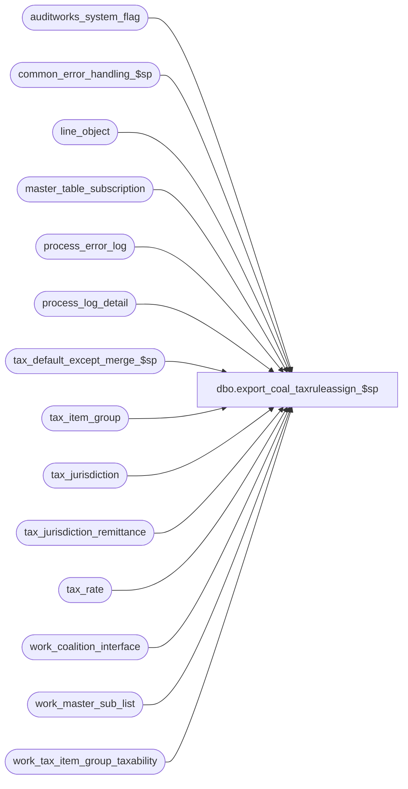

# dbo.export_coal_taxruleassign_$sp

**Database:** auditworks  
**Server:** bedrockdb01  

## Architecture Diagram



## Table Dependencies

| Referenced Table |
|---|
| auditworks_system_flag |
| common_error_handling_$sp |
| line_object |
| master_table_subscription |
| process_error_log |
| process_log_detail |
| tax_default_except_merge_$sp |
| tax_item_group |
| tax_jurisdiction |
| tax_jurisdiction_remittance |
| tax_rate |
| work_coalition_interface |
| work_master_sub_list |
| work_tax_item_group_taxability |

## Stored Procedure Code

```sql
create proc dbo.export_coal_taxruleassign_$sp (@interface_id	tinyint,
 @process_no 	smallint,
 @task_server	nvarchar(255),
 @runtime_datetime	datetime,
 @export_status	tinyint,
 @new_release	tinyint,
 @task_no	int OUTPUT,
 @errmsg 	nvarchar(255) OUTPUT
)
AS

DECLARE
@block_type			smallint,
@data_header			nvarchar(255),
@errno				int,
@process_log_entry 		bit,
@record_sequence		int,
@table_name			nvarchar(30),
@table_key			nvarchar(255),
@task_module			nvarchar(255),
@task_header			nvarchar(255),
@task_operation 		nvarchar(255),
@export_module_name		nvarchar(255),
@message_id		        int,	
@min_date			smalldatetime,
@object_name			nvarchar(255),
@operation_name			nvarchar(100),
@process_name		        nvarchar(100),
@process_id			int,
@cursor_open			tinyint,
@tax_jurisdiction               nchar(5),
@tax_level			tinyint,
@tax_rate_code			tinyint,
@min_tax_item_group_id          numeric(6,0),  --@min_tax_item_group_id should be numeric(10,0) not numeric(6,0) but ITEM dcn only accepts 6
@action				tinyint,
@posting_datetime		datetime,
@rows				int,
@effective_from_date		smalldatetime,
@start_pos			tinyint,
@end_pos			tinyint,
@delete_task_no			int,
@length				smallint,
@tax_item_group_id 		numeric(10,0),
@line_object			smallint,
@today				datetime,
@earliest_expiry_date   	datetime 


/*  Proc Name: export_coal_taxruleassign_$sp
   Desc: Coalition Tax Exports.
     Called by coalition_interface_main_$sp.
     
HISTORY:
Date     Name           Def# Desc
Mar17,14 Phu        1-4CDP8E Fix partial export that has result in the wrong order.
Feb10,14 Vicci        149810 No change actually required since inactive jurisdictions already excluded from work_tax_item_group_taxability,
                             but active_flag check added for clarity.
Feb26,13 Vicci        142088 To avoid deadlocks, lock a shared flag prior to work_master_sub_list deletions.
Feb22,13 Vicci        142020 Do not hold a lock on the work_master_sub_list table while reading it in a cursor, since this causes the 
                             audit_trail_header_$trI work_master_sub_list cleanup of prior configuration changes for the table/key upon 
                             additional change to the same table/key to die as victim of a deadlock.
Feb13,13 Vicci        141812 In the case where taxability by item-groups exceptions have been deleted from one jurisdiction
                             but the item-group is still referenced by other jurisdictions, the item group was being left behind
                             in #taxruleassign_tm which, once its use for determining which current TM entries require export was complete,
                             served as a driver table for exporting unused item-group cleanups.  Logic corrected to avoid export deletes
                             of the tax item group exception from all jurisdictions when it was only deleted from one.  Note this is just a
                             safety precaution since ALL tax-item-groups would normally have a rate (they are given a default if there isn't
                             any exception for them).  Also, add process completion to log.
Apr07,11 Vicci        126078 Take master_table_subscription active flag into account.
Jun12,09 Vicci      1-3ZQZ3F In the case of a full export, since only unexpired rule assignments are downloaded anyways,
                             download them with an effective date of today to minimize number of download files.
Feb20,09 Vicci         86072 Take into account parameter for whether or not to export expired information.
Jul11,06 Maryam        69746 Add process_id = @process_id to where claus. Change @length to @length - @start_pos.
                             Fix the error message. 
Mar13,06 Vicci	       68918 handle non-contiguous taxability by item group entries;
			     include newly created item-groups in ruleassign export;
			     allow export of future effective dates even though their 
			     subsequent deletion/modification wouldn't work;  
			     support more than 1 tax-item-group drawing its defaults 
			     from the same line-object;  since Coalition does not have a 
			     concept of effective-date for tax-rule-assignments (other than
			     future run-times) do not send rule-assignment deletions unless
			     no rule remains assigned to the tax-item-group/jur/level.
Mar11,04 Daphna        25374 increment counter inside cursor loop to prevent multiple insert error
Nov12,02 Winnie         5124 update export_status to 0 if no data in work_coalition_interface
Oct21,02 Winnie	     1-G3UJD Only check integrity when export_format = 1
Aug06,02 Winnie      1-DZ2SY To support export_status = 1 (for coalition update/delete)
Jun06,02 Winnie      1-DFWDF Only insert to work_coalition_interface when min_date is not null.
May02,02 Winnie	     1-CFFPT To standardize the coalition for Tax export.

*/


SELECT @process_name = 'export_coal_taxruleassign_$sp',
       @process_id = @@spid,
       @message_id = 201068,
       @task_module = 'Module=TaxRuleAssign',
       @export_module_name = 'TaxRuleAssign',
       @cursor_open = 0,
       @min_date = NULL,
       @today = convert(datetime, convert(nvarchar, getdate(), 101))

CREATE TABLE #taxruleassign_tm(
        tax_item_group_id numeric(10,0) not null, 
        tax_jurisdiction nchar(5) not null, 
        tax_level tinyint not null)           
SELECT @errno = @@error
IF @errno != 0
BEGIN
  SELECT @errmsg = 'Failed to create temp table to receive list of table maintenance changes to tax-item-group taxability',
         @object_name = '#taxruleassign_tm',
         @operation_name = 'CREATE'
  GOTO error
END

CREATE TABLE #retired_tax_item_group(
	tax_item_group_id  numeric(10,0) not null, 
        tax_jurisdiction nchar(5) not null, 
        tax_level tinyint not null)
SELECT @errno = @@error
IF @errno != 0
BEGIN
  SELECT @errmsg = 'Failed to create temp table to receive list of modified tax-item-groups no longer referenced by jurisdiction/level',
         @object_name = '#retired_tax_item_group',
         @operation_name = 'CREATE'
  GOTO error
END

/*  create table to be used by tax_default_except_merge_$sp */
CREATE TABLE #tax_item_group(
	tax_item_group_id	      numeric(10,0) not null, 
	line_object		      smallint null, 
	exception_flag		      tinyint not null)
SELECT @errno = @@error
IF @errno != 0
BEGIN
  SELECT @errmsg = 'Failed to create temp table to receive list of tax-item-group and whether or not they are associated with exceptions',
         @object_name = '#tax_item_group',
         @operation_name = 'CREATE'
  GOTO error
END

EXEC tax_default_except_merge_$sp @errmsg OUTPUT, 0, @process_id
SELECT @errno = @@error
IF @errno != 0
BEGIN
  IF @errmsg IS NULL /* then */
    SELECT @errmsg = 'Failed to determine taxability of tax-item-groups'
  SELECT @object_name = 'tax_default_except_merge_$sp',
         @operation_name = 'EXECUTE'
  GOTO error
END

IF @export_status = 2 -- full download
BEGIN
  SELECT @block_type = 2, -- Task
         @task_no = @task_no + 1
  SELECT @task_header = '[Task.' + CONVERT(nvarchar, @task_no) + ']',
         @task_operation = 'Operation=DeleteAll',
         @record_sequence = 0
   
  SELECT @min_date = MIN(t.effective_from_date) 
    FROM work_tax_item_group_taxability t
   WHERE process_id = @process_id
     AND (effective_until_date >= @today 
          OR effective_until_date IS NULL)
  SELECT @errno = @@error
  IF @errno <> 0
  BEGIN
    SELECT @errmsg = 'Failed to select min_date from work_tax_item_group_taxability for TaxRuleAssign',
           @object_name = 'work_tax_item_group_taxability',
           @operation_name = 'SELECT'      
    GOTO error
  END             
    
  IF @min_date IS NULL
    SELECT @min_date = '01/01/1970'
    
  -- Build the deletion task
  INSERT work_coalition_interface
         (runtime_datetime, record_content, block_type,
      task_no, record_sequence_no, export_module_name)
  VALUES (@min_date, @task_header, @block_type, 
         @task_no, @record_sequence, @export_module_name)
  SELECT @errno = @@error
  IF @errno <> 0
  BEGIN
    SELECT @errmsg = 'Failed to insert into work_coalition_interface with task header for TaxRuleAssign DeleteAll',
           @object_name = 'work_coalition_interface',
           @operation_name = 'INSERT'   
    GOTO error
  END             
                        
  SELECT @record_sequence = @record_sequence + 1
  
  INSERT work_coalition_interface
         (runtime_datetime, record_content, block_type,
         task_no, record_sequence_no, export_module_name)
  VALUES (@min_date, @task_server, @block_type, 
         @task_no, @record_sequence, @export_module_name)
  SELECT @errno = @@error
  IF @errno <> 0
  BEGIN
    SELECT @errmsg = 'Failed to insert into work_coalition_interface with task_server for TaxRuleAssign DeleteAll',
           @object_name = 'work_coalition_interface',
           @operation_name = 'INSERT'      
    GOTO error
  END             
                       
  SELECT @record_sequence = @record_sequence + 1

  INSERT work_coalition_interface
         (runtime_datetime,record_content, block_type, 
         task_no, record_sequence_no, export_module_name)
  VALUES (@min_date, @task_module, @block_type,
         @task_no, @record_sequence, @export_module_name)
  SELECT @errno = @@error
  IF @errno <> 0
  BEGIN
    SELECT @errmsg = 'Failed to insert into work_coalition_interface with task_module for TaxRuleAssign DeleteAll',
           @object_name = 'work_coalition_interface',
           @operation_name = 'INSERT'      
    GOTO error
  END             
                       
  SELECT @record_sequence = @record_sequence + 1
  
  INSERT work_coalition_interface
         (runtime_datetime, record_content, block_type,
         task_no, record_sequence_no, export_module_name)
  VALUES (@min_date, @task_operation, @block_type,
         @task_no, @record_sequence, @export_module_name)
  SELECT @errno = @@error
  IF @errno <> 0
  BEGIN
    SELECT @errmsg = 'Failed to insert into work_coalition_interface with task_operation for TaxRuleAssign DeleteAll',
           @object_name = 'work_coalition_interface',
           @operation_name = 'INSERT'      
    GOTO error
  END             

  SELECT @data_header = '[Data.' + CONVERT(nvarchar, @task_no) + ']',
         @record_sequence = 0,
         @block_type = 3 -- Data

  INSERT work_coalition_interface(
         runtime_datetime, record_content, block_type,
         task_no, record_sequence_no, export_module_name)
  VALUES (@min_date, @data_header, @block_type,
         @task_no, @record_sequence, @export_module_name)
  SELECT @errno = @@error
  IF @errno <> 0
  BEGIN
    SELECT @errmsg = 'Failed to insert into work_coalition_interface with data_header for TaxRuleAssign DeleteAll',
           @object_name = 'work_coalition_interface',
           @operation_name = 'INSERT'      
    GOTO error
  END             

  SELECT @record_sequence = @record_sequence + 1

  INSERT work_coalition_interface(
         runtime_datetime, record_content, block_type,
         task_no, record_sequence_no, export_module_name)
  VALUES (@min_date, 'AllTaxRuleAssigns', @block_type,
         @task_no, @record_sequence, @export_module_name)  
  SELECT @errno = @@error
  IF @errno <> 0
  BEGIN
    SELECT @errmsg = 'Failed to insert into work_coalition_interface for TaxRuleAssign DeleteAll',
           @object_name = 'work_coalition_interface',
           @operation_name = 'INSERT'                      
    GOTO error
  END
END --IF @export_status = 2
ELSE
BEGIN
  DECLARE taxruleassign_crsr CURSOR FAST_FORWARD
      FOR
   SELECT table_name, 
           table_key
     FROM work_master_sub_list
    WHERE interface_id = @interface_id
      AND (   table_name = 'taxability_by_item_group' 
           OR table_name = 'tax_default'
           OR table_name = 'tax_item_group.line_object'
           OR table_name = 'line_object.tax_item_group_id')
      AND posting_datetime <= @runtime_datetime
    ORDER BY table_name, entry_id ASC

  SELECT @errno = @@error
  IF @errno <> 0
  BEGIN
    SELECT @errmsg = 'Unable to declare cursor taxruleassign_crsr',
           @object_name = 'taxruleassign_crsr',
           @operation_name = 'DECLARE'  
    GOTO error
  END

  OPEN taxruleassign_crsr
  SELECT @errno = @@error
  IF @errno <> 0
  BEGIN
    SELECT @errmsg = 'Unable to open cursor taxruleassign_crsr',
           @object_name = 'taxruleassign_crsr',
           @operation_name = 'OPEN'      
    GOTO error
  END

  SELECT @cursor_open = 2

  WHILE 1 = 1
  BEGIN
    FETCH taxruleassign_crsr
     INTO @table_name,
          @table_key

    IF @@fetch_status <> 0
      BREAK

    SELECT @length = LEN(@table_key),
           @start_pos = 1,
           @rows = 0,
           @delete_task_no = @task_no + 1,  
           @task_no = @task_no + 2   
                
    IF @table_name = 'taxability_by_item_group'
    BEGIN
      SELECT @end_pos = CHARINDEX('/',@table_key)
      SELECT @tax_jurisdiction = SUBSTRING(@table_key, 1, @end_pos -1 ),
             @start_pos = @end_pos + 1
      SELECT @end_pos = CHARINDEX('/', SUBSTRING(@table_key, @start_pos, @length - @start_pos))
      SELECT @tax_item_group_id = CONVERT(NUMERIC(10,0), SUBSTRING(@table_key,@start_pos, @end_pos -1)),
             @start_pos = @start_pos + @end_pos 
      SELECT @end_pos = CHARINDEX('/', SUBSTRING(@table_key, @start_pos, @length - @start_pos))
      SELECT @tax_level = CONVERT(tinyint, SUBSTRING(@table_key,@start_pos, @end_pos -1)),
             @start_pos = @start_pos + @end_pos 

      INSERT INTO #taxruleassign_tm(tax_item_group_id, tax_jurisdiction, tax_level)
      VALUES (@tax_item_group_id, @tax_jurisdiction, @tax_level)
    END  --IF @table_name = 'taxability_by_item_group'
    ELSE
    BEGIN
      IF @table_name = 'tax_default'
      BEGIN
        SELECT @end_pos = CHARINDEX('/',@table_key)
        SELECT @tax_jurisdiction = SUBSTRING(@table_key, 1, @end_pos -1 ),
               @start_pos = @end_pos + 1
        SELECT @end_pos = CHARINDEX('/', SUBSTRING(@table_key, @start_pos, @length - @start_pos))
        SELECT @line_object = CONVERT(SMALLINT, SUBSTRING(@table_key,@start_pos, @end_pos -1)),
               @start_pos = @start_pos + @end_pos 
        SELECT @end_pos = CHARINDEX('/', SUBSTRING(@table_key, @start_pos, @length - @start_pos))
        SELECT @tax_level = CONVERT(TINYINT, SUBSTRING(@table_key,@start_pos, @end_pos -1)),
               @start_pos = @start_pos + @end_pos 

        INSERT INTO #taxruleassign_tm(tax_item_group_id, tax_jurisdiction, tax_level)
        SELECT t.tax_item_group_id, @tax_jurisdiction, @tax_level
          FROM tax_item_group t
         WHERE t.line_object = @line_object
        SELECT @errno = @@error
        IF @errno <> 0
        BEGIN
          SELECT @errmsg = 'Unable to fix list of tax-item-groups affected by tax-default change for line-object',
                 @object_name = '#taxruleassign_tm',
                 @operation_name = 'INSERT'      
          GOTO error
        END
           
        INSERT INTO #taxruleassign_tm(tax_item_group_id, tax_jurisdiction, tax_level)
        SELECT o.tax_item_group_id, @tax_jurisdiction, @tax_level
          FROM line_object o
         WHERE o.line_object = @line_object
           AND o.tax_item_group_id IS NOT NULL         
        SELECT @errno = @@error
        IF @errno <> 0
        BEGIN
          SELECT @errmsg = 'Unable to list tax-item-group affected by tax-default change for line-object',
                 @object_name = '#taxruleassign_tm',
                 @operation_name = 'INSERT'      
          GOTO error
        END

      END -- IF @table_name = 'tax_default'
      ELSE
      BEGIN
        INSERT INTO #taxruleassign_tm(tax_item_group_id, tax_jurisdiction, tax_level)
        VALUES (convert(numeric(10,0), @table_key), 'ALL', 0)
                SELECT @errno = @@error
        IF @errno <> 0
        BEGIN
          SELECT @errmsg = 'Unable to list tax-item-group newly created with default line-object specified or newly referenced in line-object',
                 @object_name = '#taxruleassign_tm',
                 @operation_name = 'INSERT'      
          GOTO error
        END
      END --Else of IF @table_name = 'tax_default'
    END --ELSE of IF @table_name = 'taxability_by_item_group'      
  END -- WHILE 1 = 1

  CLOSE taxruleassign_crsr
  SELECT @errno = @@error
  IF @errno <> 0
  BEGIN
    SELECT @errmsg = 'Unable to close cursor taxruleassign_crsr',
     @object_name = 'taxruleassign_crsr',
           @operation_name = 'CLOSE'      
    GOTO error
  END

  DEALLOCATE taxruleassign_crsr
 
  SELECT @cursor_open = 0    
    
  --141812:  The DELETE #taxruleassign_tm and its subsequent use a a driver for exporting taxability by item group deletions
  --         had to be changed to be an insert into a #retired_tax_item_group table instead 
  --         and relocated above the work_tax_item_group_taxability deletion, otherwise item-groups that are
  --         no longer referenced by any of the modified jurisdictions but still referenced by other jurisdictions
  --         were left in #taxruleassign_tm, which resulted in the export thinking the item-group is unused
  --         and exporting a delete for it from ALL jurisdictions.
  INSERT #retired_tax_item_group(tax_item_group_id, tax_level, tax_jurisdiction)  
  SELECT DISTINCT t.tax_item_group_id, COALESCE(r.tax_level, t.tax_level), COALESCE(r.tax_jurisdiction, t.tax_jurisdiction)
    FROM #taxruleassign_tm t
         LEFT OUTER JOIN tax_jurisdiction_remittance r  --note:  join absent on purpose
           ON t.tax_jurisdiction = 'ALL'
          AND t.tax_level = 0
         LEFT OUTER JOIN work_tax_item_group_taxability w
           ON w.process_id = @process_id
          AND COALESCE(r.tax_jurisdiction, t.tax_jurisdiction) = w.tax_jurisdiction
          AND COALESCE(r.tax_level, t.tax_level) = w.tax_level
          AND t.tax_item_group_id = w.tax_item_group_id
   WHERE w.tax_item_group_id IS NULL
  SELECT @errno = @@error, @rows = @@rowcount
  IF @errno <> 0
  BEGIN
    SELECT @errmsg = 'Unable to build list of item-groups which were modified and which no-longer have have tax-rule assignments',
           @object_name = '#retired_tax_item_group',
           @operation_name = 'INSERT'      
  GOTO error
  END

  DELETE work_tax_item_group_taxability
   WHERE process_id = @process_id
     AND tax_item_group_id NOT IN (SELECT tax_item_group_id
         			     FROM #taxruleassign_tm
         			    WHERE tax_jurisdiction = 'ALL')
     AND convert(nvarchar, tax_item_group_id) + ',' + tax_jurisdiction + ',' + convert(nvarchar, tax_level)
         NOT IN (SELECT convert(nvarchar, tax_item_group_id) + ',' + tax_jurisdiction + ',' + convert(nvarchar, tax_level)
                     FROM #taxruleassign_tm)
  SELECT @errno = @@error
  IF @errno <> 0
  BEGIN
    SELECT @errmsg = 'Unable to remove work_tax_item_group_taxability entries for item-groups which were not modified',
           @object_name = 'work_tax_item_group_taxability',
           @operation_name = 'DELETE'      
    GOTO error
  END

  IF @rows > 0 --#retired_tax_item_group exist
  BEGIN
    SELECT @block_type = 2, -- Task
           @task_header = '[Task.' + CONVERT(nvarchar, @delete_task_no) + ']',
           @task_operation = 'Operation=Delete',
           @record_sequence = 0, 
           @rows = 0

    SELECT @effective_from_date = min(t.effective_from_date)
      FROM work_tax_item_group_taxability t 
     WHERE process_id = @process_id
        
    IF @effective_from_date IS NULL
      SELECT @effective_from_date = '01/01/1970'

    INSERT work_coalition_interface(
           runtime_datetime, record_content, block_type,
           task_no, record_sequence_no, export_module_name)
    VALUES (@effective_from_date, @task_header, @block_type, 
            @delete_task_no, @record_sequence, @export_module_name)
    SELECT @errno = @@error
    IF @errno <> 0
    BEGIN
      SELECT @errmsg = 'Failed to insert into work_coalition_interface with task header for TaxRuleAssign Delete',
             @object_name = 'work_coalition_interface',
             @operation_name = 'INSERT'      
      GOTO error
    END             
                        
    SELECT @record_sequence = @record_sequence + 1
  
    INSERT work_coalition_interface(
           runtime_datetime, record_content, block_type,
           task_no, record_sequence_no, export_module_name)
    VALUES (@effective_from_date, @task_server, @block_type, 
            @delete_task_no, @record_sequence, @export_module_name)
    SELECT @errno = @@error
    IF @errno <> 0 
    BEGIN
      SELECT @errmsg = 'Failed to insert into work_coalition_interface with task_server for TaxRuleAssign Delete',
             @object_name = 'work_coalition_interface',
             @operation_name = 'INSERT'      
      GOTO error
    END             
                         
    SELECT @record_sequence = @record_sequence + 1

    INSERT work_coalition_interface(
           runtime_datetime,record_content, block_type, 
           task_no, record_sequence_no, export_module_name)
    VALUES (@effective_from_date, @task_module, @block_type,
           @delete_task_no, @record_sequence, @export_module_name)
    SELECT @errno = @@error
    IF @errno <> 0 
    BEGIN
      SELECT @errmsg = 'Failed to insert into work_coalition_interface with task_module for TaxRuleAssign Delete',
             @object_name = 'work_coalition_interface',
             @operation_name = 'INSERT'      
      GOTO error
    END             
                       
    SELECT @record_sequence = @record_sequence + 1
   
    INSERT work_coalition_interface(
           runtime_datetime, record_content, block_type,
           task_no, record_sequence_no, export_module_name)
    VALUES (@effective_from_date, @task_operation, @block_type,
           @delete_task_no, @record_sequence, @export_module_name)
    SELECT @errno = @@error
    IF @errno <> 0 
    BEGIN
      SELECT @errmsg = 'Failed to insert into work_coalition_interface with task_operation for TaxRuleAssign Delete',
             @object_name = 'work_coalition_interface',
             @operation_name = 'INSERT'      
      GOTO error
    END             

    SELECT @data_header = '[Data.' + CONVERT(nvarchar, @delete_task_no) + ']',
           @record_sequence = 0,
           @block_type = 3 -- Data
             
    INSERT work_coalition_interface(
           runtime_datetime, record_content, block_type,
           task_no, record_sequence_no, export_module_name)
    VALUES (@effective_from_date, @data_header, @block_type,
           @delete_task_no, @record_sequence, @export_module_name)
    SELECT @errno = @@error
    IF @errno <> 0 
    BEGIN
      SELECT @errmsg = 'Failed to insert into work_coalition_interface with data_header for TaxRuleAssign Delete',
             @object_name = 'work_coalition_interface',
    @operation_name = 'INSERT'      
      GOTO error
    END             
    
    SELECT @record_sequence = @record_sequence + 1
    /* Delete off all Jur/level rate assignments that may ever have existed for the tax item group for which no assignments
       currently remain. */
    INSERT work_coalition_interface(
           runtime_datetime, record_content, block_type,
           task_no, record_sequence_no, export_module_name)
    SELECT DISTINCT @effective_from_date, @export_module_name + ','+ 
           CONVERT(nvarchar, t.tax_item_group_id) + ',' + CONVERT(nvarchar, t.tax_level)
           + ',' + CONVERT(nvarchar(9), j.tax_jurisdiction_id), @block_type,
           @delete_task_no, @record_sequence, @export_module_name
      FROM #retired_tax_item_group t
           INNER JOIN tax_jurisdiction j  
              ON t.tax_jurisdiction = j.tax_jurisdiction
    SELECT @errno = @@error
    IF @errno <> 0 
    BEGIN
      SELECT @errmsg = 'Failed to insert into work_coalition_interface for TaxRuleAssign Delete',
             @object_name = 'work_coalition_interface',
             @operation_name = 'INSERT'                      
      GOTO error
    END
  END --IF there are tax-item-groups who no longer have any rule-assignments
END --ELSE of IF @export_status = 2

IF @new_release = 0
BEGIN
  DECLARE taxability_rule_assign_crsr CURSOR 
      FOR
   SELECT tax_jurisdiction, 
          tax_level,
          tax_rate_code,
          MIN(tax_item_group_id) 
     FROM work_tax_item_group_taxability 
    WHERE process_id = @process_id
      AND tax_rate_code <> 0
      AND (effective_until_date >= @today 
           OR effective_until_date IS NULL)
    GROUP BY tax_jurisdiction, tax_level, tax_rate_code
   HAVING MIN(tax_item_group_id) <> MAX(tax_item_group_id)
  SELECT @errno = @@error
  IF @errno <> 0
  BEGIN
    SELECT @errmsg = 'Unable to declare cursor taxability_rule_assign_crsr',  
           @object_name = 'taxability_rule_assign_crsr',  
           @operation_name = 'DECLARE'      
      GOTO error
  END

  OPEN taxability_rule_assign_crsr
  SELECT @errno = @@error
  IF @errno <> 0
  BEGIN
    SELECT @errmsg = 'Unable to open cursor taxability_rule_assign_crsr',
           @object_name = 'taxability_rule_assign_crsr',
           @operation_name = 'OPEN'      
    GOTO error
  END

  SELECT  @cursor_open = 1

  WHILE 1 = 1
  BEGIN
    FETCH taxability_rule_assign_crsr
     INTO @tax_jurisdiction,
          @tax_level,
          @tax_rate_code,
          @min_tax_item_group_id

    IF @@fetch_status <> 0
      BREAK

    INSERT process_error_log (
           process_no,
           error_code,
           error_timestamp,
           process_id,
	   verified,
 	   error_msg,
 	   message_id)
    VALUES (@process_no,
    	   0,
	   getdate(),
	   @@spid,
	   0,
	   'Tax jurisdiction/tax level/ tax_rate_code ' + @tax_jurisdiction + '/' + 
 	   CONVERT(nvarchar,@tax_level) + '/' + CONVERT(nvarchar,@tax_rate_code)
	   + ' has assigned to more than 1 tax_item_group for coalition',
	   0)
    SELECT @errno = @@error
    IF @errno <> 0
    BEGIN
      SELECT @errmsg = 'Unable to insert into process_error_log',
             @object_name = 'process_error_log',
             @operation_name = 'INSERT'      
        GOTO error
    END

    DELETE work_tax_item_group_taxability
     WHERE process_id = @process_id
       AND tax_jurisdiction = @tax_jurisdiction
       AND tax_level = @tax_level
       AND tax_rate_code = @tax_rate_code
       AND tax_item_group_id <> @min_tax_item_group_id
       AND tax_rate_code <> 0          
    SELECT @errno = @@error
    IF @errno <> 0
    BEGIN
      SELECT @errmsg = 'Unable to delete from work_tax_item_group_taxability',
             @object_name = 'work_tax_item_group_taxability',
             @operation_name = 'DELETE'      
        GOTO error
    END

  END -- While 1 = 1
  
  CLOSE taxability_rule_assign_crsr
  SELECT @errno = @@error
  IF @errno <> 0
  BEGIN
  SELECT @errmsg = 'Unable to close cursor taxability_rule_assign_crsr',
           @object_name = 'taxability_rule_assign_crsr',
           @operation_name = 'close'      
    GOTO error
  END

  DEALLOCATE taxability_rule_assign_crsr
  
  SELECT @cursor_open = 0
END -- IF @new_release = 0

DELETE work_tax_item_group_taxability
 WHERE process_id = @process_id
   AND effective_until_date < @today 
SELECT @errno = @@error
IF @errno <> 0
BEGIN
  SELECT @errmsg = 'Unable to remove expired entries from tax item group taxability list',
         @object_name = 'work_tax_item_group_taxability',
         @operation_name = 'DELETE'      
  GOTO error
END


/* To avoid tax-rule assignments being downloaded prior to zones and zone-auth-relationship */
UPDATE work_tax_item_group_taxability
   SET effective_from_date = @runtime_datetime
 WHERE process_id = @process_id
   AND effective_from_date < @runtime_datetime
SELECT @errno = @@error
IF @errno <> 0
BEGIN
  SELECT @errmsg = 'Unable to set the effective_from_date.',
         @object_name = 'work_tax_item_group_taxability',
         @operation_name = 'UPDATE'      
  GOTO error
END

--Build Reinsertion Task
IF EXISTS (SELECT 1 
             FROM work_tax_item_group_taxability
            WHERE process_id = @process_id)
BEGIN
  SELECT @block_type = 2, 
         @task_no = @task_no + 1
  SELECT @task_header = '[Task.' + CONVERT(nvarchar, @task_no) + ']',
         @task_operation = 'Operation=AddUpdate',
         @record_sequence = 0

  INSERT work_coalition_interface(
      runtime_datetime, record_content, block_type,
         task_no, record_sequence_no, export_module_name)
  SELECT DISTINCT effective_from_date, @task_header, @block_type,
         @task_no, @record_sequence, @export_module_name
    FROM work_tax_item_group_taxability
   WHERE process_id = @process_id
  SELECT @errno = @@error
  IF @errno <> 0
  BEGIN
    SELECT @errmsg = 'Failed to insert into work_coalition_interface with task_header for TaxRuleAssign AddUpdate',
           @object_name = 'work_coalition_interface',
           @operation_name = 'INSERT'                      
    GOTO error
  END             
                       
  SELECT @record_sequence = @record_sequence + 1      

  INSERT work_coalition_interface(
         runtime_datetime, record_content, block_type,
         task_no, record_sequence_no, export_module_name)
  SELECT DISTINCT effective_from_date, @task_server, @block_type,
         @task_no, @record_sequence, @export_module_name
    FROM work_tax_item_group_taxability
   WHERE process_id = @process_id
  SELECT @errno = @@error
  IF @errno <> 0
  BEGIN
    SELECT @errmsg = 'Failed to insert into work_coalition_interface with task_server for TaxRuleAssign AddUpdate',
           @object_name = 'work_coalition_interface',
           @operation_name = 'INSERT'                      
    GOTO error
  END             
                       
  SELECT @record_sequence = @record_sequence + 1

  INSERT work_coalition_interface(
         runtime_datetime, record_content, block_type,
         task_no, record_sequence_no, export_module_name)
  SELECT DISTINCT effective_from_date, @task_module, @block_type,
         @task_no, @record_sequence, @export_module_name
    FROM work_tax_item_group_taxability
   WHERE process_id = @process_id
  SELECT @errno = @@error
  IF @errno <> 0
  BEGIN
    SELECT @errmsg = 'Failed to insert into work_coalition_interface with task_module for TaxRuleAssign AddUpdate',
           @object_name = 'work_coalition_interface',
           @operation_name = 'INSERT'                      
    GOTO error
  END             
                       
  SELECT @record_sequence = @record_sequence + 1

  INSERT work_coalition_interface(
         runtime_datetime, record_content, block_type,
      task_no, record_sequence_no, export_module_name)
  SELECT DISTINCT effective_from_date, @task_operation, @block_type,
         @task_no, @record_sequence, @export_module_name
    FROM work_tax_item_group_taxability
   WHERE process_id = @process_id
  SELECT @errno = @@error
  IF @errno <> 0
  BEGIN
    SELECT @errmsg = 'Failed to insert into work_coalition_interface with task_operation for TaxRuleAssign AddUpdate',
           @object_name = 'work_coalition_interface',
           @operation_name = 'INSERT'                        
    GOTO error
  END             
  
  -- Build the reinsertion data
  SELECT @data_header = '[Data.' + CONVERT(nvarchar, @task_no) + ']',
         @record_sequence = 0,
      @block_type = 3 -- Data

  INSERT work_coalition_interface(
         runtime_datetime, record_content, block_type,
         task_no, record_sequence_no, export_module_name)
  SELECT DISTINCT effective_from_date, @data_header, @block_type,
         @task_no, @record_sequence, @export_module_name
    FROM work_tax_item_group_taxability
   WHERE process_id = @process_id
  SELECT @errno = @@error
  IF @errno <> 0
  BEGIN
    SELECT @errmsg = 'Failed to insert into work_coalition_interface with data_header for TaxRuleAssign AddUpdate',
           @object_name = 'work_coalition_interface',
           @operation_name = 'INSERT'                      
    GOTO error
    END   

  SELECT @record_sequence = @record_sequence + 1

  INSERT work_coalition_interface(
         runtime_datetime, 
         record_content, 
         block_type, 
         task_no, 
         record_sequence_no, 
         export_module_name )
  SELECT DISTINCT t.effective_from_date, 
         @export_module_name + ','+ CONVERT(nvarchar, t.tax_item_group_id) +
         ',' + CONVERT(nvarchar,t.tax_level) + ',' + CONVERT(nvarchar(9), j.tax_jurisdiction_id) + ',' + 
         CONVERT(nvarchar, (r.tax_rate_id)) + ',',
         @block_type, 
         @task_no, 
         @record_sequence, 
         @export_module_name
    FROM work_tax_item_group_taxability t, tax_jurisdiction j, tax_rate r
   WHERE t.process_id = @process_id
     AND t.tax_jurisdiction = j.tax_jurisdiction 
     AND t.tax_level = r.tax_level 
     AND t.tax_jurisdiction = r.tax_jurisdiction 
     AND t.tax_rate_code = r.tax_rate_code
     AND j.active_flag = 1
  SELECT @errno = @@error
  IF @errno <> 0
  BEGIN
    SELECT @errmsg = 'Failed to insert into work_coalition_interface from work_tax_item_group_taxability for TaxRuleAssign (1)',
           @object_name = 'work_coalition_interface',
           @operation_name = 'INSERT'                      
    GOTO error
  END              
      
  IF @new_release = 0 
  BEGIN
    INSERT work_coalition_interface(
           runtime_datetime, 
           record_content, 
           block_type, 
           task_no, 
           record_sequence_no, 
           export_module_name )
    SELECT DISTINCT t.effective_from_date, 
           @export_module_name + ','+ CONVERT(nvarchar, t.tax_item_group_id) +
           ',' + CONVERT(nvarchar,t.tax_level) + ',' + CONVERT(nvarchar(9), j.tax_jurisdiction_id) + ',' + 
           '0' + CONVERT(nvarchar, (t.tax_item_group_id * 10000 
           + j.tax_jurisdiction_id * 10 + t.tax_level)) + ',',
           @block_type, 
           @task_no, 
           @record_sequence, 
           @export_module_name
      FROM work_tax_item_group_taxability t, tax_jurisdiction j
     WHERE t.process_id = @process_id
       AND t.tax_jurisdiction = j.tax_jurisdiction 
       AND t.tax_rate_code = 0
       AND j.active_flag = 1
       
    SELECT @errno = @@error
    IF @errno <> 0
    BEGIN
      SELECT @errmsg = 'Failed to insert into work_coalition_interface for Non Taxable (1)',
             @object_name = 'work_coalition_interface',
             @operation_name = 'INSERT'                      
      GOTO error
    END              
  END --IF @new_release = 0 
  ELSE
  BEGIN
    INSERT work_coalition_interface(
     runtime_datetime, 
           record_content, 
           block_type, 
          task_no, 
           record_sequence_no, 
           export_module_name )
    SELECT DISTINCT t.effective_from_date, 
           @export_module_name + ','+ CONVERT(nvarchar, t.tax_item_group_id) +
           ',' + CONVERT(nvarchar,t.tax_level) + ',' + CONVERT(nvarchar(9), j.tax_jurisdiction_id) + ',' + 
           '0,',
           @block_type, 
           @task_no, 
           @record_sequence, 
           @export_module_name
      FROM work_tax_item_group_taxability t, tax_jurisdiction j
     WHERE t.process_id = @process_id
       AND t.tax_jurisdiction = j.tax_jurisdiction 
       AND tax_rate_code = 0
       AND j.active_flag = 1
   SELECT @errno = @@error
    IF @errno <> 0
    BEGIN
      SELECT @errmsg = 'Failed to insert into work_coalition_interface for Non Taxable (2)',
             @object_name = 'work_coalition_interface',
    @operation_name = 'INSERT'                      
        GOTO error
    END              
  END --ELSE of IF @new_release = 0 
          
  DELETE work_tax_item_group_taxability
   WHERE process_id = @process_id
  SELECT @errno = @@error
  IF @errno <> 0
  BEGIN
    SELECT @errmsg = 'Failed to clean table work_tax_item_group_taxability for TaxRuleAssign (1)' ,
           @object_name = 'work_tax_item_group_taxability',
           @operation_name = 'DELETE'      
      GOTO error
  END                 
END -- IF there are any work_tax_item_group_taxability entries to export

IF @export_status <> 2
BEGIN
  BEGIN TRANSACTION  --142088
  /* Prevent possible deadlocks when audit trail published change retraction deletion and this export 
     simultaneously attempt to clean up the same work_master_sublist rows, by updating a shared system flag. */ 
  UPDATE auditworks_system_flag
     SET flag_datetime_value = getdate()
   WHERE flag_name = 'work_master_sublist_access'
  SELECT @errno = @@error
  IF @errno != 0 
  BEGIN
    SELECT @errmsg = 'Set flag to force concurrent processes to run sequentially',
           @object_name = 'auditworks_system_flag',
           @operation_name = 'UPDATE'
    GOTO error
  END

  DELETE work_master_sub_list
   WHERE interface_id = @interface_id
     AND (table_name = 'taxability_by_item_group'
          OR table_name = 'tax_default'
          OR table_name = 'line_object.tax_item_group_id'
          OR table_name = 'tax_item_group.line_object')
     AND posting_datetime <= @runtime_datetime
  SELECT @errno = @@error
  IF @errno <> 0
  BEGIN
    SELECT @errmsg = 'Failed to delete from work_master_sub_list for TaxRuleAssign',
           @object_name = 'work_master_sub_list',
           @operation_name = 'DELETE'                      
    GOTO error
  END  
  COMMIT                  
END -- IF @export_status <> 2

IF NOT EXISTS (SELECT export_module_name
                 FROM work_coalition_interface
                WHERE export_module_name = @export_module_name)
BEGIN               
  UPDATE master_table_subscription
     SET export_status = 0
   WHERE export_module_name = @export_module_name 
     AND interface_id = @interface_id
     AND active_flag > 0
  SELECT @errno = @@error
  IF @errno <> 0
  BEGIN
    SELECT @errmsg = 'Unable to update master_table_subscription',
           @object_name = 'master_table_subscription',
           @operation_name = 'UPDATE'      
    GOTO error
  END
END

SELECT @rows = COUNT(1)
  FROM work_tax_item_group_taxability
 WHERE process_id = @process_id
SELECT @errno = @@error
IF @errno <> 0
BEGIN
  SELECT @errmsg = 'Failed to verify that work_tax_item_group_taxability is empty as it should be after export' ,
         @object_name = 'work_tax_item_group_taxability',
         @operation_name = 'SELECT'      
  GOTO error
END        
INSERT into process_log_detail(         
       process_no, 
       process_name, 
       process_info_type, 
       process_info_number) 
VALUES(209, 
       @process_name, 
       'Completed.  work_tax_item_group_taxability rows = ', 
       @rows)
SELECT @errno = @@error
IF @errno <> 0
BEGIN
  SELECT @errmsg = 'Unable to log process completion',
         @object_name = 'process_log_detail',
         @operation_name = 'INSERT'      
  GOTO error
END
      
RETURN 

error:   /* Common error handler */

	IF @cursor_open = 1
	  BEGIN
	   CLOSE taxability_rule_assign_crsr
	   DEALLOCATE taxability_rule_assign_crsr
	  END

       IF @cursor_open = 2
	  BEGIN
	   CLOSE taxruleassign_crsr
	   DEALLOCATE taxruleassign_crsr
	  END

	EXEC common_error_handling_$sp @process_no, @errno, @errmsg, 0, @message_id, 
  	    @process_name, @object_name, @operation_name, 1, 1, 
  	    @process_log_entry	  

	RETURN
```

