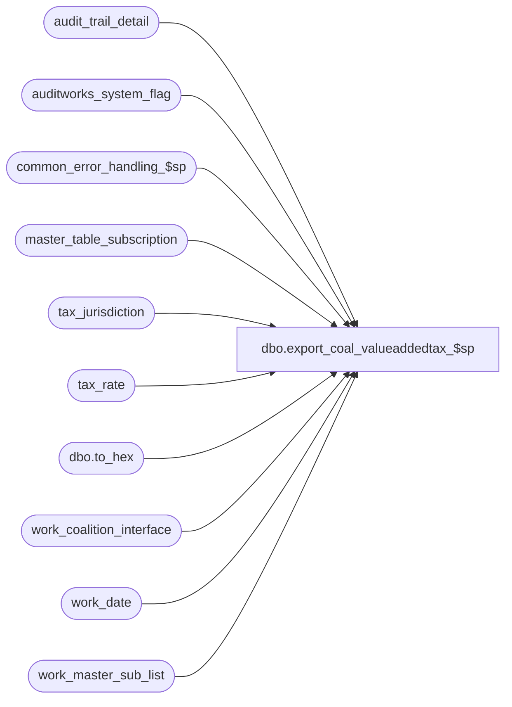

# dbo.export_coal_valueaddedtax_$sp

**Database:** auditworks  
**Server:** bedrockdb01  

## Architecture Diagram



## Table Dependencies

| Referenced Table |
|---|
| audit_trail_detail |
| auditworks_system_flag |
| common_error_handling_$sp |
| master_table_subscription |
| tax_jurisdiction |
| tax_rate |
| dbo.to_hex |
| work_coalition_interface |
| work_date |
| work_master_sub_list |

## Stored Procedure Code

```sql
create proc dbo.export_coal_valueaddedtax_$sp 
(@interface_id	tinyint,
 @process_no 	smallint,
 @task_server	nvarchar(255),
 @runtime_datetime	datetime,
 @export_status	tinyint,
 @task_no	int OUTPUT,
 @errmsg 	nvarchar(2000) OUTPUT,
 @tax_dcn_exp_hist int
)
AS

DECLARE
@block_type			smallint,
@cursor_open			tinyint,
@data_header			nvarchar(255),
@errno				int,
@length				smallint,
@process_log_entry 		tinyint,
@record_sequence		int,
@min_date			smalldatetime,
@table_name			nvarchar(30),
@table_key			nvarchar(255),
@task_module			nvarchar(255),
@task_header			nvarchar(255),
@task_operation 		nvarchar(255),
@export_module_name		nvarchar(255),
@message_id		        int,	
@object_name			nvarchar(255),
@operation_name			nvarchar(100),
@process_name		        nvarchar(100),
@action				tinyint,
@posting_datetime		datetime,
@rows				int,
@entry_id			numeric(12,0),
@tax_jurisdiction		nchar(5),
@tax_level			tinyint,
@tax_rate_code			tinyint,
@effective_from_date		datetime,
@start_pos			tinyint,
@end_pos			tinyint,
@tax_rate_id 			numeric(10,0),
@delete_task_no			int,
@today				datetime 


/*  Proc Name: export_coal_valueaddedtax_$sp
   Desc: Coalition Tax Exports.
     Called by coalition_interface_main_$sp.

HISTORY:
Date     Name           Def# Desc
Mar15,16 Vicci      DAOM-213 When exporting redundant informat for ValueAddedTax module convert the tax rate id to hex before logging it as a string
                             since STORE only supports 6 characters.  Although not sufficient, it allows tax rate ID of up to 16777215 to be exported
                             (as VAT CODE FFFFFF) which is better than the current max of 999999.
Mar17,14 Phu        1-4CDP8E Fix partial export that has result in the wrong order.
Feb10,14 Vicci        149810 Exclude inactive jurisdictions.
Feb26,13 Vicci        142088 To avoid deadlocks, lock a shared flag prior to work_master_sub_list deletions.
Feb22,13 Vicci        142020 Do not hold a lock on the work_master_sub_list table while reading it in a cursor, since this causes the 
                             audit_trail_header_$trI work_master_sub_list cleanup of prior configuration changes for the table/key upon 
                             additional change to the same table/key to die as victim of a deadlock.
Jul16,12 Paul         136951 use nolock hint on master_table_subscription to reduce deadlocking.
Apr07,11 Vicci        126078 Take master_table_subscription active flag into account.
Feb20,09 Vicci         86072 Take into account parameter for whether or not to export expired information.
Jan19,06 Vicci	       66166 Do not use the cursor variable @table_name when deleting from
			     work_master_sub_list since this delete is outside the cursor
			     and when nothing has been fetched it is not set.
Mar11,04 Daphna        25374 increment counter inside cursor loop to prevent multiple insert error
Jul17,03 Vicci   11567/11569 In the case of the full download only, include expired rates in the export
			     in order to avoid error whereby tax-rule-assign has earlier 
			     runtime than tax-rule.
Nov12,02 Winnie         5124 update export_status to 0 if no data in work_coalition_interface
Aug06,02 Winnie      1-DZ2SY To support export_status = 1 (for coalition update/delete)
Jun06,02 Winnie      1-DFWDF Only insert to work_coalition_interface when min_date is not null.
May02,02 Winnie	     1-CFFPT To standardize the coalition for Tax export.

*/


SELECT @process_name = 'export_coal_valueaddedtax_$sp',
       @message_id = 201068,
       @task_module = 'Module=ValueAddedTax' ,
       @export_module_name = 'ValueAddedTax',
       @min_date = NULL, -- 
       @today = convert(datetime, convert(nvarchar, getdate(), 101))

IF @export_status = 2
  BEGIN

    SELECT @block_type = 2, -- Task
           @task_no = @task_no + 1
    SELECT @task_header = '[Task.' + CONVERT(nvarchar, @task_no) + ']',
       @task_operation = 'Operation=DeleteAll',
           @record_sequence = 0

    SELECT @min_date = MIN (CASE WHEN @tax_dcn_exp_hist = 0 AND t.effective_from_date <= @today THEN '01/01/1970' ELSE t.effective_from_date END)
      FROM tax_rate t
           INNER JOIN tax_jurisdiction j
              ON t.tax_jurisdiction = j.tax_jurisdiction
             AND j.active_flag = 1 
     WHERE ISNULL(t.item_tax_strip_flag,0) > 0    
       AND (t.effective_until_date IS NULL 
            OR @tax_dcn_exp_hist = -1 
            OR t.effective_until_date >= dateadd(dd, -1 * @tax_dcn_exp_hist, @today))
    SELECT @errno = @@error
    IF @errno <> 0
      BEGIN
        SELECT @errmsg = 'Failed to select @min_date from tax_rate for ValueAddedTax DeleteAll',
               @object_name = 'tax_rate',
               @operation_name = 'SELECT'      
         GOTO error
      END             

    IF @min_date IS NOT NULL --   
      BEGIN
        -- Build the deletion task
        INSERT work_coalition_interface
               (runtime_datetime, record_content, block_type,
                task_no, record_sequence_no, export_module_name)
        VALUES  (@min_date, @task_header, @block_type,
                @task_no, @record_sequence, @export_module_name)

        SELECT @errno = @@error
        IF @errno <> 0
        BEGIN
          SELECT @errmsg = 'Failed to insert into work_coalition_interface with task header for ValueAddedTax DeleteAll',
                 @object_name = 'work_coalition_interface',
                 @operation_name = 'INSERT'      
           GOTO error
        END             
                       
        SELECT @record_sequence = @record_sequence + 1
   
        INSERT work_coalition_interface
               (runtime_datetime, record_content, block_type,
                task_no, record_sequence_no, export_module_name)
        VALUES (@min_date, @task_server, @block_type,
                @task_no, @record_sequence, @export_module_name)

         SELECT @errno = @@error
         IF @errno <> 0
           BEGIN
             SELECT @errmsg = 'Failed to insert into work_coalition_interface with task_server for ValueAddedTax DeleteAll',
                    @object_name = 'work_coalition_interface',
                    @operation_name = 'INSERT'      
             GOTO error
           END             
                        
        SELECT @record_sequence = @record_sequence + 1

        INSERT work_coalition_interface
               (runtime_datetime, record_content, block_type,
                task_no, record_sequence_no, export_module_name)
        VALUES (@min_date, @task_module, @block_type,
                @task_no, @record_sequence, @export_module_name)

         SELECT @errno = @@error
         IF @errno <> 0
           BEGIN
             SELECT @errmsg = 'Failed to insert into work_coalition_interface with task_module for ValueAddedTax DeleteAll',
                    @object_name = 'work_coalition_interface',
                    @operation_name = 'INSERT'      
               GOTO error
            END             
                       
        SELECT @record_sequence = @record_sequence + 1
  
        INSERT work_coalition_interface
               (runtime_datetime, record_content, block_type,
                task_no, record_sequence_no, export_module_name)
        VALUES (@min_date, @task_operation, @block_type,
                @task_no, @record_sequence, @export_module_name)

        SELECT @errno = @@error
        IF @errno <> 0
          BEGIN
            SELECT @errmsg = 'Failed to insert into work_coalition_interface with task_operation for ValueAddedTax DeleteAll',
                   @object_name = 'work_coalition_interface',
                   @operation_name = 'INSERT'      
            GOTO error
          END             

        SELECT @data_header = '[Data.' + CONVERT(nvarchar, @task_no) + ']',
   @record_sequence = 0,
               @block_type = 3 -- Data

        INSERT work_coalition_interface
               (runtime_datetime, record_content, block_type,
                task_no, record_sequence_no, export_module_name)
        VALUES (@min_date, @data_header, @block_type,
                @task_no, @record_sequence, @export_module_name)

         SELECT @errno = @@error
         IF @errno <> 0
           BEGIN
             SELECT @errmsg = 'Failed to insert into work_coalition_interface with data_header for ValueAddedTax DeleteAll',
                    @object_name = 'work_coalition_interface',
                    @operation_name = 'INSERT'      
             GOTO error
           END             

        SELECT @record_sequence = @record_sequence + 1

        INSERT work_coalition_interface
               (runtime_datetime, record_content, block_type,
                task_no, record_sequence_no, export_module_name)
        VALUES (@min_date, 'AllValueAddedTaxes', @block_type,
                @task_no, @record_sequence, @export_module_name)
             
        SELECT @errno = @@error
        IF @errno <> 0
          BEGIN
            SELECT @errmsg = 'Failed to insert into work_coalition_interface for ValueAddedTax DeleteAll',
                   @object_name = 'work_coalition_interface',
                   @operation_name = 'INSERT'      
           GOTO error
        END

        SELECT @block_type = 2, 
               @task_no = @task_no + 1
        SELECT @task_header = '[Task.' + CONVERT(nvarchar, @task_no) + ']',
               @task_operation = 'Operation=AddUpdate',
               @record_sequence = 0

        -- Build the reinsertion task

        TRUNCATE TABLE work_date
        SELECT @errno = @@error
        IF @errno <> 0
          BEGIN
            SELECT @errmsg = 'Failed to truncate work_date table for ValueAddedTax (1)',
                   @object_name = 'work_date',
                   @operation_name = 'TRUNCATE'      
           GOTO error
          END             

        INSERT work_date
               (effective_from_date)
        SELECT DISTINCT CASE WHEN @tax_dcn_exp_hist = 0 AND t.effective_from_date <= @today THEN '01/01/1970' ELSE t.effective_from_date END 
          FROM tax_rate t 
               INNER JOIN tax_jurisdiction j
                  ON t.tax_jurisdiction = j.tax_jurisdiction
                 AND j.active_flag = 1
         WHERE ISNULL(item_tax_strip_flag,0) > 0
           AND (t.effective_until_date IS NULL 
                OR @tax_dcn_exp_hist = -1 
                OR t.effective_until_date >= dateadd(dd, -1 * @tax_dcn_exp_hist, @today))
        SELECT @errno = @@error
        IF @errno <> 0
          BEGIN
            SELECT @errmsg = 'Failed to insert to work_date table for ValueAddedTax',
                   @object_name = 'work_date',
                   @operation_name = 'INSERT'      
            GOTO error
          END             

        INSERT work_coalition_interface
               (runtime_datetime, record_content, block_type,
                task_no, record_sequence_no, export_module_name)
        SELECT effective_from_date, @task_header, @block_type,
               @task_no, @record_sequence, @export_module_name
         FROM work_date 

        SELECT @errno = @@error
        IF @errno <> 0
          BEGIN
            SELECT @errmsg = 'Failed to insert into work_coalition_interface with task_header for ValueAddedTax AddUpdate',
                   @object_name = 'work_coalition_interface',
                   @operation_name = 'INSERT'      
            GOTO error
          END             
                       
        SELECT @record_sequence = @record_sequence + 1      

        INSERT work_coalition_interface
               (runtime_datetime, record_content, block_type,
                task_no, record_sequence_no, export_module_name)
        SELECT effective_from_date, @task_server, @block_type,
               @task_no, @record_sequence, @export_module_name
          FROM work_date 

        SELECT @errno = @@error
        IF @errno <> 0
          BEGIN
            SELECT @errmsg = 'Failed to insert into work_coalition_interface with task_server for ValueAddedTax AddUpdate',
                   @object_name = 'work_coalition_interface',
                   @operation_name = 'INSERT'      
             GOTO error
           END             
                
        SELECT @record_sequence = @record_sequence + 1

        INSERT work_coalition_interface
               (runtime_datetime, record_content, block_type,
                task_no, record_sequence_no, export_module_name)
        SELECT effective_from_date, @task_module, @block_type,
               @task_no, @record_sequence, @export_module_name
          FROM work_date 
      
        SELECT @errno = @@error
        IF @errno <> 0
          BEGIN
            SELECT @errmsg = 'Failed to insert into work_coalition_interface with task_module for ValueAddedTax AddUpdate',
                   @object_name = 'work_coalition_interface',
                   @operation_name = 'INSERT'      
            GOTO error
          END             
                       
        SELECT @record_sequence = @record_sequence + 1

        INSERT work_coalition_interface
               (runtime_datetime, record_content, block_type,
                task_no, record_sequence_no, export_module_name)
        SELECT effective_from_date, @task_operation, @block_type,
               @task_no, @record_sequence, @export_module_name                               
          FROM work_date 
      
        SELECT @errno = @@error
        IF @errno <> 0
          BEGIN
            SELECT @errmsg = 'Failed to insert into work_coalition_interface with task_operation for ValueAddedTax AddUpdate',
                   @object_name = 'work_coalition_interface',
                   @operation_name = 'INSERT'      
            GOTO error
          END             
  
        -- Build the reinsertion data
        SELECT @data_header = '[Data.' + CONVERT(nvarchar, @task_no) + ']',
               @record_sequence = 0,
               @block_type = 3 -- Data

        INSERT work_coalition_interface(
               runtime_datetime, record_content, block_type,
               task_no, record_sequence_no, export_module_name)
        SELECT effective_from_date, @data_header, @block_type,
               @task_no, @record_sequence, @export_module_name               
          FROM work_date       
        SELECT @errno = @@error
          IF @errno <> 0
            BEGIN
              SELECT @errmsg = 'Failed to insert into work_coalition_interface with data_header for ValueAddedTax AddUpdate',
                     @object_name = 'work_coalition_interface',
                     @operation_name = 'INSERT'      
              GOTO error
            END             

        SELECT @record_sequence = @record_sequence + 1

        INSERT work_coalition_interface
               (runtime_datetime,
                record_content,
                block_type, task_no, record_sequence_no, export_module_name)
         SELECT DISTINCT CASE WHEN @tax_dcn_exp_hist = 0 AND t.effective_from_date <= @today THEN '01/01/1970' ELSE t.effective_from_date END,
                @export_module_name + ',' + RIGHT(dbo.to_hex(convert(bigint, t.tax_rate_id)), 6) + ',' +
                SUBSTRING(t.tax_rate_code_description,1,30) + ',' + SUBSTRING(t.tax_rate_code_description,1,50) + ',' +
                CONVERT(nvarchar,t.combined_rate),
                @block_type, @task_no, @record_sequence, @export_module_name                               
           FROM tax_rate t
                INNER JOIN tax_jurisdiction j
                   ON t.tax_jurisdiction = j.tax_jurisdiction
                  AND j.active_flag = 1 
          WHERE ISNULL(t.item_tax_strip_flag,0) > 0
            AND (t.effective_until_date IS NULL 
                 OR @tax_dcn_exp_hist = -1 
                 OR t.effective_until_date >= dateadd(dd, -1 * @tax_dcn_exp_hist, @today))
        SELECT @errno = @@error
        IF @errno <> 0
          BEGIN
            SELECT @errmsg = 'Failed to insert into work_coalition_interface from tax_rate for ValueAddedTax AddUpdate',
                   @object_name = 'work_coalition_interface',
                   @operation_name = 'INSERT'      
            GOTO error
          END                    

        TRUNCATE TABLE work_date
        SELECT @errno = @@error
        IF @errno <> 0
          BEGIN
            SELECT @errmsg = 'Failed to truncate work_date table for ValueAddedTax (2)',
                   @object_name = 'work_date',
                   @operation_name = 'TRUNCATE'      
            GOTO error
          END             
      END -- IF @min_date IS NOT NULL
  END

ELSE
  BEGIN
    DECLARE valueaddedtax_crsr CURSOR FAST_FORWARD
        FOR
     SELECT table_name, 
            table_key,
            action,
            posting_datetime,
            entry_id
       FROM work_master_sub_list
      WHERE interface_id = @interface_id
        AND table_name = 'tax_rate'
        AND posting_datetime <= @runtime_datetime
   ORDER BY entry_id ASC

    SELECT @errno = @@error
      IF @errno <> 0
        BEGIN
          SELECT @errmsg = 'Unable to declare cursor valueaddedtax_crsr',
                 @object_name = 'valueaddedtax_crsr',
                 @operation_name = 'DECLARE'      
          GOTO error
        END

    CREATE TABLE #check_tax_rate_id
           (tax_rate_id numeric(10,0))
    SELECT @errno = @@error
      IF @errno <> 0
        BEGIN
          SELECT @errmsg = 'Unable to create temp table #check_tax_rate_id',
                 @object_name = '#check_tax_rate_id',
                 @operation_name = 'CREATE'      
          GOTO error
        END

    OPEN valueaddedtax_crsr
    SELECT @errno = @@error
      IF @errno <> 0
        BEGIN
          SELECT @errmsg = 'Unable to open cursor valueaddedtax_crsr',
                 @object_name = 'valueaddedtax_crsr',
                 @operation_name = 'OPEN'      
          GOTO error
        END

    SELECT  @cursor_open = 1

    WHILE 1 = 1
    BEGIN
      FETCH valueaddedtax_crsr
       INTO @table_name,
            @table_key,
            @action,
            @posting_datetime,
            @entry_id

      IF @@fetch_status <> 0
        BREAK


      SELECT @length = LEN(@table_key),
             @start_pos = 1,
             @rows = 0, 
             @delete_task_no = @task_no + 1, 
             @task_no = @task_no + 2  

      SELECT @end_pos = CHARINDEX('/',@table_key)
      SELECT @tax_jurisdiction = SUBSTRING(@table_key, 1, @end_pos -1 ),
             @start_pos = @end_pos + 1
      SELECT @end_pos = CHARINDEX('/', SUBSTRING(@table_key, @start_pos, @length))
      SELECT @tax_level = CONVERT(tinyint, SUBSTRING(@table_key,@start_pos, @end_pos -1)),
             @start_pos = @start_pos + @end_pos 
      SELECT @end_pos = CHARINDEX('/', SUBSTRING(@table_key, @start_pos, @length))
      SELECT @tax_rate_code = CONVERT(TINYINT,SUBSTRING(@table_key, @start_pos, @end_pos -1 )),
             @start_pos = @start_pos + @end_pos 
      SELECT @effective_from_date = CONVERT(DATETIME,SUBSTRING(@table_key, @start_pos, @length - @start_pos + 1))

      --Jurisdiction deactivated
      IF @action <> 3 AND 
        EXISTS (SELECT 1
                  FROM  tax_jurisdiction t WITH (NOLOCK)
                 WHERE  @tax_jurisdiction = tax_jurisdiction
                   AND  t.active_flag = 0)
        SELECT @action = 3

      IF @action = 3
      BEGIN
        SELECT @tax_rate_id = CONVERT(NUMERIC(10,0),before_value)
          FROM audit_trail_detail
         WHERE entry_id = @entry_id
          AND column_name = 'tax_rate_id'

        SELECT @errno = @@error
        IF @errno <> 0
          BEGIN
            SELECT @errmsg = 'Failed to select before_value from audit_trail_detail for ValueAddedTax Delete',
                   @object_name = 'audit_trail_detail',
                   @operation_name = 'SELECT'      
            GOTO error
          END                 

        IF EXISTS (SELECT 1
   FROM tax_rate t
                          INNER JOIN tax_jurisdiction j
                             ON t.tax_jurisdiction = j.tax_jurisdiction
                            AND j.active_flag = 1
                    WHERE t.tax_rate_id = @tax_rate_id
                  )
          SELECT @rows = 1          
                 
        IF @rows = 0 
          BEGIN
            SELECT @block_type = 2, -- Task
                   @task_header = '[Task.' + CONVERT(nvarchar, @delete_task_no) + ']',
                   @task_operation = 'Operation=Delete',
                   @record_sequence = 0

            INSERT work_coalition_interface
                   (runtime_datetime, record_content, block_type,
                    task_no, record_sequence_no, export_module_name)
            VALUES (@effective_from_date, @task_header, @block_type,
                    @delete_task_no, @record_sequence, @export_module_name)

            SELECT @errno = @@error
            IF @errno <> 0 
            BEGIN
              SELECT @errmsg = 'Failed to insert into work_coalition_interface with task header for ValueAddedTax Delete',
                     @object_name = 'work_coalition_interface',
            @operation_name = 'INSERT'      
              GOTO error
            END             
                       
            SELECT @record_sequence = @record_sequence + 1
     
            INSERT work_coalition_interface
                   (runtime_datetime, record_content, block_type,
                   task_no, record_sequence_no, export_module_name)
            VALUES (@effective_from_date, @task_server, @block_type,
                    @delete_task_no, @record_sequence, @export_module_name)

            SELECT @errno = @@error
            IF @errno <> 0 
              BEGIN
                SELECT @errmsg = 'Failed to insert into work_coalition_interface with task_server for ValueAddedTax Delete',
                       @object_name = 'work_coalition_interface',
                       @operation_name = 'INSERT'      
                GOTO error
              END             
                        
            SELECT @record_sequence = @record_sequence + 1

            INSERT work_coalition_interface
                   (runtime_datetime, record_content, block_type,
                    task_no, record_sequence_no, export_module_name)
            VALUES (@effective_from_date, @task_module, @block_type,
                    @delete_task_no, @record_sequence, @export_module_name)
  
            SELECT @errno = @@error
            IF @errno <> 0 
              BEGIN
                SELECT @errmsg = 'Failed to insert into work_coalition_interface with task_module for ValueAddedTax Delete',
                       @object_name = 'work_coalition_interface',
                       @operation_name = 'INSERT'      
                  GOTO error
               END             
                       
            SELECT @record_sequence = @record_sequence + 1
  
            INSERT work_coalition_interface
                (runtime_datetime, record_content, block_type,
                    task_no, record_sequence_no, export_module_name)
            VALUES (@effective_from_date, @task_operation, @block_type,
                    @delete_task_no, @record_sequence, @export_module_name)

            SELECT @errno = @@error
            IF @errno <> 0 
              BEGIN
                SELECT @errmsg = 'Failed to insert into work_coalition_interface with task_operation for ValueAddedTax Delete',
                     @object_name = 'work_coalition_interface',
                       @operation_name = 'INSERT'      
                GOTO error
              END             

            SELECT @data_header = '[Data.' + CONVERT(nvarchar, @delete_task_no) + ']',
                   @record_sequence = 0,
                   @block_type = 3 -- Data

            INSERT work_coalition_interface
                (runtime_datetime, record_content, block_type,
                    task_no, record_sequence_no, export_module_name)
            VALUES (@effective_from_date, @data_header, @block_type,
                    @delete_task_no, @record_sequence, @export_module_name)

            SELECT @errno = @@error
            IF @errno <> 0 
              BEGIN
                SELECT @errmsg = 'Failed to insert into work_coalition_interface with data_header for ValueAddedTax Delete',
                       @object_name = 'work_coalition_interface',
                       @operation_name = 'INSERT'      
                GOTO error
              END             

            SELECT @record_sequence = @record_sequence + 1

            INSERT work_coalition_interface
                   (runtime_datetime, record_content, block_type,
                    task_no, record_sequence_no, export_module_name)
            VALUES (@effective_from_date, @export_module_name + ',' + RIGHT(dbo.to_hex(convert(bigint, @tax_rate_id)), 6), 
                    @block_type, @delete_task_no, @record_sequence, @export_module_name)
             
           SELECT @errno = @@error
            IF @errno <> 0
              BEGIN
           SELECT @errmsg = 'Failed to insert into work_coalition_interface for ValueAddedTax Delete',
                       @object_name = 'work_coalition_interface',
                       @operation_name = 'INSERT'      
               GOTO error
            END

          END -- IF @action = 3
        END -- IF @rows = 0
    
    ELSE
      BEGIN

        SELECT @block_type = 2, 
               @task_header = '[Task.' + CONVERT(nvarchar, @task_no) + ']',
               @task_operation = 'Operation=AddUpdate',
               @record_sequence = 0

        SELECT @tax_rate_id = CONVERT(NUMERIC(10,0),after_value)
          FROM audit_trail_detail
         WHERE entry_id = @entry_id
           AND column_name = 'tax_rate_id'

        SELECT @errno = @@error
        IF @errno <> 0
          BEGIN
            SELECT @errmsg = 'Failed to select after_value from audit_trail_detail for ValueAddedTax Delete',
                   @object_name = 'audit_trail_detail',
                   @operation_name = 'SELECT'      
            GOTO error
          END                 
       
        SELECT @rows = 0

        IF EXISTS (SELECT t.tax_rate_id 
                     FROM tax_rate t
                          INNER JOIN tax_jurisdiction j
                             ON t.tax_jurisdiction = j.tax_jurisdiction
                            AND j.active_flag = 1
                    WHERE t.tax_rate_id = @tax_rate_id
                      AND t.tax_level = @tax_level
                      AND t.tax_rate_code = @tax_rate_code
                      AND t.tax_jurisdiction = @tax_jurisdiction
                      AND t.effective_from_date = @effective_from_date
                      AND ISNULL(t.item_tax_strip_flag,0) > 0
                      AND (t.effective_until_date >= @today
                           OR t.effective_until_date IS NULL))
           IF EXISTS (SELECT tax_rate_id
                        FROM #check_tax_rate_id
                       WHERE tax_rate_id = @tax_rate_id)
             SELECT @rows = 2  
           ELSE SELECT @rows = 1 

         IF @rows = 1
         BEGIN
          INSERT INTO #check_tax_rate_id
                 (tax_rate_id)
          VALUES (@tax_rate_id) 
          SELECT @errno = @@error
          IF @errno <> 0 
       BEGIN
      SELECT @errmsg = 'Failed to insert into #check_tax_rate_id for TaxRule AddUpdate (2)',
                     @object_name = '#check_tax_rate_id',
                     @operation_name = 'INSERT'      
              GOTO error
            END             

          INSERT work_coalition_interface
                 (runtime_datetime, record_content, block_type,
                  task_no, record_sequence_no, export_module_name)
          SELECT DISTINCT CASE WHEN @tax_dcn_exp_hist = 0 AND t.effective_from_date <= @today THEN '01/01/1970' ELSE t.effective_from_date END, @task_header, @block_type,
                 @task_no, @record_sequence, @export_module_name
            FROM tax_rate t 
           WHERE t.tax_rate_id = @tax_rate_id  --known to be active given row check above
             AND ISNULL(t.item_tax_strip_flag,0) > 0       
             AND (t.effective_until_date >= @today 
                  OR t.effective_until_date IS NULL)
          SELECT @errno = @@error
          IF @errno <> 0 
          BEGIN
            SELECT @errmsg = 'Failed to insert into work_coalition_interface with task_header for ValueAddedTax AddUpdate (2)',
                   @object_name = 'work_coalition_interface',
                   @operation_name = 'INSERT'      
            GOTO error
          END             
                       
        SELECT @record_sequence = @record_sequence + 1      

        INSERT work_coalition_interface
               (runtime_datetime, record_content, block_type,
                task_no, record_sequence_no, export_module_name)
        SELECT DISTINCT CASE WHEN @tax_dcn_exp_hist = 0 AND t.effective_from_date <= @today THEN '01/01/1970' ELSE t.effective_from_date END, @task_server, @block_type,
                @task_no, @record_sequence, @export_module_name
          FROM tax_rate t --known to be active given row check above
         WHERE t.tax_rate_id = @tax_rate_id
           AND ISNULL(t.item_tax_strip_flag,0) > 0     
           AND (t.effective_until_date >= @today 
                OR t.effective_until_date IS NULL)
        SELECT @errno = @@error
        IF @errno <> 0 
          BEGIN
            SELECT @errmsg = 'Failed to insert into work_coalition_interface with task_server for ValueAddedTax AddUpdate (2)',
              @object_name = 'work_coalition_interface',
                   @operation_name = 'INSERT'      
             GOTO error
          END  
                       
        SELECT @record_sequence = @record_sequence + 1

        INSERT work_coalition_interface
               (runtime_datetime, record_content, block_type,
                task_no, record_sequence_no, export_module_name)
        SELECT DISTINCT CASE WHEN @tax_dcn_exp_hist = 0 AND t.effective_from_date <= @today THEN '01/01/1970' ELSE t.effective_from_date END, @task_module, @block_type,
               @task_no, @record_sequence, @export_module_name
          FROM tax_rate t --known to be active given row check above
         WHERE t.tax_rate_id = @tax_rate_id
           AND ISNULL(t.item_tax_strip_flag,0) > 0   
           AND (t.effective_until_date >= @today 
                OR t.effective_until_date IS NULL)
        SELECT @errno = @@error 
        IF @errno <> 0 
          BEGIN
            SELECT @errmsg = 'Failed to insert into work_coalition_interface with task_module for ValueAddedTax AddUpdate (2)',
                   @object_name = 'work_coalition_interface',
                   @operation_name = 'INSERT'      
            GOTO error
          END             
                       
        SELECT @record_sequence = @record_sequence + 1

        INSERT work_coalition_interface
               (runtime_datetime, record_content, block_type,
                task_no, record_sequence_no, export_module_name)
        SELECT DISTINCT CASE WHEN @tax_dcn_exp_hist = 0 AND t.effective_from_date <= @today THEN '01/01/1970' ELSE t.effective_from_date END, @task_operation, @block_type,
               @task_no, @record_sequence, @export_module_name                               
          FROM tax_rate t
         WHERE t.tax_rate_id = @tax_rate_id  --known to be active given row check above
           AND ISNULL(t.item_tax_strip_flag,0) > 0     
           AND (t.effective_until_date >= @today 
                OR t.effective_until_date IS NULL)
        SELECT @errno = @@error 
        IF @errno <> 0 
          BEGIN
            SELECT @errmsg = 'Failed to insert into work_coalition_interface with task_operation for ValueAddedTax AddUpdate (2)',
                   @object_name = 'work_coalition_interface',
                   @operation_name = 'INSERT'      
            GOTO error
          END             
  
        -- Build the reinsertion data
        SELECT @data_header = '[Data.' + CONVERT(nvarchar, @task_no) + ']',
               @record_sequence = 0,
               @block_type = 3 -- Data

        INSERT work_coalition_interface
               (runtime_datetime, record_content, block_type,
                task_no, record_sequence_no, export_module_name)
        SELECT DISTINCT CASE WHEN @tax_dcn_exp_hist = 0 AND t.effective_from_date <= @today THEN '01/01/1970' ELSE t.effective_from_date END, @data_header, @block_type,
                @task_no, @record_sequence, @export_module_name                              
          FROM tax_rate t
         WHERE t.tax_rate_id = @tax_rate_id  --known to be active given row check above
           AND ISNULL(t.item_tax_strip_flag,0) > 0     
           AND (t.effective_until_date >= @today 
                OR t.effective_until_date IS NULL)
         SELECT @errno = @@error
         IF @errno <> 0 
            BEGIN
              SELECT @errmsg = 'Failed to insert into work_coalition_interface with data_header for ValueAddedTax AddUpdate (2)',
                     @object_name = 'work_coalition_interface',
                     @operation_name = 'INSERT'      
              GOTO error
            END             

         SELECT @record_sequence = @record_sequence + 1

         INSERT work_coalition_interface
               (runtime_datetime,
                record_content,
                block_type, task_no, record_sequence_no, export_module_name)
         SELECT DISTINCT CASE WHEN @tax_dcn_exp_hist = 0 AND t.effective_from_date <= @today THEN '01/01/1970' ELSE t.effective_from_date END,
                @export_module_name + ',' + RIGHT(dbo.to_hex(convert(bigint, @tax_rate_id)), 6) + ',' +
                SUBSTRING(tax_rate_code_description,1,30) + ',' + SUBSTRING(tax_rate_code_description,1,50) + ',' +
                CONVERT(nvarchar,combined_rate),
                @block_type, @task_no, @record_sequence, @export_module_name                               
           FROM tax_rate t 
          WHERE ISNULL(t.item_tax_strip_flag,0) > 0
            AND t.tax_rate_id = @tax_rate_id  --known to be active given row check above
            AND (t.effective_until_date >= @today 
                OR t.effective_until_date IS NULL)
          SELECT @errno = @@error
          IF @errno <> 0 
          BEGIN
            SELECT @errmsg = 'Failed to insert into work_coalition_interface from tax_rate for ValueAddedTax AddUpdate (2)',
                   @object_name = 'work_coalition_interface',
                   @operation_name = 'INSERT'      
            GOTO error
          END                    
        END -- IF @rows = 1
      END -- ELSE
    END -- WHILE

    CLOSE valueaddedtax_crsr
    SELECT @errno = @@error
    IF @errno <> 0
      BEGIN
        SELECT @errmsg = 'Unable to close cursor valueaddedtax_crsr',
               @object_name = 'valueaddedtax_crsr',
               @operation_name = 'CLOSE'      
        GOTO error
      END

    DEALLOCATE valueaddedtax_crsr
 
    SELECT @cursor_open = 0

  BEGIN TRANSACTION  --142088
  /* Prevent possible deadlocks when audit trail published change retraction deletion and this export 
     simultaneously attempt to clean up the same work_master_sublist rows, by updating a shared system flag. */ 
  UPDATE auditworks_system_flag
     SET flag_datetime_value = getdate()
   WHERE flag_name = 'work_master_sublist_access'
  SELECT @errno = @@error
  IF @errno != 0 
  BEGIN
    SELECT @errmsg = 'Set flag to force concurrent processes to run sequentially',
           @object_name = 'auditworks_system_flag',
           @operation_name = 'UPDATE'
    GOTO error
  END

  DELETE work_master_sub_list
   WHERE interface_id = @interface_id
     AND table_name IN (SELECT table_name
                          FROM master_table_subscription WITH (NOLOCK)
                         WHERE interface_id = 16
                           AND export_module_name = @export_module_name
                           AND active_flag > 0)                         
     AND posting_datetime <= @runtime_datetime 
    SELECT @errno = @@error
    IF @errno <> 0
      BEGIN
        SELECT @errmsg = 'Failed to delete from work_master_sub_list for ValueAddedTax',
               @object_name = 'work_master_sub_list',
         @operation_name = 'DELETE'                      
        GOTO error
      END                    
  COMMIT

    DROP table #check_tax_rate_id
    SELECT @errno = @@error
    IF @errno <> 0
      BEGIN
        SELECT @errmsg = 'Unable to drop table #check_tax_rate_id',
               @object_name = '#check_tax_rate_id',
               @operation_name = 'DROP'      
        GOTO error
      END

  END -- ELSE of IF @export_status = 2

IF NOT EXISTS (SELECT export_module_name
                 FROM work_coalition_interface
                WHERE export_module_name = @export_module_name)
  BEGIN               
    UPDATE master_table_subscription
       SET export_status = 0
     WHERE export_module_name = @export_module_name 
       AND interface_id = @interface_id
       AND active_flag > 0
    SELECT @errno = @@error
    IF @errno <> 0
      BEGIN
        SELECT @errmsg = 'Unable to update master_table_subscription',
               @object_name = 'master_table_subscription',
               @operation_name = 'UPDATE'      
        GOTO error
      END
    END

RETURN 

error:   /* Common error handler */

         IF @cursor_open = 1
	  BEGIN
	   CLOSE valueaddedtax_crsr
	   DEALLOCATE valueaddedtax_crsr
	  END

	  EXEC common_error_handling_$sp @process_no, @errno, @errmsg, 0, @message_id, 
  	    @process_name, @object_name, @operation_name, 1, 1, 
  	    @process_log_entry

	RETURN
```

