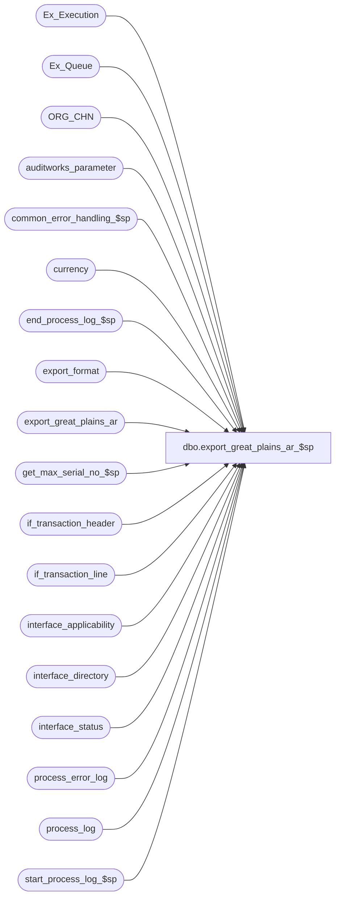

# dbo.export_great_plains_ar_$sp

**Database:** auditworks  
**Server:** bedrockdb01  

## Architecture Diagram



## Table Dependencies

| Referenced Table |
|---|
| Ex_Execution |
| Ex_Queue |
| ORG_CHN |
| auditworks_parameter |
| common_error_handling_$sp |
| currency |
| end_process_log_$sp |
| export_format |
| export_great_plains_ar |
| get_max_serial_no_$sp |
| if_transaction_header |
| if_transaction_line |
| interface_applicability |
| interface_directory |
| interface_status |
| process_error_log |
| process_log |
| start_process_log_$sp |

## Stored Procedure Code

```sql
create proc dbo.export_great_plains_ar_$sp @interface_id tinyint = 39

AS

/* 
Proc Name: export_great_plains_ar_$sp
Desc:   Standard export of house-account charges/credits to Great Plains A/R. 
	Extracts data from interface tables to export_great_plains_ar table. 
	Called by SRProc (SmartView) or ICT_EXPORT depending on export_format selected.

HISTORY:  
Date     Name           Def#  Desc
Feb03,16 Vicci    TFS-139985  Handle line amounts as large as numeric(18,4).
Apr20,07 PaulS        DV-1356 Uplift 82615 to SA5, move to SA module  
Jan30,07 Vicci		82615 Author
*/

SET NOCOUNT ON
DECLARE
  @current_rows                 int,
  @currency_code		nvarchar(3),
  @batch_size                   int,
  @current_db_name              nvarchar(30),
  @db_id                        int,
  @errmsg                       nvarchar(255),
  @errno                        int,
  @function_name	        varbinary(128),
  @last_posting_datetime        datetime,
  @max_serial_no                numeric(14,0),
  @message_id                   int,
  @min_serial_no                numeric(14,0),
  @object_name                  nvarchar(255),
  @operation_name               nvarchar(100),
  @process_log_entry            tinyint,
  @process_name                 nvarchar(100),
  @process_no                   int,
  @process_timestamp            float,
  @process_start_time           datetime,
  @retrieval_in_progress        tinyint,
  @rows                         int,
  @stream_no                    tinyint,
  @transaction_count            int,
  @user_name                    nvarchar(30)

SELECT @batch_size = 2000,
       @current_db_name = db_name(),
       @function_name = convert(varbinary(128), 'export_great_plains_ar_$sp'),
       @message_id = 201068,
       @operation_name = 'Unknown',
       @process_log_entry = 0,
       @process_name = 'Interface to Great Plains A/R',
       @process_no = 281,
       @process_start_time = getdate(),
       @stream_no = 1,
       @transaction_count = 0,
       @user_name = suser_sname()

SET CONTEXT_INFO @function_name

IF @interface_id IS NULL OR @interface_id <> 39
BEGIN
  SELECT @message_id = 201684,
         @errno = 201684,
         @object_name = @process_name,
         @errmsg = 'Invalid Argument(s) passed to the stored procedure ' + @process_name + '. Unable to proceed.'
  GOTO error
END
SELECT @retrieval_in_progress = retrieval_in_progress,
       @last_posting_datetime = last_posting_datetime
FROM interface_status
WHERE interface_id = @interface_id

SELECT @errno = @@error
IF @errno <> 0
BEGIN
  SELECT @errmsg = 'Unable to select retrieval_in_progress from interface_status',
         @object_name = 'interface_status',
         @operation_name = 'SELECT'
  GOTO error
END

IF @retrieval_in_progress <> 0
BEGIN
  SELECT @db_id = dbid
  FROM master..sysprocesses
  WHERE spid = @@spid

  SELECT @errno = @@error
  IF @errno != 0
  BEGIN
    SELECT @errmsg = 'Unable to select from master..sysprocesses',
           @object_name = 'master..sysprocesses',
           @operation_name = 'SELECT'
    GOTO error
  END

  IF EXISTS (SELECT 1
             FROM master..sysprocesses
             WHERE context_info = @function_name
             AND spid <> @@spid
             AND dbid = @db_id
             AND db_name(dbid) = @current_db_name)
  BEGIN
    SELECT @message_id = 201682,
           @errno = 201682,
           @object_name = @process_name,
           @errmsg = 'The stored procedure ' + @process_name + ' is currently running. Please verify.'
    GOTO error
  END
END

SELECT @currency_code = c.currency_code
  FROM auditworks_parameter a, currency c
 WHERE par_name = 'common_currency'  
   AND par_value = convert(nvarchar, c.currency_id)
SELECT @errno = @@error
IF @errno <> 0
BEGIN
  SELECT @errmsg = 'Unable to determine currency code',
         @object_name = 'auditworks_parameter',
         @operation_name = 'SELECT'
  GOTO error
END

IF @currency_code IS NULL
  SELECT @currency_code = ''
  
IF EXISTS (SELECT 1 FROM export_great_plains_ar)
BEGIN
  DELETE export_great_plains_ar
   WHERE record_content = '</root>'
  SELECT @errno = @@error
  IF @errno <> 0
  BEGIN
    SELECT @errmsg = 'Unable to remove root end xml tag',
           @object_name = 'export_great_plains_ar',
           @operation_name = 'DELETE'
    GOTO error
  END
END
ELSE
BEGIN
  INSERT INTO export_great_plains_ar (record_content, max_serial_no)
  VALUES('<root>', 0)
  SELECT @errno = @@error
  IF @errno <> 0
  BEGIN
    SELECT @errmsg = 'Unable to log root xml tag',
           @object_name = 'export_great_plains_ar',
           @operation_name = 'INSERT'
    GOTO error
  END  
END

SELECT @stream_no = e.stream_no
FROM export_format e, interface_directory i
WHERE i.interface_id = @interface_id
AND i.interface_id = e.interface_id
AND i.ascii_export = e.export_format

SELECT @errno = @@error
IF @errno <> 0
BEGIN
  SELECT @errmsg = 'Unable to select stream_no from export_format',
         @object_name = 'export_format',
         @operation_name = 'SELECT'
  GOTO error
END

SELECT @stream_no = ISNULL(@stream_no, 1)


UPDATE interface_status
SET retrieval_in_progress = 1, last_retrieval_datetime = @process_start_time
WHERE interface_id = @interface_id

SELECT @errno = @@error
IF @errno <> 0
BEGIN
  SELECT @errmsg = 'Unable to set retrieval_in_progress in interface_status',
         @object_name = 'interface_status',
         @operation_name = 'UPDATE'
  GOTO error
END

WHILE 1 = 1
BEGIN
  SELECT @min_serial_no = ISNULL(MAX(to_serial_no),0) + 1
  FROM Ex_Execution WITH (NOLOCK)
  WHERE queue_id = @interface_id

  SELECT @errno = @@error
  IF @errno <> 0
  BEGIN
    SELECT @errmsg = 'Unable to select to_serial_no from Ex_Execution',
           @object_name = 'Ex_Execution',
           @operation_name = 'SELECT'
    GOTO error
  END

  EXEC get_max_serial_no_$sp @interface_id, @min_serial_no, @batch_size, @max_serial_no OUTPUT

  SELECT @errno = @@error
  IF @errno <> 0
  BEGIN
    SELECT @errmsg = 'Unable to execute get_max_serial_no_$sp',
           @object_name = 'get_max_serial_no_$sp',
           @operation_name = 'EXECUTE'
    GOTO error
  END

  IF @max_serial_no = 0
    BREAK

  IF @process_log_entry = 0
  BEGIN
    EXEC start_process_log_$sp @process_no, @process_timestamp OUTPUT, @errmsg OUTPUT
    SELECT @errno = @@error
    IF @errno <> 0
    BEGIN
      SELECT @errmsg = @errmsg + ' Unable to execute start_process_log_$sp',
             @object_name = 'start_process_log_$sp',
             @operation_name = 'EXECUTE'
      GOTO error
    END
    SELECT @process_log_entry = 1
  END
    
  INSERT INTO export_great_plains_ar (record_content, max_serial_no)
  SELECT
    '<taRMTransaction>' +
    '<RMDTYPAL>' + CASE 
                     WHEN (l.line_object_type <> 8 AND l.db_cr_none = 1 AND sign(l.gross_line_amount * l.voiding_reversal_flag) = 1) THEN '1'
                     WHEN (l.line_object_type <> 8 AND l.db_cr_none = 1 AND sign(l.gross_line_amount * l.voiding_reversal_flag) = -1) THEN '7'
                     WHEN (l.line_object_type <> 8 AND l.db_cr_none = -1 AND sign(l.gross_line_amount * l.voiding_reversal_flag) = 1) THEN '8'
                     WHEN (l.line_object_type <> 8 AND l.db_cr_none = -1 AND sign(l.gross_line_amount * l.voiding_reversal_flag) = -1) THEN '3'
                     WHEN (l.line_object_type = 8 AND l.db_cr_none * sign(l.gross_line_amount * l.voiding_reversal_flag) = -1) THEN '17'
                     WHEN (l.line_object_type = 8 AND l.db_cr_none * sign(l.gross_line_amount * l.voiding_reversal_flag) = 1) THEN '13'

                   END + '</RMDTYPAL>' 
    + '<DOCNUMBR>' + convert(nvarchar,h.if_entry_no) + '</DOCNUMBR>'
    + '<DOCDATE>' + convert(nvarchar,h.transaction_date, 101) + '</DOCDATE>'
 + '<BACHNUMB>' + substring(convert(nvarchar,@process_start_time, 112) + ' ' +convert(nvarchar,@process_start_time, 8), 1, 14) + '</BACHNUMB>'
    + '<CUSTNMBR>' + substring(rtrim(ltrim(l.reference_no)), 1, 15) + '</CUSTNMBR>'
    + '<DOCAMNT>' + convert(nvarchar, convert(numeric(18,2),ABS(l.gross_line_amount - l.pos_discount_amount))) + '</DOCAMNT>'
    + '<SLSAMNT>' + convert(nvarchar, convert(numeric(18,2),ABS(l.gross_line_amount - l.pos_discount_amount))) + '</SLSAMNT>'
    + '<DOCDESCR>' + s.ORG_CHN_SHRT_NAME + ' (' + convert(nvarchar, h.store_no) + '), ' + convert(nvarchar, h.register_no) + ', ' + convert(nvarchar,h.transaction_no) + '</DOCDESCR>'
    + '<CURNCYID>' + IsNull(c.currency_code, @currency_code) +  '</CURNCYID>'
    + '</taRMTransaction>', 
    @max_serial_no
  FROM Ex_Queue q WITH (NOLOCK), 
       if_transaction_header h WITH (NOLOCK), if_transaction_line l WITH (NOLOCK), interface_applicability i WITH (NOLOCK), 
       ORG_CHN s, currency c
  WHERE q.queue_id = @interface_id
  AND q.serial_no >= @min_serial_no
  AND q.serial_no <= @max_serial_no
  AND q.key_1 = h.if_entry_no
  AND h.transaction_void_flag IN (0,8)
  AND l.line_void_flag = 0
  AND l.db_cr_none <> 0
  AND h.if_entry_no = l.if_entry_no
  AND i.interface_id = q.queue_id
  AND i.line_object = l.line_object
  AND i.line_action = l.line_action
  AND i.transaction_category = h.transaction_category
  AND h.store_no = s.ORG_CHN_NUM
  AND ISNULL(s.DFLT_CRNCY_CODE, '---') = c.currency_code

  SELECT @errno = @@error, @current_rows = @@rowcount
  IF @errno <> 0
  BEGIN
    SELECT @errmsg = 'Unable to insert export_great_plains_ar invoices',
           @object_name = 'export_great_plains_ar',
           @operation_name = 'INSERT'
    GOTO error
  END

  SELECT @transaction_count = @transaction_count + @current_rows

  BEGIN TRANSACTION

  INSERT Ex_Execution (queue_id, object_id, execution_id, from_serial_no, to_serial_no)
  VALUES (@interface_id, @interface_id * -1, 0, @min_serial_no, @max_serial_no)

  SELECT @errno = @@error
  IF @errno <> 0
  BEGIN
    DELETE export_great_plains_ar
     WHERE max_serial_no = @max_serial_no
    SELECT @errmsg = 'Unable to insert Ex_Execution for queue_id ' + CONVERT(nvarchar, @interface_id),
           @object_name = 'Ex_Execution',
           @operation_name = 'INSERT'
    GOTO error
  END

  COMMIT

END -- while 1 = 1

IF (SELECT count(*) FROM export_great_plains_ar) > 1
BEGIN
  INSERT INTO export_great_plains_ar (record_content, max_serial_no)
  VALUES('</root>', 0)
  SELECT @errno = @@error
  IF @errno <> 0
  BEGIN
    SELECT @errmsg = 'Unable to log root end xml tag',
           @object_name = 'export_great_plains_ar',
           @operation_name = 'INSERT'
    GOTO error
  END  
END
ELSE
BEGIN
  TRUNCATE TABLE export_great_plains_ar
  SELECT @errno = @@error
  IF @errno <> 0
  BEGIN
    SELECT @errmsg = 'Unable to remove root tags when no data to be exported',
           @object_name = 'export_great_plains_ar',
           @operation_name = 'TRUNCATE'
    GOTO error
  END  
END

IF @process_log_entry = 1
BEGIN
  EXEC end_process_log_$sp @process_no, @process_timestamp, @transaction_count
  SELECT @errno = @@error
  IF @errno <> 0
  BEGIN
    SELECT @errmsg = 'Unable to exec end_process_log_$sp',
           @object_name = 'end_process_log_$sp',
           @operation_name = 'EXECUTE'
    GOTO error
  END

   UPDATE process_error_log
      SET verified = 1,
          verified_by_user_id = null -- system
    WHERE process_no = @process_no
      AND verified = 0

   SELECT @errno = @@error
   IF @errno <> 0
     BEGIN
	SELECT @errmsg = 'Unable to update process_error_log',
	       @object_name = 'process_error_log',
   	       @operation_name = 'UPDATE'
	GOTO error
     END

   UPDATE process_log
      SET process_status_flag = 3
    WHERE process_start_time = process_end_time
      AND process_no = @process_no
      AND process_status_flag = 1

   SELECT @errno = @@error
   IF @errno <> 0
     BEGIN
	SELECT @errmsg = 'Unable to update process_log',
               @object_name = 'process_log',
               @operation_name = 'UPDATE'
	GOTO error
     END

  END -- If @process_log_entry = 1

-- Mark the interface as complete
BEGIN TRAN
UPDATE interface_status
SET last_retrieval_datetime = getdate(),
    retrieval_in_progress = 0
WHERE last_posting_datetime = @last_posting_datetime
AND interface_id = @interface_id

SELECT @errno = @@error, @rows = @@rowcount
IF @errno <> 0
BEGIN
  SELECT @errmsg = 'Unable to set retrieval_in_progress in interface_status for interface_id ' + CONVERT(nvarchar, @interface_id),
         @object_name = 'interface_status',
         @operation_name = 'UPDATE'
  GOTO error
END

If @rows = 0
BEGIN
  UPDATE interface_status
  SET last_retrieval_datetime = getdate(),
      retrieval_in_progress = 0,
      immediate_posting_requested = 2
  WHERE interface_id = @interface_id

  SELECT @errno = @@error
  IF @errno <> 0
  BEGIN
    SELECT @errmsg = 'Unable to set immediate_posting_requested in interface_status for interface_id ' + CONVERT(nvarchar, @interface_id),
           @object_name = 'interface_status',
           @operation_name = 'UPDATE'
    GOTO error
  END
END
COMMIT

RETURN

error:


  EXEC common_error_handling_$sp @process_no, @errno, @errmsg, 0, @message_id, @process_name, @object_name, @operation_name, 1, @stream_no
  RETURN
```

