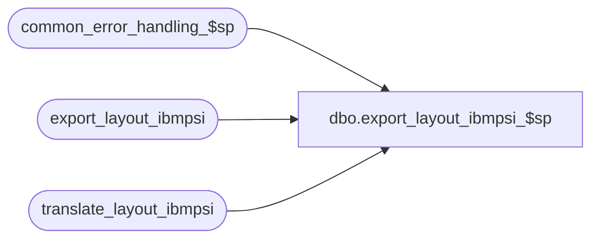

# dbo.export_layout_ibmpsi_$sp

**Database:** auditworks  
**Server:** bedrockdb01  

## Architecture Diagram



## Table Dependencies

| Referenced Table |
|---|
| common_error_handling_$sp |
| export_layout_ibmpsi |
| translate_layout_ibmpsi |

## Stored Procedure Code

```sql
create proc dbo.export_layout_ibmpsi_$sp AS

/* Version: 1.01 Date: 1996/11/11 */
/* Desc: to build temporary export table
   from the register file layout lookup table.
   extracts parameters for the requested version only.
   The output will be in the same order as the index
   on export_layout_ibmpsi. 
HISTORY     
DATE          NAME	DEF#	DESC
17-Jan-03     ShuZ   1-HZ3U2    Change double quote to single quote
19-Apr-02     ShuZ   1-CD0IX    Standardize  R3.5 Common error handling

   */
DECLARE 
@errno			int,
@errmsg 		varchar(255),
@object_name            varchar(255),
@process_name           varchar(100),
@operation_name         varchar(100),
@message_id		int

SELECT @process_name = 'export_layout_ibmpsi_$sp',
      @message_id = 201068  
      
TRUNCATE TABLE export_layout_ibmpsi
SELECT @errno = @@error
IF @errno != 0
  BEGIN
    SELECT @errmsg = 'Failed to TRUNCATE export_layout_ibmpsi',
           @object_name    = 'export_layout_ibmpsi',
           @operation_name = 'TRUNCATE'
    GOTO error
  END

INSERT export_layout_ibmpsi (
	rec_type,
	descriptor,
	data_poll_pos,
	data_poll_length,
        memo, 
        data_type)
SELECT 	rec_type,
	descriptor,
	right( ('000' + convert(varchar(3), (convert(smallint,data_poll_pos) * 2 + 1) )), 3),
	right ( ('000' + convert(varchar(3), (convert(smallint,data_poll_length) * 2) )), 3),
	substring((memo + replicate(' ',100)), 1, 100),
        data_type
FROM translate_layout_ibmpsi

SELECT @errno = @@error
IF @errno != 0
  BEGIN
    SELECT @errmsg = 'Failed to INSERT export_layout_ibmpsi',
           @object_name    = 'export_layout_ibmpsi',
           @operation_name = 'INSERT'
    GOTO error
  END

RETURN


error:

  EXEC common_error_handling_$sp 220, @errno, @errmsg, 0, @message_id, 
                                 @process_name, @object_name, @operation_name, 1
RETURN
```

