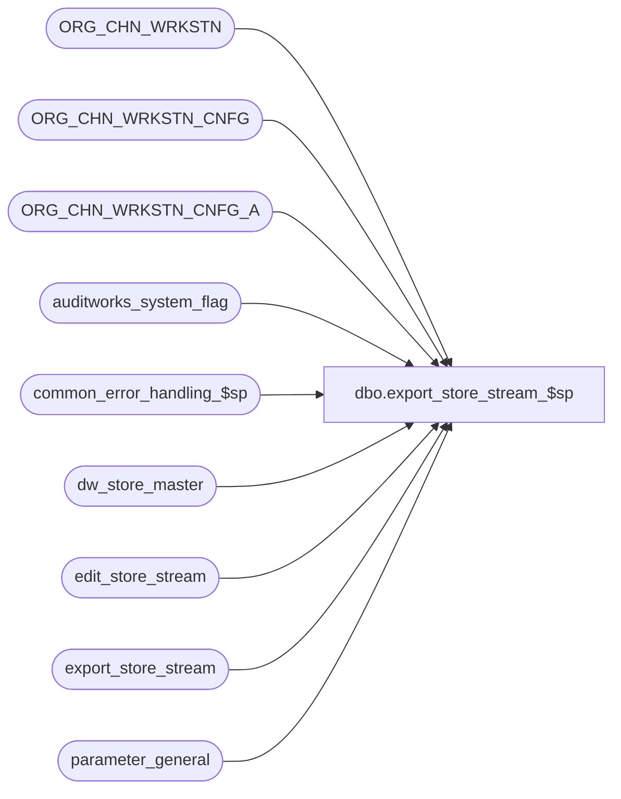

# dbo.export_store_stream_$sp

**Database:** auditworks  
**Server:** bedrockdb01  

## Architecture Diagram



## Table Dependencies

| Referenced Table |
|---|
| ORG_CHN_WRKSTN |
| ORG_CHN_WRKSTN_CNFG |
| ORG_CHN_WRKSTN_CNFG_A |
| auditworks_system_flag |
| common_error_handling_$sp |
| dw_store_master |
| edit_store_stream |
| export_store_stream |
| parameter_general |

## Stored Procedure Code

```sql
create proc dbo.export_store_stream_$sp 
@interface_id    tinyint = NULL /* this parameter is required by export.ict and normally = 36 */ 
 AS

/* Proc Name: export_store_stream_$sp
   Description: To export edit_store_stream definition table for use by the c split (called by ICT_POOL when using multistream trickle edit).
     Note: In a scaleout environment, this proc will be executed on each peripheral.

   Called from smartload script /ICT_EXPORT/export.ict using configuration info from export_format.

History:
Date     Name           Def# Action
Oct09,14 Paul          65489 remove non-essential datetime column from export table due to bcp limitation
Jul17,14 Paul          65489 author.


*/

DECLARE @concurrent_edit_processes tinyint,
	@current_date		datetime,
	@cursor_open		tinyint,
	@errmsg	 		nvarchar(2000),
	@errmsg2			nvarchar(2000),
	@errline			int,
	@errno			int,
	@instance_id		tinyint,
	@rows			int,
	@sa_company_no 		int,
	@sa_company_string 	varchar(5),
	@stream_no		tinyint,
	@ORG_CHN_NUM		int, -- T_LONG_INTEGER
	@object_name		nvarchar(255),
	@process_name		nvarchar(100),
	@operation_name		nvarchar(100),
	@message_id		int;

IF @interface_id <> 36 OR @interface_id IS NULL
  RETURN;

SET NOCOUNT ON;

SELECT @process_name = 'export_store_stream_$sp',
       @message_id = 201068,
       @current_date = getdate(),
       @stream_no = 0; 	

BEGIN TRY

    SELECT @errmsg = 'Failed to SELECT from table parameter_general.',
           @object_name    = 'parameter_general',
           @operation_name = 'SELECT';
SELECT @sa_company_no = sa_company_no,
       @concurrent_edit_processes = concurrent_edit_processes
  FROM parameter_general;
  
SELECT @rows = @@rowcount,
	 @sa_company_string = CONVERT( varchar(5), @sa_company_no );

IF @rows = 0
  GOTO business_error;

IF @concurrent_edit_processes = 0 OR @concurrent_edit_processes IS NULL
  SELECT @concurrent_edit_processes = 1;

/* There is no need to check whether edit_store_stream_$sp is currently running because only that
   proc updates interface_status which in turn triggers the ICT_EXPORT01 to call this current proc */

SELECT @errmsg = 'Failed to set last_stream_export_exec',
           @object_name    = 'auditworks_system_flag',
           @operation_name = 'UPDATE';
UPDATE auditworks_system_flag
  SET flag_datetime_value = getdate()
 WHERE flag_name = 'last_stream_export_exec';

SELECT @errmsg = 'Failed to truncate table export_store_stream',
           @object_name    = 'export_store_stream',
           @operation_name = 'TRUNCATE';
TRUNCATE TABLE export_store_stream;


IF EXISTS (SELECT 1 FROM edit_store_stream)
  BEGIN
     SELECT @errmsg = 'Failed to populate export_store_stream.',
            @object_name = 'export_store_stream',
            @operation_name = 'INSERT';
   INSERT INTO export_store_stream (
                 store_no,
                 stream_no,
                 instance_id,
                 sa_company_no)
   SELECT store_no,
          stream_no,
          0,
          @sa_company_string
     FROM edit_store_stream;

  END;

ELSE
  /* Otherwise, since table edit_store_stream is empty (first time use when edit phase2 has never run yet), then populate stores
     and assign stream numbers in a simple round-robin fashion. */
  BEGIN
   /* If more than one stream will be used, then bump stream population variable so that stream 1 will get one less store */
   IF @concurrent_edit_processes > 1
     SELECT @stream_no = 1;

   SELECT @errmsg         = 'Failed to open export_crsr CURSOR',
           @object_name    = 'export_crsr',
           @operation_name = 'OPEN';

   DECLARE export_crsr CURSOR FAST_FORWARD
    FOR
    SELECT DISTINCT R.ORG_CHN_NUM
      FROM ORG_CHN_WRKSTN R,
           ORG_CHN_WRKSTN_CNFG C,
           ORG_CHN_WRKSTN_CNFG_A A
     WHERE ISNULL(R.PRNT_WRKSTN_ID, R.WRKSTN_ID) = A.WRKSTN_ID
       AND A.WRKSTN_CNFG_CODE = C.WRKSTN_CNFG_CODE
       AND @current_date >= A.EFCTV_DATE
       AND (@current_date < A.EXPRTN_DATE OR A.EXPRTN_DATE IS NULL)
    AND ISNULL(C.TRAN_TRNSLT_VRSN_NUM,0) <> 0
       AND PLNG_FILE_NAME IS NOT NULL
       AND ISNULL(R.PRNT_WRKSTN_ID, R.WRKSTN_ID) = R.WRKSTN_ID
       AND R.ACTV = 1;
    
   OPEN export_crsr;
   SELECT @cursor_open = 1,
          @errmsg = 'Failed to insert into export_store_stream.',
          @object_name = 'export_store_stream',
          @operation_name = 'INSERT';

   WHILE 1 = 1
   BEGIN

    FETCH export_crsr
     INTO @ORG_CHN_NUM;

    IF @@fetch_status <> 0
      BREAK;

    SELECT @stream_no = @stream_no + 1;
    IF @stream_no > @concurrent_edit_processes
       OR @stream_no > 50 /* safety code */
         SELECT @stream_no = 1;

    INSERT INTO export_store_stream (
                 store_no,
                 stream_no,
                 instance_id,
                 sa_company_no)
    VALUES (@ORG_CHN_NUM,
                  @stream_no,
                  0,
                  @sa_company_string);

   END; --WHILE 1 = 1
  
   CLOSE export_crsr;
   DEALLOCATE export_crsr;

   SELECT @cursor_open = 0;
  END; -- else of rows exists in edit_store_stream


  /* Set instance_id column to match current store ownership in SA */

  SELECT @errmsg         = 'Failed to set instance_id in export_store_stream',
           @object_name    = 'export_store_stream',
           @operation_name = 'UPDATE';
  UPDATE export_store_stream
    SET instance_id = dwm.instance_id
   FROM export_store_stream ex, dw_store_master dwm
  WHERE dwm.instance_id > 0
    AND dwm.store_no = ex.store_no;

  SELECT @errmsg = 'Failed to reset last_stream_export_exec',
           @object_name    = 'auditworks_system_flag',
           @operation_name = 'UPDATE';
UPDATE auditworks_system_flag
  SET flag_datetime_value = getdate()
 WHERE flag_name = 'last_stream_export_exec';
 
RETURN;


business_error:   /* Business Rule handler. */

	SELECT @errmsg2 = @errmsg;

	EXEC common_error_handling_$sp 5, @errno, @errmsg, 0, @message_id, @process_name, @object_name, @operation_name, 1;
	  /* Note: when the exec above raises an error, that action also fires the system error trap (below) */
	RETURN;
END TRY

BEGIN CATCH; -- trap system errors
    /* common error handling. Appending proc name here because a rollback could occur if called within a transaction. */

        SELECT @errno = ERROR_NUMBER(),
		@errline = ERROR_LINE();

        SELECT @errmsg = CONVERT(nvarchar, @errno) + ':' + @process_name + ':' + CONVERT(nvarchar, @errline) + ':'
               + COALESCE(@errmsg, ' ') + ':' + ERROR_MESSAGE();

	 /* this condition will only be true when raise error in traps above fire this general catch */
	IF @errmsg2 IS NOT NULL
	  SELECT @errmsg = @errmsg2;

	IF @cursor_open = 1
	    BEGIN
	      CLOSE export_crsr;
	      DEALLOCATE export_crsr;
	    END;
	  
	EXEC common_error_handling_$sp 220, @errno, @errmsg, 0, @message_id, @process_name, @object_name, @operation_name, 1;

	RETURN;
END CATCH;
```

