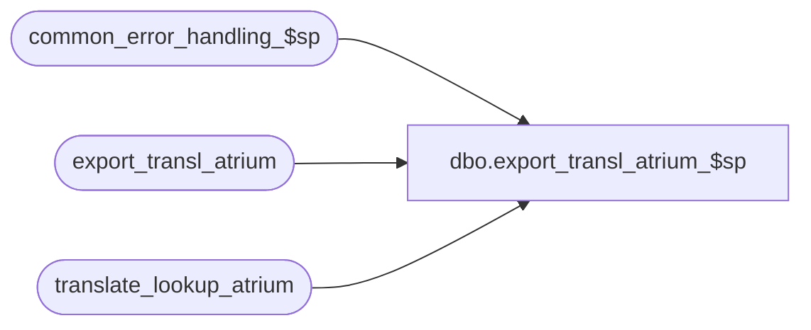

# dbo.export_transl_atrium_$sp

**Database:** auditworks  
**Server:** bedrockdb01  

## Architecture Diagram



## Table Dependencies

| Referenced Table |
|---|
| common_error_handling_$sp |
| export_transl_atrium |
| translate_lookup_atrium |

## Stored Procedure Code

```sql
create proc dbo.export_transl_atrium_$sp 
@version_no  tinyint = 2
AS
/* Desc: to build temporary export table
   from the atrium translate lookup table.
   extracts parameters for the requested version.
   The output will be in the same order as the index
   on translate_lookup_atrium. 
HISTORY     
DATE          NAME	DEF#	DESC
19-Apr-02     ShuZ   1-CD0IX    Standardize  R3.5 Common error handling
   */
DECLARE 
@errno			int,
@errmsg 		varchar(255),
@object_name            varchar(255),
@process_name           varchar(100),
@operation_name         varchar(100),
@message_id		int

SELECT @process_name = 'export_transl_atrium_$sp',
      @message_id = 201068  

TRUNCATE TABLE export_transl_atrium

SELECT @errno = @@error
IF @errno != 0
  BEGIN
    SELECT @errmsg = 'Failed to TRUNCATE export_transl_atrium',
           @object_name    = 'export_transl_atrium',
           @operation_name = 'TRUNCATE'
    GOTO error
  END


INSERT export_transl_atrium (
	version_no,
	rec_type,
	field_type,
	field_subtype,
	transaction_type,
	transaction_subtype,
        tax_transaction_type,
	data_type,
        signed,
	output_absolute_value,
	data_from,
	data_to, 
	data_replace_with_constant,
	data_replace_with_constant_neg,
	data_decimals_assume,
	data_repeat,
        transaction_delimitor,
        data_precedes_amount,
	prorate,
	discount_table,
	discount_column,
	discountable,
	output_file,
	output_column,
	seq )
SELECT 	version_no,
	rec_type,
	field_type,
	field_subtype,
	transaction_type,
	transaction_subtype,
        tax_transaction_type,
	data_type,
        signed,
	output_absolute_value,
	data_from,
	data_to, 
	data_replace_with_constant,
	data_replace_with_constant_neg,
	data_decimals_assume,
	data_repeat,
        transaction_delimitor,
        data_precedes_amount,
	prorate,
	discount_table,
	discount_column,
	discountable,
	output_file,
	output_column,
	seq
FROM translate_lookup_atrium
WHERE @version_no = version_no

SELECT @errno = @@error
IF @errno != 0
  BEGIN
    SELECT @errmsg = 'Failed to INSERT export_transl_atrium',
           @object_name    = 'export_transl_atrium',
           @operation_name = 'INSERT'
    GOTO error
  END

RETURN

error:

  EXEC common_error_handling_$sp 220, @errno, @errmsg, 0, @message_id, 
                                 @process_name, @object_name, @operation_name, 1
RETURN
```

