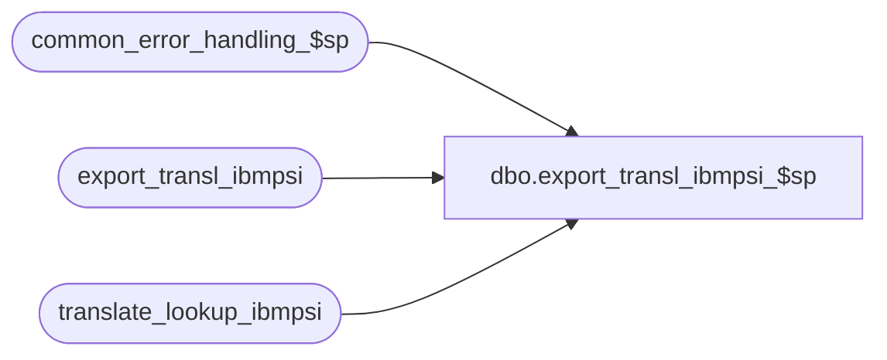

# dbo.export_transl_ibmpsi_$sp

**Database:** auditworks  
**Server:** bedrockdb01  

## Architecture Diagram



## Table Dependencies

| Referenced Table |
|---|
| common_error_handling_$sp |
| export_transl_ibmpsi |
| translate_lookup_ibmpsi |

## Stored Procedure Code

```sql
create proc dbo.export_transl_ibmpsi_$sp 
@version_no  tinyint = 1
AS

/* Version: 1.01 Date: 1996/11/11 */
/* Desc: to build temporary export table
   from the register translate lookup table.
   extracts parameters for the requested version only.
   The output will be in the same order as the index
   on export_transl_ibmpsi. 
HISTORY     
DATE          NAME	DEF#	DESC
19-Apr-02     ShuZ   1-CD0IX    Standardize  R3.5 Common error handling

   */
DECLARE 
@errno			int,
@errmsg 		varchar(255),
@object_name            varchar(255),
@process_name           varchar(100),
@operation_name         varchar(100),
@message_id		int

SELECT @process_name = 'export_transl_ibmpsi_$sp',
      @message_id = 201068     

TRUNCATE TABLE export_transl_ibmpsi
SELECT @errno = @@error
IF @errno != 0
  BEGIN
    SELECT @errmsg = 'Failed to TRUNCATE export_transl_ibmpsi',
           @object_name    = 'export_transl_ibmpsi',
           @operation_name = 'TRUNCATE'
    GOTO error
  END
  
INSERT export_transl_ibmpsi (
	version_no,
	rec_type,
	descriptor,
	transaction_type,
	transaction_subtype,
	data_poll_pos,
	data_poll_length,
        data_type,
	data_from, 
	data_to, 
	data_replace_with_constant, 
	data_decimals_assume, 
	data_repeat, 
	transaction_delimitor, 
	data_precedes_amount,
	prorate, 
	discount_table, 
	discount_column, 
	discountable, 
	output_file, 
	output_column, 
	seq,
	tax_transaction_type )
SELECT version_no,
	rec_type,
	descriptor,
	transaction_type,
	transaction_subtype,
	data_poll_pos,
	data_poll_length,
	data_type, 
	data_from, 
	data_to, 
	data_replace_with_constant, 
	data_decimals_assume, 
	data_repeat, 
	transaction_delimitor, 
	data_precedes_amount,
	prorate, 
	discount_table, 
	discount_column, 
	discountable, 
	output_file, 
	output_column, 
	seq,
	tax_transaction_type
FROM translate_lookup_ibmpsi
WHERE @version_no = version_no

SELECT @errno = @@error
IF @errno != 0
  BEGIN
    SELECT @errmsg = 'Failed to INSERT export_transl_ibmpsi',
           @object_name    = 'export_transl_ibmpsi',
           @operation_name = 'INSERT'
    GOTO error
  END

RETURN

error:

  EXEC common_error_handling_$sp 220, @errno, @errmsg, 0, @message_id, 
                                 @process_name, @object_name, @operation_name, 1
RETURN
```

