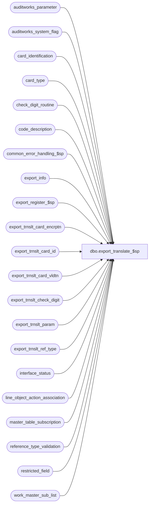

# dbo.export_translate_$sp

**Database:** auditworks  
**Server:** bedrockdb01  

## Architecture Diagram



## Table Dependencies

| Referenced Table |
|---|
| auditworks_parameter |
| auditworks_system_flag |
| card_identification |
| card_type |
| check_digit_routine |
| code_description |
| common_error_handling_$sp |
| export_info |
| export_register_$sp |
| export_trnslt_card_encrptn |
| export_trnslt_card_id |
| export_trnslt_card_vldtn |
| export_trnslt_check_digit |
| export_trnslt_param |
| export_trnslt_ref_type |
| interface_status |
| line_object_action_association |
| master_table_subscription |
| reference_type_validation |
| restricted_field |
| work_master_sub_list |

## Stored Procedure Code

```sql
create proc dbo.export_translate_$sp 
(
  @interface_id    tinyint = NULL -- this parameter is required by export.ict
)

 AS

/* 
  Name: export_translate_$sp
  Description: To build the tables that will be exported to the Translate.

Called from smartload script /ICT_EXPORT/export.ict

History:
Date     Name           Defect#  Desc
Feb26,13 Vicci        142088 To avoid deadlocks, lock a shared flag prior to work_master_sub_list deletions.
Jul16,12 Paul            136951  use nolock hint on master_table_subscription to reduce deadlocking.
Apr07,11 Vicci           126078  Take master_table_subscription active flag into account.
Apr03,07 Paul           DV-1356  Apply 79598, 67459, 66847 to SA5
Nov22,05 David          DV-1319  Apply 63730 to SA5
Nov01,05 Paul             62153  apply 61728 to SA5
Oct03,05 Paul             60471  apply 60822 to SA5
Jul06,05 David          DV-1294  Translate lookup files now under interface 47 instead of 45.
                                 Populate export_trnslt_param.
Nov09,06 Vicci            79598  Export use_rounded_tax_amount parameter
Feb09,06 David            67459  Avoid loop when requesting full export of multiple files.
Jan31,06 David            66847  Make sure full export request works when multiple copies are requested.
Nov22,05 David            63730  Changed layout of export_trnslt_ref_type.
Oct18,05 David            61728  Insert dummy rows if export tables are empty to avoid problems in translate.
Sep23,05 David            60822  Update export status when user request full download.
Jul08,05 David          DV-1298  Retrofit to 4.1.
Feb18,05 David          DV-1206  Author.

*/

DECLARE @errmsg 			nvarchar(255),
	@errno				int,
	@rows				int,
	@immediate_posting_requested 	tinyint,
	@log_error_flag			tinyint,
	@message_id			int,
	@object_name			nvarchar(255),
	@operation_name     		nvarchar(100),
	@process_no			int,
	@process_name			nvarchar(100),
	@table_name			nvarchar(30),
	@export_table_name		nvarchar(30)


IF @interface_id NOT IN (45,47)
  RETURN
  
SELECT @process_name = 'export_translate_$sp',
       @process_no = 220,
       @message_id = 201068

SELECT @immediate_posting_requested = ISNULL(immediate_posting_requested,0)
  FROM interface_status
 WHERE interface_id = @interface_id

SELECT @errno = @@error
IF @errno <> 0
BEGIN
  SELECT @errmsg = 'Unable to select immediate_posting_request from interface status',
         @object_name = 'interface_status',
         @operation_name = 'SELECT'      
  GOTO error
END

/*
export_status:
0=	Complete
1=	Table maintenance export outstanding
2=	Full export requested
3=	In-progress
*/
IF @immediate_posting_requested >= 1 --build work table with all data to be exported
BEGIN
  IF NOT EXISTS (SELECT export_status
                   FROM master_table_subscription WITH (NOLOCK)
                  WHERE export_status >= 1
                    AND interface_id = @interface_id
                    AND active_flag > 0)  
  BEGIN
    UPDATE master_table_subscription
       SET export_status = 2
     WHERE interface_id = @interface_id
       AND active_flag > 0
       AND export_status != 2 /* avoid unneccessary updating */
    SELECT @errno = @@error
        IF @errno <> 0
          BEGIN
            SELECT @errmsg = 'Unable to update master_table_subscription export_status to 2',
                   @object_name = 'master_table_subscription',
                   @operation_name = 'UPDATE'      
  	    GOTO error
          END   
  END -- if not exists       
END -- IF @immediate_posting_requested = 1

IF @immediate_posting_requested = 0
BEGIN
  UPDATE master_table_subscription 
     SET export_status = 0
   WHERE interface_id = @interface_id
     AND export_status > 0
     AND active_flag > 0
     AND export_status != 0 /* avoid unneccessary updating */
  SELECT @errno = @@error
  IF @errno <> 0
  BEGIN
    SELECT @errmsg = 'Unable to mark master table subscription entries for full download request as complete upon abort',
           @object_name = 'master_table_subscription',
           @operation_name = 'UPDATE'      
     GOTO error
  END
     
  RETURN
END

UPDATE interface_status
   SET last_retrieval_datetime = getdate()
 WHERE interface_id = @interface_id

SELECT @errno = @@error
IF @errno <> 0
BEGIN
  SELECT @errmsg = 'Unable to set last_retrieval_datetime in interface_status',
         @object_name = 'interface_status',
         @operation_name = 'UPDATE' 
  GOTO error
END

SELECT @export_table_name = e.export_table_name, 
       @table_name = m.table_name 
  FROM export_info e WITH (NOLOCK), master_table_subscription m WITH (NOLOCK)
 WHERE e.interface_id = @interface_id
   AND e.interface_id = m.interface_id
   AND (e.export_table_name = m.export_table_name OR m.export_table_name IS NULL) 
   AND m.export_status IN (1, 2, 3)  --3, i.e. in-progress included since ict will re-attempt if fails
   AND m.active_flag > 0
   
IF @export_table_name = 'export_register' 
BEGIN  
  EXEC export_register_$sp @interface_id
    
    SELECT @errno = @@error
    IF @errno <> 0
    BEGIN
      SELECT @errmsg = 'Failed to execute export_register_$sp.',
             @object_name = 'export_register_$sp',
	   @operation_name = 'EXECUTE'      
      GOTO error
    END
  
  UPDATE master_table_subscription
     SET export_status = 0
   WHERE interface_id = @interface_id
     AND export_table_name = 'export_register'
     AND active_flag > 0
     AND export_status != 0
  SELECT @errno = @@error
    IF @errno <> 0
    BEGIN
      SELECT @errmsg = 'Failed to set export_status to 0 for export_register.',
             @object_name = 'master_table_subscription',
             @operation_name = 'UPDATE'      
      GOTO error
    END
END -- IF @export_table_name = 'export_register'

IF @export_table_name = 'export_trnslt_ref_type' 
BEGIN  
  TRUNCATE TABLE export_trnslt_ref_type
    
  INSERT INTO export_trnslt_ref_type (category_object_action, reference_type)
  SELECT CONVERT(nvarchar, x.transaction_category) + '.' + CONVERT(nvarchar, x.line_object) + '.' + CONVERT(nvarchar, x.line_action), 
         x.reference_type
    FROM line_object_action_association x
   WHERE x.reference_type <> 0 
     AND ( x.reference_type IN (SELECT r.field_value FROM restricted_field r 
                                 WHERE r.field_name = 'reference_type' 
                                   AND r.active_flag = 1 
                                   AND r.restriction_level > 0) 
          OR x.reference_type IN (SELECT v.reference_type FROM reference_type_validation v 
                                   WHERE v.validation_type = 1 
                                     AND v.edit_active_flag > 0)  )

    SELECT @errno = @@error, @rows = @@rowcount
    IF @errno <> 0
    BEGIN
      SELECT @errmsg = 'Failed to populate export_trnslt_ref_type.',
             @object_name = 'export_trnslt_ref_type',
             @operation_name = 'INSERT'      
      GOTO error
    END

  IF @rows = 0 
  BEGIN
    INSERT INTO export_trnslt_ref_type VALUES ('0.0.0', 255)
     
    SELECT @errno = @@error
    IF @errno <> 0
    BEGIN
      SELECT @errmsg = 'Failed to populate export_trnslt_ref_type (dummy).',
             @object_name = 'export_trnslt_ref_type',
             @operation_name = 'INSERT'      
      GOTO error
    END
  END -- IF @rows = 0

  UPDATE master_table_subscription
     SET export_status = 0
   WHERE interface_id = @interface_id
     AND export_table_name = 'export_trnslt_ref_type'
     AND active_flag > 0
     AND export_status != 0
  SELECT @errno = @@error
    IF @errno <> 0
    BEGIN
      SELECT @errmsg = 'Failed to set export_status to 0 for export_trnslt_ref_type.',
             @object_name = 'master_table_subscription',
             @operation_name = 'UPDATE'      
      GOTO error
    END
END -- IF @export_table_name = 'export_trnslt_ref_type'
  
IF @export_table_name = 'export_trnslt_card_vldtn' 
BEGIN  
  TRUNCATE TABLE export_trnslt_card_vldtn
    
  INSERT INTO export_trnslt_card_vldtn
  SELECT v.reference_type, IsNull(c.alpha_code , 'ALL')
    FROM reference_type_validation v, code_description c
   WHERE v.validation_type = 1 
     AND v.edit_active_flag > 0 
     AND c.code_type = 22 
     AND v.reference_type = c.code

    SELECT @errno = @@error, @rows = @@rowcount
    IF @errno <> 0
    BEGIN
      SELECT @errmsg = 'Failed to populate export_trnslt_card_vldtn.',
             @object_name = 'export_trnslt_card_vldtn',
             @operation_name = 'INSERT'      
      GOTO error
    END

  IF @rows = 0 
  BEGIN
    INSERT INTO export_trnslt_card_vldtn VALUES (255,'NONE')
     
    SELECT @errno = @@error
    IF @errno <> 0
    BEGIN
      SELECT @errmsg = 'Failed to populate export_trnslt_card_vldtn (dummy).',
             @object_name = 'export_trnslt_card_vldtn',
             @operation_name = 'INSERT'      
      GOTO error
    END
  END -- IF @rows = 0

  UPDATE master_table_subscription
     SET export_status = 0
   WHERE interface_id = @interface_id
     AND export_table_name = 'export_trnslt_card_vldtn'
     AND active_flag > 0
     AND export_status != 0
  SELECT @errno = @@error
    IF @errno <> 0
    BEGIN
      SELECT @errmsg = 'Failed to set export_status to 0 for export_trnslt_card_vldtn.',
             @object_name = 'master_table_subscription',
             @operation_name = 'UPDATE'      
      GOTO error
    END
END -- IF @export_table_name = 'export_trnslt_card_vldtn'
  
IF @export_table_name = 'export_trnslt_card_encrptn' 
BEGIN  
  TRUNCATE TABLE export_trnslt_card_encrptn
    
  INSERT INTO export_trnslt_card_encrptn
  SELECT r.field_value AS reference_type, IsNull(c.alpha_code , 'ALL') 
    FROM restricted_field r, code_description c 
   WHERE r.active_flag = 1 
     AND r.field_name = 'reference_type' 
     AND r.restriction_level > 0 
     AND c.code_type = 22 
     AND r.field_value = c.code

    SELECT @errno = @@error, @rows = @@rowcount
    IF @errno <> 0
    BEGIN
      SELECT @errmsg = 'Failed to populate export_trnslt_card_encrptn.',
             @object_name = 'export_trnslt_card_encrptn',
             @operation_name = 'INSERT'      
      GOTO error
    END

  IF @rows = 0 
  BEGIN
    INSERT INTO export_trnslt_card_encrptn VALUES (255,'NONE')
     
    SELECT @errno = @@error
    IF @errno <> 0
    BEGIN
      SELECT @errmsg = 'Failed to populate export_trnslt_card_encrptn (dummy).',
             @object_name = 'export_trnslt_card_encrptn',
             @operation_name = 'INSERT'      
      GOTO error
    END
  END -- IF @rows = 0

  UPDATE master_table_subscription
     SET export_status = 0
   WHERE interface_id = @interface_id
     AND export_table_name = 'export_trnslt_card_encrptn'
     AND active_flag > 0
     AND export_status != 0
  SELECT @errno = @@error
    IF @errno <> 0
    BEGIN
      SELECT @errmsg = 'Failed to set export_status to 0 for export_trnslt_card_encrptn.',
             @object_name = 'master_table_subscription',
             @operation_name = 'UPDATE'      
      GOTO error
    END
END -- IF @export_table_name = 'export_trnslt_card_encrptn'

IF @export_table_name = 'export_trnslt_card_id' 
BEGIN  
  TRUNCATE TABLE export_trnslt_card_id
    
  INSERT INTO export_trnslt_card_id
  SELECT i.reference_type, i.from_account_no, i.to_account_no, c.card_type, c.check_digit_routine_number 
    FROM card_type c, card_identification i 
   WHERE c.card_type = i.card_type

    SELECT @errno = @@error
    IF @errno <> 0
    BEGIN
      SELECT @errmsg = 'Failed to populate export_trnslt_card_id.',
             @object_name = 'export_trnslt_card_id',
             @operation_name = 'INSERT'      
      GOTO error
    END

  UPDATE master_table_subscription
     SET export_status = 0
   WHERE interface_id = @interface_id
     AND export_table_name = 'export_trnslt_card_id'
     AND active_flag > 0
     AND export_status != 0
    SELECT @errno = @@error
    IF @errno <> 0
    BEGIN
      SELECT @errmsg = 'Failed to set export_status to 0 for export_trnslt_card_id.',
             @object_name = 'master_table_subscription',
             @operation_name = 'UPDATE'      
      GOTO error
    END
END -- IF @export_table_name = 'export_trnslt_card_id'
  
IF @export_table_name = 'export_trnslt_check_digit' 
BEGIN  
  TRUNCATE TABLE export_trnslt_check_digit
    
  INSERT INTO export_trnslt_check_digit
  SELECT check_digit_routine_no,
         multiplier1,
         multiplier2,
         multiplier3,
         multiplier4,
         multiplier5,
         multiplier6,
         multiplier7,
         multiplier8,
         multiplier9,
         multiplier10,
         multiplier11,
         multiplier12,
         multiplier13,
         multiplier14,
         multiplier15,
         multiplier16,
         multiplier17,
         multiplier18,
         multiplier19,
         multiplier20,
         sum_of_product_digits,
         sum_of_products,
         complement,
         divisor
    FROM check_digit_routine

    SELECT @errno = @@error
    IF @errno <> 0
    BEGIN
      SELECT @errmsg = 'Failed to populate export_trnslt_check_digit.',
             @object_name = 'export_trnslt_check_digit',
             @operation_name = 'INSERT'      
      GOTO error
    END

  UPDATE master_table_subscription
     SET export_status = 0
   WHERE interface_id = @interface_id
     AND export_table_name = 'export_trnslt_check_digit'
     AND active_flag > 0
     AND export_status != 0
    SELECT @errno = @@error
    IF @errno <> 0
    BEGIN
      SELECT @errmsg = 'Failed to set export_status to 0 for export_trnslt_check_digit.',
             @object_name = 'master_table_subscription',
             @operation_name = 'UPDATE'      
      GOTO error
    END
END -- IF @export_table_name = 'export_trnslt_check_digit'
  
IF @export_table_name = 'export_trnslt_param' 
BEGIN  
  TRUNCATE TABLE export_trnslt_param
    
  INSERT INTO export_trnslt_param
  SELECT 'IsTaxRoundByItem', CONVERT(nvarchar, CONVERT(int,par_value) - 1)
    FROM auditworks_parameter
   WHERE par_name = 'tax_rounding_method'

    SELECT @errno = @@error
    IF @errno <> 0
    BEGIN
      SELECT @errmsg = 'Failed to populate export_trnslt_param.',
             @object_name = 'export_trnslt_param',
             @operation_name = 'INSERT'      
      GOTO error
    END

  INSERT INTO export_trnslt_param
  SELECT 'UseRoundedAmount', CONVERT(nvarchar, IsNull(CONVERT(int,par_value), 0))
    FROM auditworks_parameter
   WHERE par_name = 'use_rounded_tax_amount'

    SELECT @errno = @@error
    IF @errno <> 0
    BEGIN
      SELECT @errmsg = 'Failed to populate export_trnslt_param  forUseRoundedAmount',
             @object_name = 'export_trnslt_param',
             @operation_name = 'INSERT'      
      GOTO error
    END

  UPDATE master_table_subscription
     SET export_status = 0
   WHERE interface_id = @interface_id
     AND export_table_name = 'export_trnslt_param'
     AND active_flag > 0
     AND export_status != 0
  SELECT @errno = @@error
    IF @errno <> 0
    BEGIN
      SELECT @errmsg = 'Failed to set export_status to 0 for export_trnslt_param.',
             @object_name = 'master_table_subscription',
             @operation_name = 'UPDATE'      
      GOTO error
    END
END -- IF @export_table_name = 'export_trnslt_param'

BEGIN TRANSACTION  --142088
  /* Prevent possible deadlocks when audit trail published change retraction deletion and this export 
     simultaneously attempt to clean up the same work_master_sublist rows, by updating a shared system flag. */ 
  UPDATE auditworks_system_flag
     SET flag_datetime_value = getdate()
   WHERE flag_name = 'work_master_sublist_access'
  SELECT @errno = @@error
  IF @errno != 0 
  BEGIN
    SELECT @errmsg = 'Set flag to force concurrent processes to run sequentially',
           @object_name = 'auditworks_system_flag',
           @operation_name = 'UPDATE'
    GOTO error
  END

  DELETE work_master_sub_list
   WHERE interface_id = @interface_id
  SELECT @errno = @@error
  IF @errno <> 0
  BEGIN
    SELECT @operation_name = 'DELETE',
           @object_name = 'work_master_sub_list',
           @errmsg = 'Failed to delete work_master_sublist entries for interface 45.'
    GOTO error       
  END
COMMIT

--If another pass is required, set immediate_posting_requested to 2
IF EXISTS (SELECT table_name
             FROM master_table_subscription WITH (NOLOCK)
            WHERE export_status IN (1, 2)
              AND interface_id = @interface_id
              AND active_flag > 0)  
BEGIN
  UPDATE interface_status
     SET immediate_posting_requested = 2 --(ict will bcp but not reset, therefore another pass will occur)
   WHERE interface_id = @interface_id
     AND immediate_posting_requested = 1

  SELECT @errno = @@error
  IF @errno <> 0
  BEGIN
    SELECT @errmsg = 'Unable to request subsequent export pass',
           @object_name = 'interface_status',
        @operation_name = 'UPDATE'      
    GOTO error
  END   
END -- if exists more master table subscription entries to be processed
ELSE
BEGIN 
  UPDATE interface_status
     SET immediate_posting_requested = 1
    FROM interface_status s , export_info x
   WHERE s.interface_id = x.interface_id
     AND x.current_copy = x.copy_qty_required
     AND x.interface_id = @interface_id
     
  SELECT @errno = @@error
  IF @errno <> 0
  BEGIN
    SELECT @errmsg = 'Unable to mark immediate posting request as having been completed',
           @object_name = 'interface_status',
           @operation_name = 'UPDATE'      
    GOTO error
  END   
END --no more table to dump

 
RETURN

error:

  EXEC common_error_handling_$sp @process_no, @errno, @errmsg, 0, @message_id, 
                                 @process_name, @object_name, @operation_name, 1


RETURN
```

