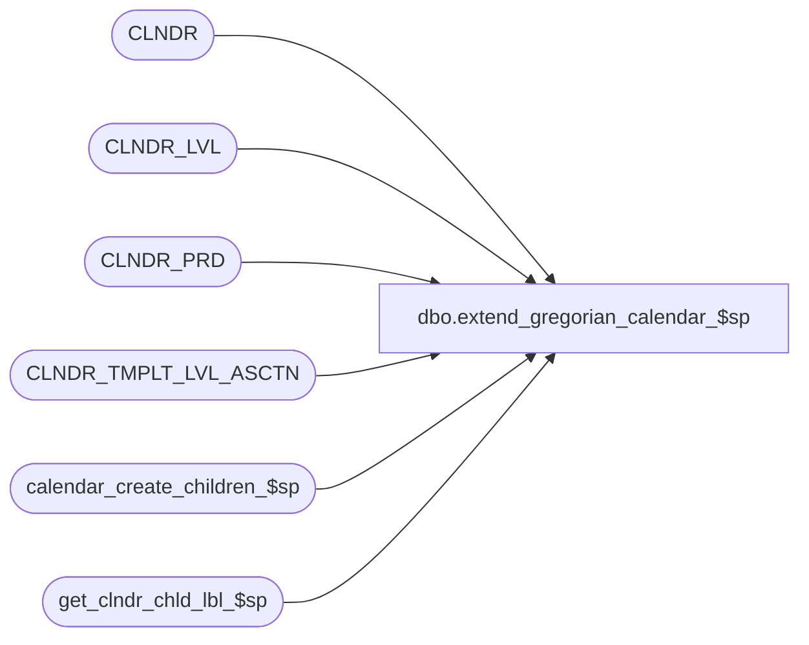

# dbo.extend_gregorian_calendar_$sp

**Database:** auditworks  
**Server:** bedrockdb01  

## Architecture Diagram



## Table Dependencies

| Referenced Table |
|---|
| CLNDR |
| CLNDR_LVL |
| CLNDR_PRD |
| CLNDR_TMPLT_LVL_ASCTN |
| calendar_create_children_$sp |
| get_clndr_chld_lbl_$sp |

## Stored Procedure Code

```sql
CREATE PROCEDURE [dbo].[extend_gregorian_calendar_$sp]
(
  @calendar_id_in varbinary(max),
  @years_to_extend int
)
AS
DECLARE

  @calendar_id    varbinary(16),
  @counter        int,
  @startDate      smalldatetime,
  @root_level     varbinary(16),
  @period_label   nvarchar(500),
  @period_count   int,
  @child_level    varbinary(16),
  @child_count    int,
  @child_cnt_alg  varbinary(16),
  @finished       int,
  @template_id    varbinary(16) = 0x32B6F56D84283248B72AD7A0DB21575C -- Gregorian
  
BEGIN

  /* 
      Proc Name: get_clndr_chld_lbl_$sp
      Desc: Algorithm Parsing and Execution Routine - Label Generation for calendar
      This procedure will return to the caller an integer representing the number of children
      a parent will contain based on an algorithm and a template definition.
  
     Tokens understood by procedure : 	[CalendarStartDate]                                 
                                    :   [CurrentPeriodDate]                                 
                                    :   [ChildSeq]                                          
                                    :   [LevelLabel]                                        
                                                                                          
     Functions understood           :   YearNumber                                          
                                    :   MonthLabel                                          
                                    :   MonthNumber                                         
                                    :   WeekDayNumber  
 
     HISTORY:
     Date     Name		Def#     Desc
     Aug09,05 Ian                author          
                                     
 */
 
 IF @calendar_id_in IS NULL
 BEGIN
 
   /* Test to see if more than one calendar */
 
   SELECT @counter = COUNT(CLNDR_ID)
     FROM CLNDR
    WHERE CLNDR_TMPLT_ID = @template_id
  
   IF @counter != 1
   BEGIN
     PRINT 'More than one gregorian calendar found - Aborting'
     RETURN
   END
 
   /* Find Gregorian Calendar */
 
 
   SELECT @calendar_id = CLNDR_ID
     FROM CLNDR
    WHERE CLNDR_TMPLT_ID = @template_id
  
    PRINT 'Found Gregorian Calendar : ID = ' + convert(varchar,@calendar_id)
  
  END 
 ELSE
   SELECT @calendar_id = @calendar_id_in
 
 /* Find the current end date of the calendar */

 SELECT @root_level = CLNDR_LVL_TYPE_ID 
   FROM CLNDR_LVL
  WHERE CLNDR_ID = @calendar_id
    AND ROOT_FLAG = 1

 SELECT @startDate = MAX(END_DATE_TIME)
   FROM CLNDR_PRD
  WHERE CLNDR_LVL_TYPE_ID = @root_level
    AND CLNDR_ID = @calendar_id
  
  WHILE @years_to_extend > 0 
  BEGIN
  
     /* Get root template information */
     
     SELECT @child_level   = CHLD_CLNDR_LVL_TYPE_ID,
            @child_count     = CHLD_CNT,
            @child_cnt_alg = CHLD_CNT_ALGRTHM_ID 
       FROM CLNDR_TMPLT_LVL_ASCTN
      WHERE CLNDR_TMPLT_ID = @template_id
        AND PRNT_CLNDR_LVL_TYPE_ID = @root_level
        
     /* Get year number */
     
     exec get_clndr_chld_lbl_$sp 1,1,@startDate,@startDate,0x4F604443D0A70D4A852EC54E3C201DD0,@root_level,1033,@period_label output
    
     SET @period_label = convert(int,@period_label)
     
     PRINT 'Creating new year starting on ' + cast(@startDate as varchar)     
     PRINT '           Number of Children ' + cast(@child_count as varchar)
     PRINT ''
     
     /* Disable calender period constraints */
     
     EXEC sp_executesql N'ALTER TABLE CLNDR_PRD NOCHECK CONSTRAINT ALL';     
     EXEC sp_executesql N'ALTER TABLE CLNDR_PRD_ASCTN NOCHECK CONSTRAINT ALL';
     EXEC sp_executesql N'ALTER TABLE CLNDR_PRD_LANG NOCHECK CONSTRAINT ALL';
     	    
     /* Now walk down the tree - creating the children as we go */
          
     exec calendar_create_children_$sp @root_level,@template_id,@period_label,@startDate output,@calendar_id, NULL

     /* Enable calender period constraints */
     
     EXEC sp_executesql N'ALTER TABLE CLNDR_PRD WITH CHECK CHECK CONSTRAINT ALL';     
     EXEC sp_executesql N'ALTER TABLE CLNDR_PRD_ASCTN WITH CHECK CHECK CONSTRAINT ALL';
     EXEC sp_executesql N'ALTER TABLE CLNDR_PRD_LANG WITH CHECK CHECK CONSTRAINT ALL';
            
     SET @years_to_extend = @years_to_extend - 1
     
  END
 
END
```

