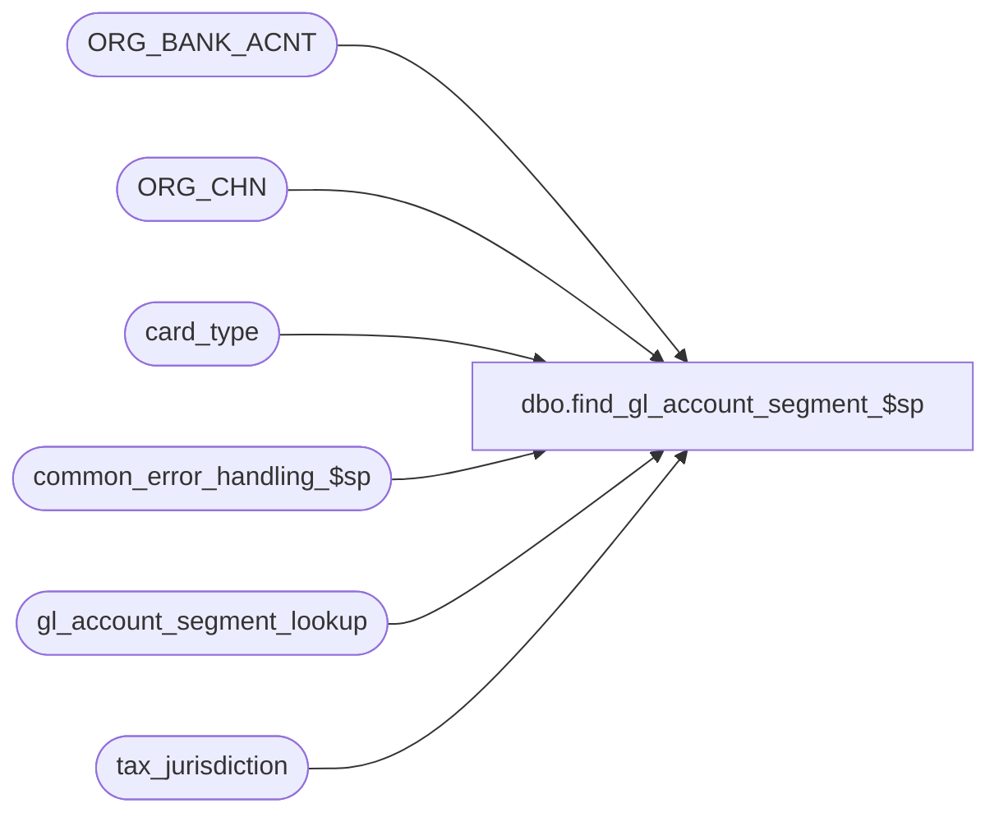

# dbo.find_gl_account_segment_$sp

**Database:** auditworks  
**Server:** bedrockdb01  

## Architecture Diagram



## Table Dependencies

| Referenced Table |
|---|
| ORG_BANK_ACNT |
| ORG_CHN |
| card_type |
| common_error_handling_$sp |
| gl_account_segment_lookup |
| tax_jurisdiction |

## Stored Procedure Code

```sql
CREATE proc [dbo].[find_gl_account_segment_$sp]  ( @process_no 				smallint,
  @lookup_segment 			tinyint,
  @store_no 				int,
  @line_object 				smallint,
  @class_code 				int,
  @discounted_line_object 		int,
  @tax_jurisdiction 			nchar(5),
  @store_deposit_destination 		smallint,
  @return_from_store 			int,
  @card_type 				nchar(1),
  @taxable				tinyint,
  @gl_account_no 			nvarchar(160)  OUTPUT,
  @errmsg 				nvarchar(255)  OUTPUT,
  @originating_store_no                 int,
  @empl_purch_flag			tinyint = 0,
  @failed_lookup_value			nvarchar(255)  OUTPUT,
  @failed_lookup_type			tinyint  OUTPUT,
  @gl_account_reference			nvarchar(20) = NULL
)

AS

/* Proc name:   find_gl_account_segment_$sp
Description: Returns G/L account number based on lookup_segment type.
	Called by create_gl_account_id_$sp

HISTORY
Date         Name       Defect#  Description
Jun01,17      Kiri    DAOM-2550  Add GL lookup option to dynamically choose between fulfilling store and originating store
Jan17,14     Vicci       149346  Support new store lookup types 17 to 24
Jan17,14     Vicci       149341  Support new Transaction G/L Account Reference lookup type 17
Sep27,11     Vicci       129992  Support taxed line-object-action lookup.
Jun15,10     Vicci       102089  Return @failed_lookup_value, @failed_lookup_type to facilitate logging to issue list.
May28,10     Vicci       117275  Look up desposit destination in ORG_BANK_ACNT not G/L account segment lookup.
Oct19,06     Tim        DV-1346  Apply defect 73379
Sep01,06     Phu          76719  Want a non-null string when it's concatenated with null string.
Mar03,06     Paul       DV-1328  apply 68370 to SA5
May25,04     David      DV-1071  Use ORG_CHN table as the new Store table.
Jun12,06     Vicci        73379  New type 15 (Empl purch flag/ GL replacement)
Feb28,06     Daphna       68370  New type 13 (Store / GL company) lookup from store_salesaudit
Apr19,02     ShuZ       1-CD0IX  Standardize  R3.5 Common error handling   
Jun11,01     ShuZ          8032  Transaction attribution to originating store   
Feb07,01     Maryam        7281  handle gl_account_segment_lookup_type 12.
Jan30,01     Maryam        7255  for discounted_line_object add @lookup_segment = lookup_type to where clause
  		                 and check the default value for lookup_segment 6 and 9. made the code
                                 more efficient.
May25,00     John G	   5864  Change '= NULL' to 'IS NULL' where applicable to mirror Oracle.
*/

DECLARE
	@errno 			int,
	@gl_segment 		nvarchar(20),
	@object_name            nvarchar(255),
	@process_name           nvarchar(100),
	@operation_name         nvarchar(100),
	@message_id		int

SET CONCAT_NULL_YIELDS_NULL OFF

SELECT @process_name = 'find_gl_account_segment_$sp',
      @message_id = 201068  	

IF @lookup_segment = 1 /* by store-store */
  BEGIN
    SELECT @gl_segment = GL_LOC_NUM
      FROM ORG_CHN
     WHERE ORG_CHN_NUM = @store_no
    SELECT @errno = @@error
    IF @errno <> 0
    BEGIN
      SELECT @errmsg = 'Failed to select from ORG_CHN',
             @object_name    = 'ORG_CHN',
             @operation_name = 'SELECT'
      GOTO error
    END
    IF @gl_segment IS NULL
      SELECT @failed_lookup_value = convert(nvarchar, @store_no),
             @failed_lookup_type = @lookup_segment
  END
ELSE
IF @lookup_segment IN ( 2, 3, 18, 19, 20 ) /* by store-group */
  BEGIN
    SELECT @gl_segment = gl_replacement_value
      FROM gl_account_segment_lookup
     WHERE @lookup_segment = lookup_type
       AND @store_no >= lookup_from_value
       AND @store_no <= lookup_to_value

    SELECT @errno = @@error
    IF @errno <> 0
      BEGIN
        SELECT @errmsg = 'Failed to select replacement segment from gl_account_segment_lookup by store-group.',
               @object_name    = 'gl_account_segment_lookup',
               @operation_name = 'SELECT'
        GOTO error
      END

    IF @gl_segment IS NULL 
      BEGIN
	SELECT @gl_segment = gl_replacement_value
	  FROM gl_account_segment_lookup
	 WHERE @lookup_segment = lookup_type
	   AND lookup_from_value = -1
	   AND lookup_to_value = -1
	SELECT @errno = @@error
	IF @errno <> 0
	BEGIN
          SELECT @errmsg = 'Failed to select default replacement segment from gl_account_segment_lookup by store-group.',
                 @object_name    = 'gl_account_segment_lookup',
                 @operation_name = 'SELECT'
          GOTO error
	END
      END --IF @gl_segment IS NULL    
      IF @gl_segment IS NULL
        SELECT @failed_lookup_value = convert(nvarchar, @store_no), @failed_lookup_type = @lookup_segment
  END
ELSE
IF @lookup_segment IN ( 5, 7 ) /* by class code */
  BEGIN
    SELECT @gl_segment = gl_replacement_value
      FROM gl_account_segment_lookup
     WHERE @lookup_segment = lookup_type
       AND @class_code >= lookup_from_value
       AND @class_code <= lookup_to_value
    SELECT @errno = @@error
    IF @errno <> 0
      BEGIN
        SELECT @errmsg = 'Failed to select from gl_account_segment_lookup (5,7)-1',
               @object_name    = 'gl_account_segment_lookup',
               @operation_name = 'SELECT'
        GOTO error
      END

    IF @gl_segment IS NULL
    BEGIN
      SELECT @gl_segment = gl_replacement_value
        FROM gl_account_segment_lookup
       WHERE @lookup_segment = lookup_type
         AND lookup_from_value = -1
         AND lookup_to_value = -1
      SELECT @errno = @@error
      IF @errno <> 0
      BEGIN
        SELECT @errmsg = 'Failed to select from gl_account_segment_lookup (5,7)-2',
               @object_name    = 'gl_account_segment_lookup',
               @operation_name = 'SELECT'
        GOTO error
      END
      
      IF @gl_segment IS NULL
        SELECT @failed_lookup_value = convert(nvarchar, @class_code), @failed_lookup_type = @lookup_segment
        
    END --IF @gl_segment IS NULL 
  END
ELSE
IF @lookup_segment = 4 /* by line_object ( discount type ) */
  BEGIN
    SELECT @gl_segment = gl_replacement_value
      FROM gl_account_segment_lookup
     WHERE @lookup_segment = lookup_type
       AND @line_object >= lookup_from_value
       AND @line_object <= lookup_to_value

    SELECT @errno = @@error
    IF @errno <> 0
      BEGIN
        SELECT @errmsg = 'Failed to select from gl_account_segment_lookup 4-1',
               @object_name    = 'gl_account_segment_lookup',
               @operation_name = 'SELECT'
        GOTO error
      END

    IF @gl_segment IS NULL  
    BEGIN
      SELECT @gl_segment = gl_replacement_value
        FROM gl_account_segment_lookup
       WHERE @lookup_segment = lookup_type
         AND lookup_from_value = -1
         AND lookup_to_value = -1
      SELECT @errno = @@error
      IF @errno <> 0
      BEGIN
        SELECT @errmsg = 'Failed to select from gl_account_segment_lookup 4-2',
               @object_name    = 'gl_account_segment_lookup',
               @operation_name = 'SELECT'
        GOTO error
      END

      IF @gl_segment IS NULL
        SELECT @failed_lookup_value = convert(nvarchar, @line_object), @failed_lookup_type = @lookup_segment

    END --IF @gl_segment IS NULL 
  END
ELSE
IF @lookup_segment = 6 /* by discounted_line_object_action */
  BEGIN
    SELECT @gl_segment = gl_replacement_value
      FROM gl_account_segment_lookup
     WHERE @lookup_segment = lookup_type
       AND @discounted_line_object >= lookup_from_value
       AND @discounted_line_object <= lookup_to_value
    SELECT @errno = @@error
    IF @errno <> 0
    BEGIN
      SELECT @errmsg = 'Failed to select from gl_account_segment_lookup 6-1',
             @object_name    = 'gl_account_segment_lookup',
             @operation_name = 'SELECT'
      GOTO error
    END

    IF @gl_segment IS NULL
    BEGIN
      SELECT @gl_segment = gl_replacement_value
        FROM gl_account_segment_lookup
       WHERE @lookup_segment = lookup_type
         AND lookup_from_value = -1
         AND lookup_to_value = -1
      SELECT @errno = @@error
      IF @errno <> 0
      BEGIN
        SELECT @errmsg = 'Failed to select from gl_account_segment_lookup 6-2',
               @object_name    = 'gl_account_segment_lookup',
               @operation_name = 'SELECT'
        GOTO error
      END
      
      IF @gl_segment IS NULL
        SELECT @failed_lookup_value = convert(nvarchar, @discounted_line_object), @failed_lookup_type = @lookup_segment

    END --IF @gl_segment IS NULL 
  END
ELSE
IF @lookup_segment = 8 /* by tax jurisdiction */
  BEGIN
    SELECT @gl_segment = gl_replacement_value
      FROM tax_jurisdiction
     WHERE @tax_jurisdiction = tax_jurisdiction
    SELECT @errno = @@error
    IF @errno <> 0
    BEGIN
      SELECT @errmsg = 'Failed to select from tax_jurisdiction 8',
             @object_name    = 'tax_jurisdiction',
             @operation_name = 'SELECT'
      GOTO error
    END
    
    IF @gl_segment IS NULL
      SELECT @failed_lookup_value = @tax_jurisdiction, @failed_lookup_type = @lookup_segment

  END
ELSE
IF @lookup_segment = 9 /* by store_deposit_destination */
  BEGIN
    SELECT @gl_segment = GL_RFRNC_NUM
      FROM ORG_BANK_ACNT
     WHERE @store_deposit_destination = BANK_ACNT_ID
       AND GL_RFRNC_NUM IS NOT NULL
    SELECT @errno = @@error
    IF @errno <> 0
    BEGIN
      SELECT @errmsg = 'Failed to select GL_RFRNC_NUM from ORG_BANK_ACNT',
             @object_name = 'ORG_BANK_ACNT',
             @operation_name = 'SELECT'
      GOTO error
    END
    
    IF @gl_segment IS NULL
    BEGIN
      SELECT @gl_segment = gl_replacement_value
        FROM gl_account_segment_lookup
       WHERE @lookup_segment = lookup_type
         AND @store_deposit_destination >= lookup_from_value
         AND @store_deposit_destination <= lookup_to_value
      SELECT @errno = @@error
      IF @errno <> 0
      BEGIN
        SELECT @errmsg = 'Failed to select from gl_account_segment_lookup 9-1',
               @object_name    = 'gl_account_segment_lookup',
               @operation_name = 'SELECT'
        GOTO error
      END
    END
    
    IF @gl_segment IS NULL
    BEGIN
      SELECT @gl_segment = gl_replacement_value
	FROM gl_account_segment_lookup
       WHERE @lookup_segment = lookup_type
         AND lookup_from_value = -1
         AND lookup_to_value = -1
      SELECT @errno = @@error
      IF @errno <> 0
      BEGIN
        SELECT @errmsg = 'Failed to select from gl_account_segment_lookup 9-2',
               @object_name    = 'gl_account_segment_lookup',
               @operation_name = 'SELECT'
        GOTO error
      END

      IF @gl_segment IS NULL
        SELECT @failed_lookup_value = convert(nvarchar, @store_deposit_destination), @failed_lookup_type = @lookup_segment
      
    END --IF @gl_segment IS NULL 
  END
ELSE
IF @lookup_segment = 10 /* by return_from_store */
  BEGIN
    SELECT @gl_segment = GL_LOC_NUM
      FROM ORG_CHN
     WHERE ORG_CHN_NUM = @return_from_store
    SELECT @errno = @@error
    IF @errno <> 0
    BEGIN
      SELECT @errmsg = 'Failed to select from ORG_CHN',
             @object_name    = 'ORG_CHN',
             @operation_name = 'SELECT'
      GOTO error
    END
    
    IF @gl_segment IS NULL
      SELECT @failed_lookup_value = convert(nvarchar, @return_from_store), @failed_lookup_type = @lookup_segment

  END
ELSE
IF @lookup_segment = 11 /* by card_type */
  BEGIN
    SELECT @gl_segment = gl_replacement_value
      FROM card_type
     WHERE card_type = @card_type
    SELECT @errno = @@error
    IF @errno <> 0
    BEGIN
      SELECT @errmsg = 'Failed to select from card_type',
             @object_name    = 'card_type',
             @operation_name = 'SELECT'
      GOTO error
    END

    IF @gl_segment IS NULL
      SELECT @failed_lookup_value = @card_type, @failed_lookup_type = @lookup_segment
      
  END
ELSE
IF @lookup_segment = 12 /* line_object/Taxability */
  BEGIN
    SELECT @gl_segment = gl_replacement_value
      FROM gl_account_segment_lookup
     WHERE @lookup_segment = lookup_type
       AND (@line_object * 10 + @taxable) >= lookup_from_value
       AND (@line_object * 10 + @taxable) <= lookup_to_value
    SELECT @errno = @@error
    IF @errno <> 0
    BEGIN
      SELECT @errmsg = 'Failed to select from gl_account_segment_lookup 12-1',
             @object_name    = 'gl_account_segment_lookup',
             @operation_name = 'SELECT'
      GOTO error
    END

    IF @gl_segment IS NULL
    BEGIN
      SELECT @gl_segment = gl_replacement_value
        FROM gl_account_segment_lookup
       WHERE @lookup_segment = lookup_type
         AND lookup_from_value = -1
         AND lookup_to_value = -1
      SELECT @errno = @@error
      IF @errno <> 0
      BEGIN
        SELECT @errmsg = 'Failed to select from gl_account_segment_lookup 12-2',
               @object_name    = 'gl_account_segment_lookup',
               @operation_name = 'SELECT'
        GOTO error
      END

      IF @gl_segment IS NULL
        SELECT @failed_lookup_value = convert(nvarchar, (@line_object * 10 + @taxable)), @failed_lookup_type = @lookup_segment

    END --IF @gl_segment IS NULL 
  END
ELSE
IF @lookup_segment = 13 /* by store-GL company no */
  BEGIN
    SELECT @gl_segment = GL_CMPNY_NUM
      FROM ORG_CHN
     WHERE ORG_CHN_NUM = @store_no
    SELECT @errno = @@error
    IF @errno <> 0
    BEGIN
      SELECT @errmsg = 'Failed to select gl_company',
             @object_name    = 'ORG_CHN',
             @operation_name = 'SELECT'
      GOTO error
    END
    
    IF @gl_segment IS NULL
      SELECT @failed_lookup_value = convert(nvarchar, @store_no), @failed_lookup_type = @lookup_segment

  END
ELSE
IF @lookup_segment = 14 /* by originating store */
  BEGIN
    SELECT @gl_segment = GL_LOC_NUM
      FROM ORG_CHN
     WHERE ORG_CHN_NUM = ISNULL(@originating_store_no, @store_no)
    SELECT @errno = @@error
    IF @errno <> 0
    BEGIN
      SELECT @errmsg = 'Failed to select from ORG_CHN (14)',
             @object_name    = 'ORG_CHN',
             @operation_name = 'SELECT'
      GOTO error
    END

    IF @gl_segment IS NULL
      SELECT @failed_lookup_value = convert(nvarchar, ISNULL(@originating_store_no, @store_no)), @failed_lookup_type = @lookup_segment

  END

ELSE
IF @lookup_segment = 15 /* line_object employee purchase flag */
BEGIN
  SELECT @gl_segment = gl_replacement_value
    FROM gl_account_segment_lookup
   WHERE @lookup_segment = lookup_type
     AND (@line_object * 10 + @empl_purch_flag) >= lookup_from_value
     AND (@line_object * 10 + @empl_purch_flag) <= lookup_to_value
  SELECT @errno = @@error
  IF @errno <> 0
  BEGIN
    SELECT @errmsg = 'Failed to select from gl_account_segment_lookup 15',
           @object_name    = 'gl_account_segment_lookup',
           @operation_name = 'SELECT'
    GOTO error
  END

  IF @gl_segment IS NULL
  BEGIN
    SELECT @gl_segment = gl_replacement_value
      FROM gl_account_segment_lookup
     WHERE @lookup_segment = lookup_type
       AND lookup_from_value = -1
       AND lookup_to_value = -1
    SELECT @errno = @@error
    IF @errno <> 0
    BEGIN
      SELECT @errmsg = 'Failed to select from gl_account_segment_lookup 12-2',
             @object_name    = 'gl_account_segment_lookup',
             @operation_name = 'SELECT'
      GOTO error
    END
    
    IF @gl_segment IS NULL
      SELECT @failed_lookup_value = convert(nvarchar, (@line_object * 10 + @empl_purch_flag)), @failed_lookup_type = @lookup_segment

  END --IF @gl_segment IS NULL 
END --IF @lookup_segment = 15
ELSE
IF @lookup_segment = 16 /* by taxed line-object-action */
  BEGIN
    SELECT @gl_segment = gl_replacement_value
      FROM gl_account_segment_lookup
     WHERE @lookup_segment = lookup_type
       AND @discounted_line_object >= lookup_from_value
 AND @discounted_line_object <= lookup_to_value
    SELECT @errno = @@error
    IF @errno <> 0
    BEGIN
      SELECT @errmsg = 'Failed to select from gl_account_segment_lookup 16-1',
             @object_name    = 'gl_account_segment_lookup',
             @operation_name = 'SELECT'
      GOTO error
    END

    IF @gl_segment IS NULL
    BEGIN
      SELECT @gl_segment = gl_replacement_value
        FROM gl_account_segment_lookup
       WHERE @lookup_segment = lookup_type
         AND lookup_from_value = -1
         AND lookup_to_value = -1
      SELECT @errno = @@error
      IF @errno <> 0
      BEGIN
        SELECT @errmsg = 'Failed to select from gl_account_segment_lookup 16-2',
               @object_name    = 'gl_account_segment_lookup',
               @operation_name = 'SELECT'
        GOTO error
      END
      
      IF @gl_segment IS NULL
        SELECT @failed_lookup_value = convert(nvarchar, @discounted_line_object), @failed_lookup_type = @lookup_segment

    END --IF @gl_segment IS NULL 
  END
ELSE
IF @lookup_segment = 17 /* Transaction G/L Account Reference */
  BEGIN
    SELECT @gl_segment = @gl_account_reference    
    
    IF LTRIM(RTRIM(@gl_segment)) = ''
      SELECT @gl_segment = NULL
    
    IF @gl_segment IS NULL  
    BEGIN
      SELECT @gl_segment = gl_replacement_value
        FROM gl_account_segment_lookup
       WHERE @lookup_segment = lookup_type
         AND lookup_from_value = -1
         AND lookup_to_value = -1
      SELECT @errno = @@error
      IF @errno <> 0
      BEGIN
        SELECT @errmsg = 'Failed to select from gl_account_segment_lookup 17',
               @object_name    = 'gl_account_segment_lookup',
               @operation_name = 'SELECT'
        GOTO error
      END
    END
    
    IF @gl_segment IS NULL
      SELECT @failed_lookup_value = '', @failed_lookup_type = @lookup_segment

  END
ELSE
IF @lookup_segment IN (21, 22)  /* by return-from-store - group */
  BEGIN
    SELECT @gl_segment = gl_replacement_value
      FROM gl_account_segment_lookup
     WHERE @lookup_segment = lookup_type
       AND @return_from_store >= lookup_from_value
       AND @return_from_store <= lookup_to_value

    SELECT @errno = @@error
    IF @errno <> 0
      BEGIN
        SELECT @errmsg = 'Failed to select replacement segment from gl_account_segment_lookup by return-from-store - group.',
               @object_name    = 'gl_account_segment_lookup',
               @operation_name = 'SELECT'
        GOTO error
      END

    IF @gl_segment IS NULL 
      BEGIN
	SELECT @gl_segment = gl_replacement_value
	  FROM gl_account_segment_lookup
	 WHERE @lookup_segment = lookup_type
	   AND lookup_from_value = -1
	   AND lookup_to_value = -1
	SELECT @errno = @@error
	IF @errno <> 0
	BEGIN
          SELECT @errmsg = 'Failed to select default replacement segment from gl_account_segment_lookup by return-from-store - group.',
                 @object_name    = 'gl_account_segment_lookup',
                 @operation_name = 'SELECT'
          GOTO error
	END
      END --IF @gl_segment IS NULL    
      IF @gl_segment IS NULL
        SELECT @failed_lookup_value = convert(nvarchar, @return_from_store), @failed_lookup_type = @lookup_segment
  END

ELSE
IF @lookup_segment IN (23, 24)
  BEGIN
    SELECT @gl_segment = gl_replacement_value
      FROM gl_account_segment_lookup
     WHERE @lookup_segment = lookup_type
       AND ISNULL(@originating_store_no, @store_no) >= lookup_from_value
       AND ISNULL(@originating_store_no, @store_no) <= lookup_to_value

    SELECT @errno = @@error
    IF @errno <> 0
      BEGIN
        SELECT @errmsg = 'Failed to select replacement segment from gl_account_segment_lookup by merch originating store - group.',
               @object_name    = 'gl_account_segment_lookup',
               @operation_name = 'SELECT'
        GOTO error
      END

    IF @gl_segment IS NULL 
      BEGIN
	SELECT @gl_segment = gl_replacement_value
	  FROM gl_account_segment_lookup
	 WHERE @lookup_segment = lookup_type
	   AND lookup_from_value = -1
	   AND lookup_to_value = -1
	SELECT @errno = @@error
	IF @errno <> 0
	BEGIN
          SELECT @errmsg = 'Failed to select default replacement segment from gl_account_segment_lookup by merch originating store - group.',
                 @object_name    = 'gl_account_segment_lookup',
                 @operation_name = 'SELECT'
          GOTO error
	END

      END --IF @gl_segment IS NULL    
      IF @gl_segment IS NULL
 SELECT @failed_lookup_value = convert(nvarchar, ISNULL(@originating_store_no, @store_no)), @failed_lookup_type = @lookup_segment
  END
ELSE
IF @lookup_segment IN (25)
  BEGIN
    SELECT @gl_segment = gl_replacement_value
      FROM gl_account_segment_lookup
     WHERE @lookup_segment = lookup_type
       AND ISNULL(@originating_store_no, @store_no) >= lookup_from_value
       AND ISNULL(@originating_store_no, @store_no) <= lookup_to_value

    SELECT @errno = @@error
    IF @errno <> 0 
      BEGIN
        SELECT @errmsg = 'Failed to select replacement segment from gl_account_segment_lookup by EOM originating store - group.',
               @object_name    = 'gl_account_segment_lookup',
               @operation_name = 'SELECT'
        GOTO error
      END

    IF @gl_segment IS NULL 
      BEGIN
	    SELECT @gl_segment = gl_replacement_value
	      FROM gl_account_segment_lookup
	     WHERE @lookup_segment = lookup_type
			AND lookup_from_value = -1
			AND lookup_to_value = -1
	    SELECT @errno = @@error
	    IF @errno <> 0
	      BEGIN
            SELECT @errmsg = 'Failed to select default replacement segment from gl_account_segment_lookup by EOM selling/originating store - group.',
                 @object_name    = 'gl_account_segment_lookup',
                 @operation_name = 'SELECT'
            GOTO error
	      END
      END --IF @gl_segment IS NULL  
	  -- EOM addition
      SELECT @gl_segment = GL_LOC_NUM
        FROM ORG_CHN
       WHERE ORG_CHN_NUM = @store_no
      SELECT @errno = @@error
      IF @errno <> 0
        BEGIN
          SELECT @errmsg = 'Failed to select from ORG_CHN',
             @object_name    = 'ORG_CHN',
             @operation_name = 'SELECT'
          GOTO error
        END	  
      IF @gl_segment IS NULL
		SELECT @failed_lookup_value = convert(nvarchar, ISNULL(@originating_store_no, @store_no)), @failed_lookup_type = @lookup_segment
  END
ELSE
IF @lookup_segment IN (26, 27)
  BEGIN
    SELECT @gl_segment = gl_replacement_value
      FROM gl_account_segment_lookup
     WHERE @lookup_segment = lookup_type
       AND ISNULL(@originating_store_no, @store_no) >= lookup_from_value
       AND ISNULL(@originating_store_no, @store_no) <= lookup_to_value

    SELECT @errno = @@error
    IF @errno <> 0 
      BEGIN
        SELECT @errmsg = 'Failed to select replacement segment from gl_account_segment_lookup by EOM Fulfilment store - group.',
               @object_name    = 'gl_account_segment_lookup',
               @operation_name = 'SELECT'
        GOTO error
      END

    IF @gl_segment IS NULL 
      BEGIN
	    SELECT @gl_segment = gl_replacement_value
	      FROM gl_account_segment_lookup
	     WHERE @lookup_segment = lookup_type
	      AND lookup_from_value = -1
	      AND lookup_to_value = -1
	    SELECT @errno = @@error
	    IF @errno <> 0
	      BEGIN
            SELECT @errmsg = 'Failed to select default replacement segment from gl_account_segment_lookup by EOM Fulfilment  store - group.',
                 @object_name    = 'gl_account_segment_lookup',
                 @operation_name = 'SELECT'
            GOTO error
	      END
      END --IF @gl_segment IS NULL    
	  -- EOM addition
      SELECT @gl_segment = GL_LOC_NUM
        FROM ORG_CHN
       WHERE ORG_CHN_NUM = @store_no
      SELECT @errno = @@error
      IF @errno <> 0
        BEGIN
          SELECT @errmsg = 'Failed to select from ORG_CHN',
             @object_name    = 'ORG_CHN',
             @operation_name = 'SELECT'
          GOTO error
        END	  
      IF @gl_segment IS NULL
		SELECT @failed_lookup_value = convert(nvarchar, ISNULL(@originating_store_no, @store_no)), @failed_lookup_type = @lookup_segment
  END


IF @gl_segment IS NULL  
  SELECT @gl_account_no = NULL
ELSE
  SELECT @gl_account_no = @gl_account_no + @gl_segment

RETURN


error:   /* Common error handler */
	
  EXEC common_error_handling_$sp @process_no, @errno, @errmsg, 0, @message_id, 
                                 @process_name, @object_name, @operation_name, 1

  RETURN
```

