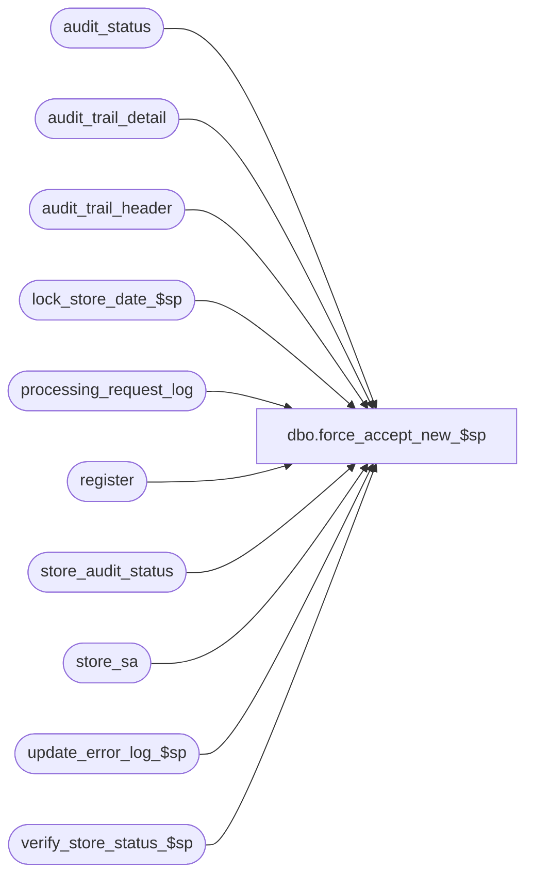

# dbo.force_accept_new_$sp

**Database:** auditworks  
**Server:** bedrockdb01  

## Architecture Diagram



## Table Dependencies

| Referenced Table |
|---|
| audit_status |
| audit_trail_detail |
| audit_trail_header |
| lock_store_date_$sp |
| processing_request_log |
| register |
| store_audit_status |
| store_sa |
| update_error_log_$sp |
| verify_store_status_$sp |

## Stored Procedure Code

```sql
create proc dbo.force_accept_new_$sp 
@name_of_user varchar(255),
@datetime_of_request smalldatetime

AS

/* Version:1.03 Date:1996/07/11 */
/* Proc name : force_accept_$sp
   Description: Sets audit_status to accepted = 300 if the only auditing concerns are
     related to media rec. Sets store_audit_status to the min audit_status.
   Called by Power Builder.

HISTORY
Date     Author		Def# Description
Jun14,01 Winnie		8085 correct audit trail logic
Feb05,01 Phu		7324 select min(audit_status) to avoid error 1422
Dec21,00 Winnie		6791 Audit trail enchancements.
May31,00 Paul		6394 pass flag to verify_store_status_$sp to avoid checking
				store level over/short.
May12,00 Paul		6302 Do not call request_registers_$sp since registers were already
			      inserted by accept_register_$sp. Call verify_store_status_$sp.
Mar01,00 Phu		5900 Change @@fetch_status > 0 to @@fetch_status <> 0 for MS SQL compatibility
Sep27,99 Paul		5409 Allow forceaccept of store
Jun15,99 Shapoor	4799 The store/date was being left LOCKED when registers are
                              FORCE ACCEPTED.
Mar23,99 Paul		4351 Check store level over/short
         Phu		Author
*/

DECLARE
	@after_description		varchar(255),
	@all_register			smallint,
	@before_description		varchar(255),
	@current_date 			smalldatetime,
	@cursor_open 			tinyint,
	@date_reject_id 		tinyint,
	@entry_id			numeric(12,0),
	@errmsg 			varchar(255),
	@errno 				int,
	@errnum 			int,
	@key_value			varchar(255),
	@key_value_descr		varchar(255),
	@min_audit_status 		smallint,
	@process_no 			smallint,
	@processing_status 		smallint,
	@reg_name			varchar(255),
	@register_no 			smallint,
	@sales_date 			smalldatetime,
	@store_name			varchar(255),
	@store_no 			int,
	@user_name_returned 		varchar(255),
	@rows				int

IF @name_of_user IS NULL
 OR @datetime_of_request IS NULL
  BEGIN
	SELECT @errno = 201510,
		@errmsg = 'There were Invalid passing arguments passed to the store procedure'
	GOTO error
  END

SELECT  @current_date = getdate(),
	@cursor_open = 0,
	@process_no = 76

CREATE TABLE #register_status (
	store_no		int not null,
	register_no		smallint not null,
	sales_date		smalldatetime not null,
	date_reject_id		tinyint not null,
	processing_status	smallint not null,
	audit_status		smallint not null )

SELECT @errno = @@error
IF @errno <> 0
  BEGIN
   SELECT @errmsg = 'Failed to create temp table #register_status'
   GOTO error
  END

SELECT	DISTINCT store_no,
       	sales_date,
	date_reject_id
 INTO #store_list
  FROM processing_request_log
 WHERE user_name = @name_of_user
   AND request_datetime = @datetime_of_request
   AND processing_status != 0
   AND processing_status <= 20

SELECT @errno = @@error
IF @errno <> 0
  BEGIN
   SELECT @errmsg = 'Failed to build temp table #store_list'
   GOTO error
  END

DECLARE process_force_accept_crsr CURSOR
FOR
SELECT 	store_no,
	sales_date,
	date_reject_id
FROM #store_list

SELECT @errno = @@error
IF @errno <> 0
  BEGIN
	SELECT @errmsg = 'Unable to declare cursor process_force_accept_crsr'
	GOTO error
  END

OPEN process_force_accept_crsr
SELECT  @cursor_open = 1

WHILE 1 = 1
  BEGIN
    FETCH process_force_accept_crsr INTO
	@store_no,
	@sales_date,
	@date_reject_id

    IF @@fetch_status <> 0
      BREAK

    SELECT @errno = 0,
           @all_register = 0
    EXEC lock_store_date_$sp @store_no, @sales_date, @date_reject_id,
      @process_no, @errno OUTPUT, @user_name_returned OUTPUT

    SELECT @errnum = @@error
    IF @errnum <> 0
      BEGIN
       SELECT @errmsg = 'Unable to execute lock_store_date_$sp', @errno = @errnum
       GOTO error
      END

    IF @errno = 201550 /* store_date currently in use. bypass it. */
      BEGIN
       UPDATE processing_request_log
         SET processing_status = 200
        WHERE user_name = @name_of_user
          AND request_datetime = @datetime_of_request
          AND store_no = @store_no
          AND sales_date = @sales_date
          AND date_reject_id = @date_reject_id

       CONTINUE
      END

    INSERT #register_status (
	store_no,
	register_no,
	sales_date,
	date_reject_id,
	processing_status,
	audit_status )
    SELECT
	rl.store_no,
	rl.register_no,
	rl.sales_date,
	rl.date_reject_id,
	processing_status,
	audit_status
      FROM  processing_request_log rl, audit_status st
     WHERE user_name = @name_of_user
       AND request_datetime = @datetime_of_request
       AND rl.store_no = @store_no
       AND rl.sales_date = @sales_date
       AND rl.date_reject_id = @date_reject_id
       AND processing_status != 0
       AND processing_status <= 20
       AND rl.store_no = st.store_no
       AND rl.sales_date = st.sales_date
       AND rl.date_reject_id = st.date_reject_id
       AND rl.register_no = st.register_no

    UPDATE #register_status
      SET processing_status = 41 -- Ignored -Store/Register closed/unused
     WHERE audit_status >= 900
       AND audit_status <= 901

    UPDATE #register_status
      SET processing_status = 42 -- Ignored -Transactions deleted
     WHERE audit_status = 902

    UPDATE #register_status
      SET processing_status = 43 -- Ignored -Transactions moved
     WHERE (audit_status = 903 OR audit_status = 905)

    UPDATE processing_request_log
      SET processing_status = rs.processing_status
      FROM  #register_status rs, processing_request_log rl
     WHERE rl.user_name = @name_of_user
       AND rl.request_datetime = @datetime_of_request
       AND rs.processing_status >= 41
       AND rs.store_no = rl.store_no
       AND rs.register_no = rl.register_no
       AND rs.sales_date = rl.sales_date
       AND rs.date_reject_id = rl.date_reject_id

    SELECT @errno = @@error
    IF @errno <> 0
	BEGIN
	 SELECT @errmsg = 'Unable to update processing_request_log (closed)'
	 GOTO error
	END

    BEGIN TRAN
	UPDATE audit_status
	 SET audit_status = 901,
	     status_date = @current_date
	  FROM  #register_status rs, audit_status st
	 WHERE rs.store_no = st.store_no
	   AND rs.register_no = st.register_no
	   AND rs.sales_date = st.sales_date
	   AND rs.date_reject_id = st.date_reject_id
	   AND processing_status = 20 -- Cannot be Accepted -Missing Store/Reg

	SELECT @errno = @@error
	IF @errno <> 0
	  BEGIN
		SELECT @errmsg = 'Unable to update table audit_status'
		GOTO error
	  END

/* log information into Audit trail header and audit trail detail if the audit status change */


  SELECT  @min_audit_status = MIN(st.audit_status)
    FROM  #register_status rs, audit_status st
  	   WHERE rs.store_no = st.store_no
	     AND rs.register_no = st.register_no
  	     AND rs.sales_date = st.sales_date
	     AND rs.date_reject_id = st.date_reject_id
	     AND st.audit_status IN (100, 200)

  SELECT @errno = @@error
    IF @errno != 0
      BEGIN
        SELECT @errmsg = 'Failed to select min(audit_status) from audit_status'
        GOTO error
      END

  UPDATE processing_request_log
    SET processing_status = 50
   FROM processing_request_log rl, audit_status st
  WHERE rl.user_name = @name_of_user
    AND rl.request_datetime = @datetime_of_request
    AND rl.processing_status < 20
    AND rl.store_no = @store_no
    AND rl.sales_date = @sales_date
    AND rl.date_reject_id = @date_reject_id
    AND st.store_no = rl.store_no
    AND st.register_no = rl.register_no
    AND st.sales_date = rl.sales_date
    AND st.date_reject_id = rl.date_reject_id
    AND st.audit_status IN (100, 200)


  SELECT @errno = @@error, 
         @rows = @@rowcount
  IF @errno <> 0
    BEGIN
      SELECT @errmsg = 'Unable to update processing_request_log (50)'
      GOTO error
    END

  IF @rows > 0 
    BEGIN
      UPDATE audit_status
         SET audit_status = 300,
             status_date = @current_date,
             status_set_by = @name_of_user
        FROM #register_status rs, audit_status st
       WHERE rs.store_no = st.store_no
         AND rs.register_no = st.register_no
         AND rs.sales_date = st.sales_date
         AND rs.date_reject_id = st.date_reject_id
         AND st.audit_status IN (100, 200)

      SELECT @errno = @@error
      IF @errno <> 0
        BEGIN
   	  SELECT @errmsg = 'Unable to update table audit_status'
  	  GOTO error
        END

      SELECT @before_description = '', 
             @after_description = '',
             @key_value =  CONVERT(VARCHAR, @store_no)
             + '/' + CONVERT(VARCHAR, @register_no)
             + '/' + CONVERT(VARCHAR(11), @sales_date)

      SELECT @store_name = store_name
        FROM store_sa 
       WHERE @store_no = store_no

      SELECT @all_register = COUNT(store_no)
        FROM processing_request_log 
       WHERE user_name = @name_of_user
         AND request_datetime = @datetime_of_request
         AND store_no = @store_no
         AND sales_date = @sales_date
         AND date_reject_id = @date_reject_id
         AND processing_status = 50
         AND register_no <= 0

      IF @all_register = 1
        BEGIN   
          INSERT audit_trail_header
                 (entry_date, 
                 table_name, 
                 table_key, 
                 table_key_descr, 
                 user_name, 
                 action, 
                 function_no,
                 store_no,
                 register_no,
                 transaction_date,
                 date_reject_id)
  
          VALUES (getdate(), 
                 'audit_status', 
                 CONVERT(VARCHAR, @store_no)
                 + '/' + '0'
     	         + '/' + CONVERT(VARCHAR(11), @sales_date), 
                 @store_name + '/' + 'All Register' + '/' +
                 CONVERT(VARCHAR(11), @sales_date), 
                 suser_sname(), 
                 2, 
                 @process_no,
                 @store_no,
                 0,
                 @sales_date,
                 @date_reject_id)

        SELECT @errno = @@error,
               @entry_id = @@identity
        IF @errno !=0
          BEGIN
            SELECT @errmsg = 'Failed to INSERT audit_trail_header.'
            GOTO error
          END  

        INSERT audit_trail_detail
                (entry_id,
                column_name, 
                before_value, 
                after_value, 
                before_description, 
                after_description)
                
        VALUES (@entry_id,
                'audit_status',
                CONVERT(VARCHAR,@min_audit_status),
                '300',
                @before_description,
                @after_description)
        SELECT @errno = @@error
        IF @errno !=0
          BEGIN
            SELECT @errmsg = 'Failed to INSERT audit_trail_detail.'
            GOTO error
          END                 
      END -- IF @all_register = 1

      IF @all_register = 0 -- some registers were possibly accept but not entire store
        BEGIN   
          INSERT audit_trail_header
             (entry_date, 
             table_name, 
             table_key, 
             table_key_descr, 
             user_name, 
             action, 
             function_no,
             store_no,
             register_no,
             transaction_date,
             date_reject_id)
  
        SELECT getdate(), 
             'audit_status', 
             CONVERT(VARCHAR, @store_no)
             + '/' + CONVERT(VARCHAR, r.register_no)
     	     + '/' + CONVERT(VARCHAR(11), @sales_date), 
             @store_name + '/' + r.register_name + '/' +
             CONVERT(VARCHAR(11), @sales_date), 
             suser_sname(), 
             2, 
             @process_no,
             @store_no,
             r.register_no,
             @sales_date,
             @date_reject_id
       FROM processing_request_log ps , register r
      WHERE @store_no        = ps.store_no
        AND @sales_date      = ps.sales_date
        AND @date_reject_id  = ps.date_reject_id
        AND ps.register_no   = r.register_no
        AND ps.store_no      = r.store_no
        AND ps.processing_status = 50

      SELECT @errno = @@error
      IF @errno !=0
        BEGIN
          SELECT @errmsg = 'Failed to INSERT audit_trail_header.'
          GOTO error
        END       

      INSERT audit_trail_detail
               (entry_id,
                column_name, 
                before_value, 
                after_value, 
                before_description, 
                after_description)
                
       SELECT   DISTINCT entry_id,
                'audit_status',
                CONVERT(VARCHAR,rs.audit_status),
                '300',
                @before_description,
                @after_description
         FROM    audit_trail_header h, #register_status rs 
        WHERE   rs.store_no = h.store_no
          AND   h.transaction_date = rs.sales_date
          AND   h.function_no = @process_no

      SELECT @errno = @@error
      IF @errno !=0
        BEGIN
          SELECT @errmsg = 'Failed to INSERT audit_trail_detail.'
          GOTO error
        END                        
     END  -- IF @all_register = 0
  END -- if @rows > 0

  SELECT @errmsg = 'force accept' -- flag to avoid checking store-level over/short
    EXEC verify_store_status_$sp @store_no, @sales_date, @date_reject_id,
			@errmsg OUTPUT
  SELECT @errno = @@error
  IF @errno != 0
    BEGIN
      IF @errmsg IS NULL
      SELECT @errmsg = 'Unable to exec verify_store_status_$sp'
      GOTO error
    END	

  UPDATE store_audit_status
    SET store_status_date = @current_date,
        status_set_by = @name_of_user,
        update_in_progress = 0  /* Unlock store_date */
  WHERE store_no = @store_no
    AND sales_date = @sales_date
    AND date_reject_id = @date_reject_id

    SELECT @errno = @@error
    IF @errno <> 0
      BEGIN
        SELECT @errmsg = 'Unable to unlock (update) table store_audit_status'
        GOTO error
      END

    COMMIT TRAN
    TRUNCATE TABLE #register_status

    SELECT @errno = @@error
    IF @errno <> 0
      BEGIN
	SELECT @errmsg = 'Unable to truncate table #register_status'
	GOTO error
      END

  END /* While 1=1 */

CLOSE process_force_accept_crsr
DEALLOCATE process_force_accept_crsr

RETURN


error:   /* Common error handler */

	IF @@trancount > 0
		ROLLBACK TRANSACTION

	IF @errno < 100000
	  SELECT @errno = @errno + 100000
	SELECT @errmsg = 'force_accept_$sp: ' + @errmsg

	IF @@trancount = 0 AND @errno < 200000
		EXEC update_error_log_$sp @process_no, @errno, @errmsg

	IF @cursor_open <> 0
	  BEGIN
		CLOSE process_force_accept_crsr
		DEALLOCATE process_force_accept_crsr
	  END

	RAISERROR @errno @errmsg
	RETURN
```

