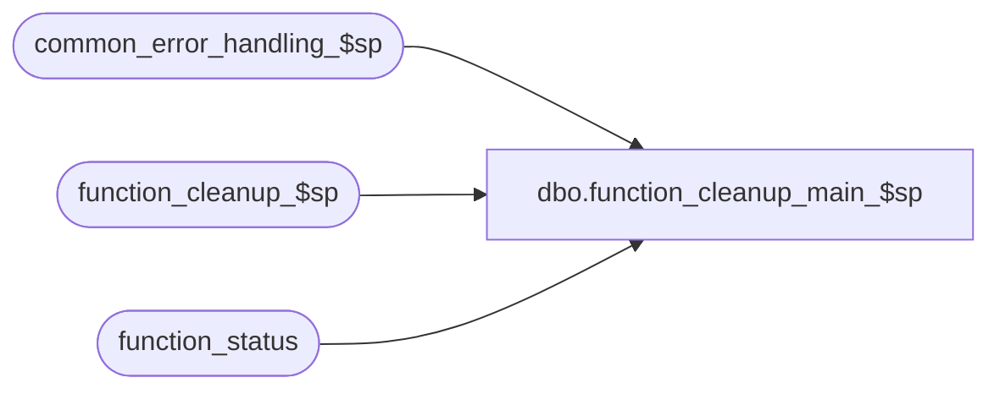

# dbo.function_cleanup_main_$sp

**Database:** auditworks  
**Server:** bedrockdb01  

## Architecture Diagram



## Table Dependencies

| Referenced Table |
|---|
| common_error_handling_$sp |
| function_cleanup_$sp |
| function_status |

## Stored Procedure Code

```sql
CREATE proc  dbo.function_cleanup_main_$sp @process_id		binary(16), -- guid in 0x format
@lock_by_user_id	int = 1 -- user_id of process calling the cleanup, can default to 1

AS

DECLARE
  @cursor_open		tinyint,
  @errmsg		nvarchar(2000),
  @errno		int,
  @function_no		smallint,
  @halted_process_id	binary(16),
  @object_name          nvarchar(255),
  @process_name         nvarchar(100),
  @operation_name       nvarchar(100),
  @message_id		int,
  @rollback_flag	tinyint,
  @user_id		int,
  @errmsg2		nvarchar(2000);

/* Proc Name: function_cleanup_main_$sp
   Description: cleans up all halted processes for a specific @process_id.
    Called by SA recovery n-tier object after errors in called stored procs or when halted guids are detected
    during foundation login authentication.
    For support purposes, a value of null can be passed in @process_id to clean up all halted processes
    providing that no users are currently executing SA functionality against the db (pass any number in @lock_by_user_id).

   NOTE: also see check_cleanup_$sp (called by UI to present halted and interrupted processes) and mass_auto_revalidate_$sp which 
         calls function cleanup for some UI functions which have been left in progress for more than 30 minutes.

REMINDER TO CC: When manually recovering halted processes in SA5, it is necessary to pass in process_id in 0x format.
	STEPS to recover halted process > 30 min old (must exclude recent entries that may still be executing) :
	 1) SELECT process_id, entry_date
	    FROM function_status WHERE entry_date < DATEADD(mi,-30, getdate())
	    ORDER BY entry_date
	 2) exec function_cleanup_main_$sp 0x1234, 1 (where the 0x1234 value is from the select of process_id above) 

Unicode version.

HISTORY
Date     Name           Def#  Desc
Sep20,16 Vicci      DAOM-1396 Expand function_no to be smallint to match function_status.
Apr28,15 Vicci     TFS-118970 Correct operation-name/object-name for business rule error 201527 to avoid confusion.
                              Fix order of cursor to ensure than when a single process (such as some of the mass corrects) use multiple function
                              status entries under different function numbers (one for process work, one for store/date lock, one for trans add)
                              that the recovery of the "released to cleanup" one (the innermost i.e. latest one) happens first.
Jan23,14 Vicci         149479 Use TRY/CATCH logic, since otherwise errors such as Error:8114 Message:Error converting data type nvarchar to numeric are not caught nor reported in any way.
Apr26,11 Paul                 add default on @lock_by_user_id, added comments re recovery by CC
Jun28,10 Vicci         118310 Don't raise roll-back-of-user-changes warning if called by the system (i.e. user -1) as in
                              the case of a call from fix_future_dates_$sp.
Oct16,08 Paul       1-3YDOA1  added order by clause to ensure that oldest halted processes get cleaned up first
Nov11,05 Paul        DV-1323  handle multiple rows with the same guid but different functions. May occur due to failed cleanup.
Jun16,05 Paul        DV-1282  raise error 201527 when cleanup succeeds but the user's work has been reversed.    
Sep30,04 Paul        DV-1146  pass in cleanup user_id
Apr22,04 Maryam      DV-1071  Pass @process_id and @user_id to common_error_handling_$sp
Apr08,04 Paul        DV-1068  SA 5 changes. Now called by n-tier object.
Jun04,03 Paul          11293  avoid locking functions that are cleaned up by frontend logic, e.g. express add (identical to 1-LTO11)
Apr19,02 ShuZ        1-CD0IX  Standardize  R3.5 Common error handling
Mar01,00 Phu		5900  Change @@fetch_status > 0 to @@fetch_status <> 0 for MS SQL compatibility
Apr28,98 Paul
Aug14,96 Seb                  author
*/

SELECT @process_name = 'function_cleanup_main_$sp',
       @message_id = 201068,
       @rollback_flag  = 0;

BEGIN TRY

SELECT @errmsg = 'Failed to process cursor cleanup_cursor.',
       @object_name = 'cleanup_cursor',
 @operation_name = 'DECLARE';
DECLARE cleanup_cursor CURSOR FAST_FORWARD
  FOR  
  SELECT user_id, 
	 function_no,
	 process_id
    FROM function_status WITH (NOLOCK)
   WHERE (process_id = @process_id -- called from gui
      OR @process_id IS NULL) -- clean up all (used by support)
   ORDER BY COALESCE(released_to_cleanup, 0) DESC, entry_date ASC;

SELECT @operation_name = 'OPEN';
OPEN cleanup_cursor;
SELECT @cursor_open = 1;

WHILE 1=1
BEGIN

  SELECT @operation_name = 'FETCH';
  FETCH cleanup_cursor INTO
  	@user_id,
	@function_no,
	@halted_process_id;

  IF @@fetch_status <> 0	/* no more data */
    BREAK;

  SELECT @errmsg = ' ';

  SELECT @errmsg = 'Failed to execute function_cleanup_$sp.',
         @object_name = 'function_cleanup_$sp',
        @operation_name = 'EXECUTE';
  EXEC function_cleanup_$sp @halted_process_id, @lock_by_user_id, @function_no, @errmsg OUTPUT;

  IF @errmsg = 'ROLLBACK' -- cleanup succeeded but user changes were rolled back
    SELECT @rollback_flag = 1;

END; /* While 1=1 */

SELECT @errmsg = 'Failed to complete cursor cleanup_cursor.',
       @object_name = 'cleanup_cursor',
       @operation_name = 'CLOSE';
CLOSE cleanup_cursor;
SELECT @operation_name = 'DEALLOCATE';
DEALLOCATE cleanup_cursor
SELECT @cursor_open = 0;

IF @rollback_flag = 1 AND IsNull(@lock_by_user_id, -1) <> -1
BEGIN
  SELECT @object_name = 'function_cleanup',
         @operation_name = 'EXECUTE',
         @errno = 201527,
	 @message_id = 201527,
	 @errmsg = 'User changes were not saved.  ';
  GOTO business_rule_error;
END;

RETURN;

business_rule_error:

  SELECT @message_id = @errno;
  SELECT @errmsg2 = @process_name + ':  ' + COALESCE(@errmsg, '');
  SELECT @errmsg = @errmsg2;
  EXEC common_error_handling_$sp @function_no, @errno, @errmsg2, 0, @message_id, 
                                 @process_name, @object_name, @operation_name, 
                                 0, 1, 0, null, 0, null, null, null,
	                         null, null, null, 0, @process_id, @user_id;
  RETURN;

END TRY

BEGIN CATCH
  SELECT @errno = ERROR_NUMBER();
  IF @errmsg2 IS NULL
  BEGIN
    SELECT @errmsg2 = @process_name + ':  ' + COALESCE(@errmsg, '') + ERROR_MESSAGE() + ' Line: ' + CONVERT(nvarchar, ERROR_LINE());
  END;
  SELECT @errmsg = @errmsg2;  

  IF @cursor_open = 1 
  BEGIN
    CLOSE cleanup_cursor;
    DEALLOCATE cleanup_cursor;
  END;

  EXEC common_error_handling_$sp @function_no, @errno, @errmsg2, 0, @message_id, 
                                 @process_name, @object_name, @operation_name, 
                                 0, 1, 0, null, 0, null, null, null,
	                         null, null, null, 0, @process_id, @user_id;
	                           
  RETURN;
END CATCH;
```

