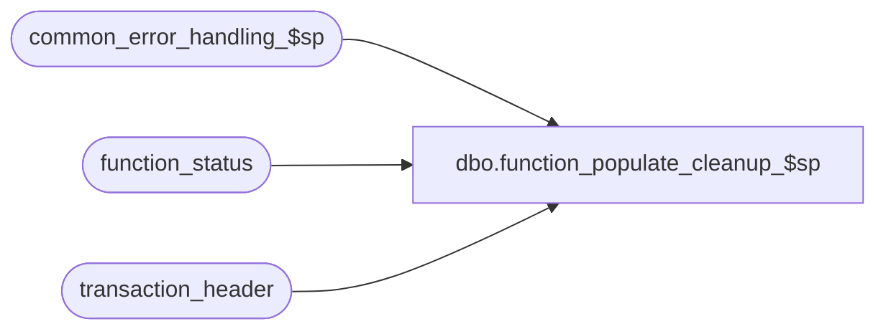

# dbo.function_populate_cleanup_$sp

**Database:** auditworks  
**Server:** bedrockdb01  

## Architecture Diagram



## Table Dependencies

| Referenced Table |
|---|
| common_error_handling_$sp |
| function_status |
| transaction_header |

## Stored Procedure Code

```sql
create proc dbo.function_populate_cleanup_$sp 
( @process_id                   binary(16) = null,
  @user_id                      int = -1)
AS

/* Description: Called by UI to view halted processes. 
HISTORY     
DATE     NAME              DEF# DESC
Jan04,11 Paul            105313 Use unicode datatypes
Mar12,10 Vicci           115597 Uplift to S/A 5.0 disregard spid since not applicable in n-tier environment.
Apr19,02 ShuZ           1-CD0IX Standardize  R3.5 Common error handling
Aug14,96 Seb
*/

DECLARE 
@errno			int,
@errmsg 		nvarchar(255),
@object_name            nvarchar(255),
@process_name           nvarchar(100),
@process_no             smallint,
@operation_name         nvarchar(100),
@message_id		int

SELECT @process_name = 'function_populate_cleanup_$sp',
       @message_id = 201068,
       @process_no = 36  

SELECT fs.user_id,
       fs.process_id,
       fs.function_no,
       fs.status,
       fs.entry_date,
       CASE WHEN fs.lock_flag > 0 THEN fs.lock_date ELSE NULL END lock_date,
       CASE WHEN fs.lock_flag > 0 THEN fs.lock_by_user_id ELSE NULL END lock_by_user_id,
       COALESCE(fs.store_no, h.store_no) store_no, 
       COALESCE(fs.register_no, h.register_no) register_no, 
       COALESCE(fs.transaction_date, h.transaction_date) transaction_date,
       COALESCE(fs.from_transaction_no, h.transaction_no) transaction_no, 
       COALESCE(fs.transaction_series, h.transaction_series) transaction_series,
       COALESCE(fs.date_reject_id, h.date_reject_id) date_reject_id, 
       fs.to_store_no,
       fs.to_register_no,
       fs.to_transaction_date,
       fs.to_transaction_no,
       fs.file_name,
       fs.reference_type,
       fs.rec_process_id
  FROM function_status fs
       LEFT OUTER JOIN transaction_header h
         ON fs.transaction_id = h.transaction_id
 WHERE fs.released_to_cleanup > 0      
SELECT @errno = @@error
IF @errno != 0
  BEGIN
    SELECT @errmsg = 'Failed to select halted processes',
           @object_name    = 'function_status',
           @operation_name = 'SELECT'
    GOTO error
  END

RETURN

error:
     EXEC common_error_handling_$sp @process_no, @errno, @errmsg, 0, @message_id,
          @process_name, @object_name, @operation_name, 0, 1,
          0, null, 0, null, null, null, null, null, null, 0, @process_id, @user_id
RETURN
```

