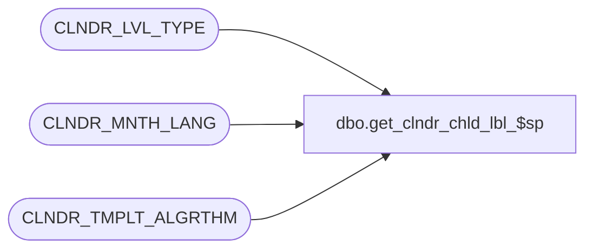

# dbo.get_clndr_chld_lbl_$sp

**Database:** auditworks  
**Server:** bedrockdb01  

## Architecture Diagram



## Table Dependencies

| Referenced Table |
|---|
| CLNDR_LVL_TYPE |
| CLNDR_MNTH_LANG |
| CLNDR_TMPLT_ALGRTHM |

## Stored Procedure Code

```sql
CREATE proc [dbo].[get_clndr_chld_lbl_$sp] 
(@i_seq integer, 
 @i_total_seq integer, 
 @i_startdatetime datetime, 
 @i_perioddatetime datetime, 
 @i_lbl_algrthm_id varbinary(16), 
 @i_calendar_level_id varbinary(16),
 @i_lcid integer,
 @i_period_label nvarchar(500) OUT)

AS
DECLARE

  /* Proc Name: get_clndr_chld_lbl_$sp
     Desc: Algorithm Parsing and Execution Routine - Label Generation for calendar
      This procedure will return to the caller an integer representing the number of children
      a parent will contain based on an algorithm and a template definition.
  
     Tokens understood by procedure : 	[CalendarStartDate]                                 
                                    :   [CurrentPeriodDate]                                 
                                    :   [ChildSeq]                                          
                                    :   [LevelLabel]                                        
                                                                                          
     Functions understood           :   YearNumber                                          
                                    :   MonthLabel                                          
                                    :   MonthNumber                                         
                                    :   WeekDayNumber  

HISTORY:
Date     Name		Def#     Desc
Aug09,05 Ian/Paul       DV-1196  author          
                                     */

  @i_algrthm      varchar(500),
  @i_errmsg       varchar(50),
  @i_level_desc   varchar(100),
  @i_start_date_token  varchar(100),
  @i_period_date_token varchar(100),                              
  @i_cnt          integer,
  @i_cnt1         integer,
  @i_end_bracket  integer,
  @i_strt_bracket integer,
  @i_cmd          nvarchar(500),
  @i_base_lang    integer,
  @i_period_number integer,
  @i_lbl          nvarchar(50)

BEGIN

  /* Hard Coded base language for now set to US English */
  
  SELECT @i_base_lang = 1033

  SELECT @i_start_date_token  = 'convert(datetime,''' +convert(char(20),@i_startdatetime,113) + ''')'

  SELECT @i_period_date_token = 'convert(datetime,''' + convert(char(20),@i_perioddatetime,113) + ''')'
          
  /* Get Label Generation Alogorith */
  
  SELECT @i_algrthm = ALGRTHM
    FROM CLNDR_TMPLT_ALGRTHM
   WHERE CLNDR_TMPLT_ALGRTHM_ID = @i_lbl_algrthm_id

  /* Get Level Description */
  
 IF CHARINDEX('[LevelLabel]',@i_algrthm,1) > 0

      SELECT @i_level_desc = CLNDR_LVL_DESC
        FROM CLNDR_LVL_TYPE
       WHERE CLNDR_LVL_TYPE_ID = @i_calendar_level_id


  /* Replace All YearNumber functions */ 


  WHILE 1=1
  BEGIN

     SELECT @i_cnt = CHARINDEX('YearNumber',@i_algrthm,1)
                 
     IF @i_cnt = 0 OR @i_cnt IS NULL BREAK

     /* Auto correct Year number where it happens to start in the same year as the previous year */

     IF convert(integer,DatePart(mm,@i_startdatetime)) = 12 and (convert(integer,DatePart(dd,@i_startdatetime)) >=25 and convert(integer,DatePart(dd,@i_startdatetime)) <=31)
     BEGIN

       SELECT @i_end_bracket  = CHARINDEX(')',@i_algrthm,@i_cnt)
       SELECT @i_strt_bracket = CHARINDEX('(',@i_algrthm,@i_cnt)
     
       SELECT @i_algrthm = SUBSTRING(@i_algrthm,1,@i_cnt-1) + 'convert(varchar,DatePart(yyyy,' +
                           SUBSTRING(@i_algrthm,@i_strt_bracket+1,@i_end_bracket-@i_strt_bracket-1) + ')+1)' +
                           SUBSTRING(@i_algrthm,@i_end_bracket+1,500) 

     END
     ELSE 
     BEGIN
  
       SELECT @i_end_bracket  = CHARINDEX(')',@i_algrthm,@i_cnt)
       SELECT @i_strt_bracket = CHARINDEX('(',@i_algrthm,@i_cnt)
     
       SELECT @i_algrthm = SUBSTRING(@i_algrthm,1,@i_cnt-1) + 'convert(varchar,DatePart(yyyy,' +
                           SUBSTRING(@i_algrthm,@i_strt_bracket+1,@i_end_bracket-@i_strt_bracket-1) + '))' +
          SUBSTRING(@i_algrthm,@i_end_bracket+1,500) 
     END
     
  END

  /* Replace All MonthLabel functions */
 
  IF @i_lcid != @i_base_lang
    BEGIN
    
      WHILE 1=1
      BEGIN

        SELECT @i_cnt = CHARINDEX('MonthLabel',@i_algrthm,1)
     
        IF @i_cnt = 0 OR @i_cnt IS NULL BREAK
  
        SELECT @i_end_bracket  = CHARINDEX(')',@i_algrthm,@i_cnt)
        SELECT @i_strt_bracket = CHARINDEX('(',@i_algrthm,@i_cnt)
     
        SELECT @i_cnt1 = CHARINDEX('[CurrentPeriodDate]',@i_algrthm,@i_strt_bracket)
   
        IF @i_cnt1 > 1 and @i_cnt1 < @i_end_bracket
        BEGIN

          SELECT @i_cmd = 'SELECT @i_period_number = convert(integer,DatePart(mm,' + @i_period_date_token +'))'

          EXEC sp_executesql @i_cmd ,N'@i_period_number integer output', @i_period_number output
                 
          SELECT @i_lbl = MNTH_LBL
            FROM CLNDR_MNTH_LANG
           WHERE LANG_ID = @i_lcid
             AND MNTH_NUM = @i_period_number
             
          IF @i_lbl IS NULL
            SELECT @i_lbl = MNTH_LBL
              FROM CLNDR_MNTH_LANG
             WHERE LANG_ID = 1033
               AND MNTH_NUM = @i_period_number          

          SELECT @i_algrthm = SUBSTRING(@i_algrthm,1,@i_cnt-1) + ''' + @i_lbl + ''' +
                              SUBSTRING(@i_algrthm,@i_end_bracket+1,500)
        END
     
      END
    END
  ELSE
    BEGIN
      WHILE 1=1
      BEGIN

        SELECT @i_cnt = CHARINDEX('MonthLabel',@i_algrthm,1)
     
        IF @i_cnt = 0 OR @i_cnt IS NULL BREAK
  
        SELECT @i_end_bracket  = CHARINDEX(')',@i_algrthm,@i_cnt)
        SELECT @i_strt_bracket = CHARINDEX('(',@i_algrthm,@i_cnt)
     
        SELECT @i_algrthm = SUBSTRING(@i_algrthm,1,@i_cnt-1) + 'datename(month,' +
                            SUBSTRING(@i_algrthm,@i_strt_bracket+1,@i_end_bracket-@i_strt_bracket-1) + ')' +
                            SUBSTRING(@i_algrthm,@i_end_bracket+1,500)
      END
  END

  /* Replace All MonthNumber functions */
  
  WHILE 1=1
  BEGIN

     SELECT @i_cnt = CHARINDEX('MonthNumber',@i_algrthm,1)
     
     IF @i_cnt = 0 OR @i_cnt IS NULL BREAK
  
     SELECT @i_end_bracket  = CHARINDEX(')',@i_algrthm,@i_cnt)
     SELECT @i_strt_bracket = CHARINDEX('(',@i_algrthm,@i_cnt)
     
     SELECT @i_algrthm = SUBSTRING(@i_algrthm,1,@i_cnt-1) + 'convert(varchar,DatePart(mm,' +
                       SUBSTRING(@i_algrthm,@i_strt_bracket+1,@i_end_bracket-@i_strt_bracket-1) + '))' +
        SUBSTRING(@i_algrthm,@i_end_bracket+1,500)    
     
  END   

  /* Replace All WeekDayNumber functions */
  
  WHILE 1=1
  BEGIN

  SELECT @i_cnt = CHARINDEX('WeekDayNumber',@i_algrthm,1)
     
     IF @i_cnt = 0 OR @i_cnt IS NULL BREAK
  
     SELECT @i_end_bracket  = CHARINDEX(')',@i_algrthm,@i_cnt)
     SELECT @i_strt_bracket = CHARINDEX('(',@i_algrthm,@i_cnt)
     
     SELECT @i_algrthm = SUBSTRING(@i_algrthm,1,@i_cnt-1) + 'convert(varchar,DatePart(dw' +
                       SUBSTRING(@i_algrthm,@i_strt_bracket+1,@i_end_bracket-@i_strt_bracket-1) + '))' +
                       SUBSTRING(@i_algrthm,@i_end_bracket+1,500);     
     
  END 
  
  /* Replace Tokens */
    
  SELECT @i_algrthm = REPLACE(@i_algrthm,'[CalendarStartDate]',@i_start_date_token)
  
  SELECT @i_algrthm = REPLACE(@i_algrthm,'[CurrentPeriodDate]',@i_period_date_token)
  
  SELECT @i_algrthm = REPLACE(@i_algrthm,'[ChildSeq]','''' + convert(varchar,@i_seq) + '''')

  SELECT @i_algrthm = REPLACE(@i_algrthm,'[TotalSeq]','''' + convert(varchar,@i_total_seq) + '''')

  IF @i_level_desc IS NOT NULL 
    SELECT @i_algrthm = REPLACE(@i_algrthm,'[LevelLabel]','''' + @i_level_desc + '''')
     
  SELECT @i_algrthm = REPLACE(@i_algrthm,'"','''')
  
  /* Execute resulting SQL */
  
  SELECT @i_cmd = 'SELECT @i_period_label = ' + @i_algrthm 

  EXEC sp_executesql @i_cmd ,N'@i_period_label nvarchar(500) output', @i_period_label output
  
  --PRINT 'Label = ' + convert(varchar,@i_period_label)
  
  RETURN

END
```

