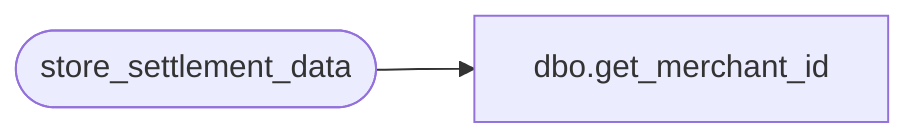

# dbo.get_merchant_id

**Database:** auditworks  
**Server:** bedrockdb01  

## Architecture Diagram



## Table Dependencies

| Referenced Table |
|---|
| store_settlement_data |

## Stored Procedure Code

```sql
CREATE PROCEDURE get_merchant_id @StoreNumber int
AS
BEGIN
SELECT store_merchant_id FROM store_settlement_data WHERE interface_id = 52 AND store_no = @StoreNumber
END
```

