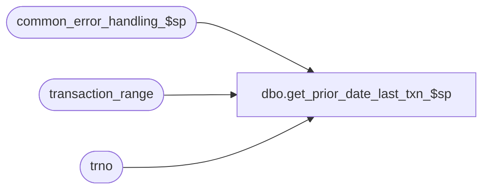

# dbo.get_prior_date_last_txn_$sp

**Database:** auditworks  
**Server:** bedrockdb01  

## Architecture Diagram



## Table Dependencies

| Referenced Table |
|---|
| common_error_handling_$sp |
| transaction_range |
| trno |

## Stored Procedure Code

```sql
create proc dbo.get_prior_date_last_txn_$sp @process_id		binary(16),
@user_id		int,
@store_no		int,
@transaction_date	smalldatetime,
@register_no		smallint,
@date_reject_id		tinyint,
@transaction_series	nchar(1),
@prior_day_transaction	trno OUTPUT,
@errmsg			nvarchar(255) OUTPUT,
@log_error_flag		tinyint = 0,  -- for call to common_error_handler, 1 = CALLED BY SMARTLOAD
@process_no		int,     -- for call to common_error_handler
@edit_process_no 	tinyint = 1  --  for call to common_error_handler

AS

/* 
PROC NAME: get_prior_date_last_txn_$sp 
     DESC: To find the number of the last transaction for the most recent date prior to the
           date passed in.

  HISTORY:
Date     Name		   Def#  Desc 
Jan04,11 Paul            105313 Use unicode datatypes
Jan11,07 Paul             81764  pass in process_id, user_id for SA5 version
Sep06,06 Vicci            76394  Author

*/


DECLARE	@errno				int,
	@prior_date			smalldatetime,
	@message_id			int,
	@operation_name		        nvarchar(100),
	@object_name		        nvarchar(255),
	@process_name			nvarchar(100)

SELECT @prior_day_transaction = NULL,
       @process_name = 'get_prior_date_last_txn_$sp',
       @message_id   = 201068

-- DEF 1-C3WWH: check tran range for prior date
SELECT @prior_date = transaction_date, 
       @prior_day_transaction = last_transaction_no
  FROM transaction_range WITH (NOLOCK)
 WHERE store_no = @store_no
   AND transaction_date = DATEADD(dd,-1,@transaction_date)
   AND register_no = @register_no
   AND date_reject_id = @date_reject_id
   AND transaction_series = @transaction_series
SELECT @errno = @@error
IF @errno != 0
BEGIN
  SELECT @errmsg = 'Failed to SELECT from @prior_date (1)',
         @object_name = 'transaction_range',
         @operation_name = 'SELECT'
  GOTO error
END     

IF @prior_date IS NULL /* then */
BEGIN
  SELECT @prior_date = MAX(transaction_date)
    FROM transaction_range WITH (NOLOCK)
   WHERE store_no = @store_no
     AND transaction_date >= DATEADD(dd,-30,@transaction_date)
     AND transaction_date < @transaction_date  
     AND register_no = @register_no
     AND date_reject_id = @date_reject_id
     AND transaction_series = @transaction_series
  SELECT @errno = @@error
  IF @errno != 0
  BEGIN
    SELECT @errmsg = 'Failed to SELECT from @prior_date (2)',
           @object_name = 'transaction_range',
           @operation_name = 'SELECT'
    GOTO error
  END     

  IF @prior_date IS NOT NULL  -- if prior date is found, get prior txn from range
  BEGIN
    SELECT @prior_day_transaction = last_transaction_no
      FROM transaction_range WITH (NOLOCK)
     WHERE store_no = @store_no
       AND register_no = @register_no
       AND transaction_date = @prior_date
       AND date_reject_id = @date_reject_id
       AND transaction_series = @transaction_series
    SELECT @errno = @@error
    IF @errno != 0
    BEGIN
      SELECT @errmsg = 'Failed to SELECT from @prior_day_tran',
             @object_name = 'transaction_range',
             @operation_name = 'SELECT'
      GOTO error
    END
  END  -- priordate not null
END  --IF @prior_date IS NULL

RETURN

error:   /* Common error handler. */

EXEC common_error_handling_$sp @process_no, @errno, @errmsg, 0, @message_id,
                 @process_name, @object_name, @operation_name, @log_error_flag, @edit_process_no, 0, null, 0, null, 
		null, null, null, null, null, 0, @process_id, @user_id

RETURN
```

