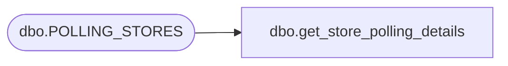

# dbo.get_store_polling_details

**Database:** auditworks  
**Server:** bedrockdb01  

## Architecture Diagram



## Table Dependencies

| Referenced Table |
|---|
| dbo.POLLING_STORES |

## Stored Procedure Code

```sql
CREATE PROCEDURE get_store_polling_details @StoreNumber int
AS
BEGIN
select POLLING_VLDTN,POLLING_VLDTN_DATE,OPEN_DATE,CLOSED_DATE,COUNTRY,STORE_TYPE,STORE_BRAND from dbo.POLLING_STORES where STORE_NUM = @StoreNumber
END
```

