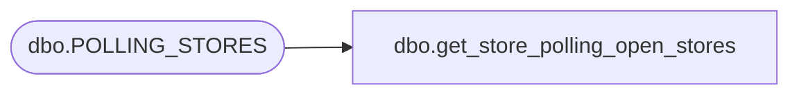

# dbo.get_store_polling_open_stores

**Database:** auditworks  
**Server:** bedrockdb01  

## Architecture Diagram



## Table Dependencies

| Referenced Table |
|---|
| dbo.POLLING_STORES |

## Stored Procedure Code

```sql
CREATE PROCEDURE get_store_polling_open_stores
AS
SELECT [STORE_NUM]
      ,[POLLING_VLDTN]
      ,[POLLING_VLDTN_DATE]
      ,[MODIFIED_BY]
      ,[LAST_MODIFIED_DTTM]
      ,[OPEN_DATE]
      ,[CLOSED_DATE]
      ,[COUNTRY]
      ,[STORE_TYPE]
      ,[STORE_BRAND]
	  FROM [auditworks].[dbo].[POLLING_STORES]
	  WHERE CLOSED_DATE IS NULL OR CLOSED_DATE > GETDATE()
	  ORDER BY STORE_NUM
```

