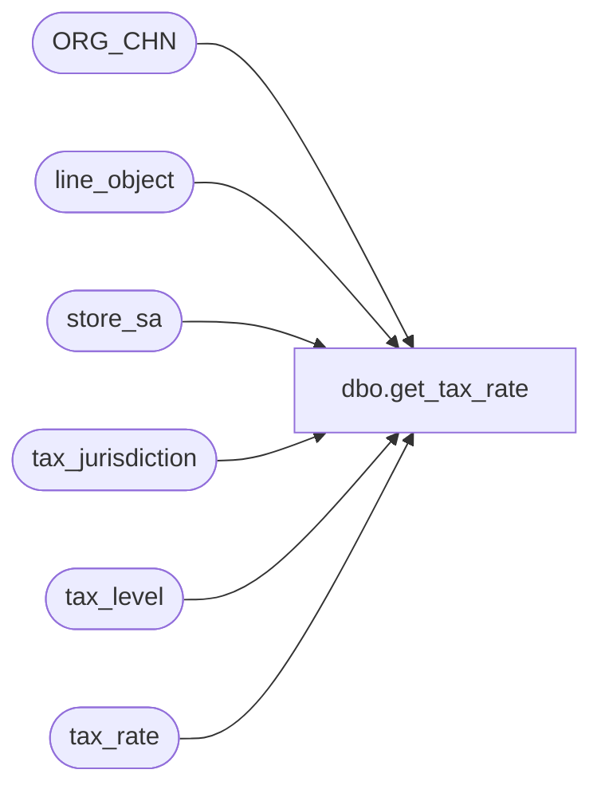

# dbo.get_tax_rate

**Database:** auditworks  
**Server:** bedrockdb01  

## Architecture Diagram



## Table Dependencies

| Referenced Table |
|---|
| ORG_CHN |
| line_object |
| store_sa |
| tax_jurisdiction |
| tax_level |
| tax_rate |

## Stored Procedure Code

```sql
CREATE PROCEDURE dbo.get_tax_rate @StoreNumber int
AS
BEGIN
SELECT CONVERT(VARCHAR(8),SUM(t.combined_rate)) AS combined_rate
FROM ORG_CHN s,
	tax_rate t,
	tax_level l,
	line_object o,
	store_sa st,
	tax_jurisdiction tj
WHERE s.TAX_JRSDCTN_CODE = t.tax_jurisdiction
AND s.ORG_CHN_NUM = st.store_no
AND l.line_object = o.line_object
AND l.tax_level = t.tax_level
AND t.tax_jurisdiction = tj.tax_jurisdiction
AND t.effective_until_date IS NULL
AND t.tax_rate_code = 1
AND s.ORG_CHN_NUM IN (@StoreNumber)
GROUP BY s.ORG_CHN_NUM,st.country_code,st.state_code,t.tax_jurisdiction,tj.pos_tax_jurisdiction_code,t.tax_rate_id,o.line_object_description,t.tax_rate_code_description
ORDER BY 1
END
```

