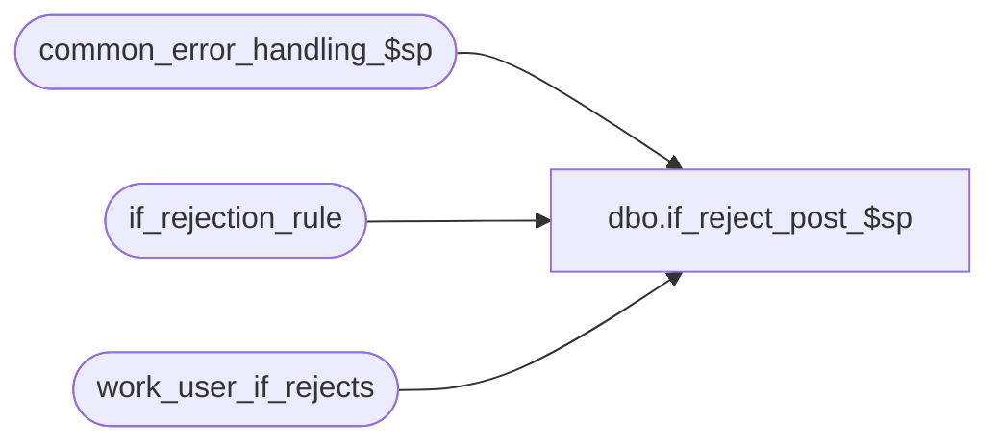

# dbo.if_reject_post_$sp

**Database:** auditworks  
**Server:** bedrockdb01  

## Architecture Diagram



## Table Dependencies

| Referenced Table |
|---|
| common_error_handling_$sp |
| if_rejection_rule |
| work_user_if_rejects |

## Stored Procedure Code

```sql
create proc dbo.if_reject_post_$sp @process_id	 	binary(16),  
@user_id                int,
@errmsg                 nvarchar(255)            OUTPUT,
@edit_process_no	tinyint = 1

AS

/* Procedure Name: if_reject_post_$sp
   Desc: Run user-defined queries that identify transactions that may be i/f rejects.
   SQL_QRY is generated using metadata and maintained via tm.
   Called by edit_post_$sp, move_verify_user_if_rej_$sp, mass_correct_user_if_rej_$sp, verify_user_if_rejects_$sp

HISTORY
Date     Name      Defect Desc
Jun20,14 Vicci  TFS-75582 Expand SQL_QRY datatype
Feb02,11 Vicci     124563 Pass @process_id to user-defined-query.  Do not overlay @process_id since the calling
                          procs are the ones who populated the work_if_rejects table used in the query FROM clause, 
                          and they used the @process_id that they passed in.
Jun14,06 Tim	  DV-1339 replace active_rejection_rule with ISNULL(active_rejection_rule,1)
Apr19,06 Paul     DV-1332 Change @SQL_QRY to nvarchar since it is used in sp_executesql.
Jul04,05 Paul     DV-1239 use new sql column (only one sql query allowed per reject reason)
Mar24,05 Paul     DV-1218 removed reference to dropped column to support SA5 tm, added nolock hints
Sep17,04 Maryam   DV-1146 replace user_name with user_id.
Apr23,04 Maryam   DV-1071 Modified to receive @user_name and @process_id as input parameters
			  and pass it to the subprocs
Jan02,03 Winnie      5435 corrected MSSQL version since dynamic sql syntax is different than Sybase
Nov26,01 Winnie   1-969YY Add logic for R3 error handling to pass @edit_process_no
Nov29,01 Henry       8976 Ported from Oracle to use Dynamic SQL capability.

*/


DECLARE
        @cursor_open			tinyint,
        @errno 				int,
        @if_rejection_reason 		smallint,
        @object_name			nvarchar(255),
	@process_name			nvarchar(100),
	@operation_name			nvarchar(100),
	@message_id			int,
	@SQL_QRY			nvarchar(max)

SELECT	@process_name = 'if_reject_post_$sp',
        @message_id = 201068

DELETE work_user_if_rejects
 WHERE process_id = @process_id
SELECT @errno = @@error
IF @errno <> 0
  BEGIN
   SELECT @errmsg = 'Failed to DELETE work_user_if_rejects ',
	@object_name = 'work_user_if_rejects',
	@operation_name = 'DELETE'
   GOTO error
  END 

DECLARE user_if_reject_crsr CURSOR FAST_FORWARD
FOR
SELECT	if_rejection_reason,
	REPLACE(SQL_QRY, '@@spid', '@process_id')  --just for backwards compatibility with queries saved in earlier releases.
  FROM	if_rejection_rule WITH (NOLOCK)
 WHERE 	if_rejection_reason >= 200
   AND  ISNULL(active_rejection_rule, 1) >= 1
   AND  SQL_QRY IS NOT NULL
ORDER BY if_rejection_reason

OPEN user_if_reject_crsr

SELECT @errno = @@error
IF @errno <> 0
  BEGIN
   SELECT @errmsg = 'Failed to open user_if_reject_crsr',
          @object_name = 'user_if_reject_crsr',
          @operation_name = 'OPEN'
   GOTO error
  END 

SELECT @cursor_open = 1

WHILE 1 = 1 
  BEGIN
    FETCH user_if_reject_crsr INTO
        @if_rejection_reason,
        @SQL_QRY

    IF @@fetch_status <> 0
	BREAK

    EXEC sp_executesql @SQL_QRY, N'@process_id binary(16)', @process_id

    SELECT @errno = @@error
    IF @errno <> 0
	BEGIN
	 SELECT @errmsg = 'Failed to execute i/f reject sql: ' + CONVERT(nvarchar,@if_rejection_reason),
                   @object_name = '@sql_command',
                   @operation_name = 'EXECUTE'
	 EXEC common_error_handling_$sp 111, @errno, @errmsg, 0, @message_id, 
	     @process_name, @object_name, @operation_name, 1, @edit_process_no, 0, null,
	     0, null, null, null, null, null, null, 0, @process_id, @user_id
             
	END

  END -- WHILE 1 = 1

CLOSE user_if_reject_crsr
DEALLOCATE user_if_reject_crsr
SELECT @cursor_open = 0


RETURN


error:   /* Common error handler */

        IF @cursor_open > 0
          BEGIN
                CLOSE user_if_reject_crsr
  DEALLOCATE user_if_reject_crsr
          END
	EXEC common_error_handling_$sp 111, @errno, @errmsg, 0, @message_id, 
	@process_name, @object_name, @operation_name, 1, @edit_process_no, 0, 
	null, 0, null, null, null, null, null, null, 0, @process_id, @user_id
	
	RETURN
```

