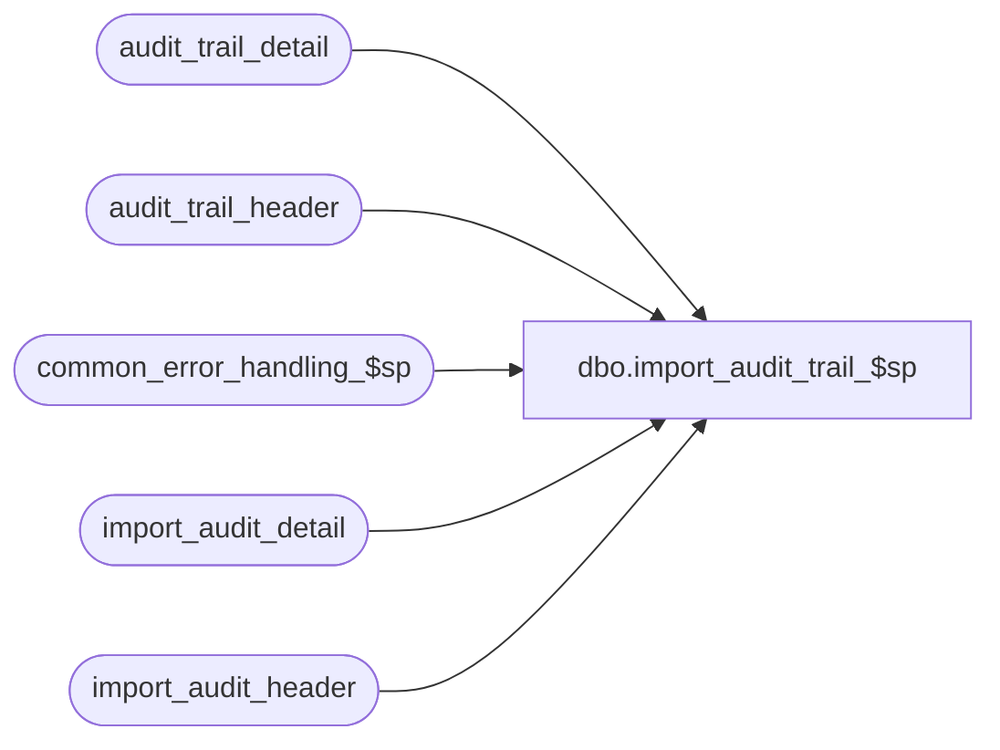

# dbo.import_audit_trail_$sp

**Database:** auditworks  
**Server:** bedrockdb01  

## Architecture Diagram



## Table Dependencies

| Referenced Table |
|---|
| audit_trail_detail |
| audit_trail_header |
| common_error_handling_$sp |
| import_audit_detail |
| import_audit_header |

## Stored Procedure Code

```sql
create proc dbo.import_audit_trail_$sp 

AS

/*
PROC NAME: import_audit_trail_$sp
     DESC: Inserts Audit trail entries generated by Service Desk 
           when Service Desk is located on a Separate Server
           Called by standard_import.ict in ICT_IMPORT smartload
		
HISTORY:
Date     Name            Def# Desc
Jan31,11 Paul          105313 Use unicode datatypes
MAY10,02 Daphna       1-CYE1P author 
*/

DECLARE
  @errmsg		nvarchar(255),
  @errno			int,
  @open_cursor  	int,
  @import_id		numeric(12,0),  -- in import table
  @entry_id		numeric(12,0),  -- in local audit_trail_header
  @rows			int,
  -- error handling
  @process_no    	int,
  @process_name  	nvarchar(100),
  @object_name   	nvarchar(255),
  @operation_name 	nvarchar(100),
  @message_id		int,
  @log_error_flag	tinyint
  
SELECT @open_cursor = 0,
       @message_id = 201068,  -- DBMS error
       @process_name = 'import_audit_trail_$sp',
       @process_no = 7,    -- standard import
       @log_error_flag = 1  --  called by smartload

 
SELECT @rows = COUNT(*) 
FROM import_audit_header

IF @rows = 0
BEGIN
  SELECT @errno = 201645,
         @message_id = 201645,
         @object_name = 'import_audit_header',
         @operation_name = 'COUNT',
         @errmsg = 'import table has no rows'
  GOTO error  
END  
  
  

SELECT @rows = COUNT(*)
FROM import_audit_detail

IF @rows = 0
BEGIN
  SELECT @errno = 201645,
         @message_id = 201645,
         @object_name = 'import_audit_detail',
         @operation_name = 'COUNT',
         @errmsg = 'import table has no rows'  
  GOTO error
END
  
DECLARE header_crsr CURSOR
FOR SELECT entry_id
      FROM import_audit_header

SELECT @errno = @@error
IF @errno != 0 
BEGIN
   SELECT @errmsg = 'for each entry',
          @object_name = 'header_crsr',
          @operation_name = 'DECLARE'
   GOTO error
END

OPEN header_crsr
SELECT @errno = @@error
IF @errno != 0 
BEGIN
   SELECT @errmsg = 'Failed to open cursor for header_crsr',
          @object_name = 'header_crsr',
          @operation_name = 'OPEN CURSOR'
   GOTO error
END

SELECT @open_cursor = 1
WHILE 1=1
BEGIN
  FETCH header_crsr INTO @import_id

  IF @@fetch_status <> 0    /* if eof, then exit */ 
    BREAK

     
  -- insert of fetched audit_trail header, get identity value  
 
  INSERT audit_trail_header(
         entry_date,
         table_name,
         table_key,
         table_key_descr,
         user_name,
         action,
         function_no,
         store_no,
         register_no,
         transaction_date,
         date_reject_id,
         transaction_no,
         transaction_series,
         entry_date_time,
         cashier_no,
         reference_type,
         rule_id,
         reference_no)
  SELECT entry_date,
         table_name,
         table_key,
         table_key_descr,
         user_name,
         action,
         function_no,
         store_no,
         register_no,
         transaction_date,
         date_reject_id,
         transaction_no,
         transaction_series,
         entry_date_time,
         cashier_no,
         reference_type,
         rule_id,
         reference_no
    FROM import_audit_header
   WHERE entry_id = @import_id

  SELECT @errno = @@error, @entry_id = @@identity 
  IF @errno != 0
  BEGIN
    SELECT @errmsg = 'from import_audit_header',
           @object_name = 'audit_trail_header',
           @operation_name = 'INSERT'
    GOTO error
  END

  -- mass insert of details for same entry id, using identity col value        
  
  INSERT INTO audit_trail_detail
         (entry_id,
          column_name,
          before_value,
          after_value,
          before_description,
          after_description)
  SELECT @entry_id,  -- identity value from insert to audit_trail_header
          column_name,
          before_value,
          after_value,
          before_description,
          after_description
     FROM import_audit_detail
    WHERE entry_id = @import_id
    
  SELECT @errno = @@error
  IF @errno != 0
  BEGIN
    SELECT @errmsg = 'from import_audit_detail',
           @object_name = 'audit_trail_detail',
           @operation_name = 'INSERT'
    GOTO error
  END
    
END /* While 1=1 */

 

CLOSE header_crsr
DEALLOCATE header_crsr 
 
SELECT @open_cursor = 0  -- no open cursors

RETURN

error:   /* Common error handler. */

    IF @open_cursor = 1
    BEGIN
      CLOSE header_crsr   
      DEALLOCATE header_crsr 
       
    END

    EXEC common_error_handling_$sp @process_no, @errno, @errmsg, 0, @message_id, @process_name,
           @object_name, @operation_name, @log_error_flag

    RETURN
```

