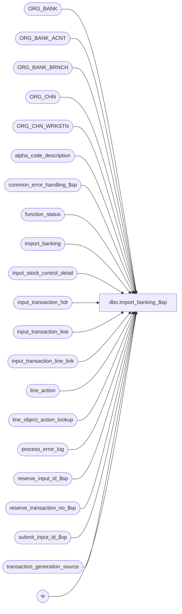

# dbo.import_banking_$sp

**Database:** auditworks  
**Server:** bedrockdb01  

## Architecture Diagram



## Table Dependencies

| Referenced Table |
|---|
| ORG_BANK |
| ORG_BANK_ACNT |
| ORG_BANK_BRNCH |
| ORG_CHN |
| ORG_CHN_WRKSTN |
| alpha_code_description |
| common_error_handling_$sp |
| function_status |
| import_banking |
| input_stock_control_detail |
| input_transaction_hdr |
| input_transaction_line |
| input_transaction_line_link |
| line_action |
| line_object_action_lookup |
| process_error_log |
| reserve_input_id_$sp |
| reserve_transaction_no_$sp |
| submit_input_id_$sp |
| transaction_generation_source |
| w |

## Stored Procedure Code

```sql
create proc dbo.import_banking_$sp AS
/* 
   NAME:    import_banking_$sp
   DESCR:   Imports banking transaction data into import_banking and populates the input tables with transaction information generated 
            based on the information imported. 
            The transactions generated will then flow through the normal edit to update the Media Reconciliation module.

            For line object ation lookup configuration purposes:            
              Lookup POS code format is 'BANK.' + COALESCE(i.reference_set_type, 'STRDEP') + '.' + COALESCE(i.foreign_currency_code, '---') + '.' + for the main transaction line posting (i.e. not an offset line): '0.' by default, but can be anything they choose to input in the line object action lookup so that one import row can become multiple transaction lines (e.g. one import row becoming 2 lines like cash withdrawn / service fee charged).
              Line object is -3
              Line action can be:
                For reference set types mapped to syscode STRDEP:
                  240 exchange deposited
  		  243 quantity deposited
		  249 deposited
		For all others:
		 38 recorded

            Choices are:
              1) post to a dummy store/ bank-register# specified in transaction generation and not assigned any particular bank account (when no store associated with the bank account has the dummy register# specified).
              2) post to an actual store if it is the only one assigned the bank account an having the bank-register# specified in transaction generation source.
              3) post to dummy stores (one per bank institution) if the bank institution is the only one assigned the bank institution 
                 (using a fake account for "all accounts" under a fake branch of "all branches") 
                 and having the bank-register# specified in transaction generation source.
            Transaction header entry date time is date/time (time optional) bank processed deposit, as specified in the import file.
            Called by ICT_IMPORT smartload.

Unicode version.
     
HISTORY:
Date      Name        Defect#    Description
Sep07,16  Vicci      DAOM-292    Correct join to ORG_CHN
Jun20,16  Vicci      DAOM-292    Soft code number of deposit records per transaction.
Jun15,16  Vicci	     DAOM-292    Author

*/

DECLARE @cashier_no			int,
        @cursor_open			tinyint,
        @dflt_store_no			int,
        @dflt_store_bank_id		binary(16),
        @entry_date_time		datetime,
	@errmsg				nvarchar(2000),
	@errmsg2			nvarchar(2000),
	@errno				int,
	@errno2				int,	
        @function_name	                varbinary(128),
	@import_row_count		int,
	@import_row_id			numeric(10,0),
	@input_id			numeric(12,0),
	@message_id			int,
	@max_import_row_id		numeric(10,0), 
	@min_import_row_id		numeric(10,0), 
	@max_import_records_per_trans	smallint,
	@max_tran_no			int,
        @next_tran_no			int,
	@object_name			nvarchar(255),
	@operation_name			nvarchar(100),
	@process_name			nvarchar(100),
	@process_no 			smallint,
	@process_id  		        binary(16),
	@process_start_datetime		datetime,
        @register_no			smallint,
        @resource_id			numeric(12,0),
	@rows				int,
	@row_no				int,
        @status			        smallint, 
        @store_no			int,
        @sql_command 			nvarchar(4000),
        @temp_table_created		tinyint,
        @transaction_series		nchar(1),
        @transaction_category		tinyint,
        @trans_qty			int;

SELECT @function_name = CONVERT(varbinary(128), 'import_banking_$sp'),
       @message_id = 201068,
       @operation_name = 'Unknown',
       @process_id = NEWID(), 		--TODO:  halted process recovery
       @process_name = 'import_banking_$sp',
       @process_no = 7,		--standard import
       @process_start_datetime = getdate(),
       @status = -1

SET CONTEXT_INFO @function_name

BEGIN TRY

SELECT @errmsg = 'Failed to select from transaction_generation_source. ',
       @object_name = 'transaction_generation_source',
       @operation_name = 'SELECT';
SELECT @dflt_store_no = g.store_no,
       @register_no = r.WRKSTN_NUM,
       @cashier_no = g.cashier_no,
       @transaction_series = g.transaction_series,
       @transaction_category = g.transaction_category,
       @dflt_store_bank_id = a.BANK_ID,
       @max_import_records_per_trans = import_records_per_trans
  FROM transaction_generation_source g
       LEFT OUTER JOIN ORG_CHN_WRKSTN r
         ON g.store_no = r.ORG_CHN_NUM
        AND g.register_no = r.WRKSTN_NUM
       LEFT OUTER JOIN ORG_CHN s
         ON g.store_no = s.ORG_CHN_NUM
       LEFT OUTER JOIN ORG_BANK_ACNT a
         ON a.BANK_ACNT_ID = s.PRMRY_BANK_ACNT_ID
 WHERE process_no = @process_no;

IF @register_no IS NULL
BEGIN
  SELECT @errmsg = 'Transaction generation source table has not been set up for process:  ' + convert(nvarchar, @process_no),
         @errno = 201678,
         @message_id = 201678;
  GOTO general_error;
END        

IF @max_import_records_per_trans IS NULL
BEGIN
  SELECT @max_import_records_per_trans = 100;
END;

IF NOT EXISTS (SELECT 1 FROM import_banking)
  GOTO reset_exit;

--Determine how to interpret the content of the reference fields
SELECT @errmsg = 'Failed to determine how to interpret the content of the reference fields. ',
       @object_name = 'import_banking',
       @operation_name = 'UPDATE';
UPDATE i  --UPDATE import_banking
   SET system_code = c.system_code
  FROM import_banking i
       INNER JOIN alpha_code_description c
          ON c.code_type = 249  --reference set type
         AND c.code_status = 'U'
         AND c.code = COALESCE(i.reference_set_type, 'STRDEP')

--Set the bank account ID based on the bank/branch/account specified in the import file
SELECT @errmsg = 'Failed to set the bank account ID based on the bank/branch/account specified in the import file. ';
UPDATE i  --UPDATE import_banking
   SET BANK_ACNT_ID = a.BANK_ACNT_ID,
       BANK_ID = a.BANK_ID
  FROM import_banking i
       INNER JOIN ORG_BANK b
          ON i.INSTN_NUM = b.INSTN_NUM
         AND b.ACTV = 1
       INNER JOIN ORG_BANK_BRNCH t
          ON b.BANK_ID = t.BANK_ID
         AND i.BANK_BRNCH_NUM = t.BANK_BRNCH_NUM
         AND t.ACTV = 1
       INNER JOIN ORG_BANK_ACNT a
          ON t.BANK_ID = a.BANK_ID
         AND t.BANK_BRNCH_ID = a.BANK_BRNCH_ID
         AND i.BANK_ACNT_NUM = a.BANK_ACNT_NUM
         AND a.ACTV = 1;

--If a store was specified in the import file then 
--   1) log it to the entity reconciled
--   2) if the bank/branch/account specified in the import file wasn't found then set the bank account ID to be that of this store
--   3) if it has a register with the number configured to be used by the import process, set the transaction header store to this store
SELECT @errmsg = 'Failed to look up store specified in banking import file';
UPDATE i  --UPDATE import_banking
   SET store_no = CASE WHEN w.WRKSTN_NUM IS NULL THEN NULL ELSE o.ORG_CHN_NUM END,
       BANK_ACNT_ID = COALESCE(i.BANK_ACNT_ID, o.PRMRY_BANK_ACNT_ID),
       originating_store_no = o.ORG_CHN_NUM
  FROM import_banking i
       INNER JOIN ORG_CHN o
          ON i.reference_number = o.ORG_CHN_NUM
       LEFT OUTER JOIN ORG_CHN_WRKSTN w
          ON o.ORG_CHN_NUM = w.ORG_CHN_NUM
         AND w.WRKSTN_NUM = @register_no
         AND w.ACTV = 1  
 WHERE i.system_code IN ('STRDEP');

--If a wasn't specified in the import file but there is only one store associated with the right register associated with the account then set the transaction header store to be the store found
--If a store wasn't specified in the import file then set the entity reconciled store to be one of the stores associated with the account (so that the right bank is found by the rec edit when determining the balancing entity).  Note, balancing by store is only supported if only one store deposits into the specified account.  Note there is no bank option in the Period/Entity reconciled.
SELECT @errmsg = 'Failed to set store based on bank account';
UPDATE i  --UPDATE import_banking
   SET store_no = q.store_no,
       originating_store_no = CASE WHEN i.system_code IN ('STRDEP') THEN q.originating_store_no ELSE only_originating_store_no END
  FROM import_banking i
       INNER JOIN (SELECT i.BANK_ACNT_ID, 
                          CASE WHEN MIN(CASE WHEN w.WRKSTN_NUM IS NULL THEN 2147483647 ELSE o.ORG_CHN_NUM END) = MAX(CASE WHEN w.WRKSTN_NUM IS NULL THEN 0 ELSE o.ORG_CHN_NUM END) 
                          THEN MAX(CASE WHEN w.WRKSTN_NUM IS NULL THEN 0 ELSE o.ORG_CHN_NUM END) 
                          ELSE NULL END store_no,
                          MAX(o.ORG_CHN_NUM) originating_store_no,
                          CASE WHEN MAX(o.ORG_CHN_NUM) = MIN(o.ORG_CHN_NUM) THEN MAX(o.ORG_CHN_NUM) ELSE NULL END only_originating_store_no
                     FROM import_banking i
                          INNER JOIN ORG_CHN o
                             ON i.BANK_ACNT_ID = o.PRMRY_BANK_ACNT_ID
                            AND o.ACTV = 1
                           LEFT OUTER JOIN ORG_CHN_WRKSTN w
                             ON o.ORG_CHN_NUM = w.ORG_CHN_NUM
                            AND w.WRKSTN_NUM = @register_no
                            AND w.ACTV = 1
                    WHERE i.originating_store_no IS NULL
                      AND i.BANK_ACNT_ID IS NOT NULL
                    GROUP BY i.BANK_ACNT_ID) q
         ON i.BANK_ACNT_ID = q.BANK_ACNT_ID
 WHERE i.originating_store_no IS NULL
   AND i.BANK_ACNT_ID IS NOT NULL;

--Set transaction store based on bank institution ID if the store is not yet known and the default store is not associated with the bank and there is only one store with the right workstation for the bank.
SELECT @errmsg = 'Failed to set store based on bank institution ID. ';
UPDATE i  --UPDATE import_banking
   SET store_no = q.store_no
  FROM import_banking i
       INNER JOIN (SELECT i.BANK_ID, 
                          MAX(o.ORG_CHN_NUM) store_no
                     FROM import_banking i
                          INNER JOIN ORG_BANK_ACNT a
                             ON i.BANK_ID = a.BANK_ID
                             AND a.ACTV = 1
                          INNER JOIN ORG_CHN o
                             ON a.BANK_ACNT_ID = o.PRMRY_BANK_ACNT_ID
                            AND o.ACTV = 1
                           INNER JOIN ORG_CHN_WRKSTN w
                             ON o.ORG_CHN_NUM = w.ORG_CHN_NUM
                            AND w.WRKSTN_NUM = @register_no      
                            AND w.ACTV = 1
                    WHERE i.store_no IS NULL
                      AND (i.BANK_ID <> @dflt_store_bank_id OR @dflt_store_bank_id IS NULL)
                    GROUP BY i.BANK_ID
                   HAVING MIN(o.ORG_CHN_NUM) = MAX(o.ORG_CHN_NUM) ) q
         ON i.BANK_ID = q.BANK_ID
 WHERE i.store_no IS NULL
   AND (i.BANK_ID <> @dflt_store_bank_id OR @dflt_store_bank_id IS NULL);

SELECT @errmsg = 'Failed to temp table to list transaction lines to be inserted. ',
       @object_name = '#import_banking',
       @operation_name = 'CREATE';  
CREATE TABLE #import_banking(
       row_no numeric(12,0) NOT NULL,
       store_no int NOT NULL,
       entry_date_time datetime NOT NULL,
       transaction_no int NOT NULL,
       line_id numeric(5,0) NOT NULL,
       line_object smallint NOT NULL,
       line_action tinyint NOT NULL,
       gross_line_amount numeric(18,4) NOT NULL, --line_amount_18_4
       lookup_pos_code nvarchar(500) NULL,
       transaction_reference_no nvarchar(20) NULL,
       reference_datetime datetime NULL,
       reference_string_1 nvarchar(255) NULL,
       reference_string_2 nvarchar(255) NULL,
       originating_store_no int NULL,
       BANK_ACNT_ID smallint null,	-- PK of ORG_BANK_ACNT;  corresponds to ORG_CHN.PRMRY_BANK_ACNT_ID and media_reconciliation_status.bank_no
       system_code nvarchar(10) NULL,
       entry_id numeric(12,0) not null,
       lookup_line_action tinyint NULL);
SELECT @temp_table_created = 1;

CREATE TABLE #import_banking_trans_no(
       transaction_no int NOT NULL, --trno
       entry_id numeric(12,0) not null);
SELECT @temp_table_created = 2;

SELECT @errmsg = 'Failed to execute stored proc reserve_input_id_$sp. ',
       @object_name = 'reserve_input_id_$sp',
       @operation_name = 'EXECUTE';
EXEC reserve_input_id_$sp @process_id, null, null, @input_id OUTPUT, @errmsg OUTPUT, @process_no;

SELECT @errmsg = 'Failed to read store_date_cursor. ',
       @object_name = 'store_date_cursor',
       @operation_name = 'DECLARE';
DECLARE store_date_cursor CURSOR FAST_FORWARD
    FOR
 SELECT COALESCE(i.store_no, @dflt_store_no) store_no, i.posting_datetime entry_date_time, CEILING(CONVERT(FLOAT,COUNT(*))/@max_import_records_per_trans) trans_qty
   FROM import_banking i
  GROUP BY COALESCE(i.store_no, @dflt_store_no), i.posting_datetime;

SELECT @operation_name = 'OPEN',
       @cursor_open = 1;
OPEN store_date_cursor;

SELECT @operation_name = 'FETCH';
FETCH store_date_cursor
 INTO @store_no, @entry_date_time, @trans_qty;

WHILE @@fetch_status = 0 
BEGIN
   
  SELECT @errmsg = 'Failed to execute stored proc reserve_transaction_no_$sp. ',
         @object_name = 'reserve_transaction_no_$sp',
         @operation_name = 'EXECUTE';
  EXEC reserve_transaction_no_$sp @process_id, null, @process_no, @store_no, @register_no, @transaction_series,
       @trans_qty, @max_tran_no OUTPUT, @next_tran_no OUTPUT, @errmsg OUTPUT;

  SELECT @errmsg = 'Failed to populate #import_banking_trans_no. ',
         @object_name = '#import_banking_trans_no',
         @operation_name = 'INSERT';
  INSERT INTO #import_banking_trans_no(entry_id, transaction_no)
  SELECT q.entry_id,
         (@next_tran_no + CONVERT(int, (q.row_within_store_date-1)/@max_import_records_per_trans)) transaction_no
    FROM (SELECT row_number() OVER (ORDER BY i.entry_id) row_within_store_date, i.entry_id
            FROM import_banking i
           WHERE COALESCE(i.store_no, @dflt_store_no) = @store_no
             AND i.posting_datetime = @entry_date_time ) q

  SELECT @errmsg = 'Failed to fetch store_date_cursor. ',
         @object_name = 'store_date_cursor',
         @operation_name = 'FETCH';  
  FETCH store_date_cursor
   INTO @store_no, @entry_date_time, @trans_qty

END --while not end of store_cursor

SELECT @errmsg = 'Failed to close store_date_cursor. ',
       @object_name = 'store_cursor',
       @operation_name = 'CLOSE';
CLOSE store_date_cursor
SELECT @operation_name = 'DEALLOCATE';
DEALLOCATE store_date_cursor
 
SELECT @errmsg = 'Failed to populate list of transaction lines to be inserted. ',
       @object_name = '#import_banking',
       @operation_name = 'INSERT';
INSERT INTO #import_banking(
       row_no,
       store_no,
       entry_date_time,
       transaction_no,
       line_id,
       line_object,
       line_action,
       gross_line_amount,
       lookup_pos_code,
       transaction_reference_no,
       reference_datetime,
       reference_string_1,
       reference_string_2,
       originating_store_no,
       BANK_ACNT_ID,
       system_code,
       entry_id,
       lookup_line_action)
SELECT row_number() OVER (ORDER BY COALESCE(i.store_no, @dflt_store_no), i.posting_datetime, t.transaction_no, i.entry_id) row_no, 
       COALESCE(i.store_no, @dflt_store_no) store_no,
       i.posting_datetime entry_date_time,
       t.transaction_no,
       1, --default line_id
       COALESCE(loal.line_object, -3) line_object, 
       COALESCE(loal.line_action, a.line_action, 249) line_action,
       CASE WHEN a.line_action = 240 
            THEN i.posting_amount - i.foreign_currency_amount
            ELSE CASE WHEN a.line_action = 243
           THEN i.posting_quantity
     ELSE COALESCE(i.foreign_currency_amount, i.posting_amount) 
                 END
       END gross_line_amount,
       COALESCE(loal.lookup_pos_code, 'BANK.' + COALESCE(i.reference_set_type, 'STRDEP') + '.' + COALESCE(i.foreign_currency_code, '---') + '.0.') lookup_pos_code,   
       i.transaction_reference_no,
       i.reference_datetime,
       i.reference_string_1,
       i.reference_string_2,
       i.originating_store_no,
       i.BANK_ACNT_ID,
       i.system_code,
       i.entry_id,
       COALESCE(a.line_action, 249) lookup_line_action
 FROM #import_banking_trans_no t 
      INNER JOIN import_banking i  
         ON t.entry_id = i.entry_id
      LEFT OUTER JOIN line_action a  --to explode 1 row into multiple lines (pivot amount, exchange, quantity)
         ON a.line_action IN (240, 243, 249, 38)
        AND (   (i.system_code = 'STRDEP' AND a.line_action = 249)
             OR (i.system_code = 'STRDEP' AND i.foreign_currency_amount <> i.posting_amount AND a.line_action = 240)
             OR (i.system_code = 'STRDEP' AND i.posting_quantity > 0 AND a.line_action = 243)
             OR (i.system_code <> 'STRDEP' AND a.line_action = 38)  )
      LEFT OUTER JOIN line_object_action_lookup loal
        ON loal.lookup_line_object = -3
       AND loal.lookup_line_action = COALESCE(a.line_action, 249)
       AND loal.lookup_pos_code LIKE 'BANK.' + COALESCE(i.reference_set_type, 'STRDEP') + '.' + COALESCE(i.foreign_currency_code, '---') + '.%';

SELECT @errmsg = 'Failed to set line_id for transaction lines to be imported. ',
       @object_name = '#import_banking',
       @operation_name = 'UPDATE';
UPDATE w  --UPDATE #import_banking
   SET line_id = w.row_no - q.min_trans_row_no + 1
  FROM (SELECT transaction_no, MIN(row_no) min_trans_row_no
          FROM #import_banking
         GROUP BY transaction_no 
        HAVING COUNT(1) <> 1
       ) q
       INNER JOIN #import_banking w
          ON w.transaction_no = q.transaction_no
         AND w.row_no <> q.min_trans_row_no
   
SELECT @errmsg = 'Failed to populate input tables. ',
       @object_name = 'input_transaction_line',
       @operation_name = 'INSERT';
INSERT INTO input_transaction_line (
       input_id, 
       store_no, 
       register_no, 
       entry_date_time, 
       transaction_series, 
       transaction_no, 
       line_id, 
       line_object, 
       line_action, 
       gross_line_amount,
       reference_no,
       lookup_pos_code)
SELECT @input_id, 
       w.store_no, 
       @register_no, 
       w.entry_date_time, 
       @transaction_series, 
       w.transaction_no, 
       w.line_id, 
       w.line_object, 
       w.line_action, 
       w.gross_line_amount,
       w.transaction_reference_no,
       w.lookup_pos_code
  FROM #import_banking w;

SELECT @errmsg = 'Unable to update function_status. ',
       @object_name = 'function_status',
       @operation_name = 'UPDATE';
UPDATE function_status
     SET status = 1  --input_ table entries may require cleanup
   WHERE process_id = @process_id
     AND function_no = @process_no;

SELECT @errmsg = 'Failed to populate input tables. ',
       @object_name = 'input_transaction_line_link',
       @operation_name = 'INSERT';
INSERT INTO input_transaction_line_link(
       input_id,
       store_no,
       register_no,
       entry_date_time,
       transaction_series,
       transaction_no,
       line_id,
       linked_line_id)
SELECT @input_id, 
       w.store_no, 
       @register_no, 
       w.entry_date_time, 
       @transaction_series, 
       w.transaction_no, 
       w.line_id, 
       ll.line_id --linked_line_id
  FROM #import_banking ll  
       INNER JOIN #import_banking w
          ON w.entry_id = ll.entry_id
         AND w.lookup_line_action = 249
 WHERE ll.lookup_line_action IN (240, 243);

SELECT @object_name = 'input_stock_control_detail';
INSERT into input_stock_control_detail(
     input_id,
       store_no,
       register_no,
      entry_date_time,
       transaction_series,
       transaction_no,
       line_id,
       units,  --tray
       other_store_no,  --cashier
       location_no,  --workstation
       count_date,  --as-of date/time
       pos_deptclass,  --auto-set period reconciled
       originating_store_no,  --store
       display_def_id)  --Entity/Period reconciled
SELECT @input_id, 
       w.store_no, 
       @register_no, 
       w.entry_date_time, 
       @transaction_series, 
       w.transaction_no, 
       w.line_id, 
       NULL,  --tray
       NULL,  --cashier
       NULL,  --workstation
       w.reference_datetime,  --as-of date/time of deposit slip
       CASE WHEN w.reference_datetime IS NULL THEN 1 ELSE 0 END,  --auto-set period reconciled
       w.originating_store_no,  --store
       33  --Entity/Period reconciled
  FROM #import_banking w
 WHERE w.system_code = 'STRDEP';

SELECT @errmsg = 'Failed to populate input Load or Issuance information attachment. ';
INSERT into input_stock_control_detail(
       input_id,
       store_no,
       register_no,
       entry_date_time,
       transaction_series,
       transaction_no,
       line_id,
       units,  			--Expiry days
       originating_store_no,	--Originating store
       count_date,		--Effective date
       display_def_id)  	--Banking information
SELECT @input_id, 
       w.store_no, 
       @register_no, 
       w.entry_date_time, 
       @transaction_series, 
       w.transaction_no, 
       w.line_id, 
       NULL,  			--Expiry days
       w.originating_store_no,	--Originating store
       w.reference_datetime,	--Effective date
       31  			--C/L Load or Issuance
  FROM #import_banking w
 WHERE w.system_code <> 'STRDEP'
   AND (w.originating_store_no IS NOT NULL OR w.reference_datetime IS NOT NULL);

SELECT @errmsg = 'Failed to populate input table banking information attachment. ';
INSERT into input_stock_control_detail(
       input_id,
       store_no,
       register_no,
       entry_date_time,
       transaction_series,
       transaction_no,
       line_id,
       other_store_no,  --bank (external depository# from POS)
       vendor_no,	--deposit slip
       imrd,		--security seal
       location_no,     --bank account ID (ORG_BANK_ACNT.BANK_ACNT_ID)
       display_def_id)  --Banking information
SELECT @input_id, 
       w.store_no, 
       @register_no, 
       w.entry_date_time, 
       @transaction_series, 
       w.transaction_no, 
       w.line_id, 
       NULL,  			--bank (external depository# from POS)
       CASE WHEN w.system_code = 'STRDEP' THEN w.reference_string_1 ELSE NULL END,	--deposit slip
       CASE WHEN w.system_code = 'STRDEP' THEN w.reference_string_2 ELSE NULL END,	--security seal
       w.BANK_ACNT_ID,     --bank account ID (ORG_BANK_ACNT.BANK_ACNT_ID)
       57  --Banking information
  FROM #import_banking w

SELECT @errmsg = 'Failed to populate input table header. ',
       @object_name = 'input_transaction_hdr'
INSERT INTO input_transaction_hdr (
       input_id, 
       store_no, 
       register_no, 
       entry_date_time, 
       transaction_series, 
       transaction_no, 
       cashier_no, 
       transaction_category,
       till_no  )
SELECT DISTINCT @input_id, 
       w.store_no, 
       @register_no, 
       w.entry_date_time, 
       @transaction_series, 
       w.transaction_no, 
       @cashier_no, 
       @transaction_category,
       1  --till_no
  FROM #import_banking w

SELECT @errmsg = 'Unable to execute submit_input_is_$sp. ',
       @object_name = 'submit_input_id_$sp',
       @operation_name = 'EXECUTE';
EXEC submit_input_id_$sp @process_id, null, @input_id, @process_start_datetime OUTPUT, @errmsg OUTPUT;
SELECT @status = 1;

SELECT @errmsg = 'Unable to mark prior banking import errors as verified. ',
 @object_name = 'process_error_log',
      @operation_name = 'UPDATE';
UPDATE process_error_log
   SET verified = 1 
 WHERE error_timestamp >= dateadd(dd, -30, getdate())
   AND process_no = @process_no
   AND verified = 0
   AND (object_name like '%import_banking%' OR process_name = 'import_banking_$sp');

reset_exit:
SELECT @function_name = convert(varbinary(128), 'Unknown')
SET CONTEXT_INFO @function_name
IF @temp_table_created >= 1
  DROP TABLE #import_banking;
IF @temp_table_created >= 2
  DROP TABLE #import_banking_trans_no;

RETURN;

general_error:
  IF @errno IS NULL
    SELECT @errno = ERROR_NUMBER();
    
  SELECT @errmsg2 = @process_name + ':  ' + COALESCE(@errmsg, '') + ' Line: ' + CONVERT(nvarchar, ERROR_LINE()) + ', ' + ERROR_MESSAGE() ;
  SELECT @function_name = convert(varbinary(128), 'Unknown')
  SET CONTEXT_INFO @function_name

  IF @temp_table_created >= 1
    DROP TABLE #import_banking;
  IF @temp_table_created >= 2
    DROP TABLE #import_banking_trans_no;


  EXEC common_error_handling_$sp @process_no, @errno, @errmsg2, 0, @message_id, @process_name, @object_name, @operation_name, 1, 1, 
                                 0, null, 0, null, null, null, null, null, null, 0, @process_id, NULL

  RETURN;

END TRY

BEGIN CATCH
  SELECT @errno = ERROR_NUMBER();
  IF @errmsg2 IS NULL
  BEGIN
    SELECT @errmsg2 = @process_name + ':  ' + COALESCE(@errmsg, '') + ' Line: ' + CONVERT(nvarchar, ERROR_LINE()) + ', ' + ERROR_MESSAGE();
  END;
  SELECT @errmsg = @errmsg2;  

  SELECT @function_name = convert(varbinary(128), 'Unknown')
  SET CONTEXT_INFO @function_name

  IF @temp_table_created >= 1
    DROP TABLE #import_banking;
  IF @temp_table_created >= 2
    DROP TABLE #import_banking_trans_no;

  IF @cursor_open = 1
  BEGIN 
    CLOSE store_date_cursor;
    DEALLOCATE store_date_cursor;
  END;

  IF @status < 1
  BEGIN
    UPDATE function_status
       SET released_to_cleanup = 1
     WHERE process_id = @process_id
      AND function_no = @process_no
      AND status = 0;
  END; 

  EXEC common_error_handling_$sp @process_no, @errno, @errmsg2, 0, @message_id, @process_name, @object_name, @operation_name, 1, 1, 
                                 0, null, 0, null, null, null, null, null, null, 0, @process_id, NULL
  
  RETURN;
END CATCH;
```

