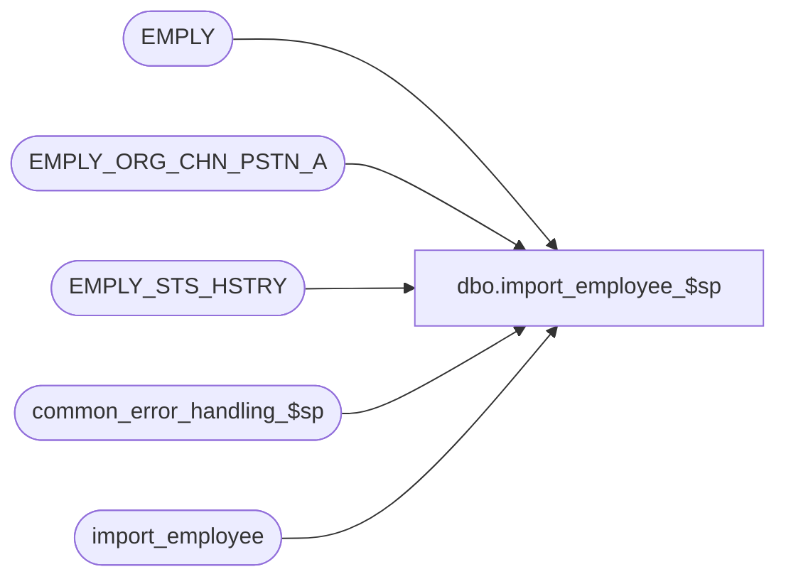

# dbo.import_employee_$sp

**Database:** auditworks  
**Server:** bedrockdb01  

## Architecture Diagram



## Table Dependencies

| Referenced Table |
|---|
| EMPLY |
| EMPLY_ORG_CHN_PSTN_A |
| EMPLY_STS_HSTRY |
| common_error_handling_$sp |
| import_employee |

## Stored Procedure Code

```sql
create proc dbo.import_employee_$sp 
AS

/*
PROC NAME: import_employee_$sp
     DESC: This program will post employee received from  a client or 3rd party to the 
           AW employee table based on the I'nsert U'pdate D'elete R'eplacement_file entry_type.
           WARNING: May become obsolete in later versions of SA5.
           Called by standard_import.ict in ICT_IMPORT smartload
		
HISTORY:
Date     Name          Def#  Desc
Jan31,11 Paul        105313  Use unicode datatypes
Aug08,08 Paul         87777  Uplift 66476 to SA5
May04,04 Brett	    DV-1071  Replace employee table with EMPLY (finish up for Sab)
Apr23,04 Sab	    DV-1071  Replace employee table with EMPLY
Jan24,06 Vicci	      66476  Allow employees to be deactivated without being deleted
Dec09,02 Winnie     1-H56TW  avoid raiserror on business rule warning message
Nov14,02 Maryam     1-G4Q91  When checking for invalid entry_type pass 3 to abort_flag
FEB08,02 Daphna     1-AWBZX  renumber message id from 203141 to 201653
NOV27,01 Daphna F   1-97KT4  Error Handling
Oct24,01 ShuZ          8808  Performance improvement when reloading entire table
NOV26,01 Daphna F   1-960HE  for QA and SHIP: explicit conversion of @employee_no to 
                             nvarchar(10) in concatenation of errmsg for multiple entries
Jun15,00 Daphna F      6431  correct cursor name dup_emp_cursor -> dup_emp_crsr	
Apr10,00 Daphna F      6165  use of identity col in user_import table to handle insert/update/deletes
				         to same employee_no in the order they are in import file
Mar01,00 Phu           5900  Change @@fetch_status > 0 to @@fetch_status <> 0 for MS SQL compatibility
Jan31,00 Maryam	   5013  Distinguish between Insert and Update.Also check for invalid entry type.          
Sep01,98 Vicci          ??   last modified
Oct03,97 Vicci         n/a   author 
*/

DECLARE
  @bypass_update 	int,
  @errmsg		    nvarchar(255),
  @errno		    int,
  @open_cursor  	int,
  @first_fetch		tinyint, 
  @employee_no		int,
  @import_id		numeric(12,0),
  @entry_type		nchar(1),
  @rows			    int,
  -- error handling
  @process_no    	int,
  @process_name  	nvarchar(100),
  @object_name   	nvarchar(255),
  @operation_name 	nvarchar(100),
  @message_id		int,
  @message_id2      int,
  @memo1		    nvarchar(10),
  @log_error_flag	tinyint
  
SELECT @open_cursor = 0,
       @bypass_update = 0,
       @message_id = 201068,  -- DBMS error
       @process_name = 'import_employee_$sp',
       @process_no = 7,    -- standard import
       @log_error_flag = 1,  -- log 
       @first_fetch  =  1  
 
IF EXISTS(SELECT entry_type 
	    FROM import_employee
	   WHERE UPPER(entry_type) NOT IN ('I', 'R', 'D', 'U'))
BEGIN
  SELECT @errmsg = 'An invalid entry-type was encountered in the import file. Please verify the |1 table.',
	 @errno =  201735,
	 @message_id2 = 201735,
	 @memo1 = 'import_employee'

  EXEC common_error_handling_$sp @process_no, @errno, @errmsg, 3, @message_id2, @process_name,
           @object_name, @operation_name, @log_error_flag
END
      
SELECT @errno = @@error
IF @errno != 0
 BEGIN 
   SELECT @errmsg = 'invalid entry_types.',
          @operation_name = 'SELECT',
          @object_name = 'import_employee'
     GOTO error
 END  	   
    	   	   
IF EXISTS(SELECT entry_type
            FROM import_employee
           WHERE UPPER(entry_type) = 'R')
 BEGIN          
   TRUNCATE TABLE EMPLY

   UPDATE import_employee
      SET entry_type = 'I'
    WHERE UPPER(entry_type) = 'U'

   SELECT @errno = @@error
   IF @errno != 0
   BEGIN
     SELECT @errmsg = 'set UPDATES to INSERTS',
            @object_name = 'import_employee',
            @operation_name = 'UPDATE'
     GOTO error
   END
   
  SELECT @bypass_update = 1   
 END   


/* find occurences of same employee_no being inserted/updated/deleted 
          more than once in import file */

DECLARE dup_emp_crsr CURSOR
FOR SELECT employee_no
      FROM import_employee
    GROUP BY employee_no
    HAVING count(*) > 1

SELECT @errno = @@error
IF @errno != 0 
BEGIN
   SELECT @errmsg = 'duplicate employee nos',
          @object_name = 'dup_emp_crsr',
          @operation_name = 'DECLARE'
   GOTO error
END

OPEN dup_emp_crsr
SELECT @errno = @@error
IF @errno != 0 
BEGIN
   SELECT @errmsg = 'Failed to open cursor for dup_emp_crsr',
          @object_name = 'dup_emp_crsr',
          @operation_name = 'OPEN CURSOR'
   GOTO error
END

SELECT @open_cursor = 1

 /* process all rows returned in the cursor set for duplicate rows on import_employee table */

WHILE 1=1
BEGIN
  FETCH dup_emp_crsr INTO @employee_no

  IF @@fetch_status <> 0    /* if eof, then exit */
  BEGIN
    IF @first_fetch = 0  -- only if after LAST fetch
    BEGIN
      SELECT @errno = 0,
           @errmsg = 'Duplicate employee number in import file, see PROCESS ERROR',
           @object_name = 'import_employee',
           @operation_name = 'IMPORT'
  
      EXEC common_error_handling_$sp @process_no, @errno, @errmsg, 3, @message_id, @process_name,
           @object_name, @operation_name, @log_error_flag  
    END  -- @first_fetch = 0           
    BREAK
  END  
     
  IF @first_fetch = 1
     SELECT @first_fetch = 0 
     
   /* get all instances for the employee_no in order of import file */
  
  DECLARE dup_row_crsr CURSOR
  FOR SELECT import_id, entry_type
         FROM import_employee
        WHERE employee_no = @employee_no
        ORDER BY import_id

  SELECT @errno = @@error
  IF @errno != 0 
  BEGIN
    SELECT @errmsg = 'cursor for @employee_no',
           @object_name = 'dup_row_crsr',
           @operation_name = 'DECLARE CURSOR'
    GOTO error
  END

  OPEN dup_row_crsr
  SELECT @errno = @@error
  IF @errno != 0 
  BEGIN
    SELECT @errmsg = 'Failed to open dup_row_crsr cursor',
           @object_name = 'dup_row_crsr',
           @operation_name = 'OPEN CURSOR'
    GOTO error
  END

  SELECT @open_cursor = 2 -- both cursors open

  /* process all rows returned in the cursor set for duplicate rows on import_employee table */

  WHILE 2=2
  BEGIN
    FETCH dup_row_crsr
     INTO @import_id, @entry_type

    IF @@fetch_status <> 0    /* if eof, then exit */
      BREAK

    IF @entry_type IN ('U','I','R')
    BEGIN
      UPDATE EMPLY   
             SET FRST_NAME = bcp.employee_first_name,
                     LAST_NAME = bcp.employee_last_name,
                     HS_ACNT_NUM = bcp.house_account_no,
                     ACTV = COALESCE(bcp.active_flag,1)
         FROM EMPLY e, import_employee bcp
      WHERE e.EMPLY_NUM = bcp.employee_no 
            AND bcp.import_id = @import_id

     UPDATE EMPLY_STS_HSTRY
             SET EFCTV_DATE = bcp.date_of_hire,
	       EXPRTN_DATE = bcp.date_of_termination
         FROM EMPLY_STS_HSTRY e, import_employee bcp
      WHERE e.EMPLY_NUM = bcp.employee_no 
            AND bcp.import_id = @import_id

    UPDATE EMPLY_ORG_CHN_PSTN_A
            SET ORG_CHN_NUM = bcp.home_store_no,
                    PSTN_CODE = bcp.employee_type,
                    PRMRY_LOC_ID = bcp.employee_department
        FROM EMPLY_ORG_CHN_PSTN_A e, import_employee bcp
     WHERE e.EMPLY_NUM = bcp.employee_no 
           AND bcp.import_id = @import_id


      SELECT @errno = @@error,
             @rows = @@rowcount
      IF @errno != 0
      BEGIN
        SELECT @errmsg = 'set employee info from import_employee',
               @object_name = 'employee',
               @operation_name = 'UPDATE' 
        GOTO error
      END
      
      IF @rows = 0 -- no rows updated
      BEGIN
        INSERT EMPLY (
             EMPLY_NUM,
             FRST_NAME,
             LAST_NAME,
             ACTV,
            SHRT_NAME,
            HS_ACNT_NUM,
            SCRTY_CLS_CODE,        -- CHECK
            EMPLY_STS_CODE,       -- 4
            PRTY_ID                         -- VALUES
		)
        SELECT employee_no,
                       employee_first_name,
                       employee_last_name,
                       COALESCE(active_flag,1),
                       employee_first_name,
	          house_account_no,
        1,' ',1
          FROM import_employee
       WHERE import_id = @import_id

       INSERT EMPLY_STS_HSTRY (
	        EMPLY_NUM,
	        EFCTV_DATE,
	        EMPLY_STS_CODE,	-- CHECK THIS VALUE
	        EXPRTN_DATE
		)
      SELECT employee_no,
	       date_of_hire,
	        ' ',
	       date_of_termination
         FROM import_employee
      WHERE import_id = @import_id
 
      INSERT EMPLY_ORG_CHN_PSTN_A (
	       EMPLY_NUM,
	       ORG_CHN_NUM,
	       PSTN_CODE,
	       EFCTV_DATE,
	       EXPRTN_DATE,
	       EMPLY_SHRT_NUM,	-- CHECK THIS VALUE
	       PRMRY_LOC_ID
		)
     SELECT employee_no,
	       home_store_no,
	       employee_type,
	       date_of_hire,
	       date_of_termination,
	        1,
	       employee_department
         FROM import_employee
      WHERE import_id = @import_id


        SELECT @errno = @@error
        IF @errno != 0
        BEGIN
          SELECT @errmsg = 'from import_employee',
                 @object_name = 'employee',
                 @operation_name = 'INSERT'
          GOTO error
        END
      END  /* @rows = 0 -- no rows updated */
    END /* @entry_type IN ('U','I','R') */
    ELSE 
    BEGIN
      IF @entry_type= 'D' 
      BEGIN
        UPDATE EMPLY
         SET ACTV = 0
            FROM import_employee bcp, EMPLY e
         WHERE bcp.employee_no = e.EMPLY_NUM
               AND bcp.import_id = @import_id

        SELECT @errno = @@error
        IF @errno != 0
        BEGIN
          SELECT @errmsg = 'from import_employee',
                 @object_name = 'employee',
                 @operation_name = 'DELETE'
          GOTO error
        END
      END /* @entry_type= 'D' */
    END /* @entry_type NOT ('U','I','R') */
    
  END /* While 2=2 */

  CLOSE dup_row_crsr
  DEALLOCATE dup_row_crsr
 
  SELECT @open_cursor = 1  -- only dup_emp_crsr open now

  DELETE import_employee
   WHERE employee_no = @employee_no

  SELECT @errno = @@error
  IF @errno != 0
  BEGIN
    SELECT @errmsg = '@employee_no: dup_emp_crsr',
           @object_name = 'import_employee',
           @operation_name = 'DELETE'
    GOTO error
  END
 
  /* do not log message to smartload log, only to error log */
  SELECT @log_error_flag = 0,
         @message_id = 201653,         
         @errmsg = 'Please verify the employee table.',
         @errno = 201653,
         @object_name = 'employee',
         @operation_name = 'VERIFY',
         @memo1 = CONVERT(nvarchar(10),@employee_no)
 
  EXEC common_error_handling_$sp @process_no, @errno, @errmsg, 3, @message_id, @process_name,
       @object_name, @operation_name, @log_error_flag,NULL,NULL,NULL,NULL,@memo1 
  
  SELECT @log_error_flag = 1,  -- reset for next fetch
         @message_id = 201068
   
END /* 1=1 */

CLOSE dup_emp_crsr
DEALLOCATE dup_emp_crsr 
 
SELECT @open_cursor = 0  -- no open cursors

       /* remaining entries in import_employee are one per employee_no */   

UPDATE import_employee
   SET entry_type = 'I'
 WHERE UPPER(entry_type) = 'U'

SELECT @errno = @@error
IF @errno != 0
BEGIN
  SELECT @errmsg = 'set entry_type = INSERT',
         @object_name = 'import_employee',
         @operation_name = 'UPDATE'
  GOTO error
END

UPDATE import_employee
   SET entry_type = 'U'
  FROM import_employee ie,
       EMPLY e
 WHERE ie.employee_no = e.EMPLY_NUM
   AND UPPER(entry_type) = 'I'

SELECT @errno = @@error
IF @errno != 0
BEGIN
  SELECT @errmsg = 'reset entry_type = UPDATES',
         @object_name = 'import_employee',
         @operation_name = 'UPDATE'
  GOTO error
END

/* mass insert */

INSERT EMPLY (
	EMPLY_NUM,
	FRST_NAME,
	LAST_NAME,
	ACTV,	                      -- CHECK THIS VALUE
	SHRT_NAME,
	HS_ACNT_NUM,
	SCRTY_CLS_CODE,  -- CHECK
	EMPLY_STS_CODE,  -- 4
	PRTY_ID                     -- VALUES
	)
SELECT employee_no,
	employee_first_name,
	employee_last_name,
	COALESCE(active_flag,1),
	employee_first_name,
	house_account_no,' ',' ',1
  FROM import_employee
 WHERE UPPER(entry_type) IN ('I','R')

INSERT EMPLY_STS_HSTRY (
	EMPLY_NUM,
	EFCTV_DATE, 
	EMPLY_STS_CODE,	-- CHECK THIS VALUE
	EXPRTN_DATE
	)
SELECT employee_no,
	date_of_hire,
	' ',
	date_of_termination
  FROM  import_employee
 WHERE UPPER(entry_type) IN ('I','R')

INSERT EMPLY_ORG_CHN_PSTN_A (
	EMPLY_NUM,
	ORG_CHN_NUM,
	PSTN_CODE,
	EFCTV_DATE,
	EXPRTN_DATE,
	EMPLY_SHRT_NUM,	-- CHECK THIS VALUE
	PRMRY_LOC_ID
	)
SELECT employee_no,
	home_store_no,
	employee_type,
	date_of_hire,
	date_of_termination,
	' ',
	employee_department
  FROM  import_employee
 WHERE UPPER(entry_type) IN ('I','R')

SELECT @errno = @@error
IF @errno != 0
BEGIN
  SELECT @errmsg = 'from import_employee entry_type = I or R',
         @object_name = 'employee',
         @operation_name = 'MASS INSERT'
  GOTO error
END

IF @bypass_update = 0
BEGIN 
/* mass update  */ 
UPDATE EMPLY
        SET FRST_NAME = bcp.employee_first_name,
	   LAST_NAME = bcp.employee_last_name,
                HS_ACNT_NUM = bcp.house_account_no,
                ACTV = COALESCE(bcp.active_flag,1)
     FROM EMPLY e, import_employee bcp
  WHERE e.EMPLY_NUM = bcp.employee_no 
        AND UPPER(bcp.entry_type) = 'U'

UPDATE EMPLY_STS_HSTRY
       SET EFCTV_DATE = bcp.date_of_hire,
	  --EMPLY_STS_CODE = bcp.???????????????????????????????????????????????????????
	  EXPRTN_DATE = bcp.date_of_termination
    FROM EMPLY_STS_HSTRY e, import_employee bcp
 WHERE e.EMPLY_NUM = bcp.employee_no 
       AND UPPER(bcp.entry_type) = 'U'


UPDATE EMPLY_ORG_CHN_PSTN_A
        SET ORG_CHN_NUM = bcp.home_store_no,
	   PSTN_CODE = bcp.employee_type,
	   EFCTV_DATE = bcp.date_of_hire,
	   EXPRTN_DATE = bcp.date_of_termination,
                PRMRY_LOC_ID = employee_department
     FROM EMPLY_ORG_CHN_PSTN_A e, import_employee bcp
  WHERE e.EMPLY_NUM = bcp.employee_no 
        AND UPPER(bcp.entry_type) = 'U'


  SELECT @errno = @@error
  IF @errno != 0
  BEGIN
    SELECT @errmsg = 'from import_employee entry_type = U',
           @object_name = 'employee',
           @operation_name = 'MASS UPDATE'
    GOTO error
  END
END -- If @bypass_update = 0

/* mass delete */

UPDATE EMPLY
  SET ACTV = 0
    FROM import_employee bcp, EMPLY e
 WHERE bcp.employee_no = e.EMPLY_NUM
   AND UPPER(bcp.entry_type) = 'D'

SELECT @errno = @@error
IF @errno != 0
BEGIN
  SELECT @errmsg = 'from import_employee entry_type = D',
         @object_name = 'employee',
         @operation_name = 'MASS DELETE'
  GOTO error
END

RETURN

error:   /* Common error handler. */

    IF @open_cursor >= 1
    BEGIN
      CLOSE dup_emp_crsr   
      DEALLOCATE dup_emp_crsr 

   	 IF @open_cursor = 2
      BEGIN
        CLOSE dup_row_crsr
 	   DEALLOCATE dup_row_crsr
      END   
       
    END

    EXEC common_error_handling_$sp @process_no, @errno, @errmsg, 0, @message_id, @process_name,
           @object_name, @operation_name, @log_error_flag

    RETURN
```

