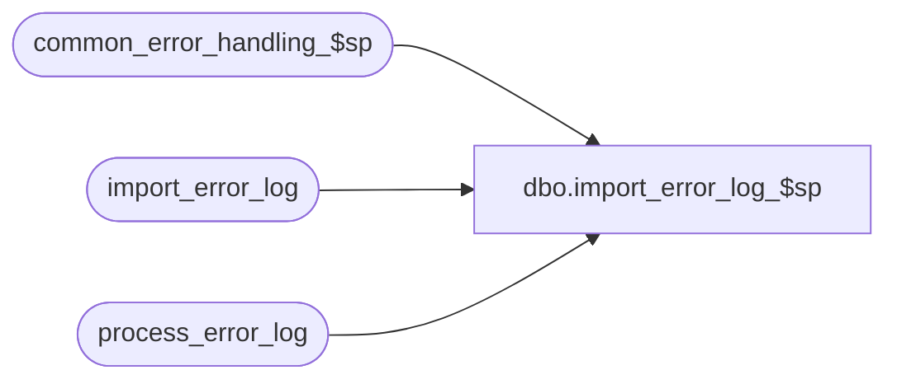

# dbo.import_error_log_$sp

**Database:** auditworks  
**Server:** bedrockdb01  

## Architecture Diagram



## Table Dependencies

| Referenced Table |
|---|
| common_error_handling_$sp |
| import_error_log |
| process_error_log |

## Stored Procedure Code

```sql
create proc dbo.import_error_log_$sp 


AS

/*
PROC NAME: import_error_log_$sp
     DESC: Inserts process_error_log entries generated on the Separate Server
           Called by standard_import.ict in ICT_IMPORT smartload.
		
HISTORY:
Date     Name            Def# Desc
Jan31,11 Paul          105313 Use unicode datatypes
Oct27,04 Paul         DV-1146 do not import verified_by or user name columns into SA5
MAY22,02 Daphna       1-CYE1P author 
*/

DECLARE
  @errmsg		nvarchar(255),
  @errno		int,
  @log_error_flag	tinyint,
  @message_id		int,
  @object_name   	nvarchar(255),
  @operation_name 	nvarchar(100),
  @process_no    	int,
  @process_name  	nvarchar(100),
  @rows			int

  
SELECT @message_id = 201068,  -- DBMS error
       @process_name = 'import_error_log_$sp',
       @process_no = 7,    -- standard import
       @log_error_flag = 1  --  called by smartload

SELECT @rows = COUNT(*) 
FROM import_error_log

IF @rows = 0
BEGIN
  SELECT @errno = 201045,
         @message_id = 201045,
         @errmsg = 'import table has no rows'
  GOTO error       
END


INSERT process_error_log(
       process_no,
       error_code,
       error_timestamp,
       process_id,
       verified,
       support_call_reference_no,
       error_msg,
       memo1,
       memo2,
       memo3,
       memo_date,
       support_call_id,
       memo_date2,
       memo_date3,
       process_name,
       object_name,
       operation_name,
       message_id,
       stream_no)
SELECT process_no,
       error_code,
       error_timestamp,
       process_id,
       verified,
       support_call_reference_no,
       error_msg,
       memo1,
       memo2,
       memo3,
       memo_date,
       support_call_id,
       memo_date2,
       memo_date3,
       process_name,
       object_name,
       operation_name,
       message_id,
       stream_no
  FROM import_error_log

SELECT @errno = @@error
IF @errno != 0
BEGIN
  SELECT @errmsg = 'from import_error_log',
         @object_name = 'process_error_log',
         @operation_name = 'INSERT'
  GOTO error
END

RETURN

error:   /* Common error handler. */


    EXEC common_error_handling_$sp @process_no, @errno, @errmsg, 0, @message_id, @process_name,
           @object_name, @operation_name, @log_error_flag

    RETURN
```

