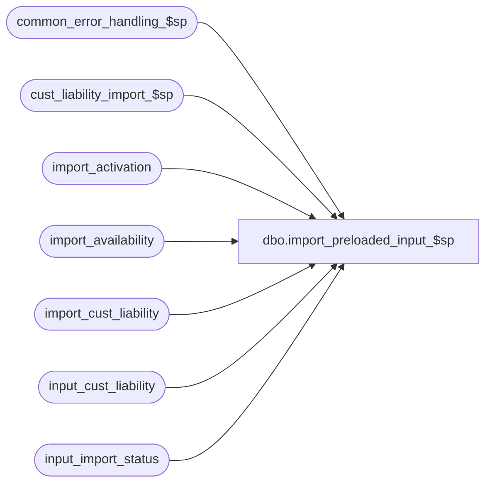

# dbo.import_preloaded_input_$sp

**Database:** auditworks  
**Server:** bedrockdb01  

## Architecture Diagram



## Table Dependencies

| Referenced Table |
|---|
| common_error_handling_$sp |
| cust_liability_import_$sp |
| import_activation |
| import_availability |
| import_cust_liability |
| input_cust_liability |
| input_import_status |

## Stored Procedure Code

```sql
create proc dbo.import_preloaded_input_$sp AS

/*
   NAME:    import_preloaded_input_$sp
   DESCR:   Imports data which was loaded by external systems into database tables instead of being sent to S/A as 
            ascii files.  Once imported, the data is removed from the input tables and exported to a flat ascii .OUT 
            file in the ICT_IMPORT/BK directory for backup. This allows for an audit-trail of the data received and
            allows for the file to be reprocessed (for example in test) if necessary.
            Currently only Customer Liability data may be imported in this manner, but this proc may
            be extended to support other imports by adding sections in the order desired.
            Also export o
            Called by ICT_IMPORT smartload.
            An example of how an external system would load data into the database tables follows:
	            DECLARE @import_batch_id numeric(12,0)		--identifies the batch of reservations, fulfillments, cancellations about to be interfaced
		    EXEC reserve_import_batch_id_$sp @import_batch_id OUTPUT  --returns a unique identifier for the batch;  will raise an error if a S/A application upgrade is in progress.
		    INSERT INTO input_cust_liability(
			   import_batch_id,
			   entry_date_time, 
			   reference_no,  
			   rule_id,
			   store_no,
			   pos_identifier_type,
			   pos_identifier,
			   units,
			   serial_no)
		    SELECT @import_batch_id,
	 	  	   getdate(),
	 	  	   '12345600',
	 	  	   'ES6',
	 	  	   2228,
	 	  	   1,
	 	  	   42714120945,
	 	  	   1,
	 	  	   null		--in case of Gift Vouchers would be set to card#
		    EXEC release_import_batch_id_$sp @import_batch_id  --releases the batch to S/A which will then process it.
            
HISTORY:
Date      Name             Defect#  Description
Apr25,14  Vicci          TFS-71445  Handle receipt of future date beyond 2079.
Nov14,13  Vicci             148175  Don't set export flag unless not already set.  Handle export_flag 2 (i.e. request for export issued
                                    by cust_liability_processing_$sp and indication that it has already released these rows to the Edit).
Oct03,13  Vicci             146826  Log pos_identifier_type to import_cust_liability and MSSQL 2012 compatibility handling.
Mar18,13  Vicci             142035  Remove ampersands from log messages to avoid the ICT interpreting them as errors.
Nov01,10  Vicci             122171  Log serial_no (gift voucher number).
Mar31,09  Vicci	            109078  Author

*/

DECLARE @cursor_open			tinyint,
	@errmsg				nvarchar(2000),
	@errno				int,
	@message_id			int,
	@object_name			nvarchar(255),
	@operation_name			nvarchar(100),
	@process_name			nvarchar(100),
	@process_no 			smallint,
	@process_start_datetime		datetime,
	@rows				int,
	@rule_id			nvarchar(3),
	@impt_fmt			nvarchar(30),
	@msg				nvarchar(255),
	@errmsg2			nvarchar(2000);

SELECT @process_no = 242, --C/L Import
       @process_name = 'import_preloaded_input_$sp',
       @message_id = 201068,
       @process_start_datetime = getdate(),
       @operation_name = 'SELECT';

BEGIN TRY

/*  SECTION 1 START:  Customer Liability import */
SELECT @errmsg = 'Failed to remove orphaned import-from-input requests. ',
       @object_name = 'input_import_status',
       @operation_name = 'DELETE';
DELETE input_import_status
 WHERE status = 1
   AND process_no = 228  --Customer Liability Posting
   AND NOT EXISTS (SELECT 1 FROM input_cust_liability cl WHERE cl.import_batch_id = input_import_status.import_batch_id);

SELECT @errmsg = 'Failed to left over data from prior processing attempt. ',
       @object_name = 'import_cust_liability';
DELETE import_cust_liability
 WHERE export_flag = 0;

SELECT @errmsg = 'Failed to load import-from-input data. ',
       @object_name = 'import_cust_liability',
       @operation_name = 'INSERT';
INSERT into import_cust_liability(
 rule_id,
       reference_no,
       date_issued,  --date reserved/fulfilled/cancelled
       issuing_store_no,
       upc_no,
       pos_identifier,
       pos_identifier_type, 
       units,
       import_batch_id,
       action_amount,
       serial_no)
SELECT cl.rule_id, cl.reference_no, CASE WHEN cl.entry_date_time > '06/06/2079' THEN '06/06/2079' ELSE cl.entry_date_time END, cl.store_no, 
       CASE WHEN cl.pos_identifier_type = 0 THEN cl.upc_no ELSE NULL END, 
       CASE WHEN cl.pos_identifier_type <> 0 THEN cl.pos_identifier ELSE NULL END, 
       cl.pos_identifier_type,
       cl.units, cl.import_batch_id, 0, cl.serial_no 
  FROM input_import_status i
       INNER JOIN input_cust_liability cl
          ON i.import_batch_id = cl.import_batch_id
 WHERE i.status = 1
   AND i.process_no = 228  --Customer Liability Posting
 ORDER BY cl.rule_id, cl.reference_no, cl.entry_date_time, cl.store_no;
SELECT @rows = @@rowcount;
   
IF @rows > 0
BEGIN
  SELECT @errmsg = 'Failed to execute stored proc cust_liability_import_$sp. ',
         @object_name = 'cust_liability_import_$sp',
         @operation_name = 'EXECUTE';
  EXEC cust_liability_import_$sp;
END;

IF @rows > 0 OR EXISTS (SELECT 1 FROM import_cust_liability WHERE export_flag = 2)  --note export_flag 2 is set by cust_liability_processing for rows released to the the edit.  This "or" is to handle error recovery if one rule from batch was released but the next failed or subsequent code failed.
BEGIN
  SELECT @errmsg = 'Failed to remove processed import-from-input requests:  risk of double-posting must be addressed! ',
         @object_name = 'input_import_status',
         @operation_name = 'DELETE';
  DELETE input_import_status  
   WHERE status = 1
     AND process_no = 228  --Customer Liability Posting
     AND import_batch_id IN (SELECT import_batch_id FROM import_cust_liability cl);

  SELECT @errmsg = 'Failed to remove processed import-from-input requests. ',
         @object_name = 'input_import_status';
  DELETE input_cust_liability 
   WHERE import_batch_id IN (SELECT import_batch_id FROM import_cust_liability cl);
  
  SELECT @errmsg = 'Failed to request an ascii file backup of the import table rows. ',
         @object_name = 'import_cust_liability',
         @operation_name = 'UPDATE';
  UPDATE import_cust_liability
     SET export_flag = 1
   WHERE import_batch_id IS NOT NULL
     AND COALESCE(export_flag, 0) <> 1;;
  SELECT @rows = @@rowcount;

  IF @rows > 0
  BEGIN 
    SELECT @errmsg = 'Failed to remove left over rows from prior import. ',
           @object_name = 'import_cust_liability',
           @operation_name = 'DELETE';
    DELETE import_cust_liability 
     WHERE export_flag = 0;

    SELECT @errmsg = 'Failed to determine what customer liability import format is active. ',
           @object_name = 'import_activation',
           @operation_name = 'SELECT';
    SELECT @impt_fmt = i.import_format_name
      FROM import_activation a, import_availability i
     WHERE a.import_control_file = 'CL.GO'
       AND a.import_id = i.import_id;
       
    IF @impt_fmt IS NULL
    BEGIN
      SELECT @errmsg = 'Failed to determine what customer liability import format is available. ',
             @object_name = 'import_availability',
             @operation_name = 'SELECT';
      SELECT @impt_fmt = MAX(i.import_format_name)
        FROM import_availability i
       WHERE i.import_control_file = 'CL.GO';
    END; 
    
    SELECT @msg=':LOG Proc changed variable impt_fmt=' + @impt_fmt;
    PRINT @msg;
    SELECT @msg=':VAR impt_fmt=' + @impt_fmt;
    PRINT @msg;
    PRINT ':LOG Proc changed variable impt_table_name=import_cust_liability';
    PRINT ':VAR impt_table_name=import_cust_liability';
    PRINT ':LOG Proc changed variable impt_pfx=CL';
    PRINT ':VAR impt_pfx=CL';
    PRINT ':LOG Proc changed variable output_dest=BK';
    PRINT ':VAR output_dest=BK';
    PRINT ':LOG Proc forced skip to CL_EXPORT';
    PRINT ':GOTO EXPORT_FILE';
    
  END;

END;
/*  SECTION 1 END:  Customer Liability import */


  RETURN;

END TRY

BEGIN CATCH
  SELECT @errno = ERROR_NUMBER();
  IF @errmsg2 IS NULL
  BEGIN
    SELECT @errmsg2 = @process_name + ':  ' + COALESCE(@errmsg, '') + ERROR_MESSAGE() + ' Line: ' + CONVERT(nvarchar, ERROR_LINE());
  END;
  SELECT @errmsg = @errmsg2;  
  
  EXEC common_error_handling_$sp @process_no, @errno, @errmsg2, 0, @message_id, @process_name, @object_name, @operation_name, 1;
  
  RETURN;
END CATCH;

error:   		-- common error handler 
 
	EXEC common_error_handling_$sp @process_no, @errno, @errmsg, 0, @message_id, 
	@process_name, @object_name, @operation_name, 1

	RETURN
```

