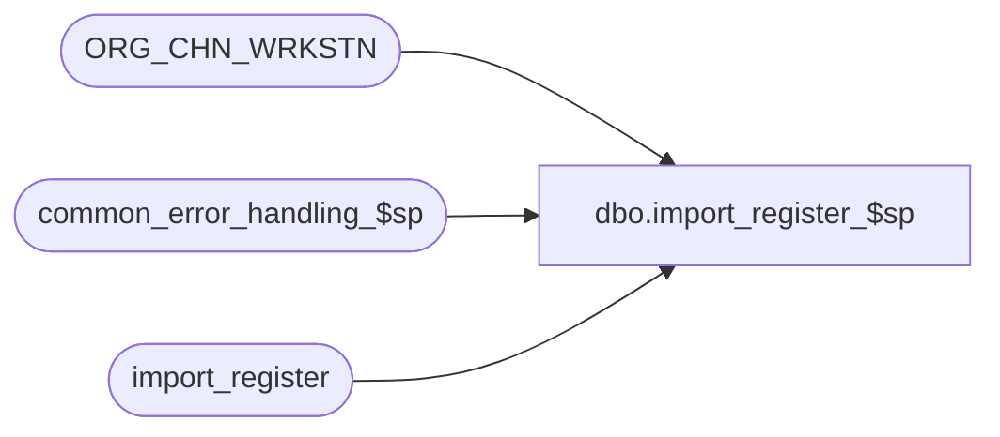

# dbo.import_register_$sp

**Database:** auditworks  
**Server:** bedrockdb01  

## Architecture Diagram



## Table Dependencies

| Referenced Table |
|---|
| ORG_CHN_WRKSTN |
| common_error_handling_$sp |
| import_register |

## Stored Procedure Code

```sql
create proc dbo.import_register_$sp 


AS

/* 
   Desc: to post registers from import_register to register table 

HISTORY:
Date     Name           Def# Desc
Jan31,11 Paul         105313 Use unicode datatypes
May29,04 Maryam      DV-1071 Use ORG_CHN_WRKSTN instead of register table.
May16,02 Henry       1-CD0IX Add R3.5 standardized common error handling
Jul04,96 Srinivas	

*/

DECLARE

-- used for common error handling.
	@errmsg				nvarchar(255),
	@errno				int,
	@process_no			smallint,
	@log_flag			tinyint,
	@object_name			nvarchar(255),
	@process_name			nvarchar(100),
	@operation_name			nvarchar(100),
	@message_id			int

SELECT @process_name = 'import_register_$sp',
       @message_id = 201068,
       @log_flag = 1,  -- called from smartload
       @process_no = 7 -- standard import

/* ignore if already on file */

DELETE import_register
FROM import_register ir, ORG_CHN_WRKSTN rg
WHERE ir.store_no = rg.ORG_CHN_NUM
AND ir.register_no = rg.WRKSTN_NUM

SELECT @errno = @@error
IF @errno != 0 
BEGIN
  SELECT @errmsg = 'Failed to cleanup work table',
	 @object_name = 'import_register',
	 @operation_name = 'DELETE'
  GOTO error
END

/* ignore duplicates ( if any ) in source file */

INSERT ORG_CHN_WRKSTN (
       ORG_CHN_NUM,
       WRKSTN_NUM,
       CMPTR_NAME )
SELECT DISTINCT
	store_no,
	register_no,
	description
FROM import_register

SELECT @errno = @@error
IF @errno != 0 
BEGIN
  SELECT @errmsg = 'Failed to populate register table',
	 @object_name = 'register',
	 @operation_name = 'INSERT'
  GOTO error
END

RETURN

error:   /* Common error handler. */

	EXEC common_error_handling_$sp @process_no, @errno, @errmsg, 0, @message_id, 
	@process_name, @object_name, @operation_name, @log_flag

RETURN
```

