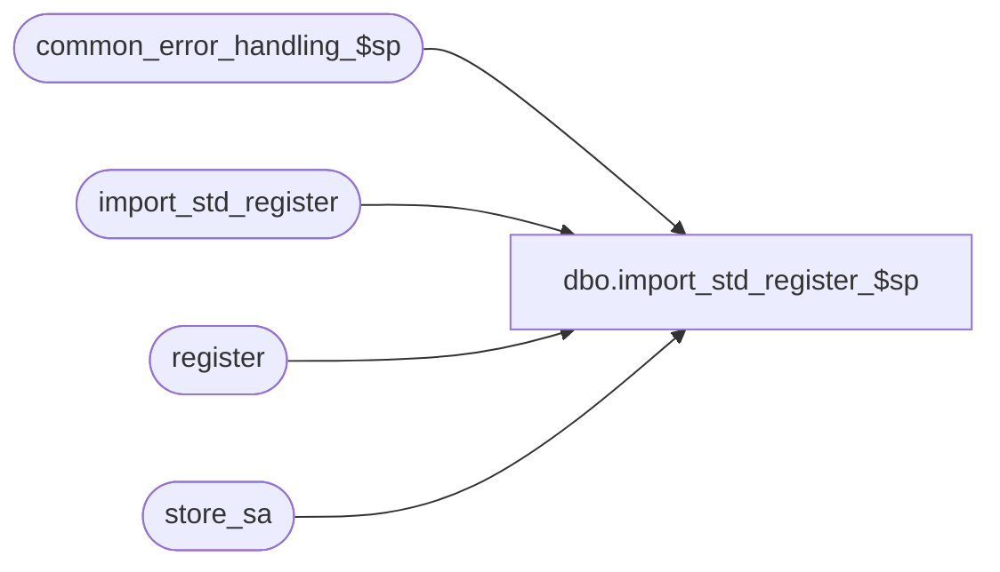

# dbo.import_std_register_$sp

**Database:** auditworks  
**Server:** bedrockdb01  

## Architecture Diagram



## Table Dependencies

| Referenced Table |
|---|
| common_error_handling_$sp |
| import_std_register |
| register |
| store_sa |

## Stored Procedure Code

```sql
create proc dbo.import_std_register_$sp 

AS

/* 
PROC NAME: import_std_register_$sp
     DESC: This program will post register information received from a client or 3rd party 
           to the AW register table based on the I'nsert U'pdate D'elete_file entry_type
   	   File name is register.tab, 
   	   Called by ICT_IMPORT smartload standard_import.ict
        
HISTORY
Date     Name      Def# Desc
Jan31,11 Paul    105313 Use unicode datatypes
Oct25,06 Phu      77931 Fix outer join for SQL 2005 Mode 90.
Sep06,06 Tim      76719 Null Concatenation Fix.  IMPORTANT: Rem'ed out code that wouldn't compile.
Jul09,04 ShuZ   DV-1071 Expand user_name to nvarchar(50)
May11,04 Maryam DV-1071 change @process_id to binary(16)
Mar18,03 Phu       5425 Remove @errmsg from parameter list to standardize import
Dec09,02 Winnie 1-H56TW avoid raiserror on business rule warning message
Jun07,02 Winnie 1-CD0IX Standardize R3.5 error handling
May16,02 Henry	1-CD0IX Add R3.5 standardized common error handling
Nov16/01 Henry     8959 Correct Def 7355 to use IS NOT NULL
Apr04/01 Phu       7501 Use system function to retrieve user name
Mar08/01 Bayani	   7355 Added validation to bypass register which has a NULL in the poll_id 
Jan08/01 Winnie	   7159 Remove the (x) in convert(nvarchar(x)) statement to allow for larger store and register number.
Sep28/00 Henry	   6777 If get entry_type 'R', do not truncate the Register table. Change to Insert instead.
Jul13/00 Louise M  6488 Default register_type to 0 when this is not supplied
                                      in the import file (0=not live)	
Jun14/00 Daphna    6431 change of table name user_import_register to import_std_register
                        change of proc name to user_import_register_$sp to import_std_register_$sp
Apr10/00 Daphna    6165 use of identity col in user_import table to handle insert/update/deletes
			 to same store/reg combo in the order they are in import file
Mar01/00 Phu       5900 Change @@fetch_status > 0 to @@fetch_status <> 0 for MS SQL compatibility
Feb08/00 Maryam	   5895 Check for invalid entry type, and trap duplicate rows on update.     
Sep27/99 Erin N    5404 To check that store exists in store_sa    
Mar24/99 Henry Wu  n/a  Author
		
*/
 
DECLARE
  @errno		int,
  @errmsg		nvarchar(255),
  @entry_type   	nchar(1),
  @import_id    	numeric(12,0),
  @open_cursor  	int,
  @process_id		binary(16),
  @register_no		numeric(20,0),
  @rows			int,
  @store_no		numeric(20,0),
  @user_name    	nvarchar(50),
-- used for common error handling.
  @process_no		smallint,
  @log_flag		tinyint,
  @object_name		nvarchar(255),
  @process_name		nvarchar(100),
  @operation_name	nvarchar(100),
  @memo1		nvarchar(50),
  @message_id		int,
  @message_id2		int

SET CONCAT_NULL_YIELDS_NULL OFF

SELECT @open_cursor = 0,
       @rows = 0,
       @user_name = suser_sname(),
       @process_id = @@spid,
       @process_name = 'import_std_register_$sp',
       @message_id = 201068,
       @log_flag = 1,  -- called from smartload
       @process_no = 7 -- standard import

-- check for invalid entry types, log warning message and continue processing 
IF EXISTS(SELECT entry_type 
	    FROM import_std_register
	   WHERE UPPER(entry_type) NOT IN ('I', 'D', 'U'))
BEGIN
  SELECT @errmsg = 'Invalid entry_type in the import file. Please verify the |1 table and import data file.',
  	 @object_name = 'import_std_register',
  	 @operation_name = 'SELECT',
  	 @message_id2 = 201735,
  	 @errno = 201735,
  	 @memo1 = 'import_std_register'

  EXEC common_error_handling_$sp @process_no, @errno, @errmsg, 3, @message_id2,
	@process_name, @object_name, @operation_name, @log_flag, NULL, NULL,NULL, NULL, @memo1

  SELECT @errno = 0
END
      
/* prevent creation of registers for stores that don't exist */   

SELECT im.store_no, store_found_flag = st.store_no
  INTO #store_list
  FROM import_std_register im LEFT JOIN store_sa st ON (im.store_no = st.store_no)

SELECT @rows = @@rowcount,
	@errno = @@error    
IF @errno != 0
BEGIN
   SELECT @errmsg = 'Failed to build temp table #store_list.',
	  @object_name = '#store_list',
	  @operation_name = 'SELECT'
     GOTO error
END 
 
IF @rows > 0  -- there are store/reg in import file where store_no not in store_sa
BEGIN    
    
  DECLARE store_crsr CURSOR
  FOR SELECT DISTINCT store_no
     FROM #store_list
     WHERE store_found_flag IS NULL --    

  SELECT @errno = @@error
  IF @errno != 0 
  BEGIN
    SELECT @errmsg = 'Failed to declare cursor for missing store_no',
	   @object_name = 'store_crsr',
	   @operation_name = 'DECLARE'
    GOTO error
  END

  OPEN store_crsr
  SELECT @errno = @@error
  IF @errno != 0   
  BEGIN
    SELECT @errmsg = 'Failed to open cursor store_crsr',
	   @object_name = 'store_crsr',
	   @operation_name = 'OPEN'
    GOTO error
  END

  SELECT @open_cursor = 1

  WHILE 1=1
  BEGIN
    FETCH store_crsr  INTO @store_no

    IF @@fetch_status <> 0    /* if eof, then exit */
      BREAK

   --to delete from the user_import_register table where the store not in store_sa

    DELETE import_std_register 
     WHERE store_no  = @store_no

    SELECT @errno = @@error
    IF @errno != 0
    BEGIN
      SELECT @errmsg = 'Unable to delete from user_import_register where store not in store_sa',
	   @object_name = 'import_std_register',
	   @operation_name = 'DELETE'
      GOTO error
    END

    SELECT @errmsg = 'Registers were not imported for store number '+ CONVERT(nvarchar,  @store_no) + ' because the store does not exist. Please create the store first.',
	   @object_name = 'import_std_register',
	   @operation_name = 'DELETE'

    -- log warning message and continue processing
    EXEC common_error_handling_$sp @process_no, @errno, @errmsg, 0, @message_id, 
	 @process_name, @object_name, @operation_name, @log_flag
 
  END /* WHILE 1=1 */

  CLOSE store_crsr
  SELECT @errno = @@error
  IF @errno != 0   
  BEGIN
    SELECT @errmsg = 'Failed to CLOSE cursor store_crsr',
	   @object_name = 'store_crsr',
	   @operation_name = 'CLOSE'
    GOTO error
  END
  
  DEALLOCATE store_crsr
  SELECT @open_cursor = 0

END  /* @rows > 0: there are store/reg in import file where store_no not in store_sa */

/* find occurences of same store/reg being inserted/updated/deleted more than once in import file */

DECLARE dup_reg_crsr CURSOR
FOR  SELECT store_no,
 	    register_no
       FROM import_std_register
     GROUP BY store_no, register_no
     HAVING COUNT(*) > 1

SELECT @errno = @@error
IF @errno != 0 
BEGIN
  SELECT @errmsg = 'Failed to declare cursor for duplicate store-reg combinations',
	 @object_name = 'dup_reg_crsr',
	 @operation_name = 'DECLARE'
  GOTO error
END

OPEN dup_reg_crsr
SELECT @errno = @@error
IF @errno != 0 
BEGIN
  SELECT @errmsg = 'Failed to open cursor for dup_reg_crsr',
	 @object_name = 'dup_reg_crsr',
	 @operation_name = 'OPEN'
  GOTO error
END

SELECT @open_cursor = 2 

WHILE 2=2
BEGIN
  FETCH dup_reg_crsr
    INTO @store_no, @register_no

  IF @@fetch_status <> 0    /* if eof, then exit */
     BREAK

  DECLARE dup_row_crsr CURSOR
  FOR SELECT import_id, entry_type
        FROM import_std_register
       WHERE store_no = @store_no
         AND register_no  = @register_no
      ORDER BY import_id   

  SELECT @errno = @@error
  IF @errno != 0 
  BEGIN
    SELECT @errmsg = 'Failed to declare dup_row_crsr cursor for @store_no and @register_no',
	   @object_name = 'dup_row_crsr',
	   @operation_name = 'DECLARE'
    GOTO error
  END

  OPEN dup_row_crsr
  SELECT @errno = @@error
  IF @errno != 0 
  BEGIN
    SELECT @errmsg = 'Failed to open dup_row_crsr cursor',
	   @object_name = 'dup_row_crsr',
	   @operation_name = 'OPEN'
    GOTO error
  END

  SELECT @open_cursor = 3  -- 2 cursors open 

  WHILE 3=3
  BEGIN
    FETCH dup_row_crsr
     INTO @import_id, @entry_type

IF @@fetch_status <> 0    /* if eof, then exit */
      BREAK

    IF @entry_type IN ('I','U')
    BEGIN
    /*
      UPDATE register
         SET register_name = uir.register_name,
             register_function = uir.register_function,
             register_poll_id = uir.register_poll_id,
             polling_method = uir.polling_method,
             register_type = ISNULL(uir.register_type,0),
             register_location = uir.register_location,
             register_department = uir.register_department,
             translate_lookup_version = uir.translate_lookup_version
        FROM register ur, store_sa ss, import_std_register uir
       WHERE uir.store_no=ss.store_no
         AND ur.store_no = uir.store_no 
         AND ur.register_no = uir.register_no
         AND uir.import_id = @import_id
         AND uir.register_poll_id IS NOT NULL --  do not update register if register_poll_id is null
*/
      SELECT @errno = @@error,
             @rows = @@rowcount
      IF @errno != 0
      BEGIN
        SELECT @errmsg = 'Failed to UPDATE register from user_import_register: dup_row_crsr',
	       @object_name = 'register',
	       @operation_name = 'UPDATE'
        GOTO error
      END

      IF @rows = 0  -- no rows updated 
      BEGIN
      /*
        INSERT	register (
         	store_no,
	        register_no,
         	register_name,
   	        register_function,
   		register_poll_id,
	   	polling_method,
   		register_type,
	   	register_location,
   		register_department,
	   	translate_lookup_version)
         SELECT	uir.store_no,
		uir.register_no,
	   	uir.register_name,
   		uir.register_function,
	   	uir.register_poll_id,
   		uir.polling_method,
	   	ISNULL(uir.register_type,0),
   		uir.register_location,
	   	uir.register_department,
   		uir.translate_lookup_version
	   FROM import_std_register uir, store_sa ss
   	  WHERE uir.import_id = @import_id
            AND ss.store_no=uir.store_no
            AND uir.register_poll_id IS NOT NULL --  do not insert register if register_poll_id is null
*/
        SELECT @errno = @@error
        IF @errno != 0
        BEGIN
          SELECT @errmsg = 'Failed to INSERT register from user_import_register: dup_row_crsr ',
		 @object_name = 'register',
		 @operation_name = 'INSERT'
          GOTO error
        END
      END /* @rows = 0: no rows updated */

    END  /* @entry_type IN ('I','U') */
    ELSE /* @entry_type NOT IN ('I','U') */
    BEGIN 
      IF @entry_type = 'D'
      BEGIN
        DELETE register
          FROM import_std_register uir,
               register ur,store_sa ss
         WHERE ur.store_no = uir.store_no 
           AND ur.register_no = uir.register_no
           AND ss.store_no=uir.store_no
           AND uir.import_id = @import_id
	
        SELECT @errno = @@error
        IF @errno != 0
        BEGIN
          SELECT @errmsg = 'Failed to DELETE register from user_import_register: dup_row_crsr',
		 @object_name = 'register',
		 @operation_name = 'DELETE'
          GOTO error
        END
      END /* @entry_type = 'D' */
    END  /* @entry_type NOT IN ('I','U') */

  END /* While 3=3 */

  CLOSE dup_row_crsr
  SELECT @errno = @@error
  IF @errno != 0 
  BEGIN
    SELECT @errmsg = 'Failed to CLOSE cursor for dup_row_crsr',
    	 @object_name = 'dup_row_crsr',
	 @operation_name = 'CLOSE'
    GOTO error
  END
  
  DEALLOCATE dup_row_crsr
  SELECT @open_cursor = 2  -- only one cursor open

  SELECT @errmsg = 'There are multiple entries for store number '+ CONVERT(nvarchar,  @store_no)+' and register number '+ convert(nvarchar, @register_no) +' in the user_import_register file. Please verify the register table.',
	 @object_name = 'register',
	 @operation_name = 'INSERT/UPDATE'

  EXEC common_error_handling_$sp @process_no, @errno, @errmsg, 0, @message_id, 
	@process_name, @object_name, @operation_name, @log_flag

  DELETE import_std_register
   WHERE store_no = @store_no
     AND register_no = @register_no

  SELECT @errno = @@error
  IF @errno != 0
  BEGIN
    SELECT @errmsg = 'Failed to DELETE user_import_register: dup_reg_crsr',
	   @object_name = 'import_std_register',
	   @operation_name = 'DELETE'
    GOTO error
  END

END /* WHILE 2=2 */

CLOSE dup_reg_crsr
SELECT @errno = @@error
IF @errno != 0 
BEGIN
  SELECT @errmsg = 'Failed to CLOSE cursor for dup_reg_crsr',
  	 @object_name = 'dup_reg_crsr',
	 @operation_name = 'CLOSE'
  GOTO error
END

DEALLOCATE dup_reg_crsr
SELECT @open_cursor = 0

/* remaining entries in user_import_register are one per store/reg combo */
-- If get 'R', do not truncate the Register table. Change to Insert instead.

UPDATE import_std_register
   SET entry_type = 'I'
 WHERE UPPER(entry_type) IN ('U','R')

SELECT @errno = @@error
IF @errno != 0
BEGIN
   SELECT @errmsg = 'Failed to SET user_import_register to all INSERTS.',
	  @object_name = 'import_std_register',
	  @operation_name = 'UPDATE'
   GOTO error
END

UPDATE import_std_register
   SET entry_type = 'U'
  FROM import_std_register uir,
       register ur
 WHERE uir.store_no = ur.store_no
   AND uir.register_no = ur.register_no
   AND UPPER(uir.entry_type) = 'I'

SELECT @errno = @@error
IF @errno != 0
BEGIN
   SELECT @errmsg = 'Failed to RESET user_import_register to UPDATES.',
	  @object_name = 'import_std_register',
	  @operation_name = 'UPDATE'
   GOTO error
END

/* mass insert */
/*
INSERT	register (
	store_no,
	register_no,
   	register_name,
   	register_function,
   	register_poll_id,
   	polling_method,
   	register_type,
   	register_location,
   	register_department,
   	translate_lookup_version)
SELECT	uir.store_no,
	uir.register_no,
   	uir.register_name,
   	uir.register_function,
   	uir.register_poll_id,
   	uir.polling_method,
   	ISNULL(uir.register_type,0),
   	uir.register_location,
   	uir.register_department,
   	uir.translate_lookup_version
  FROM  import_std_register uir, store_sa ss
 WHERE  UPPER(entry_type) = 'I'
   AND  ss.store_no=uir.store_no
   AND  uir.register_poll_id IS NOT NULL --  do not insert register if register_poll_id is null

*/
   
SELECT @errno = @@error
IF @errno != 0
BEGIN
  SELECT @errmsg = 'Failed to MASS INSERT register from import_std_register = I ',
	 @object_name = 'register',
	 @operation_name = 'INSERT'
  GOTO error
END


/* mass insert to process_error_log */

-- can't use the common_error_handling_$sp proc (only for single inserts) 
/*
INSERT 	process_error_log (
	process_no,
	error_code,
	error_timestamp,
	process_id,
	verified,
	verified_by,
	error_msg,
	user_name, 
	memo1, 
	memo2)
 SELECT 7, 
 	202600,
 	getdate(),
 	@process_id,
 	0,
 	NULL,
        'Register |1 for store |2 was not imported.  Invalid poll id.',
	@user_name,
	CONVERT(nvarchar,register_no),
	CONVERT(nvarchar,store_no)
   FROM import_std_register
   WHERE register_poll_id IS NULL -- write to process_error_log if register_poll_id is null
*/
  
SELECT @errno = @@error
IF @errno != 0
BEGIN
   SELECT @errmsg = 'Failed to MASS INSERT register to  process_error_log',
	  @object_name = 'process_error_log',
	  @operation_name = 'INSERT'
   GOTO error
END

/* mass update */

/* 
UPDATE register
   SET register_name = uir.register_name,
       register_function = uir.register_function,
       register_poll_id = uir.register_poll_id,
       polling_method = uir.polling_method,
       register_type = ISNULL(uir.register_type,0),
       register_location = uir.register_location,
       register_department = uir.register_department,
       translate_lookup_version = uir.translate_lookup_version
  FROM register ur, store_sa ss, 
       import_std_register uir
 WHERE uir.store_no=ss.store_no
   AND ur.store_no = uir.store_no 
   AND ur.register_no = uir.register_no
   AND UPPER(uir.entry_type) = 'U'
   AND  uir.register_poll_id IS NOT NULL --  do not update register if register_poll_id is null
*/

SELECT @errno = @@error
IF @errno != 0
BEGIN
   SELECT @errmsg = 'Failed to MASS UPDATE register from user_import_register =  U',
	  @object_name = 'register',
	 @operation_name = 'UPDATE'
   GOTO error
END

DELETE register
  FROM import_std_register uir,
       register ur,store_sa ss
 WHERE ur.store_no = uir.store_no 
   AND ur.register_no = uir.register_no
   and UPPER(uir.entry_type) = 'D'
   AND ss.store_no=uir.store_no
	
SELECT @errno = @@error
IF @errno != 0
BEGIN
   SELECT @errmsg = 'Failed to MASS DELETE register from user_import_register =  D',
	  @object_name = 'register',
	  @operation_name = 'DELETE'
   GOTO error
END

RETURN

error:   /* Common error handler. */

	IF @open_cursor = 1
	BEGIN
	  CLOSE store_crsr
          DEALLOCATE store_crsr	  
	END
	
	IF @open_cursor = 2
	BEGIN
	 CLOSE dup_reg_crsr
	  DEALLOCATE dup_reg_crsr
	END

	IF @open_cursor = 3
	BEGIN
	  CLOSE dup_reg_crsr
	  DEALLOCATE dup_reg_crsr
	  CLOSE dup_row_crsr
	  DEALLOCATE dup_row_crsr
	END

	EXEC common_error_handling_$sp @process_no, @errno, @errmsg, 0, @message_id, 
	@process_name, @object_name, @operation_name, @log_flag

RETURN
```

