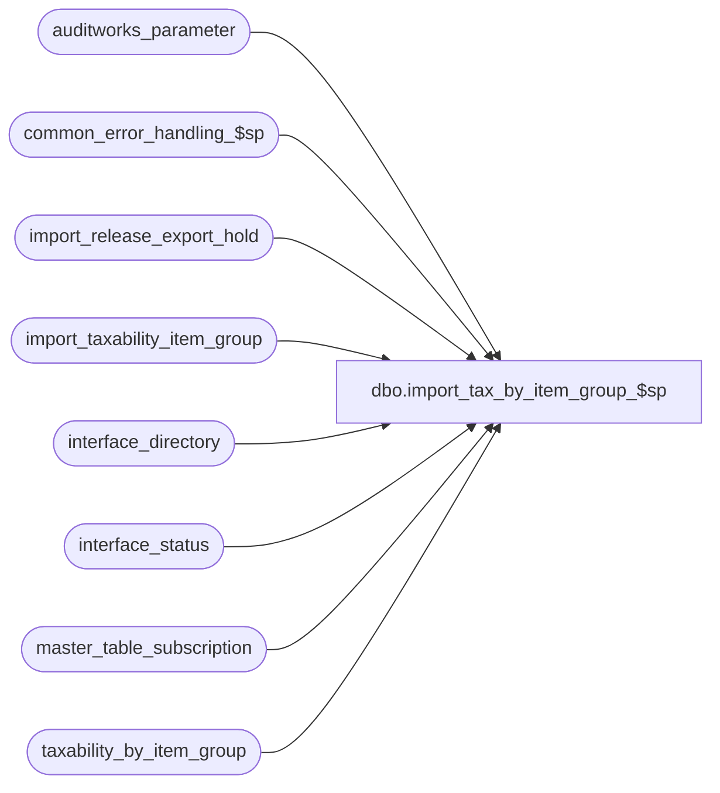

# dbo.import_tax_by_item_group_$sp

**Database:** auditworks  
**Server:** bedrockdb01  

## Architecture Diagram



## Table Dependencies

| Referenced Table |
|---|
| auditworks_parameter |
| common_error_handling_$sp |
| import_release_export_hold |
| import_taxability_item_group |
| interface_directory |
| interface_status |
| master_table_subscription |
| taxability_by_item_group |

## Stored Procedure Code

```sql
create proc dbo.import_tax_by_item_group_$sp AS

/* Proc Name: import_tax_by_item_group_$sp
   Author:Maryam Saleh-Taleghani
   Description: This program posts imported import_taxability_item_group rows to the taxability_by_item_group table. 

HISTORY
Date     Name           Def#  Desc
Sep29,14 Vicci          86335 Remove reliance on SET ANSI_NULLS being ON.
Jun17,14 Vicci     TFS-75199  If no hold was placed (because Coalition is inactive and there is no other interface subscribing to tax config) 
                              and the Edit won't be running the merge, then put the Coalition interface on hold anyway so that when all the files
                              to be imported have been brought in and the hold is released this will launch a merge request.
Mar18,13 Vicci        142035  Issue an export hold release request (that ICT will perform after the rest of the files present in the directory 
                              have been imported) instead of releasing the hold immediately.
Mar05,13 Vicci                Add try/catch
Feb25,13 Vicci        142072  To avoid poor performance and deadlocks with exports insert taxability_by_item_group with correct effective_until_date
                              rather than correcting it after the fact, and don't update it needlessly.
Aug14,12 Vicci        137565  Add warning to process error log if conflicting entries for same key have been imported and order by entry_id
Jul16,12 Paul         136951  use nolock hint on master_table_subscription to reduce deadlocking.
Sep07,11 Vicci        129626  Avoid multiple non-expired entries following attempt to delete non-existent entry when prior expired entry exists.
Aug29,11 Vicci        129426  Avoid overlapping effective-dates when the taxability by tax item group import is aborted.
Apr13,11 Vicci        126218  Place exports to interfaces subscribing to taxability_by_item_group changes on hold while import runs.
Sep06,06 Tim     76719/75320  Null Concatenation Fix.
Nov07,02 Maryam      1-G4Q91  Author
*/

DECLARE
  @errno		int,
  @errmsg		nvarchar(2000),
  @entry_type		nchar(1),
  @tax_jurisdiction	nchar(5),
  @tax_level		tinyint,
  @tax_item_group_id		int,
  @tax_rate_code	tinyint,   
  @effective_from_date	smalldatetime,
  @effective_until_date	smalldatetime,
  @max_effective_from_date  smalldatetime,
  @max_date		smalldatetime,
  @min_date		smalldatetime,
  @rows			int,
  @cursor_open		int,
-- used for common error handling.
  @process_no		smallint,
  @log_flag		tinyint,
  @object_name		nvarchar(255),
  @process_name		nvarchar(100),
  @operation_name	nvarchar(100),
  @message_id		int,
  @message_id2		int,
  @memo1 		nvarchar(50),
  @hold_datetime	datetime,
  @hold_placed		tinyint
  
SET CONCAT_NULL_YIELDS_NULL OFF

SELECT @cursor_open = 0,
       @process_name = 'import_tax_by_item_group_$sp',
       @message_id = 201068,
       @log_flag = 1,  -- called from smartload
       @process_no = 7, -- standard import
       @hold_datetime = getdate(),
       @errno = 0;

BEGIN TRY
UPDATE interface_status
   SET hold_datetime = @hold_datetime
  FROM master_table_subscription m WITH (NOLOCK)
 WHERE m.table_name = 'taxability_by_item_group'
   AND m.update_timing = 5
   AND m.interface_id =  interface_status.interface_id
   AND interface_status.hold_datetime IS NULL
SELECT @hold_placed = sign(@@rowcount)
END TRY
BEGIN CATCH
  SELECT @errno = ERROR_NUMBER(), @errmsg = ERROR_MESSAGE()
IF @errno != 0
BEGIN
  SELECT @errmsg = @errmsg + ' -Failed to place exports to interfaces subscribing to taxability_by_item_group changes on hold while import runs',
         @object_name = 'interface_status',
         @operation_name = 'UPDATE'
  GOTO error
END
END CATCH

--If no hold was placed (because Coalition is inactive and there is no other interface subscribing to tax config) and the Edit won't be running the merge,
--then put the Coalition interface on hold anyway so that when all the files to be imported have been brought in and the hold is release this will launch a merge request
IF @hold_placed = 0  AND EXISTS (SELECT 1
	                           FROM auditworks_parameter
                	          WHERE par_name = 'disable_edit_tax_merge'
                	            AND par_value = '1') 
BEGIN
  BEGIN TRY
  UPDATE interface_status
     SET hold_datetime = @hold_datetime
    FROM interface_directory d WITH (NOLOCK)
   WHERE d.interface_id = 16
     AND d.update_timing = 0
     AND d.interface_id =  interface_status.interface_id
     AND interface_status.hold_datetime IS NULL
  SELECT @hold_placed = sign(@@rowcount)
  END TRY
  BEGIN CATCH
    SELECT @errno = ERROR_NUMBER(), @errmsg = ERROR_MESSAGE()
  IF @errno != 0
  BEGIN
    SELECT @errmsg = @errmsg + ' -Failed to place Coalition export on hold while import runs even though it is inactive.  ',
           @object_name = 'interface_status',
           @operation_name = 'UPDATE'
    GOTO error
  END
  END CATCH
END
  
SELECT @memo1 = NULL
SELECT @memo1 = MIN(q.entry_key)
  FROM (SELECT tax_jurisdiction + '/' + convert(nvarchar, tax_item_group_id) + '/' + convert(nvarchar, tax_level) + '/' + convert(nvarchar, effective_from_date) entry_key, 
               count(1) conflicting_entry_count
          FROM import_taxability_item_group
         GROUP BY tax_jurisdiction, tax_item_group_id, tax_level,  effective_from_date
        HAVING count(1) > 1) q
SELECT @errno = @@error
IF @errno != 0
BEGIN
  SELECT @errmsg = 'Failed to determine if any conflicting entries were imported.',
	 @object_name = 'import_taxability_item_group',
	 @operation_name = 'SELECT'
  GOTO error
END
IF @memo1 IS NOT NULL
BEGIN
  SELECT @errmsg = ':LOG EXECWARN: WARNING!!  Multiple entries for the same key were imported. Please verify (for example) key ' + @memo1 + ' in the import_taxability_item_group table.'
  PRINT @errmsg

  SELECT @errmsg = 'Multiple entries for the same key were imported. Please verify key |1 in the import_taxability_item_group table.',
	 @object_name = 'import_taxability_item_group',
	 @operation_name = 'SELECT',
	 @errno =  201736,
	 @message_id2 = 201736
  EXEC common_error_handling_$sp @process_no, @errno, @errmsg, 3, @message_id2, @process_name, @object_name, @operation_name, 
                                 @log_flag, 1, 0, NULL, 0, @memo1, 'import_taxability_item_group'
  SELECT @errno = 0
END

  DECLARE tax_item_group_crsr CURSOR FAST_FORWARD
  FOR
  SELECT  entry_type,
	  tax_jurisdiction,
	  tax_item_group_id,
	  tax_level,
	  tax_rate_code,
	  effective_from_date
   FROM   import_taxability_item_group WITH (NOLOCK)
 ORDER BY effective_from_date, entry_id
	
  OPEN tax_item_group_crsr

  SELECT @errno = @@error
  IF @errno != 0
    BEGIN
      SELECT @errmsg = 'Failed to open cursor tax_item_group_crsr.',
	     @object_name = 'tax_item_group_crsr',
	     @operation_name = 'OPEN'
      GOTO error
    END

  SELECT @cursor_open = 1

  WHILE 1=1
  BEGIN

  FETCH tax_item_group_crsr INTO
	@entry_type,
	@tax_jurisdiction,
	@tax_item_group_id,
	@tax_level,
	@tax_rate_code,
	@effective_from_date

  IF @@fetch_status <> 0
    BREAK

    IF UPPER(@entry_type) NOT IN ('I', 'D', 'U')
    BEGIN

      SELECT @errmsg = 'An invalid entry-type was encountered in the import file. Please verify the |1 table.',
	     @errno =  201735,
	     @message_id2 = 201735,
	     @memo1 = 'import_taxability_item_group'


      EXEC common_error_handling_$sp @process_no, @errno, @errmsg, 3, @message_id2, 
		@process_name, @object_name, @operation_name, @log_flag, NULL, NULL,NULL, NULL, @memo1

    END

  IF UPPER(@entry_type) = 'D'
    BEGIN
      SELECT @max_effective_from_date = MAX(effective_from_date)
        FROM taxability_by_item_group
       WHERE tax_jurisdiction = @tax_jurisdiction 
         AND tax_item_group_id = @tax_item_group_id
         AND tax_level = @tax_level
         AND effective_from_date < @effective_from_date
      SELECT @errno = @@error
      IF @errno != 0
        BEGIN
          SELECT @errmsg = 'Failed to select effective_from_date of the row beofre that being deleted.',
		 @object_name = 'taxability_by_item_group',
		 @operation_name = 'SELECT'
          GOTO error
        END

      SELECT @effective_until_date = effective_until_date
        FROM taxability_by_item_group
       WHERE tax_jurisdiction = @tax_jurisdiction 
         AND tax_item_group_id = @tax_item_group_id
         AND tax_level = @tax_level
         AND effective_from_date = @effective_from_date       
      SELECT @errno = @@error, @rows = @@rowcount
      IF @errno != 0
        BEGIN
          SELECT @errmsg = 'Failed to select effective_until_date of the row being deleted.',
		 @object_name = 'taxability_by_item_group',
		 @operation_name = 'SELECT'
          GOTO error
        END

     IF @rows > 0 --row to be deleted exists
     BEGIN
       BEGIN TRANSACTION 
      
       BEGIN TRY 
       DELETE taxability_by_item_group
        WHERE tax_jurisdiction = @tax_jurisdiction 
          AND tax_item_group_id = @tax_item_group_id
          AND tax_level = @tax_level
          AND effective_from_date = @effective_from_date
       END TRY
       BEGIN CATCH
         SELECT @errno = ERROR_NUMBER(), @errmsg = ERROR_MESSAGE()
       IF @errno != 0
       BEGIN
         SELECT @errmsg = @errmsg + ' -Failed to DELETE from taxability_by_item_group.',
	        @object_name = 'taxability_by_item_group',
		@operation_name = 'DELETE'
         GOTO error
       END
       END CATCH

       IF @max_effective_from_date IS NOT NULL 
       BEGIN
        BEGIN TRY
          UPDATE taxability_by_item_group
             SET effective_until_date = @effective_until_date
           WHERE tax_jurisdiction = @tax_jurisdiction 
             AND tax_item_group_id = @tax_item_group_id
             AND tax_level = @tax_level
             AND effective_from_date = @max_effective_from_date
        END TRY
	BEGIN CATCH
	  SELECT @errno = ERROR_NUMBER(), @errmsg = ERROR_MESSAGE()
        IF @errno != 0
        BEGIN
        SELECT @errmsg = COALESCE(@errmsg, ' ') + ' -Failed to set effective_until_date of the row before that being deleted.  ' + @tax_jurisdiction + ', level:  ' + convert(nvarchar, @tax_level) + ', item group:  ' + convert(nvarchar, @tax_item_group_id) + ', ' + convert(nvarchar, @max_effective_from_date),
		 @object_name = 'taxability_by_item_group',
		 @operation_name = 'UPDATE'
          GOTO error
        END
	END CATCH

      END --IF @min_effective_from_date != @effective_from_date
     
      COMMIT TRANSACTION
    END --IF @rows > 0 --row to be deleted exists
  END --IF @entry_type = 'D'

  IF UPPER(@entry_type) IN ('I', 'U')
  BEGIN
    BEGIN TRY
      UPDATE taxability_by_item_group
         SET tax_rate_code = @tax_rate_code
       WHERE tax_jurisdiction = @tax_jurisdiction 
         AND tax_item_group_id = @tax_item_group_id
         AND tax_level = @tax_level
         AND effective_from_date = @effective_from_date
      SELECT @rows = @@rowcount
    END TRY
    BEGIN CATCH
      SELECT @errno = ERROR_NUMBER(), @errmsg = ERROR_MESSAGE()
    IF @errno != 0
    BEGIN
      SELECT @errmsg = COALESCE(@errmsg, ' ') + ' -Failed to UPDATE taxability_by_item_group from import_tax_by_item_group ' + @tax_jurisdiction + ', rate code:  ' + convert(nvarchar, @tax_rate_code) + ', level:  ' + convert(nvarchar, @tax_level) + ', item group:  ' + convert(nvarchar, @tax_item_group_id) + ', ' + convert(nvarchar, @effective_from_date),
             @object_name = 'taxability_by_item_group',
             @operation_name = 'UPDATE'
      GOTO error
    END
    END CATCH
  
    IF @rows = 0 
    BEGIN 
      SELECT @max_date = MAX(effective_from_date)
        FROM taxability_by_item_group
       WHERE tax_jurisdiction = @tax_jurisdiction
         AND tax_item_group_id = @tax_item_group_id
         AND tax_level = @tax_level
         AND effective_from_date < @effective_from_date
      SELECT @errno = @@error
      IF @errno != 0
            BEGIN
              SELECT @errmsg = 'Failed to select effective_from_date of the row before that being inserted.',
		     @object_name = 'taxability_by_item_group',
		     @operation_name = 'SELECT'
              GOTO error
            END

          SELECT @min_date = MIN(effective_from_date)
            FROM taxability_by_item_group
           WHERE tax_jurisdiction = @tax_jurisdiction
             AND tax_item_group_id = @tax_item_group_id
             AND tax_level = @tax_level
             AND effective_from_date > @effective_from_date
          SELECT @errno = @@error
          IF @errno != 0
            BEGIN
              SELECT @errmsg = 'Failed to select effective_from_date of the row after that being inserted.',
		     @object_name = 'taxability_by_item_group',
		     @operation_name = 'SELECT'
              GOTO error
            END

        BEGIN TRANSACTION
        BEGIN TRY
          INSERT taxability_by_item_group (
                 tax_jurisdiction,
                 tax_item_group_id,
                 tax_level,
                 tax_rate_code,
                 effective_from_date,
                 effective_until_date)
          VALUES (@tax_jurisdiction,
                 @tax_item_group_id,
                 @tax_level,
                 @tax_rate_code,
                 @effective_from_date,
                 DATEADD(dd, -1, @min_date))        
        END TRY
        BEGIN CATCH
          SELECT @errno = ERROR_NUMBER(), @errmsg = ERROR_MESSAGE()

          IF @errno != 0
            BEGIN
              SELECT @errmsg = COALESCE(@errmsg, ' ') + ' -Unable to INSERT imported exceptions for tax_jurisdiction = ' + @tax_jurisdiction +
                                ', tax_item_group_id = ' + CONVERT(nvarchar, @tax_item_group_id) + ', tax_level = ' + CONVERT(nvarchar, @tax_level)+
                                ', tax_rate_code = ' + CONVERT(nvarchar,@tax_rate_code) + ', effective_from_date = '
                                + CONVERT(nvarchar(11), @effective_from_date)+' into the taxability_by_item_group table ',
		     @object_name = 'taxability_by_item_group',
		     @operation_name = 'INSERT'
              GOTO error
            END
        END CATCH
          IF @max_date IS NOT NULL  --i.e. the is a row befor that being inserted
          BEGIN
            BEGIN TRY
              UPDATE taxability_by_item_group
                 SET effective_until_date = DATEADD(dd, -1, @effective_from_date)
               WHERE tax_jurisdiction = @tax_jurisdiction 
                 AND tax_item_group_id = @tax_item_group_id
                 AND tax_level = @tax_level
                 AND effective_from_date = @max_date
            END TRY
            BEGIN CATCH
              SELECT @errno = ERROR_NUMBER(), @errmsg = ERROR_MESSAGE()
            IF @errno != 0
            BEGIN
              SELECT @errmsg = COALESCE(@errmsg, ' ') + ' Failed to UPDATE effective_until_date of the row before that being inserted ' + @tax_jurisdiction + ', level:  ' + convert(nvarchar, @tax_level) + ', item group:  ' + convert(nvarchar, @tax_item_group_id) + ', ' + convert(nvarchar, @max_date),
		     @object_name = 'taxability_by_item_group',
		     @operation_name = 'UPDATE'
              GOTO error
            END
            END CATCH

          END  --IF @max_date IS NOT NULL
          
        COMMIT TRANSACTION
      END -- IF @rows = 0 
    END --IF @entry_type IN ('I', 'U')
  END /* WHILE 1=1 */

CLOSE tax_item_group_crsr
SELECT @errno = @@error
IF @errno != 0
  BEGIN
    SELECT @errmsg = 'Failed to CLOSE cursor tax_item_group_crsr.',
           @object_name = 'tax_item_group_crsr',
	   @operation_name = 'CLOSE'
    GOTO error
  END

DEALLOCATE tax_item_group_crsr

IF @hold_placed = 1
BEGIN
  INSERT INTO import_release_export_hold(
         interface_id,
         hold_datetime)
  SELECT DISTINCT interface_id, hold_datetime
    FROM interface_status i WITH (NOLOCK)
   WHERE i.hold_datetime = @hold_datetime
  SELECT @errno = @@error
  IF @errno != 0
  BEGIN
    SELECT @errmsg = 'Failed to create entries that ICT_IMPORT will export as interface hold release requests and process once done importing other files.',
           @object_name = 'import_release_export_hold',
           @operation_name = 'INSERT'
    GOTO error
  END

  --Note: when this line is printed, the import ICT will drop a release_export_hold.GO file into the directory with priority 9999 to cause release to be placed last on TO-Do list.  
  PRINT ':LOG ReleaseExportHold'  
END  --IF @hold_placed = 1
 
RETURN

error:   /* Common error handler. */

	IF @hold_placed = 1
	BEGIN
	  INSERT INTO import_release_export_hold(
	         interface_id,
	         hold_datetime)
	  SELECT DISTINCT interface_id, hold_datetime
	    FROM interface_status i WITH (NOLOCK)
	   WHERE i.hold_datetime = @hold_datetime

	  --Note: when this line is printed, the import ICT will drop a release_export_hold.GO file into the directory with priority 9999 to cause release to be placed last on TO-Do list.  
	  PRINT ':LOG ReleaseExportHold'  
	END  --IF @hold_placed = 1
	
	IF @cursor_open = 1
	  BEGIN
	   CLOSE tax_item_group_crsr
	   DEALLOCATE tax_item_group_crsr
	  END

	EXEC common_error_handling_$sp @process_no, @errno, @errmsg, 0, @message_id, 
	@process_name, @object_name, @operation_name, @log_flag

	RETURN
```

