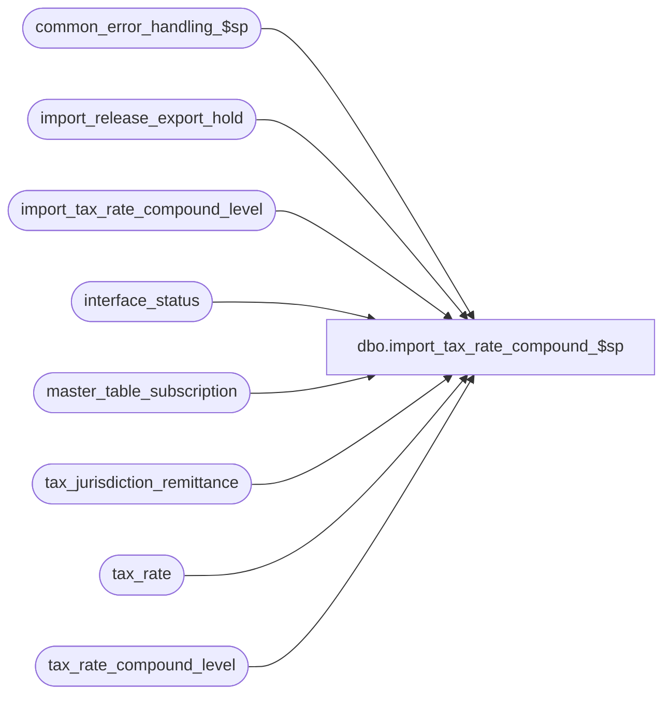

# dbo.import_tax_rate_compound_$sp

**Database:** auditworks  
**Server:** bedrockdb01  

## Architecture Diagram



## Table Dependencies

| Referenced Table |
|---|
| common_error_handling_$sp |
| import_release_export_hold |
| import_tax_rate_compound_level |
| interface_status |
| master_table_subscription |
| tax_jurisdiction_remittance |
| tax_rate |
| tax_rate_compound_level |

## Stored Procedure Code

```sql
create proc dbo.import_tax_rate_compound_$sp AS

/* 
PROC NAME: import_tax_rate_compound_$sp
     DESC: This program posts imported tax rate compound level definitions to the tax-rate table. 


HISTORY:
Date     Name       Def# Desc
Sep29,14 Vicci     86335 Remove reliance on SET ANSI_NULLS being ON.
Mar18,13 Vicci    142035 Put export on hold until import completes. 
Mar12,08 Vicci  1-38MDAZ Author

*/

DECLARE
	@errmsg				nvarchar(2000),
	@errno				int,
	@process_no			smallint,
	@log_flag			tinyint,
	@object_name			nvarchar(255),
	@process_name			nvarchar(100),
	@operation_name			nvarchar(100),
	@message_id			int,
	@hold_datetime			datetime,
	@hold_placed			tinyint

SET CONCAT_NULL_YIELDS_NULL OFF	

SELECT @process_name = 'import_tax_rate_compound_$sp',
       @message_id = 201068,
       @log_flag = 1,  -- called from smartload
       @process_no = 7, -- standard import
       @hold_datetime = getdate()

BEGIN TRY
UPDATE interface_status
   SET hold_datetime = @hold_datetime
  FROM master_table_subscription m WITH (NOLOCK)
 WHERE m.table_name IN ('tax_rate_compound_level', 'tax_rate')
   AND m.update_timing = 5
   AND m.interface_id =  interface_status.interface_id
   AND interface_status.hold_datetime IS NULL
SELECT @hold_placed = sign(@@rowcount)
END TRY
BEGIN CATCH
  SELECT @errno = ERROR_NUMBER(), @errmsg = ERROR_MESSAGE()
IF @errno != 0
BEGIN
  SELECT @errmsg = @errmsg + ' -Failed to place exports to interfaces subscribing to tax_rate_compound_level and indirectly impacted table changes on hold while import runs',
         @object_name = 'interface_status',
         @operation_name = 'UPDATE'
  GOTO error
END
END CATCH
       
BEGIN TRY
DELETE tax_rate_compound_level
  FROM import_tax_rate_compound_level i
 WHERE tax_rate_compound_level.tax_jurisdiction = i.tax_jurisdiction
   AND tax_rate_compound_level.tax_level = i.tax_level  
   AND tax_rate_compound_level.tax_rate_code = i.tax_rate_code  
   AND tax_rate_compound_level.effective_from_date = i.effective_from_date 
   AND tax_rate_compound_level.tax_on_tax_level = i.tax_on_tax_level
   AND i.entry_type = 'D'
END TRY
BEGIN CATCH
  SELECT @errno = ERROR_NUMBER(), @errmsg = ERROR_MESSAGE()
IF @errno != 0
BEGIN
  SELECT @errmsg = @errmsg + ' -Failed to remove tax rate compound levels to be deleted',
	 @object_name = 'tax_rate_compound_level',
	 @operation_name = 'DELETE'
  GOTO error
END
END CATCH

--Keep only the last instructions concerning a given tax rate compound level
BEGIN TRY
DELETE import_tax_rate_compound_level
  FROM (SELECT tax_jurisdiction, tax_level, tax_rate_code, effective_from_date, max(entry_id) max_entry_id
          FROM import_tax_rate_compound_level
         GROUP BY tax_jurisdiction, tax_level, tax_rate_code, effective_from_date
        HAVING count(entry_id) > 1) q
 WHERE import_tax_rate_compound_level.tax_jurisdiction = q.tax_jurisdiction
   AND import_tax_rate_compound_level.tax_level = q.tax_level
   AND import_tax_rate_compound_level.tax_rate_code = q.tax_rate_code
   AND import_tax_rate_compound_level.effective_from_date = q.effective_from_date
   AND import_tax_rate_compound_level.entry_id < q.max_entry_id
END TRY
BEGIN CATCH
  SELECT @errno = ERROR_NUMBER(), @errmsg = ERROR_MESSAGE()
IF @errno != 0
BEGIN
  SELECT @errmsg = @errmsg + ' -Failed to remove superceded entries from import table',
	 @object_name = 'import_tax_rate_compound_level',
	 @operation_name = 'DELETE'
  GOTO error
END
END CATCH

BEGIN TRY
INSERT into tax_rate_compound_level(
       tax_jurisdiction,
       tax_level,
       tax_rate_code,
       effective_from_date,
       tax_on_tax_level)
SELECT i.tax_jurisdiction,
       i.tax_level,
       i.tax_rate_code,
       i.effective_from_date,
       i.tax_on_tax_level
  FROM import_tax_rate_compound_level i
       INNER JOIN tax_rate r  --tax rate code to which compound entries are being attached must exist in tax_rate
          ON i.tax_jurisdiction = r.tax_jurisdiction
         AND i.tax_level = r.tax_level
   	 AND i.tax_rate_code = r.tax_rate_code
   	 AND i.effective_from_date = r.effective_from_date
       INNER JOIN tax_jurisdiction_remittance tjr  --tax levels upon which tax is to be compounded must be valid for the jurisdiction
          ON i.tax_jurisdiction = tjr.tax_jurisdiction
         AND i.tax_on_tax_level = tjr.tax_level
 WHERE i.entry_type <> 'D'
   AND 1 NOT IN (SELECT 1
                   FROM tax_rate_compound_level s
                  WHERE i.tax_jurisdiction = s.tax_jurisdiction
   		    AND i.tax_level = s.tax_level
   		    AND i.tax_rate_code = s.tax_rate_code
   		    AND i.effective_from_date = s.effective_from_date)
END TRY
BEGIN CATCH
  SELECT @errno = ERROR_NUMBER(), @errmsg = ERROR_MESSAGE()
IF @errno != 0
BEGIN
  SELECT @errmsg = @errmsg + ' -Failed to create new tax rate compound level entries',
	 @object_name = 'tax_rate_compound_level',
	 @operation_name = 'INSERT'
  GOTO error
END
END CATCH

IF @hold_placed = 1
BEGIN
  INSERT INTO import_release_export_hold(
         interface_id,
         hold_datetime)
  SELECT DISTINCT interface_id, hold_datetime
    FROM interface_status i WITH (NOLOCK)
   WHERE i.hold_datetime = @hold_datetime
  SELECT @errno = @@error
  IF @errno != 0
  BEGIN
    SELECT @errmsg = 'Failed to create entries that ICT_IMPORT will export as interface hold release requests and process once done importing other files.',
           @object_name = 'import_release_export_hold',
           @operation_name = 'INSERT'
    GOTO error
  END

  --Note: when this line is printed, the import ICT will drop a release_export_hold.GO file into the directory with priority 9999 to cause release to be placed last on TO-Do list.  
  PRINT ':LOG ReleaseExportHold'  
END  --IF @hold_placed = 1

RETURN

error:   /* Common error handler. */

	IF @hold_placed = 1
	BEGIN
	  INSERT INTO import_release_export_hold(
	         interface_id,
	         hold_datetime)
	  SELECT DISTINCT interface_id, hold_datetime
	    FROM interface_status i WITH (NOLOCK)
	   WHERE i.hold_datetime = @hold_datetime

	  --Note: when this line is printed, the import ICT will drop a release_export_hold.GO file into the directory with priority 9999 to cause release to be placed last on TO-Do list.  
	  PRINT ':LOG ReleaseExportHold'  
	END  --IF @hold_placed = 1


	EXEC common_error_handling_$sp @process_no, @errno, @errmsg, 0, @message_id, 
	@process_name, @object_name, @operation_name, @log_flag

	RETURN
```

