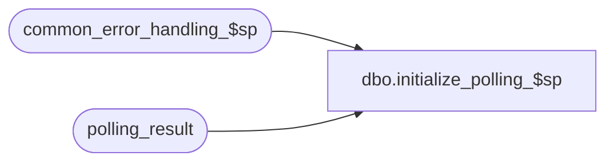

# dbo.initialize_polling_$sp

**Database:** auditworks  
**Server:** bedrockdb01  

## Architecture Diagram



## Table Dependencies

| Referenced Table |
|---|
| common_error_handling_$sp |
| polling_result |

## Stored Procedure Code

```sql
create proc dbo.initialize_polling_$sp 

AS

/* Version:1.01 Date:1996/07/20 */
/* Desc: clear out polling result table prior to bulk copy import.
     Called from edit.ict ( imports polling history file ). 

HISTORY:
Date     Name              Def# Desc
Jan04,11 Paul            105313 Use unicode datatypes
May16,02 Henry          1-CD0IX Add R3.5 standardized common error handling

*/

DECLARE
-- used for common error handling.
	@errmsg				nvarchar(255),
	@errno				int,
	@process_no			smallint,
	@log_flag			tinyint,
	@object_name			nvarchar(255),
	@process_name			nvarchar(100),
	@operation_name			nvarchar(100),
	@message_id			int

SELECT @process_name = 'initialize_polling_$sp',
       @message_id = 201068,
       @log_flag = 1,  -- called from smartload
       @process_no = 7 -- standard import

TRUNCATE TABLE polling_result

SELECT @errno = @@error
IF @errno <> 0
  BEGIN
    SELECT @errmsg = 'Unable to cleanup polling_result table',
	   @object_name = 'polling_result',
	   @operation_name = 'TRUNCATE'
    GOTO error
  END

RETURN

error:   /* Common error handler */

	EXEC common_error_handling_$sp @process_no, @errno, @errmsg, 0, @message_id, 
	@process_name, @object_name, @operation_name, @log_flag

	RETURN
```

