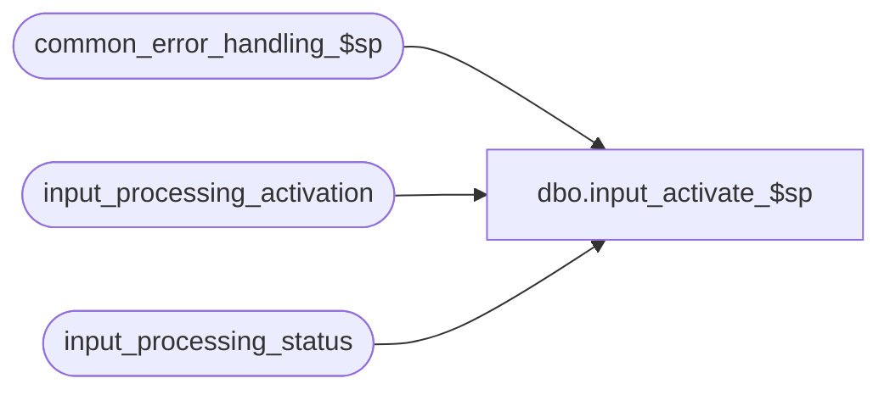

# dbo.input_activate_$sp

**Database:** auditworks  
**Server:** bedrockdb01  

## Architecture Diagram



## Table Dependencies

| Referenced Table |
|---|
| common_error_handling_$sp |
| input_processing_activation |
| input_processing_status |

## Stored Procedure Code

```sql
create proc dbo.input_activate_$sp 

 
@interface_id		smallint 

AS

/* Name: input_activate_$sp
** Desc: This procedure inserts into input_processing_activation.
         Called by export.ict. Set up in export_format interface_id 29.

HISTORY:
Date     Name          Defect#  Desc
Jan04,11 Paul           105313  Use unicode datatypes
Aug27,02 David C       1-EWE1B  Added input parameter to avoid error in MSS.
Feb15,02 David C       AW-8415  Author

*/

   
DECLARE
	@errno				int,
	@errmsg				nvarchar(255),
	@message_id			int,
	@object_name			nvarchar(255),
	@operation_name			nvarchar(100),
	@process_name			nvarchar(100),
	@process_no 			smallint


SELECT @process_no = 19,
       @process_name = 'input_activate_$sp',
       @message_id = 201068

INSERT INTO input_processing_activation (input_id)
SELECT input_id
  FROM input_processing_status
 WHERE status = 1

SELECT @errno = @@error
IF @errno != 0 
BEGIN
  SELECT @errmsg = 'Failed to insert input_processing_activation',
         @object_name = 'input_processing_activation',
         @operation_name = 'INSERT'
  GOTO error
END  


RETURN

error:

	EXEC common_error_handling_$sp @process_no, @errno, @errmsg, 0, @message_id, 
	@process_name, @object_name, @operation_name, 0

	RETURN
```

