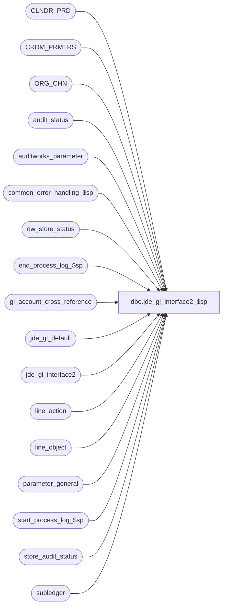

# dbo.jde_gl_interface2_$sp

**Database:** auditworks  
**Server:** bedrockdb01  

## Architecture Diagram



## Table Dependencies

| Referenced Table |
|---|
| CLNDR_PRD |
| CRDM_PRMTRS |
| ORG_CHN |
| audit_status |
| auditworks_parameter |
| common_error_handling_$sp |
| dw_store_status |
| end_process_log_$sp |
| gl_account_cross_reference |
| jde_gl_default |
| jde_gl_interface2 |
| line_action |
| line_object |
| parameter_general |
| start_process_log_$sp |
| store_audit_status |
| subledger |

## Stored Procedure Code

```sql
create proc dbo.jde_gl_interface2_$sp 
( @period_ending_date		smalldatetime,
  @journal_entry_description 	nvarchar(29),
  @last_date_closed		smalldatetime
)

AS

/* Proc name:   jde_gl_interface2_$sp
   Description: Build variable length column values for jde_gl_interface2 table from subledger table according a range of 
                transaction dates, which is retrieved from parameter_general.
                The layout of table jde_gl_interface2 created by this proc has 193 columns instead of 157 columns created by jde_gl_interface_$sp.
                Called from period_end_$sp

 HISTORY:
Date     Name       Defect# Description
Jan31,11 Paul        105313 Use unicode datatypes
May28,10 Phu         116982 Initial development

*/


DECLARE
	@jde_one				int,
	@jde_vnedus				nvarchar(10),
	@jde_vnedty				nvarchar(1) ,
	@jde_vnedsq				nvarchar(2) ,
	@jde_vnedtn				nvarchar(22),
	@jde_vnedct				nvarchar(2) ,
	@jde_vnedts				nvarchar(6) ,
	@jde_vnedft				nvarchar(10),
	@jde_vneder				nvarchar(1) ,
	@jde_vneddl				nvarchar(5) ,
	@jde_vnedsp				nvarchar(1) ,
	@jde_vnedtc				nvarchar(1) ,
	@jde_vnedtr				nvarchar(1) ,
	@jde_vnedbt				nvarchar(15),
	@jde_vnedgl				nvarchar(1) ,
	@jde_vnedan				nvarchar(8) ,
	@jde_vndct				nvarchar(2) ,
	@jde_vndoc				nvarchar(8) ,
	@jde_vnjeln				nvarchar(7) ,
	@jde_vnextl				nvarchar(2) ,
	@jde_vnpost				nvarchar(1) ,
	@jde_vnicu				nvarchar(8) ,
	@jde_vnicut				nvarchar(2) ,
	@jde_vnticu				nvarchar(6) ,
	@jde_vnam				nvarchar(1) ,
	@jde_vnaid				nvarchar(8) ,
	@jde_vnsbl				nvarchar(8) ,
	@jde_vnsblt				nvarchar(1) ,
	@jde_vnlt				nvarchar(2) ,
	@jde_vnctry				nvarchar(2) ,
	@jde_vnfy				nvarchar(2) ,
	@jde_vnfq				nvarchar(4) ,
	@jde_vncrcd				nvarchar(3) ,
	@jde_vncrr				nvarchar(15),
	@jde_vnhcrr				nvarchar(15),
	@jde_vnu				nvarchar(15),
	@jde_vnum				nvarchar(2) ,
	@jde_vnglc				nvarchar(4) ,
	@jde_vnre				nvarchar(1) ,
	@jde_vnr1				nvarchar(8) ,
	@jde_vnr2				nvarchar(8) ,
	@jde_vnr3				nvarchar(8) ,
	@jde_vnsfx				nvarchar(3) ,
	@jde_vnodoc				nvarchar(8) ,
	@jde_vnodct				nvarchar(2) ,
	@jde_vnosfx				nvarchar(3) ,
	@jde_vnpkco				nvarchar(5) ,
	@jde_vnokco				nvarchar(5) ,
	@jde_vnpdct				nvarchar(2) ,
	@jde_vnan8				nvarchar(8) ,
	@jde_vncn				nvarchar(8) ,
	@jde_vndkc				nvarchar(6) ,
	@jde_vnasid				nvarchar(25),
	@jde_vnbre				nvarchar(1),
	@jde_vnrcnd				nvarchar(1),
	@jde_vnsumm				nvarchar(1),
	@jde_vnprge				nvarchar(1),
	@jde_vntnn				nvarchar(1),
	@jde_vnalt1				nvarchar(1),
	@jde_vnalt2				nvarchar(1),
	@jde_vnalt3				nvarchar(1),
	@jde_vnalt4				nvarchar(1),
	@jde_vnalt5				nvarchar(1),
	@jde_vnalt6				nvarchar(1),
	@jde_vnalt7				nvarchar(1),
	@jde_vnalt8				nvarchar(1),
	@jde_vnalt9				nvarchar(1),
	@jde_vnalt0				nvarchar(1),
	@jde_vnaltt				nvarchar(1) ,
	@jde_vnaltu				nvarchar(1) ,
	@jde_vnaltv				nvarchar(1) ,
	@jde_vnaltw				nvarchar(1) ,
	@jde_vnaltx				nvarchar(1) ,
	@jde_vnaltz				nvarchar(1) ,
	@jde_vndlna				nvarchar(1) ,
	@jde_vncff1				nvarchar(1) ,
	@jde_vncff2				nvarchar(1) ,
	@jde_vnasm				nvarchar(1) ,
	@jde_vnbc				nvarchar(1) ,
	@jde_vnvinv				nvarchar(25),
	@jde_vnivd				nvarchar(6) ,
	@jde_vnwr01				nvarchar(4) ,
	@jde_vnpo				nvarchar(8) ,
	@jde_vnpsfx				nvarchar(3) ,
	@jde_vndcto				nvarchar(2) ,
	@jde_vnlnid				nvarchar(6) ,
	@jde_vnwy				nvarchar(2),
	@jde_vnwn				nvarchar(2),
	@jde_vnfnlp				nvarchar(1) ,
	@jde_vnopsq				nvarchar(5) ,
	@jde_vnjbcd				nvarchar(6) ,
	@jde_vnjbst				nvarchar(4) ,
	@jde_vnhmcu				nvarchar(12),
	@jde_vndoi				nvarchar(2) ,
	@jde_vnalid				nvarchar(25),
	@jde_vnalty				nvarchar(2) ,
	@jde_vnregnum			nvarchar(8) ,
	@jde_vnpyid				nvarchar(15),
	@jde_vnpid				nvarchar(10),
	@jde_vnjobn				nvarchar(10),
	@jde_vnupmt				nvarchar(6) ,
	@jde_vncrrm				nvarchar(1) ,
	@clndr_id				binary(16),
	@lvl_month				binary(16),
	@rows					int,
	@current_date 			datetime,
	@current_date_julian		numeric(6,0),
	@ddmmyyyy				nchar(10),
	@errmsg 				nvarchar(255),
	@errno 				int,
	@company_no				smallint,
	@message_id				int,
	@object_name			nvarchar(255),
	@operation_name			nvarchar(100),
	@process_name			nvarchar(100),
	@period_end_date 			smalldatetime,
	@process_log_entry 		tinyint,
	@process_no 			smallint,
	@process_timestamp 		float,
	@transaction_count 		numeric(12,0),
	@min_seq_offset			numeric(12,0),
	@gl_interface_timing		smallint,
	@cost_center_start_pos		smallint,
	@cost_center_length		smallint,
	@object_account_start_pos	smallint,
	@object_account_length		smallint,
	@subsidiary_start_pos		smallint,
	@subsidiary_length		smallint,
	@zeros_40				nchar(40)


SET CONCAT_NULL_YIELDS_NULL OFF

SELECT @current_date = getdate() -- do not move this line to elsewhere

SELECT @jde_vnedbt = convert(nvarchar, @current_date, 112) + REPLACE(convert(nvarchar, @current_date, 8), ':', ''), /* batch number, must be unique, set to current date as yyyymmddhhmiss,  112: yyyymmdd, 8: hh24:mi:ss */
       @ddmmyyyy = convert(nvarchar, @current_date, 103) -- dd/mm/yyyy

SELECT 
	@jde_one			= 1,
	@jde_vnedty			= ' ',
	@jde_vnedsq			= '0',
	@jde_vnedtn			= '1', /* Transaction number - set to 1 because the batch number jde_vnedbt is unique */
	@jde_vnedct			= 'JE',
	@jde_vnedts			= ' ',
	@jde_vnedft			= ' ',
	@jde_vneder			= 'R',
	@jde_vneddl			= '0',
	@jde_vnedsp			= '0',
	@jde_vnedtc			= 'A',
	@jde_vnedtr			= 'J',
	@jde_vnedgl			= ' ',
	@jde_vnedan			= '0',
	@jde_vndct			= 'JE',
	@jde_vndoc			= '0',
	@jde_vnjeln			= '0',
	@jde_vnextl			= ' ',
	@jde_vnpost			= ' ',
	@jde_vnicu			= '0',
	@jde_vnicut			= 'G',
	@jde_vnticu			= '0',
	@jde_vnam			= '2',
	@jde_vnaid			= ' ', /* Account ID - instead of '00038447' because GL account is supplied */
	@jde_vnsbl			= ' ',
	@jde_vnsblt			= ' ',
	@jde_vnlt			= 'AA',
	@jde_vnctry			= '0',
	@jde_vnfy			= '0',
	@jde_vnfq			= ' ',
	@jde_vncrcd			= 'USD',
	@jde_vncrr			= '0',
	@jde_vnhcrr			= '0',
	@jde_vnu			= ' ',
	@jde_vnum			= ' ',
	@jde_vnglc			= ' ',
	@jde_vnre			= ' ',
	@jde_vnr1			= ' ',
	@jde_vnr2			= ' ',
	@jde_vnr3			= ' ',
	@jde_vnsfx			= ' ',
	@jde_vnodoc			= '0',
	@jde_vnodct			= ' ',
	@jde_vnosfx			= ' ',
	@jde_vnpkco			= ' ',
	@jde_vnokco			= ' ',
	@jde_vnpdct			= ' ',
	@jde_vnan8			= '0',
	@jde_vncn			= ' ',
	@jde_vndkc			= '0',
	@jde_vnasid			= ' ',
	@jde_vnbre			= ' ',
	@jde_vnrcnd			= ' ',
	@jde_vnsumm			= ' ',
	@jde_vnprge			= ' ',
	@jde_vntnn			= ' ',
	@jde_vnalt1			= ' ',
	@jde_vnalt2			= ' ',
	@jde_vnalt3			= ' ',
	@jde_vnalt4			= ' ',
	@jde_vnalt5			= ' ',
	@jde_vnalt6			= ' ',
	@jde_vnalt7			= ' ',
	@jde_vnalt8			= ' ',
	@jde_vnalt9			= ' ',
	@jde_vnalt0			= ' ',
	@jde_vnaltt			= ' ',
	@jde_vnaltu			= ' ',
	@jde_vnaltv			= ' ',
	@jde_vnaltw			= ' ',
	@jde_vnaltx			= ' ',
	@jde_vnaltz			= ' ',
	@jde_vndlna			= ' ',
	@jde_vncff1			= ' ',
	@jde_vncff2			= ' ',
	@jde_vnasm			= ' ',
	@jde_vnbc			= ' ',
	@jde_vnvinv			= ' ',                  
	@jde_vnivd			= '0',
	@jde_vnwr01			= ' ',
	@jde_vnpo			= ' ',
	@jde_vnpsfx			= ' ',
	@jde_vndcto			= ' ',
	@jde_vnlnid			= '0',
	@jde_vnwy			= '0',
	@jde_vnwn			= '0',
	@jde_vnfnlp			= ' ',
	@jde_vnopsq			= '1',
	@jde_vnjbcd			= ' ',
	@jde_vnjbst			= ' ',
	@jde_vndoi			= '0',
	@jde_vnalid			= ' ',
	@jde_vnalty			= ' ',
	@jde_vnregnum		= '0',
	@jde_vnpyid			= '0',
	@jde_vnpid			= 'ZP0411Z1',
	@jde_vnjobn			= 'SmartLoad',
	@jde_vnupmt			= RIGHT('0' + SUBSTRING(@jde_vnedbt, 9, 6), 6),  -- hh24miss
	@jde_vncrrm			= 'D'

if exists (select * from sysindexes where id = object_id('dbo.jde_gl_interface2')  and name ='jde_gl_interface2_x0')
begin
  drop index jde_gl_interface2.jde_gl_interface2_x0
end

SELECT
	@current_date_julian = (datepart(year, @current_date) - 1900) * 1000 + datepart(dayofyear, @current_date), -- not used in this version
	@errmsg = NULL,
	@process_log_entry = 0,
	@process_no = 205,
	@process_timestamp = 0,
	@transaction_count = 0,
	@min_seq_offset = 1,
	@gl_interface_timing = 0,
	@message_id = 201068,
	@process_name = 'jde_gl_interface2_$sp',
	@zeros_40 = '0000000000000000000000000000000000000000'

-- need to override @journal_entry_description because the date must be ddmmyyyy
SELECT @company_no = sa_company_no,
       @journal_entry_description = journal_entry_description  + ' ' + @ddmmyyyy
FROM parameter_general

SELECT @errno = @@error
IF @errno <> 0
  BEGIN
	SELECT @errmsg = 'Unable to select from parameter_general',
	       @object_name = 'parameter_general',
	       @operation_name = 'SELECT'
	GOTO error
  END

EXEC start_process_log_$sp @process_no, @process_timestamp OUTPUT, @errmsg OUTPUT

SELECT @errno = @@error
IF @errno <> 0
  BEGIN
    SELECT @object_name = 'start_process_log_$sp',
	   @operation_name = 'EXECUTE'
    IF @errmsg IS NULL
	SELECT @errmsg = 'Unable to execute start_process_log_$sp'
    GOTO error
  END

SELECT @process_log_entry = 1

SELECT @cost_center_start_pos = cost_center_start_pos,
       @cost_center_length =cost_center_length,
       @object_account_start_pos = object_account_start_pos,
       @object_account_length = object_account_length,
       @subsidiary_start_pos = subsidiary_start_pos,
       @subsidiary_length = subsidiary_length,
       @jde_vnedus = user_id
  FROM jde_gl_default

SELECT @errno = @@error
IF @errno <> 0
  BEGIN
    SELECT @errmsg = 'Unable to select  from jde_gl_default table',
	   @object_name = 'jde_gl_default',
	   @operation_name = 'SELECT'
    GOTO error
  END  


CREATE TABLE #jde_detail(
	jde_entry_no	numeric(7,0) identity,
	gl_date		nchar(10), -- numeric(6,0),
	gl_company	int,
	account		nvarchar(160),
	period		tinyint,
	amount		numeric(15,2),
	store_no	int,
	line_object	smallint,
	line_action	tinyint,
	DFLT_CRNCY_CODE nchar(3))

SELECT @errno = @@error
IF @errno <> 0
  BEGIN
    SELECT @errmsg = 'Unable to create table #jde_detail',
	   @object_name = '#jde_detail',
	   @operation_name = 'CREATE TABLE'
    GOTO error
  END


SELECT @clndr_id = PRMTR_VAL_BIN
  FROM CRDM_PRMTRS
 WHERE PRMTR_NAME = 'GL_PSTNG_CLNDR_ID'

SELECT @errno = @@error, @rows = @@rowcount
IF @rows = 0 AND @errno = 0
  SELECT @errno = 201612
IF @errno <> 0
  BEGIN
	SELECT @errmsg = 'Unable to select calendar id',
	       @object_name = 'CRDM_PRMTRS',
	       @operation_name = 'SELECT'
	GOTO error
  END

SELECT @lvl_month = par_bin_value
  FROM auditworks_parameter
 WHERE par_name = 'clndr_lvl_month'

SELECT @errno = @@error
IF @errno <> 0
  BEGIN
	SELECT @errmsg = 'Unable to select month level id',
	       @object_name = 'auditworks_parameter',
	       @operation_name = 'SELECT'
	GOTO error
  END

INSERT #jde_detail(
	gl_date ,
	gl_company,
	account ,
	period ,
	amount ,
	store_no ,
	line_object,
	line_action,
	DFLT_CRNCY_CODE)
SELECT CONVERT(nvarchar, DATEADD(ss, -1, c.END_DATE_TIME), 103), /* dd/mm/yyyy */
	s.gl_company,
	x.gl_account_no,
	s.period,
	SUM(s.amount),
	s.store_no,
	s.line_object,
	s.line_action,
	o.DFLT_CRNCY_CODE
   FROM subledger s WITH (NOLOCK), CLNDR_PRD c, gl_account_cross_reference x, ORG_CHN o
  WHERE s.posting_status = 0
    AND s.gl_account_id = x.gl_account_id
    AND c.CLNDR_ID = @clndr_id
    AND c.CLNDR_LVL_TYPE_ID = @lvl_month
    AND s.transaction_date >= c.STRT_DATE_TIME 
    AND s.transaction_date  < c.END_DATE_TIME
    AND s.transaction_date BETWEEN @last_date_closed AND @period_ending_date
    AND s.store_no = o.ORG_CHN_NUM
  GROUP BY c.END_DATE_TIME, s.gl_company, x.gl_account_no, s.period, s.store_no, s.line_object, s.line_action, o.DFLT_CRNCY_CODE

SELECT @errno = @@error
IF @errno <> 0
  BEGIN
	SELECT @errmsg = 'Unable to insert table #jde_detail',
	       @object_name = '#jde_detail',
	       @operation_name = 'INSERT'
	GOTO error
  END

BEGIN TRAN

INSERT INTO jde_gl_interface2 (
	vnone,
	vnedus,
	vnedty,
	vnedsq,
	vnedtn,
	vnedct,
	vnedln, -- integer data type
	vnedts,
	vnedft,
	vneddt,
	vneder,
	vneddl,
	vnedsp,
	vnedtc,
	vnedtr,
	vnedbt,
	vnedgl,
	vnedan,
	vnkco, 
	vndct,
	vndoc,
	vndgj,
	vnjeln,
	vnextl,
	vnpost,
	vnicu,
	vnicut,
	vndicj,
	vndsyj,
	vnticu,
	vnco,
	vnani,
	vnam,
	vnaid,

	vnmcu,
	vnobj,
	vnsub,

	vnsbl,
	vnsblt,
	vnlt,
	vnpn,
	vnctry,
	vnfy,
	vnfq,
	vncrcd,
	vncrr,
	vnhcrr,
	vnhdgj,

	vnaa,
	vnu,

	vnum,
	vnglc,
	vnre,
	vnexa,
	vnexr,
	vnr1,
	vnr2,
	vnr3,
	vnsfx,
	vnodoc,
	vnodct,
	vnosfx,
	vnpkco,
	vnokco,
	vnpdct,
	vnan8,
	vncn,
	vndkj,
	vndkc,
	vnasid,
	vnbre,
	vnrcnd,
	vnsumm,
	vnprge,
	vntnn,
	vnalt1,
	vnalt2,
	vnalt3,
	vnalt4,
	vnalt5,
	vnalt6,
	vnalt7,
	vnalt8,
	vnalt9,
	vnalt0,
	vnaltt,
	vnaltu,
	vnaltv,
	vnaltw,
	vnaltx,
	vnaltz,
	vndlna,
	vncff1,
	vncff2,
	vnasm,
	vnbc,
	vnvinv,
	vnivd,
	vnwr01,
	vnpo,
	vnpsfx,
	vndcto,
	vnlnid,
	vnwy,
	vnwn,
	vnfnlp,
	vnopsq,
	vnjbcd,
	vnjbst,
	vnhmcu,
	vndoi,
	vnalid,
	vnalty,
	vndsvj,
	vntorg,
	vnregnum,
	vnpyid,
	vnuser,
	vnpid,		
	vnjobn,
	vnupmj,
	vnupmt,
	vncrrm,

	tmp_line_object,
	tmp_line_object_desc,
	tmp_line_action,
	tmp_line_action_desc) 
SELECT 
	@jde_one,
	@jde_vnedus,
	@jde_vnedty,
	@jde_vnedsq,
	@jde_vnedtn,
	@jde_vnedct,
	jde_entry_no, /* vnedln : Line number - will be set to the same value as JE line number */
	@jde_vnedts,
	@jde_vnedft,
	@ddmmyyyy, /* vneddt */
	@jde_vneder,
	@jde_vneddl,
	@jde_vnedsp,
	@jde_vnedtc,
	@jde_vnedtr,
	@jde_vnedbt,
	@jde_vnedgl,
	@jde_vnedan,
	RIGHT('00000' + convert(nvarchar, gl_company % 100000), 5),  /* vnkco last 5 digits of gl_company */
	@jde_vndct,
	@jde_vndoc,
	gl_date, /* vndgj */
	RIGHT(convert(nvarchar, jde_entry_no), 7), /* vnjeln */
	@jde_vnextl,
	@jde_vnpost,
	@jde_vnicu,
	@jde_vnicut,
	@ddmmyyyy, /* vndicj */
	@ddmmyyyy, /* vndsyj */
	@jde_vnticu,
	RIGHT('00000' + convert(nvarchar, gl_company % 100000), 5),  /* vnco last 5 digits of gl_company */
	ISNULL(SUBSTRING(account,1,29), SPACE(1)),  /* vnani */
	@jde_vnam,
	@jde_vnaid,

	SUBSTRING(CASE account WHEN '0' THEN @zeros_40 else account END, @cost_center_start_pos, @cost_center_length), /* vnmcu */
	SUBSTRING(CASE account WHEN '0' THEN @zeros_40 else account END, @object_account_start_pos, @object_account_length), /* vnobj */
	SUBSTRING(CASE account WHEN '0' THEN @zeros_40 else account END, @subsidiary_start_pos, @subsidiary_length), /* vnsub */

	@jde_vnsbl,
	@jde_vnsblt,
	@jde_vnlt,
	convert(nvarchar, period), /* vnpn */
	@jde_vnctry,
	@jde_vnfy,
	@jde_vnfq,
	DFLT_CRNCY_CODE, /* vncrcd */
	@jde_vncrr,
	@jde_vnhcrr,
	@ddmmyyyy, /* vnhdgj */
	
	convert(nvarchar, amount), /* vnaa - leading sign, decimal imbedded */
	@jde_vnu, /* leading sign, decimal imbedded */

	@jde_vnum,
	@jde_vnglc,
	@jde_vnre,
	SUBSTRING(@journal_entry_description,1,30), /* vnexa */
	convert(nvarchar, store_no), /* vnexr */
	@jde_vnr1,
	@jde_vnr2,
	@jde_vnr3,
	@jde_vnsfx,
	@jde_vnodoc,
	@jde_vnodct,
	@jde_vnosfx,
	@jde_vnpkco,
	@jde_vnokco,
	@jde_vnpdct,
	@jde_vnan8,
	@jde_vncn,
	@ddmmyyyy, /* vndkj */
	@jde_vndkc,
	@jde_vnasid,
	@jde_vnbre,
	@jde_vnrcnd,
	@jde_vnsumm,
	@jde_vnprge,
	@jde_vntnn,
	@jde_vnalt1,
	@jde_vnalt2,
	@jde_vnalt3,
	@jde_vnalt4,
	@jde_vnalt5,
	@jde_vnalt6,
	@jde_vnalt7,
	@jde_vnalt8,
	@jde_vnalt9,
	@jde_vnalt0,
	@jde_vnaltt,
	@jde_vnaltu,
	@jde_vnaltv,
	@jde_vnaltw,
	@jde_vnaltx,
	@jde_vnaltz,
	@jde_vndlna,
	@jde_vncff1,
	@jde_vncff2,
	@jde_vnasm,
	@jde_vnbc,
	@jde_vnvinv,
	@jde_vnivd,
	@jde_vnwr01,
	@jde_vnpo,
	@jde_vnpsfx,
	@jde_vndcto,
	@jde_vnlnid,
	@jde_vnwy,
	@jde_vnwn,
	@jde_vnfnlp,
	@jde_vnopsq,
	@jde_vnjbcd,
	@jde_vnjbst,
	convert(nvarchar, gl_company), /* vnhmcu */
	@jde_vndoi,
	@jde_vnalid,
	@jde_vnalty,
	@ddmmyyyy, /* vndsvj */
	@jde_vnedus, /* vntorg */
	@jde_vnregnum,
	@jde_vnpyid,
	@jde_vnedus, /* vnuser */
	@jde_vnpid,		
	@jde_vnjobn,
	@ddmmyyyy, /* vnupmj */
	@jde_vnupmt,
	@jde_vncrrm,

	line_object,
	SPACE(1),
	line_action,
	SPACE(1)
FROM #jde_detail  WITH (NOLOCK)

SELECT @errno = @@error
IF @errno <> 0
  BEGIN
	SELECT @errmsg = 'Unable to insert jde_gl_interface2',
	       @object_name = 'jde_gl_interface2',
	       @operation_name = 'INSERT'
	GOTO error
  END

 
UPDATE jde_gl_interface2 
SET tmp_line_object_desc = o.line_object_description
FROM line_object o, jde_gl_interface2 j
WHERE o.line_object = j.tmp_line_object

SELECT @errno = @@error
IF @errno <> 0
  BEGIN
	SELECT @errmsg = 'Unable to update jde_gl_interface2',
	       @object_name = 'jde_gl_interface2',
	       @operation_name = 'UPDATE'
	GOTO error
  END

UPDATE jde_gl_interface2 
SET tmp_line_action_desc = a.line_action_display_descr
FROM line_action a, jde_gl_interface2 j
WHERE a.line_action = j.tmp_line_action

SELECT @errno = @@error
IF @errno <> 0
  BEGIN
	SELECT @errmsg = 'Unable to update jde_gl_interface2',
	       @object_name = 'jde_gl_interface2',
	       @operation_name = 'UPDATE'
	GOTO error
  END

UPDATE jde_gl_interface2
SET vnexr = SUBSTRING(RTRIM (LTRIM (vnexr)) + ' ' +
			RTRIM(LTRIM(ISNULL(tmp_line_object_desc,' '))) + ' ' +
			RTRIM(LTRIM(ISNULL(tmp_line_action_desc,' '))), 1, 30)

SELECT @errno = @@error
IF @errno <> 0
  BEGIN
	SELECT @errmsg = 'Unable to update jde_gl_interface2',
	       @object_name = 'jde_gl_interface2',
	      @operation_name = 'UPDATE'
	GOTO error
  END

/* Set subledger posting status to yes */
  
  UPDATE subledger
  SET posting_status = 1,
      gl_posting_datetime = @current_date
  WHERE posting_status = 0
  AND transaction_date BETWEEN @last_date_closed AND @period_ending_date

  SELECT @errno = @@error
  IF @errno <> 0
    BEGIN
	SELECT @errmsg = 'Unable to update subledger with posting_status to 1',
	       @object_name = 'subledger',
	       @operation_name = 'UPDATE'
	GOTO error
    END

  UPDATE store_audit_status
  SET store_audit_status = 500,
	store_status_date = @current_date
  WHERE store_audit_status = 400
  AND sales_date BETWEEN @last_date_closed AND @period_ending_date

  SELECT @errno = @@error
  IF @errno <> 0
    BEGIN
	SELECT @errmsg = 'Unable to set store_audit_status to 500 from 400',
	       @object_name = 'store_audit_status',
	       @operation_name = 'UPDATE'
	GOTO error
    END

  UPDATE audit_status
  SET audit_status = 500,
	status_date = @current_date
  WHERE audit_status = 400
  AND sales_date BETWEEN @last_date_closed AND @period_ending_date

  SELECT @errno = @@error
  IF @errno <> 0
    BEGIN
	SELECT @errmsg = 'Unable to set audit_status to 500 from 400',
	       @object_name = 'audit_status',
	       @operation_name = 'UPDATE'
	GOTO error
    END

  UPDATE dw_store_status
     SET store_status = 3
   WHERE store_status = 2
     AND sales_date BETWEEN @last_date_closed AND @period_ending_date

  SELECT @errno = @@error
  IF @errno <> 0
    BEGIN
	SELECT @errmsg = 'Unable to set store_status to 3 from 2',
	       @object_name = 'dw_store_status',
	       @operation_name = 'UPDATE'
	GOTO error
    END

-- NOTE:
--	Moved the UPDATE of parameter_general, for the
--	RESET of the last_date_closed = period_end_date, and the
--	RESET of the preliminary_period_end_date = NULL,
--	to the proc reset_period_end_$sp

COMMIT TRAN

IF @process_log_entry = 1
	EXEC end_process_log_$sp @process_no, @process_timestamp, @transaction_count

DROP TABLE #jde_detail
SELECT @errno = @@error
  IF @errno <> 0
    BEGIN
	SELECT @errmsg = 'Unable to set drop table #jde_gl',
	       @object_name = '#jde_detail',
	       @operation_name = 'DROP TABLE'
	GOTO error
    END

-- Note: The index is created on column vnedln instead of vnjeln is because we want the result sorted numerically.
create clustered
 index jde_gl_interface2_x0
    on dbo.jde_gl_interface2 ( vnedln )

RETURN

error:

	EXEC common_error_handling_$sp @process_no, @errno, @errmsg, 0, @message_id, 
	@process_name, @object_name, @operation_name, 1
	RETURN
```

