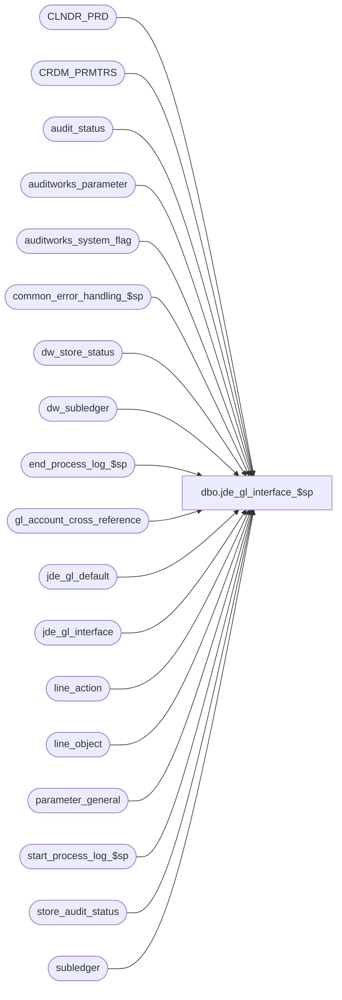

# dbo.jde_gl_interface_$sp

**Database:** auditworks  
**Server:** bedrockdb01  

## Architecture Diagram



## Table Dependencies

| Referenced Table |
|---|
| CLNDR_PRD |
| CRDM_PRMTRS |
| audit_status |
| auditworks_parameter |
| auditworks_system_flag |
| common_error_handling_$sp |
| dw_store_status |
| dw_subledger |
| end_process_log_$sp |
| gl_account_cross_reference |
| jde_gl_default |
| jde_gl_interface |
| line_action |
| line_object |
| parameter_general |
| start_process_log_$sp |
| store_audit_status |
| subledger |

## Stored Procedure Code

```sql
create proc dbo.jde_gl_interface_$sp 

@period_ending_date		smalldatetime,
@journal_entry_description 	nchar(29),
@last_date_closed		smalldatetime


AS

/* Proc name:   jde_gl_interface_$sp
   Description: Build jde_gl_interface table from subledger table according a range of 
     transaction dates, which is retrieved from parameter_general.
	Called from period_end_$sp

 HISTORY:
 Date 	 Name       Def# Desc
Jan31,11 Paul     105313 Use unicode datatypes
Nov12,10 Paul     121833 remove usage of BETWEEN date range since
                          @last_date_closed should be excluded;  also update dw_subledger on consolidated
Feb04,09 Vicci  1-3G3FM8 Drop and re-created clustered index to avoid AMF Bowling losing this patch which they claim
                         solved their issue of mis-ordered output with parallelism turned on.
Nov06,06 Paul      74790 read CRDM_PRMTRS to get CLNDR_ID
Sep01,06 Phu       76719 Want a non-null string when it's concatenated with null string.
Oct03,05 Paul      60471 apply 60634 to SA5
May04,05 Sab     DV-1254 Added new code to update dw_store_status set store_status = 3
Dec15,04 David   DV-1191 Improve performance by adding hints.
May11,04 David   DV-1071 Use new Calendar table.
Sep19,05 Daphna    60634 set subledger.gl_posting_datetime when posting_status set = 1   
Nov30,01 Phu        8931 Error handling
Jul05,01 Winnie     8169 Remove the date format of status_date
Mar23,01 Winnie     7450 Check gl_interface_timing for daily GL, move out all the recurring logic of all the GL interface and put it in period end. 
Mar14,01 Winnie     7378 To Parameterize the JDE GL Interface column VNMCU, VNOBJ, VNSUB by using jde_gl_default table.
May25,00 John G     5864 Change '= NULL' to 'IS NULL' where applicable to mirror Oracle.
Jan13,00 Vicci      5835 Use auditworks_parameter gl_interface_timing instead of smartload_var ascii_update_timin  
Dec15,99 Henry      5781 Support creation of ascii subledger export when preliminary period end
Sep20,99 Vicci      5455 Support daily (instead of period-end) building of ascii file
*/

/* declaration section for variables to be used in jde gl interface file */
DECLARE
	@jde_vnedus			nchar(10),
	@jde_vnedty			nchar(1) ,
	@jde_vnedsq			nchar(2) ,
	@jde_vnedtn			nchar(22),
	@jde_vnedct			nchar(2) ,
	@jde_vnedln			nchar(7) ,
	@jde_vnedts			nchar(6) ,
	@jde_vnedft			nchar(10),
	@jde_vneddt			nchar(6) ,
	@jde_vneder			nchar(1) ,
	@jde_vneddl			nchar(5) ,
	@jde_vnedsp			nchar(1) ,
	@jde_vnedtc			nchar(1) ,
	@jde_vnedtr			nchar(1) ,
	@jde_vnedbt			nchar(15),
	@jde_vnedgl			nchar(1) ,
	@jde_vnedan			nchar(8) ,
	@jde_vnkco			nchar(5) ,
	@jde_vndct			nchar(2) ,
	@jde_vndoc			nchar(8) ,
	@jde_vnjeln			nchar(7) ,
	@jde_vnextl			nchar(2) ,
	@jde_vnpost			nchar(1) ,
	@jde_vnicu			nchar(8) ,
	@jde_vnicut			nchar(2) ,
	@jde_vnticu			nchar(6) ,
	@jde_vnam			nchar(1) ,
	@jde_vnaid			nchar(8) ,
	@jde_vnsbl			nchar(8) ,
	@jde_vnsblt			nchar(1) ,
	@jde_vnlt			nchar(2) ,
	@jde_vnctry			nchar(2) ,
	@jde_vnfy			nchar(2) ,
	@jde_vnfq			nchar(4) ,
	@jde_vncrcd			nchar(3) ,
	@jde_vncrr			nchar(15),
	@jde_vnhcrr			nchar(15),
	@jde_vnu			nchar(15),
	@jde_vnus			nchar(1) ,
	@jde_vnum			nchar(2) ,
	@jde_vnglc			nchar(4) ,
	@jde_vnre			nchar(1) ,
	@jde_vnr1			nchar(8) ,
	@jde_vnr2			nchar(8) ,
	@jde_vnr3			nchar(8) ,
	@jde_vnsfx			nchar(3) ,
	@jde_vnodoc			nchar(8) ,
	@jde_vnodct			nchar(2) ,
	@jde_vnosfx			nchar(3) ,
	@jde_vnpkco			nchar(5) ,
	@jde_vnokco			nchar(5) ,
	@jde_vnpdct			nchar(2) ,
	@jde_vnan8			nchar(8) ,
	@jde_vncn			nchar(8) ,
	@jde_vndkc			nchar(6) ,
	@jde_vnasid			nchar(25),
	@jde_vnbre			nchar(1),
	@jde_vnrcnd			nchar(1),
	@jde_vnsumm			nchar(1),
	@jde_vnprge			nchar(1),
	@jde_vntnn			nchar(1),
	@jde_vnalt1			nchar(1),
	@jde_vnalt2			nchar(1),
	@jde_vnalt3			nchar(1),
	@jde_vnalt4			nchar(1),
	@jde_vnalt5			nchar(1),
	@jde_vnalt6			nchar(1),
	@jde_vnalt7			nchar(1),
	@jde_vnalt8			nchar(1),
	@jde_vnalt9			nchar(1),
	@jde_vnalt0			nchar(1),
	@jde_vnaltt			nchar(1) ,
	@jde_vnaltu			nchar(1) ,
	@jde_vnaltv			nchar(1) ,
	@jde_vnaltw			nchar(1) ,
	@jde_vnaltx			nchar(1) ,
	@jde_vnaltz			nchar(1) ,
	@jde_vndlna			nchar(1) ,
	@jde_vncff1			nchar(1) ,
	@jde_vncff2			nchar(1) ,
	@jde_vnasm			nchar(1) ,
	@jde_vnbc			nchar(1) ,
	@jde_vnvinv			nchar(25),
	@jde_vnivd			nchar(6) ,
	@jde_vnwr01			nchar(4) ,
	@jde_vnpo			nchar(8) ,
	@jde_vnpsfx			nchar(3) ,
	@jde_vndcto			nchar(2) ,
	@jde_vnlnid			nchar(6) ,
	@jde_vnwy			nchar(2),
	@jde_vnwn			nchar(2),
	@jde_vnfnlp			nchar(1) ,
	@jde_vnopsq			nchar(5) ,
	@jde_vnjbcd			nchar(6) ,
	@jde_vnjbst			nchar(4) ,
	@jde_vnhmcu			nchar(12),
	@jde_vndoi			nchar(2) ,
	@jde_vnalid			nchar(25),
	@jde_vnalty			nchar(2) ,
	@jde_vntorg			nchar(10),
	@jde_vnregnum			nchar(8) ,
	@jde_vnpyid			nchar(15),
	@jde_vnuser			nchar(10),
	@jde_vnpid			nchar(10),
	@jde_vnjobn			nchar(10),
	@jde_vnupmt			nchar(6) ,
	@jde_vncrrm			nchar(1) ,
	@jde_vnacr			nchar(15),
	@jde_vndgm			nchar(2) ,
	@jde_vndgd			nchar(2) ,
	@jde_vndgy			nchar(2) ,
	@jde_vndgnum			nchar(2),
	@jde_vndicm			nchar(2),
	@jde_vndicd			nchar(2),
	@jde_vndicy			nchar(2),
	@jde_vndicnum			nchar(2),
	@jde_vndsym			nchar(2),
	@jde_vndsyd			nchar(2),
	@jde_vndsyy			nchar(2),
	@jde_vndsynum			nchar(2),
	@jde_vndkm			nchar(2),
	@jde_vndkd			nchar(2),
	@jde_vndky			nchar(2),
	@jde_vndknum			nchar(2),
	@jde_vndsvm			nchar(2),
	@jde_vndsvd			nchar(2),
	@jde_vndsvy			nchar(2),
	@jde_vndsvnum			nchar(2),
	@jde_vnhdgm			nchar(2),
	@jde_vnhdgd			nchar(2),
	@jde_vnhdgy			nchar(2),
	@jde_vnhdgnum			nchar(2),
	@jde_vndkcm			nchar(2),
	@jde_vndkcd			nchar(2),
	@jde_vndkcy			nchar(2),
	@jde_vndkcnum			nchar(2),
	@jde_vnivdm			nchar(2),
	@jde_vnivdd			nchar(2),
	@jde_vnivdy			nchar(2),
	@jde_vnivdnum			nchar(2),
	@clndr_id			binary(16),
	@lvl_month			binary(16),
	@rows				int

SET CONCAT_NULL_YIELDS_NULL OFF
	
SELECT 
	@jde_vnedus			= 'RTLSALES',
	@jde_vnedty			= ' ',
	@jde_vnedsq			= '00',
	@jde_vnedtn			= '                      ',
	@jde_vnedct			= 'JE',
	@jde_vnedln			= '0000000',
	@jde_vnedts			= '      ',
	@jde_vnedft			= '          ',
	@jde_vneddt			= '000000',
	@jde_vneder			= ' ',
	@jde_vneddl			= '00000',
	@jde_vnedsp			= ' ',
	@jde_vnedtc			= 'A',
	@jde_vnedtr			= 'J',
	@jde_vnedbt			= '               ',
	@jde_vnedgl			= ' ',
	@jde_vnedan			= '00000000',
	@jde_vnkco			= '     ',
	@jde_vndct			= 'JE',
	@jde_vndoc			= '00011700',
	@jde_vnjeln			= '0000000',
	@jde_vnextl			= '  ',
	@jde_vnpost			= ' ',
	@jde_vnicu			= '00000000',
	@jde_vnicut			= 'G ',
	@jde_vnticu			= '000000',
	@jde_vnam			= '2',
	@jde_vnaid			= '        ',
	@jde_vnsbl			= '        ',
	@jde_vnsblt			= ' ',
	@jde_vnlt			= 'AA',
	@jde_vnctry			= '00',
	@jde_vnfy			= '00',
	@jde_vnfq			= '    ',
	@jde_vncrcd			= '   ',
	@jde_vncrr			= '000000000000000',
	@jde_vnhcrr			= '000000000000000',
	@jde_vnu				= '000000000000000',
	@jde_vnus			= ' ',
	@jde_vnum			= '  ',
	@jde_vnglc			= '    ',
	@jde_vnre			= ' ',
	@jde_vnr1			= '        ',
	@jde_vnr2			= '        ',
	@jde_vnr3			= '        ',
	@jde_vnsfx			= '   ',
	@jde_vnodoc			= '00000000',
	@jde_vnodct			= '  ',
	@jde_vnosfx			= '   ',
	@jde_vnpkco			= '     ',
	@jde_vnokco			= '     ',
	@jde_vnpdct			= '  ',
	@jde_vnan8			= '00000000',
	@jde_vncn			= '        ',
	@jde_vndkc			= '000000',
	@jde_vnasid			= '                         ',
	@jde_vnbre			= ' ',
	@jde_vnrcnd			= ' ',
	@jde_vnsumm			= ' ',
	@jde_vnprge			= ' ',
	@jde_vntnn			= ' ',
	@jde_vnalt1			= ' ',
	@jde_vnalt2			= ' ',
	@jde_vnalt3			= ' ',
	@jde_vnalt4			= ' ',
	@jde_vnalt5			= ' ',
	@jde_vnalt6			= ' ',
	@jde_vnalt7			= ' ',
	@jde_vnalt8			= ' ',
	@jde_vnalt9			= ' ',
	@jde_vnalt0			= ' ',
	@jde_vnaltt			= ' ',
	@jde_vnaltu			= ' ',
	@jde_vnaltv			= ' ',
	@jde_vnaltw			= ' ',
	@jde_vnaltx			= ' ',
	@jde_vnaltz			= ' ',
	@jde_vndlna			= ' ',
	@jde_vncff1			= ' ',
	@jde_vncff2			= ' ',
	@jde_vnasm			= ' ',
	@jde_vnbc			= ' ',
	@jde_vnvinv			= '                         ',    
	@jde_vnivd			= '000000',
	@jde_vnwr01			= '    ',
	@jde_vnpo			= '        ',
	@jde_vnpsfx			= '   ',
	@jde_vndcto			= '  ',
	@jde_vnlnid			= '000000',
	@jde_vnwy			= '00',
	@jde_vnwn			= '00',
	@jde_vnfnlp			= ' ',
	@jde_vnopsq			= '00000',
	@jde_vnjbcd			= '      ',
	@jde_vnjbst			= '    ',
	@jde_vnhmcu			= '            ',
	@jde_vndoi			= '00',
	@jde_vnalid			= '                         ',
	@jde_vnalty			= '  ',
	@jde_vntorg			= '     ',
	@jde_vnregnum			= '00000000',
	@jde_vnpyid			= '000000000000000',
	@jde_vnuser			= '          ',
	@jde_vnpid			= 'user_gl_in',
	@jde_vnjobn			= 'SmartLoad ',
	@jde_vnupmt			= '000000',
	@jde_vncrrm			= ' ',
	@jde_vnacr			= '000000000000000',
	@jde_vndgm			= SUBSTRING(convert(nchar(6),getdate(),12),3,2),
	@jde_vndgd			= SUBSTRING(convert(nchar(6),getdate(),12),5,2),
	@jde_vndgy			= SUBSTRING(convert(nchar(6),getdate(),12),1,2),
	@jde_vndgnum			= '00',
	@jde_vndicm			= '00',
	@jde_vndicd			= '00',
	@jde_vndicy			= '00',
	@jde_vndicnum			= '00',
	@jde_vndsym			= '00',
	@jde_vndsyd			= '00',
	@jde_vndsyy			= '00',
	@jde_vndsynum			= '00',
	@jde_vndkm			= '00',
	@jde_vndkd			= '00',
	@jde_vndky			= '00',
	@jde_vndknum			= '00',
	@jde_vndsvm			= '00',
	@jde_vndsvd			= '00',
	@jde_vndsvy			= '00',
	@jde_vndsvnum			= '00',
	@jde_vnhdgm			= '00',
	@jde_vnhdgd			= '00',
	@jde_vnhdgy			= '00',
	@jde_vnhdgnum			= '00',
	@jde_vndkcm			= '00',
	@jde_vndkcd			= '00',
	@jde_vndkcy			= '00',
	@jde_vndkcnum			= '00',
	@jde_vnivdm			= '00',
	@jde_vnivdd			= '00',
	@jde_vnivdy			= '00',
	@jde_vnivdnum			= '00'


/* end declaration section */

DECLARE
        @cost_center_start_pos			smallint,
        @cost_center_length			smallint,
	@current_date 				smalldatetime,
	@current_date_julian			numeric(6,0),
	@errmsg 				nvarchar(255),
	@errno 					int,
	@company_no				smallint,
	@instance_id				int,
        @gl_interface_timing			smallint,
	@loop_date				smalldatetime,
	@message_id				int,
	@min_seq_offset				numeric(12,0),
	@object_name				nvarchar(255),
	@object_account_start_pos		smallint,
        @object_account_length			smallint,
	@operation_name				nvarchar(100),
	@process_name				nvarchar(100),
	@period_end_date 			smalldatetime,
	@process_log_entry 			tinyint,
	@process_no 				smallint,
	@process_timestamp 			float,
	@scaleout_flag				int,
	@scaleout_gl_export_on_peri		tinyint,
	@subsidiary_start_pos			smallint,
        @subsidiary_length			smallint,
	@transaction_count 			numeric(12,0)

if exists (select * from sysindexes where id = object_id('dbo.jde_gl_interface')  and name ='jde_gl_interface_x0')
begin
  drop index jde_gl_interface.jde_gl_interface_x0
end

SELECT
	@current_date = getdate(),
	@current_date_julian = (datepart(year,getdate()) - 1900)* 1000 
		+ datepart(dayofyear,getdate()) ,
	@errmsg = NULL,
	@process_log_entry = 0,
	@process_no = 205,
	@process_timestamp = 0,
	@transaction_count = 0,
	@min_seq_offset = 1,
        @gl_interface_timing = 0,
	@message_id = 201068,
	@process_name = 'jde_gl_interface_$sp'

SELECT	@company_no = sa_company_no
FROM parameter_general

SELECT @errno = @@error
IF @errno <> 0
  BEGIN
	SELECT @errmsg = 'Unable to select from parameter_general',
	       @object_name = 'parameter_general',
	       @operation_name = 'SELECT'
	GOTO error
  END

EXEC start_process_log_$sp @process_no, @process_timestamp OUTPUT, @errmsg OUTPUT

SELECT @errno = @@error
IF @errno <> 0
  BEGIN
    SELECT @object_name = 'start_process_log_$sp',
	   @operation_name = 'EXECUTE'
    IF @errmsg IS NULL
	SELECT @errmsg = 'Unable to execute start_process_log_$sp'
    GOTO error
  END

SELECT @process_log_entry = 1

SELECT @process_log_entry = 1,
	@scaleout_flag = 0,
	@scaleout_gl_export_on_peri = 0,
	@instance_id = 0

SELECT @scaleout_flag = flag_numeric_value
  FROM auditworks_system_flag
 WHERE flag_name = 'scaleout_flag'

SELECT @scaleout_gl_export_on_peri = CONVERT(tinyint,par_value)
  FROM auditworks_parameter 
 WHERE par_name = 'scaleout_gl_export_on_peri'

SELECT @instance_id = flag_numeric_value
  FROM auditworks_system_flag
 WHERE flag_name = 'instance_id'

SELECT @cost_center_start_pos = cost_center_start_pos,
       @cost_center_length =cost_center_length,
       @object_account_start_pos = object_account_start_pos,
       @object_account_length = object_account_length,
       @subsidiary_start_pos = subsidiary_start_pos,
       @subsidiary_length = subsidiary_length
  FROM jde_gl_default

SELECT @errno = @@error
IF @errno <> 0
  BEGIN
    SELECT @errmsg = 'Unable to select  from jde_gl_default table',
	   @object_name = 'jde_gl_default',
	   @operation_name = 'SELECT'
    GOTO error
  END  

CREATE TABLE #jde_detail(
	jde_entry_no	numeric(7,0) identity,
	gl_date		numeric(6,0),
	gl_company	tinyint,
	account		nvarchar(160),
	period		tinyint,
	amount		numeric,
	store_no	smallint,
	line_object	smallint,
	line_action	tinyint)

SELECT @errno = @@error
IF @errno <> 0
  BEGIN
    SELECT @errmsg = 'Unable to create table #jde_detail',
	   @object_name = '#jde_detail',
	   @operation_name = 'CREATE TABLE'
    GOTO error
  END


SELECT @clndr_id = PRMTR_VAL_BIN
  FROM CRDM_PRMTRS
 WHERE PRMTR_NAME = 'GL_PSTNG_CLNDR_ID'

SELECT @errno = @@error, @rows = @@rowcount
IF @rows = 0 AND @errno = 0
  SELECT @errno = 201612
IF @errno <> 0
  BEGIN
	SELECT @errmsg = 'Unable to select calendar id',
	       @object_name = 'CRDM_PRMTRS',
	       @operation_name = 'SELECT'
	GOTO error
  END

SELECT @lvl_month = par_bin_value
  FROM auditworks_parameter
 WHERE par_name = 'clndr_lvl_month'

SELECT @errno = @@error
IF @errno <> 0
  BEGIN
	SELECT @errmsg = 'Unable to select month level id',
	       @object_name = 'auditworks_parameter',
	       @operation_name = 'SELECT'
	GOTO error
  END

INSERT #jde_detail(
	gl_date ,
	gl_company,
	account ,
	period ,
	amount ,
	store_no ,
	line_object,
	line_action)
SELECT (datepart(year,DATEADD (ss,-1,c.END_DATE_TIME)) - 1900)* 1000 
		+ datepart(dayofyear,DATEADD (ss,-1,c.END_DATE_TIME)),
	s.gl_company,
	x.gl_account_no,
	s.period,
	SUM(s.amount*100),
	s.store_no,
	s.line_object,
	s.line_action
   FROM subledger s WITH (NOLOCK), CLNDR_PRD c, gl_account_cross_reference x
  WHERE s.posting_status = 0
    AND s.gl_account_id = x.gl_account_id
    AND c.CLNDR_ID          = @clndr_id
    AND c.CLNDR_LVL_TYPE_ID = @lvl_month
    AND s.transaction_date >= c.STRT_DATE_TIME 
    AND s.transaction_date  < c.END_DATE_TIME
    AND s.transaction_date > @last_date_closed
    AND s.transaction_date <= @period_ending_date
  GROUP BY c.END_DATE_TIME, s.gl_company, x.gl_account_no, s.period,
	   s.store_no, s.line_object, s.line_action

SELECT @errno = @@error
IF @errno <> 0
  BEGIN
	SELECT @errmsg = 'Unable to insert table #jde_detail',
	       @object_name = '#jde_detail',
	       @operation_name = 'INSERT'
	GOTO error
  END

BEGIN TRAN

INSERT INTO jde_gl_interface (
	vnedus,
	vnedty,
	vnedsq,
	vnedtn,
	vnedct,
	vnedln,
	vnedts,
	vnedft,
	vneddt,
	vneder,
	vneddl,
	vnedsp,
	vnedtc,
	vnedtr,
	vnedbt,
	vnedgl,
	vnedan,
	vnkco, 
	vndct,
	vndoc,
	vndgj,
	vnjeln,
	vnextl,
	vnpost,
	vnicu,
	vnicut,
	vndicj,
	vndsyj,
	vnticu,
	vnco,
	vnani,
	vnam,
	vnaid,
	vnmcu,
	vnobj,
	vnsub,
	vnsbl,
	vnsblt,
	vnlt,
	vnpn,
	vnctry,
	vnfy,
	vnfq,
	vncrcd,
	vncrr,
	vnhcrr,
	vnhdgj,
	vnaa,
	vnaasg,
	vnu,
	vnus,
	vnum,
	vnglc,
	vnre,
	vnexa,
	vnexr,
	vnr1,
	vnr2,
	vnr3,
	vnsfx,
	vnodoc,
	vnodct,
	vnosfx,
	vnpkco,
	vnokco,
	vnpdct,
	vnan8,
	vncn,
	vndkj,
	vndkc,
	vnasid,
	vnbre,
	vnrcnd,
	vnsumm,
	vnprge,
	vntnn,
	vnalt1,
	vnalt2,
	vnalt3,
	vnalt4,
	vnalt5,
	vnalt6,
	vnalt7,
	vnalt8,
	vnalt9,
	vnalt0,
	vnaltt,
	vnaltu,
	vnaltv,
	vnaltw,
	vnaltx,
	vnaltz,
	vndlna,
	vncff1,
	vncff2,
	vnasm,
	vnbc,
	vnvinv,
	vnivd,
	vnwr01,
	vnpo,
	vnpsfx,
	vndcto,
	vnlnid,
	vnwy,
	vnwn,
	vnfnlp,
	vnopsq,
	vnjbcd,
	vnjbst,
	vnhmcu,
	vndoi,
	vnalid,
	vnalty,
	vndsvj,
	vntorg,
	vnregnum,
	vnpyid,
	vnuser,
	vnpid,		
	vnjobn,
	vnupmj,
	vnupmt,
	vncrrm,
	vnacr,
	vndgm,
	vndgd,
	vndgy,
	vndgnum,
	vndicm,
	vndicd,
	vndicy ,
	vndicnum,
	vndsym ,
	vndsyd,
	vndsyy,
	vndsynum,
	vndkm,
	vndkd,
	vndky,
	vndknum,
	vndsvm,
	vndsvd,
	vndsvy,
	vndsvnum,
	vnhdgm,
	vnhdgd,
	vnhdgy,
	vnhdgnum,
	vndkcm,
	vndkcd,
	vndkcy,
	vndkcnum,
	vnivdm,
	vnivdd,
	vnivdy,
	vnivdnum,
	tmp_line_object,
	tmp_line_object_desc,
	tmp_line_action,
	tmp_line_action_desc) 
SELECT @jde_vnedus,
	@jde_vnedty,
	@jde_vnedsq,
	@jde_vnedtn,
	@jde_vnedct,
	@jde_vnedln,
	@jde_vnedts,
	@jde_vnedft,
	RIGHT ('000000' + LTRIM (RTRIM (convert(nchar(6), @current_date_julian))), 6), /* vneddt */
	@jde_vneder,
	@jde_vneddl,
	@jde_vnedsp,
	@jde_vnedtc,
	@jde_vnedtr,
	@jde_vnedbt,
	@jde_vnedgl,
	@jde_vnedan,
	@jde_vnkco,
	@jde_vndct,
	@jde_vndoc,
	RIGHT ('000000' + LTRIM (RTRIM (convert(nchar(6), gl_date))), 6), /* vndgj */
	RIGHT ('0000000' + LTRIM (RTRIM (convert(nchar(7), jde_entry_no))), 7), /* vnjeln */
	@jde_vnextl,
	@jde_vnpost,
	@jde_vnicu,
	@jde_vnicut,
	RIGHT ('000000' + LTRIM (RTRIM (convert(nchar(6), @current_date_julian))), 6), /* vndicj */
	RIGHT ('000000' + LTRIM (RTRIM (convert(nchar(6), @current_date_julian))), 6), /* vndsyj */
	@jde_vnticu,
	RIGHT ('00000' + LTRIM (RTRIM (convert(nchar(5), gl_company))), 5), /* vnco */
	ISNULL(SUBSTRING(account,1,29),SPACE(29)),  /* vnani */
	@jde_vnam,
	@jde_vnaid,
	RIGHT('            ' + LTRIM( RTRIM (ISNULL(SUBSTRING(account,@cost_center_start_pos, @cost_center_length),'        '))),12), /* vnmcu */
	ISNULL(SUBSTRING(account,@object_account_start_pos, @object_account_length),'    '), /* vnobj */
	ISNULL(SUBSTRING(account,@subsidiary_start_pos, @subsidiary_length ),'   '), /* vnsub */
	@jde_vnsbl,
	@jde_vnsblt,
	@jde_vnlt,
	RIGHT ('00' + LTRIM (RTRIM (convert(nchar(2), period))), 2), /* vnpn */
	@jde_vnctry,
	@jde_vnfy,
	@jde_vnfq,
	@jde_vncrcd,
	@jde_vncrr,
	@jde_vnhcrr,
	RIGHT ('000000' + LTRIM (RTRIM (convert(nchar(6), @current_date_julian))), 6), /* vnjdgj */
	RIGHT ('000000000000000' + LTRIM (RTRIM (convert(nchar(15), ABS(amount)))), 15), /* vnaa */
	SUBSTRING('-++', convert(int, SIGN(amount) + 2), 1), /* vnaas */
	@jde_vnu,
	@jde_vnus,
	@jde_vnum,
	@jde_vnglc,
	@jde_vnre,
	SUBSTRING(@journal_entry_description,1,30), /* vnexa */
	RIGHT ('000' + LTRIM (RTRIM (convert(nchar(3), store_no%1000))), 3), /* vnexr */
	@jde_vnr1,
	@jde_vnr2,
	@jde_vnr3,
	@jde_vnsfx,
	@jde_vnodoc,
	@jde_vnodct,
	@jde_vnosfx,
	@jde_vnpkco,
	@jde_vnokco,
	@jde_vnpdct,
	@jde_vnan8,
	@jde_vncn,
	RIGHT ('000000' + LTRIM (RTRIM (convert(nchar(6), @current_date_julian))), 6), /* vndkj */
	@jde_vndkc,
	@jde_vnasid,
	@jde_vnbre,
	@jde_vnrcnd,
	@jde_vnsumm,
	@jde_vnprge,
	@jde_vntnn,
	@jde_vnalt1,
	@jde_vnalt2,
	@jde_vnalt3,
	@jde_vnalt4,
	@jde_vnalt5,
	@jde_vnalt6,
	@jde_vnalt7,
	@jde_vnalt8,
	@jde_vnalt9,
	@jde_vnalt0,
	@jde_vnaltt,
	@jde_vnaltu,
	@jde_vnaltv,
	@jde_vnaltw,
	@jde_vnaltx,
	@jde_vnaltz,
	@jde_vndlna,
	@jde_vncff1,
	@jde_vncff2,
	@jde_vnasm,
	@jde_vnbc,
	@jde_vnvinv,
	@jde_vnivd,
	@jde_vnwr01,
	@jde_vnpo,
	@jde_vnpsfx,
	@jde_vndcto,
	@jde_vnlnid,
	@jde_vnwy,
	@jde_vnwn,
	@jde_vnfnlp,
	@jde_vnopsq,
	@jde_vnjbcd,
	@jde_vnjbst,
	@jde_vnhmcu,
	@jde_vndoi,
	@jde_vnalid,
	@jde_vnalty,
	RIGHT ('000000' + LTRIM (RTRIM (convert(nchar(6), @current_date_julian))), 6), /* vndsvj */
	@jde_vntorg,
	@jde_vnregnum,
	@jde_vnpyid,
	@jde_vnuser,
	@jde_vnpid,		
	@jde_vnjobn,
	RIGHT ('000000' + LTRIM (RTRIM (convert(nchar(6), @current_date_julian))), 6), /* vnupmj */
	@jde_vnupmt,
	@jde_vncrrm,
	@jde_vnacr,
	@jde_vndgm,
	@jde_vndgd,
	@jde_vndgy,
	@jde_vndgnum,
	@jde_vndicm,
	@jde_vndicd,
	@jde_vndicy ,
	@jde_vndicnum,
	@jde_vndsym ,
	@jde_vndsyd,
	@jde_vndsyy,
	@jde_vndsynum,
	@jde_vndkm,
	@jde_vndkd,
	@jde_vndky,
	@jde_vndknum,
	@jde_vndsvm,
	@jde_vndsvd,
	@jde_vndsvy,
	@jde_vndsvnum,
	@jde_vnhdgm,
	@jde_vnhdgd,
	@jde_vnhdgy,
	@jde_vnhdgnum,
	@jde_vndkcm,
	@jde_vndkcd,
	@jde_vndkcy,
	@jde_vndkcnum,
	@jde_vnivdm,
	@jde_vnivdd,
	@jde_vnivdy,
	@jde_vnivdnum,
	line_object,
	' ',
	line_action,
	' '
FROM #jde_detail  WITH (NOLOCK)

SELECT @errno = @@error
IF @errno <> 0
  BEGIN
	SELECT @errmsg = 'Unable to insert jde_gl_interface',
	       @object_name = 'jde_gl_interface',
	       @operation_name = 'INSERT'
	GOTO error
  END

 
UPDATE jde_gl_interface 
SET tmp_line_object_desc = o.line_object_description
FROM line_object o, jde_gl_interface j
WHERE o.line_object = j.tmp_line_object

SELECT @errno = @@error
IF @errno <> 0
  BEGIN
	SELECT @errmsg = 'Unable to update jde_gl_interface',
	       @object_name = 'jde_gl_interface',
	       @operation_name = 'UPDATE'
	GOTO error
  END

UPDATE jde_gl_interface 
SET tmp_line_action_desc = a.line_action_display_descr
FROM line_action a, jde_gl_interface j
WHERE a.line_action = j.tmp_line_action

SELECT @errno = @@error
IF @errno <> 0
  BEGIN
	SELECT @errmsg = 'Unable to update jde_gl_interface',
	       @object_name = 'jde_gl_interface',
	       @operation_name = 'UPDATE'
	GOTO error
  END

UPDATE jde_gl_interface
SET vnexr = SUBSTRING(RTRIM (LTRIM (vnexr))+' '+
			RTRIM(LTRIM(ISNULL(tmp_line_object_desc,' ')))+' '+
			RTRIM(LTRIM(ISNULL(tmp_line_action_desc,' '))), 1, 30),
	vnedln = vnjeln

SELECT @errno = @@error
IF @errno <> 0
  BEGIN
	SELECT @errmsg = 'Unable to update jde_gl_interface',
	       @object_name = 'jde_gl_interface',
	      @operation_name = 'UPDATE'
	GOTO error
  END

/* Set subledger posting status to yes */
  
  UPDATE subledger
  SET posting_status = 1,
      gl_posting_datetime = @current_date
  WHERE posting_status = 0
  AND transaction_date > @last_date_closed
  AND transaction_date <= @period_ending_date

  SELECT @errno = @@error
  IF @errno <> 0
    BEGIN
	SELECT @errmsg = 'Unable to update subledger with posting_status to 1',
	       @object_name = 'subledger',
	       @operation_name = 'UPDATE'
	GOTO error
    END

  /* If running export on peripheral, also need to set posted_status in subledger on consolidated */
  IF @scaleout_gl_export_on_peri = 1 AND @scaleout_flag = 1 -- THEN 
    BEGIN
    /* Using loop to batch by date and to improve scaleout query plan */
    SELECT @loop_date = DATEADD(dd,1,@last_date_closed)

    WHILE @loop_date <= @period_ending_date
    BEGIN
	      UPDATE dw_subledger
	         SET posting_status = 1,
	             gl_posting_datetime = @current_date
	       WHERE posting_status = 0
	         AND transaction_date = @loop_date 
	         AND store_no
	             IN (SELECT DISTINCT store_no
	                 FROM subledger
	                 WHERE transaction_date = @loop_date
	                   AND posting_status >= 1)

		  SELECT @errno = @@error
		  IF @errno <> 0
		    BEGIN
		     SELECT @errmsg = 'Failed to update dw_subledger with posting_status to 1',
			@object_name = 'dw_subledger',
			@operation_name = 'UPDATE'
			GOTO error
		    END
	SELECT @loop_date = DATEADD(dd,1,@loop_date)
    END -- While
    END -- If @scaleout_gl_export_on_peri = 1

  UPDATE store_audit_status
  SET store_audit_status = 500,
	store_status_date = @current_date
  WHERE store_audit_status = 400
  AND sales_date > @last_date_closed
  AND sales_date <= @period_ending_date

  SELECT @errno = @@error
  IF @errno <> 0
    BEGIN
	SELECT @errmsg = 'Unable to set store_audit_status to 500 from 400',
	       @object_name = 'store_audit_status',
	       @operation_name = 'UPDATE'
	GOTO error
    END

  UPDATE audit_status
  SET audit_status = 500,
	status_date = @current_date
  WHERE audit_status = 400
  AND sales_date > @last_date_closed
  AND sales_date <= @period_ending_date

  SELECT @errno = @@error
  IF @errno <> 0
    BEGIN
	SELECT @errmsg = 'Unable to set audit_status to 500 from 400',
	       @object_name = 'audit_status',
	       @operation_name = 'UPDATE'
	GOTO error
    END

  UPDATE dw_store_status
     SET store_status = 3
   WHERE store_status = 2
     AND sales_date > @last_date_closed
     AND sales_date <= @period_ending_date
     AND instance_id = @instance_id

  SELECT @errno = @@error
  IF @errno <> 0
    BEGIN
	SELECT @errmsg = 'Unable to set store_status to 3 from 2',
	       @object_name = 'dw_store_status',
	       @operation_name = 'UPDATE'
	GOTO error
    END

-- NOTE:
--	Moved the UPDATE of parameter_general, for the
--	RESET of the last_date_closed = period_end_date, and the
--	RESET of the preliminary_period_end_date = NULL,
--	to the proc reset_period_end_$sp

COMMIT TRAN

IF @process_log_entry = 1
	EXEC end_process_log_$sp @process_no, @process_timestamp, @transaction_count

DROP TABLE #jde_detail
SELECT @errno = @@error
  IF @errno <> 0
    BEGIN
	SELECT @errmsg = 'Unable to set drop table #jde_gl',
	       @object_name = '#jde_detail',
	       @operation_name = 'DROP TABLE'
	GOTO error
    END

create clustered
 index jde_gl_interface_x0
    on dbo.jde_gl_interface ( vnjeln )

RETURN

error:

	EXEC common_error_handling_$sp @process_no, @errno, @errmsg, 0, @message_id, 
	@process_name, @object_name, @operation_name, 1
	RETURN
```

