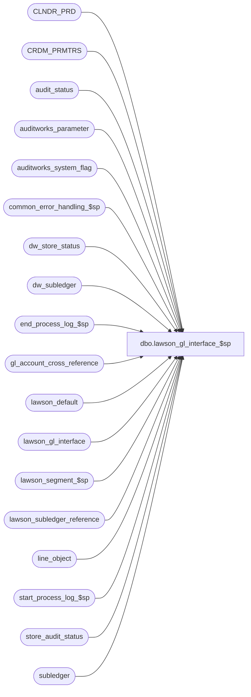

# dbo.lawson_gl_interface_$sp

**Database:** auditworks  
**Server:** bedrockdb01  

## Architecture Diagram



## Table Dependencies

| Referenced Table |
|---|
| CLNDR_PRD |
| CRDM_PRMTRS |
| audit_status |
| auditworks_parameter |
| auditworks_system_flag |
| common_error_handling_$sp |
| dw_store_status |
| dw_subledger |
| end_process_log_$sp |
| gl_account_cross_reference |
| lawson_default |
| lawson_gl_interface |
| lawson_segment_$sp |
| lawson_subledger_reference |
| line_object |
| start_process_log_$sp |
| store_audit_status |
| subledger |

## Stored Procedure Code

```sql
create proc dbo.lawson_gl_interface_$sp 

@period_ending_date		smalldatetime,
@journal_entry_description 	nchar(29),
@last_date_closed		smalldatetime

AS

/* 
PROC NAME: lawson_gl_interface_$sp
     DESC: Build lawson_gl_interface table from subledger table according a range of 
           transaction dates, which is retrieved from parameter_general. lawson_gl_interface 
           table will contain the gl_account_no instead of gl_account_id.
 	   Called from period_end_$sp 

HISTORY:
Date     Name        Def# Desc
Jan31,11 Paul      105313 Use unicode datatypes
Nov12,10 Paul      121833 remove usage of BETWEEN date range since
	                        @last_date_closed should be excluded;  also update dw_subledger on consolidated
Nov06,06 Paul       74790 read CRDM_PRMTRS to get CLNDR_ID
Sep01,06    Phu     76719   Want a non-null string when it's concatenated with null string.
Oct03,05    Paul    60471   apply 60634 to SA5
May04,05    Sab	  DV-1254   Added new code to update dw_store_status set store_status = 3
Dec15,04    David DV-1191   Improve performance by adding hints.
May 11,04   David DV-1071   Use new Calendar table.
Sep 19,05   Daphna  60634   set subledger.gl_posting_datetime when posting_status set = 1
Nov 30,01   Phu      8931   Error handling
Oct 03,01   Winnie   8809   Raise error if lawson_default table is empty.
Aug 06,01   Winnie   8463   Add date format to default table to handle different date format for caledar_date and posting_date
Jul 20,01   Winnie   8292   To expand gl company from 3 to 4 digits.
Jul 05,01   Winnie   8169   Remove the date format of status_date
Jun 12,01   Winnie   8080   Correct logic to handle multiple period for grouping level 1 & 2
Mar 23,01   Winnie   7450   Check gl_interface_timing for daily GL, move out all the recurring logic of all the GL interface and put it in period end. 
Mar 14,01   Winnie   7377   use lawson default table to determine whether a trailing or leading sign for the amount.
Dec 21,00   Henry    7146   Added another grouping level, by transaction_date.
Nov 28,00   Henry    7012   Corrected temp table #lawson_gl for the expanded field gl_account_no.
July13,00   Maryam   6487   Prevent overflow when gl_company > 9999.
May 25,00   John G   5864   Change '= NULL' to 'IS NULL' where applicable to mirror Oracle.
Apr 20,00   Daphna   6175   add warning when lawson_default table not populated        
                            @law_autorev initialized = ' ' instead of 'N'
                            Initialize @grouping_level = 0,@run_group_source = 0, 
                            @reference_source = 0,  @journal_entry_description = '       '
                            law_currency, law_system, law_program_code, law_autorev selected
                            from lawson_default                                               
Feb 10,00   Henry    5903   To expand gl_acct_no field to handle max gl_acct# (160 characters).
Jan 13,00   Vicci    5835   Use auditworks_parameter gl_interface_timing instead of smartload_var ascii_update_timin 
Dec 15,99   Henry    5781   Support creation of ascii subledger export when preliminary period end
Sep 20,99   Vicci    5455   Support creation of ascii subledger export without closing of period
Jul 07,98   ??         ??   Last modified
??? ??,97   Yin	      n/a   author 	
*/

-- declaration section for variables to be used in lawson gl interface file
-- values of lawson variables MUST be set in the lawson_default table.
-- when INSERT into the lawson_gl_interface table, MUST customize values of 'old_company' and 'old_acct_no'.

DECLARE
	@law_run_group			nvarchar(12),
	@law_source_code		nchar(2),
	@law_date			smalldatetime,
	@law_refer			nchar(10),
	@law_currency			nchar(5),
	@law_units_amt			numeric(14,2),
	@law_base_amt			numeric(14,2),
	@law_baserate			numeric(11,6),
	@law_system			nchar(2),
	@law_program_code		nchar(5),
	@law_autorev			nchar(1),
	@law_activity			nchar(15),
	@law_acct_catg			nchar(5),
	@law_doc_nbr			nchar(15),
	@law_to_base_amt		numeric(14,2),
	@law_jnl_book_nbr		nchar(20),
	@law_effect_date		nchar(8),
	@law_mx1			nchar(20),
	@law_mx2			nchar(20),
	@law_mx3			nchar(20),
	@law_preceed_amt_with_sign	tinyint,
	@law_calendar_date_fmt		tinyint,
	@column_old_co			tinyint,
	@column_old_acct		tinyint,
	@grouping_level			tinyint,
	@instance_id			int,
	@loop_date			smalldatetime,
	@run_group_source		tinyint,
	@reference_source		smallint,
	@current_date 			smalldatetime,
	@errmsg 			nvarchar(255),
	@errno 				int,
	@period_end_date 		smalldatetime,
	@process_log_entry 		tinyint,
	@process_no 			smallint,
	@process_timestamp 		float,
	@rows				int,
	@scaleout_flag			int,
	@scaleout_gl_export_on_peri	tinyint,
	@transaction_count 		numeric(12,0),
	@min_seq_offset			numeric(12,0),
	@message_id			int,
	@object_name			nvarchar(255),
	@operation_name			nvarchar(100),
	@process_name			nvarchar(100),
	@clndr_id			binary(16),
	@lvl_month			binary(16)

SET CONCAT_NULL_YIELDS_NULL OFF

SELECT
	@law_run_group = ' ',
	@law_source_code = ' ',	
	@law_date	= getdate(),		
	@law_refer	= '  ',
	@law_currency = ' ',
	@law_system	=' ',
	@law_program_code = '     '	,
	@law_autorev = ' ',
	@law_activity = ' ',
	@law_acct_catg = ' ',	
	@law_doc_nbr = ' ',
	@law_jnl_book_nbr = ' ',
	@law_effect_date = ' ',
	@law_mx1 = ' ',
	@law_mx2 = ' ',
	@law_mx3 = ' ' ,
	@column_old_co = 4,
	@column_old_acct = 5,
	@current_date = getdate(),
	@errmsg = NULL,
	@process_log_entry = 0,
	@process_no = 205,
	@process_timestamp = 0,
	@transaction_count = 0,
	@min_seq_offset = 1,
	@grouping_level = 0,
	@run_group_source = 0,
	@reference_source = 0,
	@message_id = 201068,
	@process_name = 'lawson_gl_interface_$sp',
	@errno = 0
 
IF NOT EXISTS (SELECT 1
                 FROM lawson_default)
BEGIN
  SELECT @errmsg = 'Lawson default values are missing in lawson_default table ', 
         @errno = 0       
    GOTO error                           
END                 

SELECT	@grouping_level = ISNULL(subledger_grouping, 0),
     	@reference_source = ISNULL(refer_source, 0),
	@run_group_source = ISNULL(run_group_source,0),
	@law_currency = ISNULL(currency,'     '),
	@law_system = ISNULL(system,'  '),
	@law_program_code = ISNULL(program_code,'     '),
	@law_autorev = ISNULL(autorev,' '),
	@law_preceed_amt_with_sign = ISNULL(preceed_amt_with_sign,0),
	@law_units_amt = ISNULL(CONVERT(NUMERIC(14,2),units_amt) ,0),
	@law_base_amt = ISNULL(CONVERT(NUMERIC(14,2),base_amt) ,0),
	@law_baserate = ISNULL(CONVERT(NUMERIC(11,6),baserate ),0),
	@law_to_base_amt = ISNULL(CONVERT(NUMERIC(14,2), to_base_amt),0),
	@law_calendar_date_fmt = ISNULL(calendar_date_fmt,112)
FROM lawson_default

SELECT @errno = @@error
IF @errno <> 0
  BEGIN
	SELECT @errmsg = 'Unable to select from lawson_default',
	       @object_name = 'lawson_default',
	       @operation_name = 'SELECT'
	GOTO error
  END

IF @law_preceed_amt_with_sign <> 1 AND @law_preceed_amt_with_sign <> 0
BEGIN
  SELECT @errmsg = 'Invalid default values for i_law_preceed_amt_with_sign. Please verify default table'
  GOTO error
END

EXEC start_process_log_$sp @process_no, @process_timestamp OUTPUT, @errmsg OUTPUT

SELECT @errno = @@error
IF @errno <> 0
  BEGIN
	SELECT	@object_name = 'start_process_log_$sp',
		@operation_name = 'EXECUTE'
	IF @errmsg IS NULL
		SELECT @errmsg = 'Unable to execute start_process_log_$sp'
	GOTO error
  END
 
SELECT @process_log_entry = 1

SELECT @process_log_entry = 1,
	@scaleout_flag = 0,
	@scaleout_gl_export_on_peri = 0,
	@instance_id = 0

SELECT @scaleout_flag = flag_numeric_value
  FROM auditworks_system_flag
 WHERE flag_name = 'scaleout_flag'

SELECT @scaleout_gl_export_on_peri = CONVERT(tinyint,par_value)
  FROM auditworks_parameter 
 WHERE par_name = 'scaleout_gl_export_on_peri'

SELECT @instance_id = flag_numeric_value
  FROM auditworks_system_flag
 WHERE flag_name = 'instance_id'

EXEC lawson_segment_$sp @last_date_closed, @period_ending_date, @errmsg OUTPUT
SELECT @errno = @@error
IF @errno <> 0
  BEGIN
	SELECT @object_name = 'lawson_segment_$sp',
	       @operation_name = 'EXECUTE'
	IF @errmsg IS NULL
		SELECT @errmsg = 'Unable to execute lawson_segment_$sp'
	GOTO error
  END

CREATE TABLE #lawson_gl(
	seq_number		numeric(12,0) identity,
	gl_company		int,
	gl_account_id		int,
	gl_account_no		nvarchar(160),
	run_group		nchar(255),
	reference		nchar(255),
	amount			money,
	period_end_date		smalldatetime)

SELECT @errno = @@error
IF @errno <> 0
  BEGIN
    SELECT @errmsg = 'Unable to execute lawson_segment_$sp',
	   @object_name = '#lawson_gl',
	   @operation_name = 'CREATE TABLE'
    GOTO error
  END

SELECT @clndr_id = PRMTR_VAL_BIN
  FROM CRDM_PRMTRS
 WHERE PRMTR_NAME = 'GL_PSTNG_CLNDR_ID'

SELECT @errno = @@error, @rows = @@rowcount
IF @rows = 0 AND @errno = 0
  SELECT @errno = 201612
IF @errno <> 0
  BEGIN
	SELECT @errmsg = 'Unable to select calendar id',
	       @object_name = 'CRDM_PRMTRS',
	       @operation_name = 'SELECT'
	GOTO error
  END

SELECT @lvl_month = par_bin_value
  FROM auditworks_parameter
 WHERE par_name = 'clndr_lvl_month'

SELECT @errno = @@error
IF @errno <> 0
  BEGIN
	SELECT @errmsg = 'Unable to select month level id',
	       @object_name = 'auditworks_parameter',
	       @operation_name = 'SELECT'
	GOTO error
  END

/* Create gl details */
IF @grouping_level = 1
  BEGIN
	INSERT #lawson_gl( 
		gl_company,
		gl_account_id,
		gl_account_no,
		run_group,
		reference,
		amount,
		period_end_date)
	SELECT
		SIGN(SIGN(9999-s.gl_company) + 1) * s.gl_company,
		x.gl_account_id,
		x.gl_account_no,
		SPACE(12)
			+RIGHT('0000'+LTRIM(STR(s.store_no,4,0)),4)+SPACE(8)
			+SPACE(255),
		SPACE(10)
			+RIGHT('0000'+LTRIM(STR(s.store_no,4,0)),4)+SPACE(6)
			+SPACE(255),
		SUM(s.amount),
		DATEADD( dd, -1, CONVERT(SMALLDATETIME, CONVERT(nvarchar, c.END_DATE_TIME, 101)) )
	FROM subledger s WITH (NOLOCK), CLNDR_PRD c, gl_account_cross_reference x
	WHERE s.posting_status = 0
	  AND s.gl_account_id = x.gl_account_id
	  AND c.CLNDR_ID          = @clndr_id
	  AND c.CLNDR_LVL_TYPE_ID = @lvl_month
	  AND s.transaction_date >= c.STRT_DATE_TIME 
	  AND s.transaction_date  < c.END_DATE_TIME
	  AND s.transaction_date < @last_date_closed
	  AND s.transaction_date <= @period_ending_date
	GROUP BY SIGN(SIGN(9999-s.gl_company) + 1) * s.gl_company, x.gl_account_id, x.gl_account_no, s.store_no, c.END_DATE_TIME
	ORDER BY SIGN(SIGN(9999-s.gl_company) + 1) * s.gl_company, x.gl_account_no, s.store_no, c.END_DATE_TIME

	SELECT @errno = @@error
	IF @errno <> 0
		BEGIN
		SELECT @errmsg = 'Unable to insert #lawson_gl : grouping_level = 1',
		       @object_name = '#lawson_gl',
		       @operation_name = 'INSERT'
		GOTO error
		END
  END
ELSE IF @grouping_level = 2
  BEGIN
	INSERT #lawson_gl(
		gl_company,
		gl_account_id,
		gl_account_no,
		run_group,
		reference,
		amount,
		period_end_date)
	SELECT
		SIGN(SIGN(9999-s.gl_company) + 1) * s.gl_company,
		x.gl_account_id,
		x.gl_account_no,
		SPACE(12)
			+RIGHT('0000'+LTRIM(STR(s.store_no,4,0)),4)+'        '
			+CONVERT(nchar(8),s.transaction_date,112)+'    '
			+RIGHT('0000'+LTRIM(STR(s.store_no,4,0)),4)+CONVERT(nchar(8),s.transaction_date,112)
			+SPACE(255),
		SPACE(10)
			+RIGHT('0000'+LTRIM(STR(s.store_no,4,0)),4)+'      '
			+RIGHT('0000'+LTRIM(STR(s.store_no,4,0)),4)+' '+SUBSTRING(convert(nchar(6),s.transaction_date,12),3,4)+' '
			+SPACE(255),
		SUM(s.amount),
		s.transaction_date
	FROM subledger s WITH (NOLOCK), gl_account_cross_reference x
	WHERE s.posting_status = 0
	  AND s.gl_account_id = x.gl_account_id
	  AND s.transaction_date > @last_date_closed
	  AND s.transaction_date <= @period_ending_date
	GROUP BY SIGN(SIGN(9999-s.gl_company) + 1) * s.gl_company, x.gl_account_id, x.gl_account_no, s.store_no, s.transaction_date
	ORDER BY SIGN(SIGN(9999-s.gl_company) + 1) * s.gl_company, x.gl_account_no, s.store_no, s.transaction_date

	SELECT @errno = @@error
	IF @errno <> 0
		BEGIN
		SELECT @errmsg = 'Unable to insert #lawson_gl : grouping_level = 2',
		       @object_name = '#lawson_gl',
		       @operation_name = 'INSERT'
		GOTO error
		END
  END
ELSE IF @grouping_level = 3
  BEGIN
	INSERT #lawson_gl(
		gl_company,
		gl_account_id,
		gl_account_no,
		run_group,
		reference,
		amount,
		period_end_date)
	SELECT
		SIGN(SIGN(9999-s.gl_company) + 1) * s.gl_company,
		x.gl_account_id,
		x.gl_account_no,
		SPACE(12)
			+RIGHT('0000'+LTRIM(STR(s.store_no,4,0)),4)+'        '
			+CONVERT(nchar(8),s.transaction_date,112)+'    '
			+RIGHT('0000'+LTRIM(STR(s.store_no,4,0)),4)+CONVERT(nchar(8),s.transaction_date,112)
			+SPACE(255),
		SPACE(10)
			+RIGHT('0000'+LTRIM(STR(s.store_no,4,0)),4)+'      '
			+RIGHT('0000'+LTRIM(STR(s.store_no,4,0)),4)+' '+SUBSTRING(CONVERT(nchar(6),s.transaction_date,12),3,6)+' '
			+RIGHT('0000'+LTRIM(STR(s.store_no,4,0)),4)+' '+RIGHT('00000'+LTRIM(STR(s.line_object,5,0)),5)
			+SUBSTRING(o.line_object_description,1,10)
			+SPACE(255),
		SUM(s.amount),
		s.transaction_date
	FROM subledger s WITH (NOLOCK), gl_account_cross_reference x, line_object o
	WHERE s.posting_status = 0
	  AND s.gl_account_id = x.gl_account_id
	  AND s.line_object = o.line_object
	  AND s.transaction_date > @last_date_closed
	  AND s.transaction_date <= @period_ending_date
	GROUP BY SIGN(SIGN(9999-s.gl_company) + 1) * s.gl_company, x.gl_account_id, x.gl_account_no, s.store_no, s.transaction_date,
		s.line_object, o.line_object_description
	ORDER BY SIGN(SIGN(9999-s.gl_company) + 1) * s.gl_company, x.gl_account_no, s.store_no, s.transaction_date,
		s.line_object

	SELECT @errno = @@error
	IF @errno <> 0
		BEGIN
		SELECT @errmsg = 'Unable to insert #lawson_gl : grouping_level = 3',
		       @object_name = '#lawson_gl',
		       @operation_name = 'INSERT'
		GOTO error
		END
  END
ELSE IF @grouping_level = 4
  BEGIN
	INSERT #lawson_gl(
		gl_company,
		gl_account_id,
		gl_account_no,
		run_group,
		reference,
		amount,
		period_end_date)
	SELECT
		SIGN(SIGN(9999-s.gl_company) + 1) * s.gl_company,
		x.gl_account_id,
		x.gl_account_no,
		SPACE(12)
			+RIGHT('0000'+LTRIM(STR(s.store_no,4,0)),4)+'        '
			+CONVERT(nchar(8),s.transaction_date,112)+'    '
			+RIGHT('0000'+LTRIM(STR(s.store_no,4,0)),4)+CONVERT(nchar(8),s.transaction_date,112)
			+SPACE(255),
		SPACE(10)
			+RIGHT('0000'+LTRIM(STR(s.store_no,4,0)),4)+'      '
			+RIGHT('0000'+LTRIM(STR(s.store_no,4,0)),4)+' '+SUBSTRING(convert(nchar(6),s.transaction_date,12),3,6)+' '
			+RIGHT('0000'+LTRIM(STR(s.store_no,4,0)),4)+' '+STR(s.line_object,5,0)
			+SUBSTRING(o.line_object_description,1,10)
			+RIGHT('00000'+LTRIM(STR(s.line_object,5,0)),5)+RIGHT('00000'+LTRIM(STR(s.line_action,5,0)),5)
			+SPACE(255),
		SUM(s.amount),
		s.transaction_date
	FROM subledger s WITH (NOLOCK), gl_account_cross_reference x, line_object o
	WHERE s.posting_status = 0
	  AND s.gl_account_id = x.gl_account_id
	  AND s.line_object = o.line_object
	  AND s.transaction_date > @last_date_closed
	  AND s.transaction_date <= @period_ending_date
	GROUP BY SIGN(SIGN(9999-s.gl_company) + 1) * s.gl_company, x.gl_account_id, x.gl_account_no, s.store_no, s.transaction_date,
		s.line_object, o.line_object_description, s.line_action
	ORDER BY SIGN(SIGN(9999-s.gl_company) + 1) * s.gl_company, x.gl_account_no, s.store_no, s.transaction_date,
		s.line_object, s.line_action

	SELECT @errno = @@error
	IF @errno <> 0
		BEGIN
		SELECT @errmsg = 'Unable to insert #lawson_gl : grouping_level = 4',
		       @object_name = '#lawson_gl',
		       @operation_name = 'INSERT'
		GOTO error
		END
  END
ELSE IF @grouping_level = 5  -- assigned transaction_date to run_group, keep the run_group_source = 2 in lawson_default table
  BEGIN
	INSERT #lawson_gl(
		gl_company,
		gl_account_id,
		gl_account_no,
		run_group,
		reference,
		amount,
		period_end_date)
	SELECT
		SIGN(SIGN(9999-s.gl_company) + 1) * s.gl_company,
		x.gl_account_id,
		x.gl_account_no,
		SPACE(12) + SPACE(12) + CONVERT(nchar(8),s.transaction_date) + SPACE(255),
		SPACE(255),
		SUM(s.amount),
		s.transaction_date
	FROM subledger s WITH (NOLOCK), gl_account_cross_reference x
	WHERE s.posting_status = 0
	  AND s.gl_account_id = x.gl_account_id
	  AND s.transaction_date > @last_date_closed
	  AND s.transaction_date <= @period_ending_date
	GROUP BY SIGN(SIGN(9999-s.gl_company) + 1) * s.gl_company, x.gl_account_id, x.gl_account_no, s.transaction_date
	ORDER BY SIGN(SIGN(9999-s.gl_company) + 1) * s.gl_company, x.gl_account_no, s.transaction_date

	SELECT @errno = @@error
	IF @errno <> 0
		BEGIN
		SELECT @errmsg = 'Unable to insert #lawson_gl: grouping_level = 5',
		       @object_name = '#lawson_gl',
		       @operation_name = 'INSERT'
		GOTO error
		END
  END
ELSE -- i_grouping_level = 0, or all others
  BEGIN
	INSERT #lawson_gl(
		gl_company,
		gl_account_id,
		gl_account_no,
		run_group,
		reference,
		amount,
		period_end_date)
	SELECT
		SIGN(SIGN(9999-s.gl_company) + 1) * s.gl_company,
		x.gl_account_id,
		x.gl_account_no,
		SPACE(255),
		SPACE(255),
		SUM(s.amount),
		DATEADD( dd, -1, CONVERT(SMALLDATETIME, CONVERT(nvarchar, c.END_DATE_TIME, 101)) )
	FROM subledger s WITH (NOLOCK), CLNDR_PRD c, gl_account_cross_reference x
	WHERE s.posting_status = 0
	  AND s.gl_account_id = x.gl_account_id
	  AND c.CLNDR_ID          = @clndr_id
	  AND c.CLNDR_LVL_TYPE_ID = @lvl_month
	  AND s.transaction_date >= c.STRT_DATE_TIME 
	  AND s.transaction_date  < c.END_DATE_TIME
	  AND s.transaction_date > @last_date_closed
	  AND s.transaction_date <= @period_ending_date
	GROUP BY SIGN(SIGN(9999-s.gl_company) + 1) * s.gl_company, x.gl_account_id, x.gl_account_no, c.END_DATE_TIME
	ORDER BY SIGN(SIGN(9999-s.gl_company) + 1) * s.gl_company, x.gl_account_no, c.END_DATE_TIME

	SELECT @errno = @@error
	IF @errno <> 0
		BEGIN
		SELECT @errmsg = 'Unable to insert #lawson_gl: grouping_level = 0',
		       @object_name = '#lawson_gl',
		       @operation_name = 'INSERT'
		GOTO error
		END
  END
	
SELECT @min_seq_offset = MIN(seq_number) - 1
FROM #lawson_gl WITH (NOLOCK)

SELECT @errno = @@error
IF @errno <> 0
	BEGIN
	SELECT @errmsg = 'Unable to select from #lawson_gl',
	       @object_name = '#lawson_gl',
	       @operation_name = 'SELECT'
	GOTO error
	END

BEGIN TRAN

  INSERT lawson_gl_interface (
         run_group,
	 seq_number,
	 company,
	 old_company,
	 old_acct_no,
	 source_code,
	 calendar_date,
	 refer,
	 description,
	 currency,
	 units_amt,
	 trans_amt,
	 base_amt,
	 baserate,
	 system,
	 program_code,
	 autorev,
	 posting_date,
	 activity,
	 acct_catg,
	 doc_nbr,
	 to_base_amt,
	 effect_date,
	 jnl_book_nbr,
	 mx1,
	 mx2,
	 mx3,
	 gl_company,
	 gl_account_id)
   SELECT
	 SUBSTRING(run_group,@run_group_source*12+1,12),
	 RIGHT ('000000' + LTRIM (RTRIM (convert(nchar(6), seq_number - @min_seq_offset))), 6),
	 convert(nchar(4), gl_company),
	 convert(nchar(25), gl_company),	-- old_company, this is customized for client
	 gl_account_no,			-- old_acct_no, this is customized for client
	 @law_source_code,
	 convert(nchar(8),@law_date,@law_calendar_date_fmt),
	 SUBSTRING(reference,@reference_source*10+1,10),
	 @journal_entry_description,
	 @law_currency,
	 SUBSTRING(RIGHT ('000000000000000' + LTRIM (STR (ABS (@law_units_amt), 15,2)), 15) +
	 SUBSTRING('+-', SIGN (CHARINDEX('-',STR (@law_units_amt, 15,2))) + 1, 1) + 
	 SUBSTRING('+-', SIGN (CHARINDEX('-',STR (@law_units_amt, 15,2))) + 1, 1)+
	 RIGHT ('000000000000000' + LTRIM (STR (ABS (@law_units_amt), 15,2)), 15),@law_preceed_amt_with_sign *16+1,16),
	 
	 SUBSTRING(RIGHT ('000000000000000' + LTRIM (STR (ABS (amount), 15,2)), 15) +
	 SUBSTRING('+-', SIGN (CHARINDEX('-',STR (amount, 15,2))) + 1, 1) +
	 SUBSTRING('+-', SIGN (CHARINDEX('-',STR (amount, 15,2))) + 1, 1) +
	 RIGHT ('000000000000000' + LTRIM (STR (ABS (amount), 15,2)), 15),@law_preceed_amt_with_sign *16+1,16), 
	 
	 SUBSTRING(RIGHT ('000000000000000' + LTRIM (STR (ABS (@law_base_amt), 15,2)), 15) +
	 SUBSTRING('+-', SIGN (CHARINDEX('-',STR (@law_base_amt, 15,2))) + 1, 1) +
	 SUBSTRING('+-', SIGN (CHARINDEX('-',STR (@law_base_amt, 15,2))) + 1, 1) +
	 RIGHT ('000000000000000' + LTRIM (STR (ABS (@law_base_amt), 15,2)), 15),@law_preceed_amt_with_sign *16+1,16),
	 
	 SUBSTRING(RIGHT ('000000000000' + LTRIM (STR (ABS (@law_baserate), 12,6)), 12) +
	 SUBSTRING('+-', SIGN (CHARINDEX('-',STR (@law_baserate, 12,6))) + 1, 1)+
	 SUBSTRING('+-', SIGN (CHARINDEX('-',STR (@law_baserate, 12,6))) + 1, 1) +
	 RIGHT ('000000000000' + LTRIM (STR (ABS (@law_baserate), 12,6)), 12),@law_preceed_amt_with_sign *13+1,13),

	 @law_system,
	 @law_program_code,
	 @law_autorev,
	 convert(nchar(8),period_end_date,@law_calendar_date_fmt),
	 @law_activity,
	 @law_acct_catg,
	 @law_doc_nbr,
	 SUBSTRING(RIGHT ('000000000000000' + LTRIM (STR (ABS (@law_to_base_amt), 15,2)), 15) +
	 SUBSTRING('+-', SIGN (CHARINDEX('-',STR (@law_to_base_amt, 15,2))) + 1, 1) +
	 SUBSTRING('+-', SIGN (CHARINDEX('-',STR (@law_to_base_amt, 15,2))) + 1, 1) +
	 RIGHT ('000000000000000' + LTRIM (STR (ABS (@law_to_base_amt), 15,2)), 15), @law_preceed_amt_with_sign *16+1,16),
	 
	 @law_effect_date,
	 @law_jnl_book_nbr,
	 @law_mx1,
	 @law_mx2,
	 @law_mx3,
	 gl_company,
	 gl_account_id
   FROM #lawson_gl  WITH (NOLOCK)

  SELECT @errno = @@error
    IF @errno <> 0
      BEGIN
	SELECT @errmsg = 'Unable to INSERT lawson_gl_interface',
	       @object_name = 'lawson_gl_interface',
	       @operation_name = 'INSERT'
	GOTO error
      END

  UPDATE lawson_gl_interface 
     SET old_company = RTRIM(LTRIM(ISNULL(rs.segment1,' '))) + RTRIM(LTRIM(ISNULL(rd.segment1,' '))) + 
                       RTRIM(LTRIM(ISNULL(rs.segment2,' '))) + RTRIM(LTRIM(ISNULL(rd.segment2,' '))) +
                       RTRIM(LTRIM(ISNULL(rs.segment3,' '))) + RTRIM(LTRIM(ISNULL(rd.segment3,' '))) +
                       RTRIM(LTRIM(ISNULL(rs.segment4,' '))) + RTRIM(LTRIM(ISNULL(rd.segment4,' '))) +
                       RTRIM(LTRIM(ISNULL(rs.segment5,' '))) + RTRIM(LTRIM(ISNULL(rd.segment5,' '))) +
                       RTRIM(LTRIM(ISNULL(rs.segment6,' '))) + RTRIM(LTRIM(ISNULL(rd.segment6,' '))) +
                       RTRIM(LTRIM(ISNULL(rs.segment7,' '))) + RTRIM(LTRIM(ISNULL(rd.segment7,' '))) +
                       RTRIM(LTRIM(ISNULL(rs.segment8,' '))) + RTRIM(LTRIM(ISNULL(rd.segment8,' ')))
    FROM lawson_subledger_reference rs, lawson_subledger_reference rd, lawson_gl_interface l
   WHERE EXISTS (SELECT * FROM lawson_default WHERE old_company IS NOT NULL)   
     AND rs.gl_company = -1
     AND rs.gl_account_id = -1
     AND rd.lawson_column = @column_old_co
     AND rs.lawson_column = @column_old_co
     AND l.gl_company = rd.gl_company
     AND l.gl_account_id = rd.gl_account_id

  SELECT @errno = @@error
    IF @errno <> 0
      BEGIN
 	SELECT @errmsg = 'Unable to update lawson_gl_interface: old_company',
	       @object_name = 'lawson_gl_interface',
	       @operation_name = 'UPDATE'
	GOTO error
      END

  UPDATE lawson_gl_interface 
     SET old_acct_no = RTRIM(LTRIM(ISNULL(rs.segment1,' '))) + RTRIM(LTRIM(ISNULL(rd.segment1,' '))) + 
                       RTRIM(LTRIM(ISNULL(rs.segment2,' '))) + RTRIM(LTRIM(ISNULL(rd.segment2,' '))) +
                       RTRIM(LTRIM(ISNULL(rs.segment3,' '))) + RTRIM(LTRIM(ISNULL(rd.segment3,' '))) +
                       RTRIM(LTRIM(ISNULL(rs.segment4,' '))) + RTRIM(LTRIM(ISNULL(rd.segment4,' '))) +
                       RTRIM(LTRIM(ISNULL(rs.segment5,' '))) + RTRIM(LTRIM(ISNULL(rd.segment5,' '))) +
                       RTRIM(LTRIM(ISNULL(rs.segment6,' '))) + RTRIM(LTRIM(ISNULL(rd.segment6,' '))) +
                    RTRIM(LTRIM(ISNULL(rs.segment7,' '))) + RTRIM(LTRIM(ISNULL(rd.segment7,' '))) +
                       RTRIM(LTRIM(ISNULL(rs.segment8,' '))) + RTRIM(LTRIM(ISNULL(rd.segment8,' ')))
    FROM lawson_subledger_reference rs, lawson_subledger_reference rd, lawson_gl_interface l
   WHERE EXISTS (SELECT * FROM lawson_default WHERE old_acct_no IS NOT NULL)    
     AND rs.gl_company = -1
     AND rs.gl_account_id = -1
     AND rd.lawson_column = @column_old_acct
     AND rs.lawson_column = @column_old_acct
     AND l.gl_company = rd.gl_company
     AND l.gl_account_id = rd.gl_account_id
   
  SELECT @errno = @@error
    IF @errno <> 0
      BEGIN
 	SELECT @errmsg = 'Unable to update lawson_gl_interface: old_acct_no',
	       @object_name = 'lawson_gl_interface',
	       @operation_name = 'UPDATE'
	GOTO error
      END
   
  UPDATE lawson_gl_interface  
  SET	 run_group = ISNULL(h.run_group, g.run_group),
  	 seq_number = ISNULL(h.seq_number, g.seq_number),
	 company = ISNULL(h.company, g.company),
	 source_code = ISNULL(h.source_code, g.source_code),
	 calendar_date = ISNULL(h.calendar_date, g.calendar_date),
	 refer = ISNULL(h.refer, g.refer),
	 description = ISNULL(h.description, g.description),
	 currency = ISNULL(h.currency, g.currency),
	 system = ISNULL(h.system, g.system),
	 program_code = ISNULL(h.program_code, g.program_code),
	 autorev = ISNULL(h.autorev, g.autorev),
	 posting_date = ISNULL(h.posting_date, g.posting_date),
	 activity = ISNULL(h.activity, g.activity),
	 acct_catg = ISNULL(h.acct_catg, g.acct_catg),
	 doc_nbr = ISNULL(h.doc_nbr, g.doc_nbr),
	 effect_date = ISNULL(h.effect_date, g.effect_date),
	 jnl_book_nbr = ISNULL(h.jnl_book_nbr, g.jnl_book_nbr),
	 mx1 = ISNULL(h.mx1, g.mx1),
	 mx2 = ISNULL(h.mx2, g.mx2),
	 mx3 = ISNULL(h.mx3, g.mx3)
  FROM lawson_gl_interface g, lawson_default h

  SELECT @errno = @@error
  IF @errno <> 0
  BEGIN
    SELECT @errmsg = 'Unable to update lawson_gl_interface with defaults',
	   @object_name = 'lawson_gl_interface',
	   @operation_name = 'UPDATE'
    GOTO error
  END

/* Set subledger posting status to yes */
  
  UPDATE subledger
  SET posting_status = 1,
      gl_posting_datetime = @current_date
  WHERE posting_status = 0
  AND transaction_date > @last_date_closed
  AND transaction_date <= @period_ending_date

  SELECT @errno = @@error
  IF @errno <> 0
    BEGIN
	SELECT @errmsg = 'Unable to update subledger with posting_status to 1',
	       @object_name = 'subledger',
	       @operation_name = 'UPDATE'
	GOTO error
    END

  /* If running export on peripheral, also need to set posted_status in subledger on consolidated */
  IF @scaleout_gl_export_on_peri = 1 AND @scaleout_flag = 1 -- THEN 
    BEGIN
    /* Using loop to batch by date and to improve scaleout query plan */
    SELECT @loop_date = DATEADD(dd,1,@last_date_closed)

    WHILE @loop_date <= @period_ending_date
    BEGIN
	      UPDATE dw_subledger
	         SET posting_status = 1,
	             gl_posting_datetime = @current_date
	       WHERE posting_status = 0
	         AND transaction_date = @loop_date 
	         AND store_no
	             IN (SELECT DISTINCT store_no
	                 FROM subledger
	                 WHERE transaction_date = @loop_date
	                   AND posting_status >= 1)

		  SELECT @errno = @@error
		  IF @errno <> 0
		    BEGIN
		     SELECT @errmsg = 'Failed to update dw_subledger with posting_status to 1',
			@object_name = 'dw_subledger',
			@operation_name = 'UPDATE'
			GOTO error
		    END
	SELECT @loop_date = DATEADD(dd,1,@loop_date)
    END -- While
    END -- If @scaleout_gl_export_on_peri = 1

  UPDATE store_audit_status
  SET store_audit_status = 500,
	store_status_date = @current_date
  WHERE store_audit_status = 400
  AND sales_date > @last_date_closed
  AND sales_date <= @period_ending_date

  SELECT @errno = @@error
  IF @errno <> 0
    BEGIN
	SELECT @errmsg = 'Unable to set store_audit_status to 500 from 400',
	       @object_name = 'store_audit_status',
	       @operation_name = 'UPDATE'
	GOTO error
    END

  UPDATE audit_status
  SET audit_status = 500,
	status_date = @current_date
  WHERE audit_status = 400
  AND sales_date > @last_date_closed
  AND sales_date <= @period_ending_date

  SELECT @errno = @@error
  IF @errno <> 0
    BEGIN
	SELECT @errmsg = 'Unable to set audit_status to 500 from 400',
	       @object_name = 'audit_status',
	       @operation_name = 'UPDATE'
	GOTO error
    END

  UPDATE dw_store_status
     SET store_status = 3
   WHERE store_status = 2
     AND sales_date > @last_date_closed
     AND sales_date <= @period_ending_date
     AND instance_id = @instance_id

  SELECT @errno = @@error
  IF @errno <> 0
    BEGIN
	SELECT @errmsg = 'Unable to set store_status to 3 from 2',
	       @object_name = 'dw_store_status',
	       @operation_name = 'UPDATE'
	GOTO error
    END

-- NOTE:
--	Moved the UPDATE of parameter_general, for the
--	RESET of the last_date_closed = period_end_date, and the
--	RESET of the preliminary_period_end_date = NULL,
--	to the proc reset_period_end_$sp

COMMIT TRAN

IF @process_log_entry = 1
	EXEC end_process_log_$sp @process_no, @process_timestamp, @transaction_count
	
DROP TABLE #lawson_gl 

RETURN


error:
	EXEC common_error_handling_$sp @process_no, @errno, @errmsg, 0, @message_id, 
	@process_name, @object_name, @operation_name, 1
	RETURN
```

