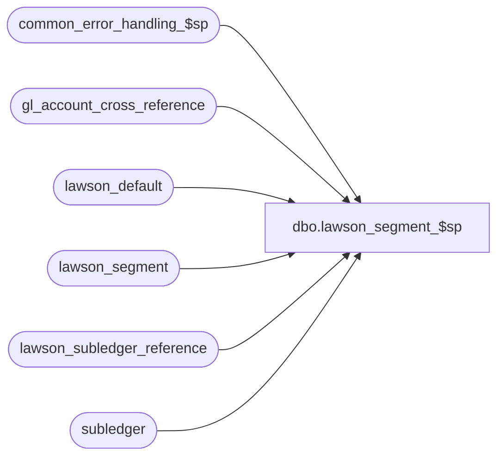

# dbo.lawson_segment_$sp

**Database:** auditworks  
**Server:** bedrockdb01  

## Architecture Diagram



## Table Dependencies

| Referenced Table |
|---|
| common_error_handling_$sp |
| gl_account_cross_reference |
| lawson_default |
| lawson_segment |
| lawson_subledger_reference |
| subledger |

## Stored Procedure Code

```sql
create proc dbo.lawson_segment_$sp @last_date_closed		smalldatetime = NULL,
@period_end_date		smalldatetime = NULL,
@errmsg			nvarchar(255) OUTPUT

AS 


/* 
PROC NAME:   lawson_segment_$sp
PROC DESC:   called from lawson_gl_interface_$sp 
             lawson_column : 4 - old_company, 5 - old_acct_no
             segment_source : 3 - subledger.gl_company, 4 - subledger.gl_account_no
HISTORY
Date      Name      Def       Desc
Jan31,11  Paul       105313   Use unicode datatypes
Sep09,04  Maryam   DV-1120/   Log error message when old_company_no or old_acct_no is null
                   1-L5LTQ/30539
Jan17,03  ShuZ      1-HZ3U2   Change double quote to single quote
DEC04,01  Daphna    1-9DCIX   R3 Error handling
DEC04,01  Daphna    1-9CFYL   set replacement value on ISNULL to string of zeroes instead of 
                              blank spaces
??        ??             ??   author
             
*/

DECLARE
	@errno 			int,
	@process_log_entry 	tinyint,
	@process_no 		smallint,
	@process_timestamp 	float,
	@transaction_count 	numeric(12,0),
	@s1_length		tinyint,
	@s1			nvarchar(35),
	@dynamic_seg		smallint,
	@seg_begin		smallint,
	@seg_end		smallint,
	@seg_count		smallint,
	@seg_length		smallint,
	@column_old_co		smallint,
	@column_old_acct	smallint,
	@source_gl_company	tinyint,
	@source_gl_account	tinyint,
	@zero_filler		nvarchar(160),
-- error handling
     @object_name		nvarchar(255),
     @operation_name	nvarchar(100),
     @process_name		nvarchar(100),
     @message_id		int,
     @log_error_flag	tinyint
	
SELECT
	@source_gl_company = 3,
	@source_gl_account = 4,
	@column_old_co = 4,
	@column_old_acct = 5,
	@errmsg = NULL,
	@process_log_entry = 0,
	@process_no = 205,
	@process_timestamp = 0,
	@transaction_count = 0,
	@zero_filler = REPLICATE('0',160),
	@message_id = 201068,
	@process_name = 'lawson_segment_$sp',
	@log_error_flag = 1  -- called by smartload
	
	

TRUNCATE TABLE lawson_subledger_reference
SELECT @errno = @@error
IF @errno <> 0
  BEGIN
	SELECT @errmsg = 'Unable to truncate table lawson_subledger_reference',
	       @object_name = 'lawson_subledger_reference',
	       @operation_name = 'TRUNCATE TABLE'
	GOTO error
  END
  
/* build hardcoded segment value of old_company*/
SELECT @s1 = old_company
  FROM lawson_default

SELECT @errno = @@error
IF @errno <> 0
  BEGIN
	SELECT @errmsg = '@s1 = old_company',
            @object_name = 'lawson_default',
	       @operation_name = 'SELECT'

	GOTO error
  END

IF @s1 IS NULL
BEGIN
  SELECT @errmsg = 'Invalid default value (NULL) for old_company. Please verify default table',
         @errno = 0
  GOTO error
END

INSERT lawson_subledger_reference(
	gl_company,
	gl_account_id,
	lawson_column)
VALUES (-1, -1, @column_old_co)
SELECT @errno = @@error
IF @errno <> 0
  BEGIN
	SELECT @errmsg = ' -1, -1, @column_old_co',
            @object_name = 'lawson_subledger_reference',
	       @operation_name = 'INSERT'

	GOTO error
  END

SELECT 
	@s1_length = LEN(@s1),
	@seg_count = 1,
	@seg_begin = 1

WHILE 1 = 1
  BEGIN
	SELECT @dynamic_seg = CHARINDEX('#', @s1)

	IF @dynamic_seg = 0
		SELECT @seg_end = @s1_length
	ELSE
		SELECT @seg_end = @dynamic_seg - 1		

	SELECT @seg_length = @seg_end - @seg_begin + 1		

	IF @seg_length > 0
	  BEGIN
		IF @seg_count = 1
		  BEGIN
			UPDATE lawson_subledger_reference
			   SET segment1 = SUBSTRING(@s1, @seg_begin, @seg_length)
			 WHERE gl_company = -1
			   AND gl_account_id = -1
			   AND lawson_column = @column_old_co
			SELECT @errno = @@error
			IF @errno <> 0
			  BEGIN
				SELECT @errmsg = 'segment1, for [ -1, -1, old_company]',
				       @operation_name = 'UPDATE',
				       @object_name = 'lawson_subledger_reference'
				GOTO error
			  END			   
		  END
		ELSE IF @seg_count = 2
		  BEGIN
			UPDATE lawson_subledger_reference
			   SET segment2 = SUBSTRING(@s1, @seg_begin, @seg_length)
			 WHERE gl_company = -1
			   AND gl_account_id = -1
			   AND lawson_column = @column_old_co
			SELECT @errno = @@error
			IF @errno <> 0
			  BEGIN
				SELECT @errmsg = 'segment2, for [ -1, -1, old_company]',
				       @operation_name = 'UPDATE',
				       @object_name = 'lawson_subledger_reference'
				GOTO error
			  END			   
		  END
		ELSE IF @seg_count = 3
		  BEGIN
			UPDATE lawson_subledger_reference
			   SET segment3 = SUBSTRING(@s1, @seg_begin, @seg_length)
			 WHERE gl_company = -1
			   AND gl_account_id = -1
			   AND lawson_column = @column_old_co
			SELECT @errno = @@error
			IF @errno <> 0
			  BEGIN
				SELECT @errmsg = 'segment3, for [ -1, -1, old_company]',
				       @operation_name = 'UPDATE',
				       @object_name = 'lawson_subledger_reference'
				GOTO error
			  END			   
		  END
		ELSE IF @seg_count = 4
		  BEGIN
			UPDATE lawson_subledger_reference
			   SET segment4 = SUBSTRING(@s1, @seg_begin, @seg_length)
			 WHERE gl_company = -1
			   AND gl_account_id = -1
			   AND lawson_column = @column_old_co
			SELECT @errno = @@error
			IF @errno <> 0
			  BEGIN
				SELECT @errmsg = 'segment4, for [ -1, -1, old_company]',
				       @operation_name = 'UPDATE',
				       @object_name = 'lawson_subledger_reference'
				GOTO error
			  END			   
		  END
		ELSE IF @seg_count = 5
		  BEGIN
			UPDATE lawson_subledger_reference
			   SET segment5 = SUBSTRING(@s1, @seg_begin, @seg_length)
			 WHERE gl_company = -1
			   AND gl_account_id = -1
			   AND lawson_column = @column_old_co
			SELECT @errno = @@error
			IF @errno <> 0
			  BEGIN
				SELECT @errmsg = 'segment5, for [ -1, -1, old_company]',
				       @operation_name = 'UPDATE',
				       @object_name = 'lawson_subledger_reference'
				GOTO error
			  END			   
		  END
		ELSE IF @seg_count = 6
		  BEGIN
			UPDATE lawson_subledger_reference
			   SET segment6 = SUBSTRING(@s1, @seg_begin, @seg_length)
			 WHERE gl_company = -1
			   AND gl_account_id = -1
			   AND lawson_column = @column_old_co
			SELECT @errno = @@error
			IF @errno <> 0
			  BEGIN
				SELECT @errmsg = 'segment6, for [ -1, -1, old_company]',
				       @operation_name = 'UPDATE',
				       @object_name = 'lawson_subledger_reference'
				GOTO error
			  END			   
		  END
		ELSE IF @seg_count = 7
		  BEGIN
			UPDATE lawson_subledger_reference
			   SET segment7 = SUBSTRING(@s1, @seg_begin, @seg_length)
			 WHERE gl_company = -1
			   AND gl_account_id = -1
			   AND lawson_column = @column_old_co
			SELECT @errno = @@error
			IF @errno <> 0
			  BEGIN
				SELECT @errmsg = 'segment7, for [ -1, -1, old_company]',
				       @operation_name = 'UPDATE',
				       @object_name = 'lawson_subledger_reference'
				GOTO error
			  END			   
		 END
		ELSE IF @seg_count = 8
		  BEGIN
			UPDATE lawson_subledger_reference
			   SET segment8 = SUBSTRING(@s1, @seg_begin, @seg_length)
			 WHERE gl_company = -1
			   AND gl_account_id = -1
			   AND lawson_column = @column_old_co
			SELECT @errno = @@error
			IF @errno <> 0
			  BEGIN
				SELECT @errmsg = 'segment8, for [ -1, -1, old_company]',
				       @operation_name = 'UPDATE',
				       @object_name = 'lawson_subledger_reference'
				GOTO error
			  END			   
		  END
	  END /* IF @seg_length > 0 */

	IF @dynamic_seg = 0
		BREAK
		  
	SELECT @seg_count = @seg_count + 1	

	SELECT @s1 = substring(@s1, @dynamic_seg + 1, @s1_length - @dynamic_seg)

	SELECT @s1_length = LEN(@s1)

  END /* WHILE 1=1*/

/* build hardcoded segment value of old_account_no */

SELECT  @s1 = old_acct_no
  FROM lawson_default

SELECT @errno = @@error
IF @errno <> 0
BEGIN
  SELECT @errmsg = '@s1 = old_acct_no',
         @operation_name = 'SELECT',
         @object_name = 'lawson_default'
  GOTO error
END

IF @s1 IS NULL
BEGIN
  SELECT @errmsg = 'Invalid default value (NULL) for old_acct_no. Please verify default table',
         @errno = 0
  GOTO error
END

INSERT lawson_subledger_reference(
	gl_company,
	gl_account_id,
	lawson_column)
VALUES (-1, -1, @column_old_acct)

SELECT @errno = @@error
IF @errno <> 0
BEGIN
  SELECT @errmsg = '[ -1, -1, @column_old_acct]',
         @operation_name = 'INSERT',
         @object_name = 'lawson_subledger_reference'
  GOTO error
END

SELECT 
	@s1_length = LEN(@s1),
	@seg_count = 1,
	@seg_begin = 1

WHILE 1 = 1
  BEGIN
	SELECT @dynamic_seg = CHARINDEX('#', @s1)
	IF @dynamic_seg = 0
		SELECT @seg_end = @s1_length
	ELSE
		SELECT @seg_end = @dynamic_seg - 1
	SELECT @seg_length = @seg_end - @seg_begin + 1
	IF @seg_length > 0
	  BEGIN
		IF @seg_count = 1
		  BEGIN
			UPDATE lawson_subledger_reference
			   SET segment1 = SUBSTRING(@s1, @seg_begin, @seg_length)
			 WHERE gl_company = -1
			   AND gl_account_id = -1
			   AND lawson_column = @column_old_acct
			SELECT @errno = @@error
			IF @errno <> 0
			  BEGIN
				SELECT @errmsg = 'segment1, for [ -1, -1, old_acct]',
				       @operation_name = 'UPDATE',
				       @object_name = 'lawson_subledger_reference'

				GOTO error
			  END			   
		  END
		ELSE IF @seg_count = 2
		  BEGIN
			UPDATE lawson_subledger_reference
			   SET segment2 = SUBSTRING(@s1, @seg_begin, @seg_length)
			 WHERE gl_company = -1
			   AND gl_account_id = -1
			   AND lawson_column = @column_old_acct
			SELECT @errno = @@error
			IF @errno <> 0
			  BEGIN
				SELECT @errmsg = 'segment2, for [ -1, -1, old_acct]',
				       @operation_name = 'UPDATE',
				       @object_name = 'lawson_subledger_reference'
				GOTO error
			  END			   
		  END
		ELSE IF @seg_count = 3
		  BEGIN
			UPDATE lawson_subledger_reference
			   SET segment3 = SUBSTRING(@s1, @seg_begin, @seg_length)
			 WHERE gl_company = -1
			   AND gl_account_id = -1
			   AND lawson_column = @column_old_acct
			SELECT @errno = @@error
			IF @errno <> 0
			  BEGIN
				SELECT @errmsg = 'segment3, for [ -1, -1, old_acct]',
				       @operation_name = 'UPDATE',
				       @object_name = 'lawson_subledger_reference'
				GOTO error
			  END			   
		  END
		ELSE IF @seg_count = 4
		  BEGIN
			UPDATE lawson_subledger_reference
			   SET segment4 = SUBSTRING(@s1, @seg_begin, @seg_length)
			 WHERE gl_company = -1
			   AND gl_account_id = -1
			   AND lawson_column = @column_old_acct
			SELECT @errno = @@error
			IF @errno <> 0
			  BEGIN
				SELECT @errmsg = 'segment4, for [ -1, -1, old_company]',
				       @operation_name = 'UPDATE',
				       @object_name = 'lawson_subledger_reference'
				GOTO error
			  END			   
		  END
		ELSE IF @seg_count = 5
		  BEGIN
			UPDATE lawson_subledger_reference
			   SET segment5 = SUBSTRING(@s1, @seg_begin, @seg_length)
			 WHERE gl_company = -1
			   AND gl_account_id = -1
			   AND lawson_column = @column_old_acct
			SELECT @errno = @@error
			IF @errno <> 0
			  BEGIN
				SELECT @errmsg = 'segment5, for [ -1, -1, old_company]',
				       @operation_name = 'UPDATE',
				       @object_name = 'lawson_subledger_reference'
				GOTO error
			  END			   
		  END
		ELSE IF @seg_count = 6
		  BEGIN
			UPDATE lawson_subledger_reference
			   SET segment6 = SUBSTRING(@s1, @seg_begin, @seg_length)
			 WHERE gl_company = -1
			   AND gl_account_id = -1
			   AND lawson_column = @column_old_acct
			SELECT @errno = @@error
			IF @errno <> 0
			  BEGIN
				SELECT @errmsg = 'segment6, for [ -1, -1, old_company]',
				       @operation_name = 'UPDATE',
				       @object_name = 'lawson_subledger_reference'
				GOTO error
			  END			   
		  END
		ELSE IF @seg_count = 7
		  BEGIN
			UPDATE lawson_subledger_reference
			   SET segment7 = SUBSTRING(@s1, @seg_begin, @seg_length)
			 WHERE gl_company = -1
			   AND gl_account_id = -1
			   AND lawson_column = @column_old_acct
			SELECT @errno = @@error
			IF @errno <> 0
			BEGIN
				SELECT @errmsg = 'segment7, for [ -1, -1, old_company]',
				       @operation_name = 'UPDATE',
				       @object_name = 'lawson_subledger_reference'
				GOTO error
			END			   
		 END
		ELSE IF @seg_count = 8
		  BEGIN
			UPDATE lawson_subledger_reference
			   SET segment8 = SUBSTRING(@s1, @seg_begin, @seg_length)
			 WHERE gl_company = -1
			   AND gl_account_id = -1
			   AND lawson_column = @column_old_acct
			SELECT @errno = @@error
			IF @errno <> 0
		     BEGIN
				SELECT @errmsg = 'segment8, for [ -1, -1, old_company]',
				       @operation_name = 'UPDATE',
				       @object_name = 'lawson_subledger_reference'
				GOTO error
		     END			   
		  END
	  END /* IF @seg_length > 0 */

	IF @dynamic_seg = 0
		BREAK
				
	SELECT @seg_count = @seg_count + 1	

	SELECT @s1 = substring(@s1, @dynamic_seg + 1, @s1_length - @dynamic_seg)

	SELECT @s1_length = LEN(@s1)

  END /* WHILE 1=1*/

/* build old_company and old_acct_no */  

INSERT lawson_subledger_reference(
	gl_company,
	gl_account_id,
	lawson_column)
SELECT distinct 
	gl_company,
	gl_account_id,
	@column_old_co
FROM subledger
WHERE posting_status = 0
  AND transaction_date BETWEEN @last_date_closed AND @period_end_date
SELECT @errno = @@error
IF @errno <> 0
BEGIN
  SELECT @errmsg = 'from subledger, @column_old_co',
         @operation_name = 'INSERT',
         @object_name = 'lawson_subledger_reference'
	GOTO error
END

INSERT lawson_subledger_reference(
	gl_company,
	gl_account_id,
	lawson_column)
SELECT distinct 
	gl_company,
	gl_account_id,
	@column_old_acct
FROM subledger
WHERE posting_status = 0
  AND transaction_date BETWEEN @last_date_closed AND @period_end_date
SELECT @errno = @@error
IF @errno <> 0
BEGIN
  SELECT @errmsg = 'from subledger, @column_old_acct',
         @operation_name = 'INSERT',
         @object_name = 'lawson_subledger_reference'
  GOTO error
END
  
/*
** Update segment where source is gl_account_no and
** segment may be a substring extracted either from left to right or from right to left.
** If the segment is extracted from right to left, start_pos must be -1.
** DEF 1-9CFYL: ISNULL replacement value is string of zeroes, instead of spaces
*/
/* from left to right */
UPDATE lawson_subledger_reference
   SET segment1 = ISNULL(SUBSTRING(x.gl_account_no, p.start_pos, p.segment_length), 
                  SUBSTRING(@zero_filler, p.start_pos, p.segment_length))
  FROM lawson_segment p, lawson_subledger_reference l, gl_account_cross_reference x
 WHERE p.lawson_column = l.lawson_column
   AND l.gl_account_id = x.gl_account_id
   AND p.segment_counter = 1
   AND p.start_pos > 0
   AND p.segment_source = @source_gl_account
SELECT @errno = @@error
IF @errno <> 0
BEGIN
  SELECT @errmsg = 'segment1, from gl_acct_cross_ref, L to R',
         @operation_name = 'UPDATE',
         @object_name = 'lawson_subledger_reference'
  GOTO error
END
  
UPDATE lawson_subledger_reference
   SET segment2 = ISNULL(SUBSTRING(x.gl_account_no, p.start_pos, p.segment_length), 
                   SUBSTRING(@zero_filler, p.start_pos, p.segment_length))
  FROM lawson_segment p, lawson_subledger_reference l, gl_account_cross_reference x
 WHERE p.lawson_column = l.lawson_column
   AND l.gl_account_id = x.gl_account_id
   AND p.segment_counter = 2
   AND p.start_pos > 0
   AND p.segment_source = @source_gl_account
SELECT @errno = @@error
IF @errno <> 0
BEGIN
  SELECT @errmsg = 'segment2, from gl_acct_cross_ref, L to R',
         @operation_name = 'UPDATE',
         @object_name = 'lawson_subledger_reference'
  GOTO error
END

UPDATE lawson_subledger_reference
   SET segment3 = ISNULL(SUBSTRING(x.gl_account_no, p.start_pos, p.segment_length), 
                    SUBSTRING(@zero_filler, p.start_pos, p.segment_length))
  FROM lawson_segment p, lawson_subledger_reference l, gl_account_cross_reference x
 WHERE p.lawson_column = l.lawson_column
   AND l.gl_account_id = x.gl_account_id
   AND p.segment_counter = 3
   AND p.start_pos > 0
   AND p.segment_source = @source_gl_account

SELECT @errno = @@error
IF @errno <> 0
BEGIN
  SELECT @errmsg = 'segment3, from gl_acct_cross_ref, L to R',
         @operation_name = 'UPDATE',
         @object_name = 'lawson_subledger_reference'
  GOTO error
END

UPDATE lawson_subledger_reference
   SET segment4 = ISNULL(SUBSTRING(x.gl_account_no, p.start_pos, p.segment_length), 
                     SUBSTRING(@zero_filler, p.start_pos, p.segment_length))
  FROM lawson_segment p, lawson_subledger_reference l, gl_account_cross_reference x
 WHERE p.lawson_column = l.lawson_column
   AND l.gl_account_id = x.gl_account_id
   AND p.segment_counter = 4
   AND p.start_pos > 0
   AND p.segment_source = @source_gl_account

SELECT @errno = @@error
IF @errno <> 0
BEGIN
  SELECT @errmsg = 'segment4, from gl_acct_cross_ref, L to R',
         @operation_name = 'UPDATE',
         @object_name = 'lawson_subledger_reference'
  GOTO error
END

UPDATE lawson_subledger_reference
   SET segment5 = ISNULL(SUBSTRING(x.gl_account_no, p.start_pos, p.segment_length), 
                    SUBSTRING(@zero_filler, p.start_pos, p.segment_length))
  FROM lawson_segment p, lawson_subledger_reference l, gl_account_cross_reference x
 WHERE p.lawson_column = l.lawson_column
   AND l.gl_account_id = x.gl_account_id
   AND p.segment_counter = 5
   AND p.start_pos > 0
   AND p.segment_source = @source_gl_account

SELECT @errno = @@error
IF @errno <> 0
BEGIN
  SELECT @errmsg = 'segment5, from gl_acct_cross_ref, L to R',
         @operation_name = 'UPDATE',
         @object_name = 'lawson_subledger_reference'
  GOTO error
END

UPDATE lawson_subledger_reference
   SET segment6 = ISNULL(SUBSTRING(x.gl_account_no, p.start_pos, p.segment_length), 
                      SUBSTRING(@zero_filler, p.start_pos, p.segment_length))
  FROM lawson_segment p, lawson_subledger_reference l, gl_account_cross_reference x
 WHERE p.lawson_column = l.lawson_column
   AND l.gl_account_id = x.gl_account_id
   AND p.segment_counter = 6
   AND p.start_pos > 0
   AND p.segment_source = @source_gl_account

SELECT @errno = @@error
IF @errno <> 0
BEGIN
  SELECT @errmsg = 'segment6, from gl_acct_cross_ref, L to R',
         @operation_name = 'UPDATE',
         @object_name = 'lawson_subledger_reference'
  GOTO error
END

UPDATE lawson_subledger_reference
   SET segment7 = ISNULL(SUBSTRING(x.gl_account_no, p.start_pos, p.segment_length), 
           SUBSTRING(@zero_filler, p.start_pos, p.segment_length))
  FROM lawson_segment p, lawson_subledger_reference l, gl_account_cross_reference x
 WHERE p.lawson_column = l.lawson_column
   AND l.gl_account_id = x.gl_account_id
   AND p.segment_counter = 7
   AND p.start_pos > 0
   AND p.segment_source = @source_gl_account
SELECT @errno = @@error
IF @errno <> 0
BEGIN
  SELECT @errmsg = 'segment7, from gl_acct_cross_ref, L to R',
         @operation_name = 'UPDATE',
         @object_name = 'lawson_subledger_reference'
  GOTO error
END

UPDATE lawson_subledger_reference
   SET segment8 = ISNULL(SUBSTRING(x.gl_account_no, p.start_pos, p.segment_length), 
                    SUBSTRING(@zero_filler, p.start_pos, p.segment_length))
  FROM lawson_segment p, lawson_subledger_reference l, gl_account_cross_reference x
 WHERE p.lawson_column = l.lawson_column
   AND l.gl_account_id = x.gl_account_id
   AND p.segment_counter = 8
   AND p.start_pos > 0
   AND p.segment_source = @source_gl_account

SELECT @errno = @@error
IF @errno <> 0
BEGIN
  SELECT @errmsg = 'segment8, from gl_acct_cross_ref, L to R',
         @operation_name = 'UPDATE',
         @object_name = 'lawson_subledger_reference'
	GOTO error
END

/* from right to left */
   
UPDATE lawson_subledger_reference
   SET segment1 = ISNULL(RIGHT(x.gl_account_no, p.segment_length), 
                     RIGHT(@zero_filler, p.segment_length))
  FROM lawson_segment p, lawson_subledger_reference l, gl_account_cross_reference x
 WHERE p.lawson_column = l.lawson_column
   AND l.gl_account_id = x.gl_account_id
   AND p.segment_counter = 1
   AND p.start_pos < 0
   AND p.segment_source = @source_gl_account
SELECT @errno = @@error
IF @errno <> 0
BEGIN
  SELECT @errmsg = 'segment1, from gl_acct_cross_ref, R to L',
         @operation_name = 'UPDATE',
         @object_name = 'lawson_subledger_reference'
	GOTO error
END

UPDATE lawson_subledger_reference
   SET segment2 = ISNULL(RIGHT(x.gl_account_no, p.segment_length),  
                      RIGHT(@zero_filler, p.segment_length))
  FROM lawson_segment p, lawson_subledger_reference l, gl_account_cross_reference x
 WHERE p.lawson_column = l.lawson_column
   AND l.gl_account_id = x.gl_account_id
   AND p.segment_counter = 2
   AND p.start_pos < 0
   AND p.segment_source = @source_gl_account

SELECT @errno = @@error
IF @errno <> 0
BEGIN
  SELECT @errmsg = 'segment2, from gl_acct_cross_ref, R to L',
         @operation_name = 'UPDATE',
         @object_name = 'lawson_subledger_reference'
	GOTO error
END

UPDATE lawson_subledger_reference
   SET segment3 = ISNULL(RIGHT(x.gl_account_no, p.segment_length), 
                       RIGHT(@zero_filler, p.segment_length))
  FROM lawson_segment p, lawson_subledger_reference l, gl_account_cross_reference x
 WHERE p.lawson_column = l.lawson_column
   AND l.gl_account_id = x.gl_account_id
   AND p.segment_counter = 3
   AND p.start_pos < 0
   AND p.segment_source = @source_gl_account

SELECT @errno = @@error
IF @errno <> 0
BEGIN
  SELECT @errmsg = 'segment3, from gl_acct_cross_ref, R to L',
         @operation_name = 'UPDATE',
         @object_name = 'lawson_subledger_reference'
	GOTO error
END

UPDATE lawson_subledger_reference
   SET segment4 = ISNULL(RIGHT(x.gl_account_no, p.segment_length), 
                       RIGHT(@zero_filler, p.segment_length))
  FROM lawson_segment p, lawson_subledger_reference l, gl_account_cross_reference x
 WHERE p.lawson_column = l.lawson_column
   AND l.gl_account_id = x.gl_account_id
   AND p.segment_counter = 4
   AND p.start_pos < 0
   AND p.segment_source = @source_gl_account

SELECT @errno = @@error
IF @errno <> 0
BEGIN
  SELECT @errmsg = 'segment4, from gl_acct_cross_ref, R to L',
         @operation_name = 'UPDATE',
         @object_name = 'lawson_subledger_reference'
	GOTO error
END

UPDATE lawson_subledger_reference
   SET segment5 = ISNULL(RIGHT(x.gl_account_no, p.segment_length), 
                      RIGHT(@zero_filler, p.segment_length))
  FROM lawson_segment p, lawson_subledger_reference l, gl_account_cross_reference x
 WHERE p.lawson_column = l.lawson_column
   AND l.gl_account_id = x.gl_account_id
   AND p.segment_counter = 5
   AND p.start_pos < 0
   AND p.segment_source = @source_gl_account

SELECT @errno = @@error
IF @errno <> 0
BEGIN
  SELECT @errmsg = 'segment5, from gl_acct_cross_ref, R to L',
         @operation_name = 'UPDATE',
         @object_name = 'lawson_subledger_reference'
	GOTO error
END

UPDATE lawson_subledger_reference
   SET segment6 = ISNULL(RIGHT(x.gl_account_no, p.segment_length), 
                        RIGHT(@zero_filler, p.segment_length))
  FROM lawson_segment p, lawson_subledger_reference l, gl_account_cross_reference x
 WHERE p.lawson_column = l.lawson_column
   AND l.gl_account_id = x.gl_account_id
   AND p.segment_counter = 6
   AND p.start_pos < 0
   AND p.segment_source = @source_gl_account

SELECT @errno = @@error
IF @errno <> 0
BEGIN
  SELECT @errmsg = 'segment6, from gl_acct_cross_ref, R to L',
         @operation_name = 'UPDATE',
         @object_name = 'lawson_subledger_reference'
	GOTO error
END

UPDATE lawson_subledger_reference
   SET segment7 = ISNULL(RIGHT(x.gl_account_no, p.segment_length), 
                     RIGHT(@zero_filler, p.segment_length))
  FROM lawson_segment p, lawson_subledger_reference l, gl_account_cross_reference x
 WHERE p.lawson_column = l.lawson_column
   AND l.gl_account_id = x.gl_account_id
   AND p.segment_counter = 7
   AND p.start_pos < 0
   AND p.segment_source = @source_gl_account

SELECT @errno = @@error
IF @errno <> 0
BEGIN
  SELECT @errmsg = 'segment7, from gl_acct_cross_ref, R to L',
         @operation_name = 'UPDATE',
         @object_name = 'lawson_subledger_reference'
	GOTO error
END

UPDATE lawson_subledger_reference
   SET segment8 = ISNULL(RIGHT(x.gl_account_no, p.segment_length), 
                       RIGHT(@zero_filler, p.segment_length))
  FROM lawson_segment p, lawson_subledger_reference l, gl_account_cross_reference x
 WHERE p.lawson_column = l.lawson_column
   AND l.gl_account_id = x.gl_account_id
   AND p.segment_counter = 8
   AND p.start_pos < 0
   AND p.segment_source = @source_gl_account

SELECT @errno = @@error
IF @errno <> 0
BEGIN
  SELECT @errmsg = 'segment8, from gl_acct_cross_ref, R to L',
         @operation_name = 'UPDATE',
         @object_name = 'lawson_subledger_reference'
	GOTO error
END

/* if segment_source is gl_company:
** segment_length is treated as number of digits, 
** start_pos will be ignored.
*/

UPDATE lawson_subledger_reference
   SET segment1 = RIGHT ( REPLICATE('0', p.segment_length) + LTRIM (RTRIM (convert(nchar(35), l.gl_company)))
                          , p.segment_length)
  FROM lawson_segment p, lawson_subledger_reference l
 WHERE p.lawson_column = l.lawson_column
   AND p.segment_counter = 1
   AND p.segment_source = @source_gl_company
   AND l.gl_company != -1
   AND l.gl_account_id != -1

SELECT @errno = @@error
IF @errno <> 0
BEGIN
  SELECT @errmsg = 'segment1, from lawson_segment',
         @operation_name = 'UPDATE',
         @object_name = 'lawson_subledger_reference'
	GOTO error
END

UPDATE lawson_subledger_reference
   SET segment2 = RIGHT ( REPLICATE('0', p.segment_length) + LTRIM (RTRIM (convert(nchar(35), l.gl_company)))
                          , p.segment_length)
  FROM lawson_segment p, lawson_subledger_reference l
 WHERE p.lawson_column = l.lawson_column
   AND p.segment_counter = 2
   AND p.segment_source = @source_gl_company
   AND l.gl_company != -1
   AND l.gl_account_id != -1

SELECT @errno = @@error
IF @errno <> 0
BEGIN
  SELECT @errmsg = 'segment2, from lawson_segment',
         @operation_name = 'UPDATE',
         @object_name = 'lawson_subledger_reference'
	GOTO error
END

UPDATE lawson_subledger_reference
   SET segment3 = RIGHT ( REPLICATE('0', p.segment_length) + LTRIM (RTRIM (convert(nchar(35), l.gl_company)))
                          , p.segment_length)
  FROM lawson_segment p, lawson_subledger_reference l
 WHERE p.lawson_column = l.lawson_column
   AND p.segment_counter = 3
   AND p.segment_source = @source_gl_company
   AND l.gl_company != -1
   AND l.gl_account_id != -1

SELECT @errno = @@error
IF @errno <> 0
BEGIN
  SELECT @errmsg = 'segment3, from lawson_segment',
         @operation_name = 'UPDATE',
         @object_name = 'lawson_subledger_reference'
	GOTO error
END

UPDATE lawson_subledger_reference
   SET segment4 = RIGHT ( REPLICATE('0', p.segment_length) + LTRIM (RTRIM (convert(nchar(35), l.gl_company)))
                          , p.segment_length)
  FROM lawson_segment p, lawson_subledger_reference l
 WHERE p.lawson_column = l.lawson_column
   AND p.segment_counter = 4
   AND p.segment_source = @source_gl_company
   AND l.gl_company != -1
   AND l.gl_account_id != -1
SELECT @errno = @@error
IF @errno <> 0
BEGIN
  SELECT @errmsg = 'segment4, from lawson_segment',
         @operation_name = 'UPDATE',
        @object_name = 'lawson_subledger_reference'
	GOTO error
END

UPDATE lawson_subledger_reference
   SET segment5 = RIGHT ( REPLICATE('0', p.segment_length) + LTRIM (RTRIM (convert(nchar(35), l.gl_company)))
                          , p.segment_length)
  FROM lawson_segment p, lawson_subledger_reference l
 WHERE p.lawson_column = l.lawson_column
   AND p.segment_counter = 5
AND p.segment_source = @source_gl_company
   AND l.gl_company != -1
   AND l.gl_account_id != -1
SELECT @errno = @@error
IF @errno <> 0
BEGIN
  SELECT @errmsg = 'segment5 from lawson_segment',
         @operation_name = 'UPDATE',
         @object_name = 'lawson_subledger_reference'
	GOTO error
END

UPDATE lawson_subledger_reference
   SET segment6 = RIGHT ( REPLICATE('0', p.segment_length) + LTRIM (RTRIM (convert(nchar(35), l.gl_company)))
                          , p.segment_length)
  FROM lawson_segment p, lawson_subledger_reference l
 WHERE p.lawson_column = l.lawson_column
   AND p.segment_counter = 6
   AND p.segment_source = @source_gl_company
   AND l.gl_company != -1
   AND l.gl_account_id != -1

SELECT @errno = @@error
IF @errno <> 0
BEGIN
  SELECT @errmsg = 'segment6, from lawson_segment',
         @operation_name = 'UPDATE',
         @object_name = 'lawson_subledger_reference'
	GOTO error
END

UPDATE lawson_subledger_reference
   SET segment7 = RIGHT ( REPLICATE('0', p.segment_length) + LTRIM (RTRIM (convert(nchar(35), l.gl_company)))
                          , p.segment_length)
  FROM lawson_segment p, lawson_subledger_reference l
 WHERE p.lawson_column = l.lawson_column
   AND p.segment_counter = 7
   AND p.segment_source = @source_gl_company
   AND l.gl_company != -1
   AND l.gl_account_id != -1

SELECT @errno = @@error
IF @errno <> 0
BEGIN
  SELECT @errmsg = 'segment7, from lawson_segment',
         @operation_name = 'UPDATE',
         @object_name = 'lawson_subledger_reference'
	GOTO error
END

UPDATE lawson_subledger_reference
   SET segment8 = RIGHT ( REPLICATE('0', p.segment_length) + LTRIM (RTRIM (convert(nchar(35), l.gl_company)))
                          , p.segment_length)
  FROM lawson_segment p, lawson_subledger_reference l
 WHERE p.lawson_column = l.lawson_column
   AND p.segment_counter = 8
   AND p.segment_source = @source_gl_company
   AND l.gl_company != -1
   AND l.gl_account_id != -1

SELECT @errno = @@error
IF @errno <> 0
BEGIN
  SELECT @errmsg = 'segment8, from lawson_segment',
         @operation_name = 'UPDATE',
         @object_name = 'lawson_subledger_reference'
	GOTO error
END


RETURN


error:   /* Common error handler */

	IF @@trancount > 0
		ROLLBACK TRANSACTION

     EXEC common_error_handling_$sp @process_no, @errno, @errmsg, 0, @message_id,
                     @process_name, @object_name, @operation_name, @log_error_flag 
	RETURN
```

