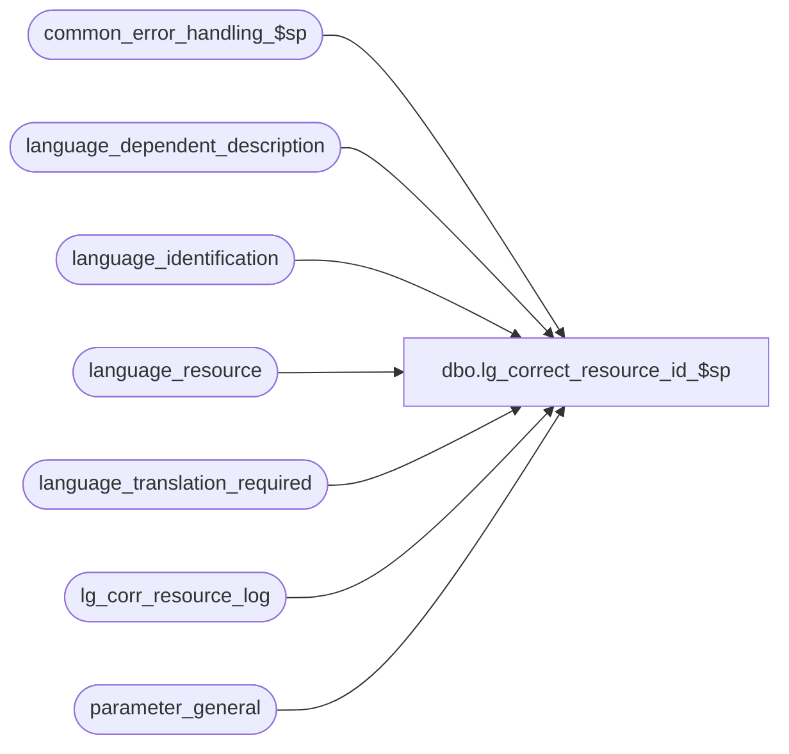

# dbo.lg_correct_resource_id_$sp

**Database:** auditworks  
**Server:** bedrockdb01  

## Architecture Diagram



## Table Dependencies

| Referenced Table |
|---|
| common_error_handling_$sp |
| language_dependent_description |
| language_identification |
| language_resource |
| language_translation_required |
| lg_corr_resource_log |
| parameter_general |

## Stored Procedure Code

```sql
create proc dbo.lg_correct_resource_id_$sp AS
/* 
PROC NAME:   lg_correct_resource_id_$sp
PROC DESC:   To update the resource_id of newly added system rows in any of the various 
             master tables. Logs row counts updated to lg_corr_resource_log . 
             Called by CM release_no_$upgr and it runs when parameter_general.upgrade_in_progress = 1.
HISTORY
Date     Name              Def# Desc
Apr20,15 Paul         TFS-110734 improved error messages 
Sep30,14 Vicci        TFS-86317 Turn off upgrade in progress since otherwise, when updating a NULL resource-id to NULL in a given table, the 
                                table's trigger does not fire and assign a user-defined resource_id.
Sep29,14 Vicci        TFS-86316 Refix 82444 not to use u. alias since this doesn't match language_translation_required and the latter is also reference by 2 other triggers.
                                Remove override of language_translation_required TBDAT since causes a mismatch with the repo.
Sep16,14 Paul         TFS-82444 do less work if multilanguage is not activated, use try .. catch,
                                add batching logic to improve update trigger performance when a master table contains > 100000 rows.
                                log row counts to lg_corr_resource_log instead of printing.
Nov05,10 Vicci           122509 clean up orphaned resource_id.
Jan14,09 Vicci           104484 Only process valid table names. 
Sep06.06 Daphna           75320 MSSQL2005 prevent null string
May06/04 Vicci      28697/28698 Don't update resource_id unless it has changed.
Oct07/03 Vicci            16590 author

*/

DECLARE @errline			int,
	@batch_size			int,
	@errmsg 			nvarchar(2000),
	@errno				int,
	@current_date			datetime,
	@log_error_flag			tinyint,
	@loop_counter                   smallint,
	@message_id			int,
	@multilanguage_update		tinyint,
	@object_name			nvarchar(255),
	@operation_name     		nvarchar(100),
	@process_no			int,
	@process_name			nvarchar(100),
	@rows				int,
	@rows_updated			int,
	@sql_command			nvarchar(2000),
	@sql_errmsg			nvarchar(500),
	@table_col			nvarchar(100),
	@cursor_open			tinyint,
    @upgrade_in_progress    tinyint;


SET CONCAT_NULL_YIELDS_NULL OFF;
SET NOCOUNT ON;

SELECT @log_error_flag = 1, -- called by smartload
       @multilanguage_update = 0,
       @process_no = 0, -- Table Maintenance
       @process_name = 'lg_correct_resource_id_$sp',
       @message_id = 201068,
       @errmsg = 'Unable to select from language_identification',
       @object_name = 'language_identification',
       @operation_name = 'SELECT',
       @sql_errmsg = ' ',
       @current_date = getdate();

BEGIN TRY

/* check whether multi-language is active */
IF EXISTS (SELECT active_flag
               FROM language_identification
              WHERE language_id <> 1033 AND active_flag = 1) 
   SELECT @multilanguage_update = 1;

SELECT @errmsg = 'Unable to determine if upgrade is in progress. ',
       @object_name = 'parameter_general'
SELECT @upgrade_in_progress = upgrade_in_progress
  FROM parameter_general;

SELECT @errmsg = 'Unable to delete old rows from lg_corr_resource_log',
           @object_name = 'lg_corr_resource_log',
           @operation_name = 'DELETE';
DELETE lg_corr_resource_log
 WHERE execution_datetime <= DATEADD(dd,-90,@current_date);

  
SELECT @errmsg = 'Unable to determine which tables require a resource_id update',
           @object_name = 'processing_cursor',
           @operation_name = 'OPEN',
           @batch_size = 100000;

/* In a multi-language environment, any rows where resource_id is null need to be updated, and when the subquery finds no row, 
   then the table's resource_id will be updated from null to null, which fires a trigger to generate a new resource_id.

   In a non-multi-lang environment, don't attempt the update for any rows where resource_id is null and where no matching 
   table_key exists for that table in language_resource since that would be unnecessary work.

   For all environments, also need to correct resource_id mismatches where resource_id is not null in the table to be updated
    yet the same resource_id does not exist in table language_resource.

   The above requirements essentially require searching all rows, but limiting the number of rows found still 
   improves performance when an update trigger fires when many rows exist in the inserted and deleted pseudo tables. 

*/

DECLARE processing_cursor CURSOR FAST_FORWARD
 FOR
  SELECT 'UPDATE TOP(' + CONVERT(nvarchar,@batch_size) +') ' + ltr.table_name + ' 
   SET ' + ltr.resource_column_name + ' = (SELECT r.resource_id 
                        FROM language_resource r
                       WHERE r.table_name = ''' + ltr.table_name + '''
                         AND r.table_key = ' + ltr.table_key + ')' + '
 WHERE ' + 
  CASE WHEN @multilanguage_update = 0 THEN
   'EXISTS'
  ELSE
ltr.table_name + '.' + ltr.resource_column_name + ' IS NULL OR NOT EXISTS'
  END
  + '(SELECT 1 FROM language_resource r '
  +  ' WHERE COALESCE(' + ltr.table_name + '.' + ltr.resource_column_name + ',0) '
  + CASE WHEN @multilanguage_update = 0 THEN '<> r.resource_id '
    ELSE '= r.resource_id ' END 
  +  ' AND r.table_name = ''' + ltr.table_name + ''''
  +  ' AND r.table_key = ' + ltr.table_key + ')'
  + CASE WHEN @multilanguage_update = 0 THEN 
     ' OR (' + ltr.table_name + '.' + ltr.resource_column_name + ' IS NOT NULL AND NOT EXISTS(SELECT 1 FROM language_resource r2 WHERE COALESCE(' 
     + ltr.table_name + '.' + ltr.resource_column_name + ',0) = r2.resource_id'
     + ' AND r2.table_name = ''' + ltr.table_name + ''''
     + ' AND r2.table_key = ' + ltr.table_key + '))'
    ELSE ' ' END,
   ltr.table_name + '/' + ltr.resource_column_name
   FROM language_translation_required ltr
   INNER JOIN sysobjects s ON (s.type = 'U' AND s.name = ltr.table_name)
   WHERE ltr.table_name <> 'master_code_description'
   ORDER BY ltr.table_name, ltr.resource_column_name;

OPEN processing_cursor;
SELECT @cursor_open = 1;

FETCH processing_cursor
 INTO @sql_command, @table_col;

IF @upgrade_in_progress != 0
BEGIN 
  SELECT @errmsg = 'Unable to turn off upgrade in progress flag. ',
         @object_name = 'parameter_general'
  UPDATE parameter_general
   SET upgrade_in_progress = 0;
END;

SELECT @errmsg = 'Unable to execute dynamic sql ',
       @object_name = 'sp_executesql',
       @operation_name = 'EXEC';

 WHILE @@fetch_status = 0 
 BEGIN

  SELECT @sql_errmsg = SUBSTRING(@sql_command,1,500),
  	@rows_updated = 0,
  	@loop_counter = 0;

  INSERT INTO lg_corr_resource_log (execution_datetime, key_col, row_count, lg_query)
  VALUES (@current_date, @table_col, @rows_updated, @sql_command);

  /* loop until all batches for one table - column have been updated.
     Added a loop counter as an additional precaution in order to avoid
     any chance of excessive loops in unusual data scenarios.  */

  WHILE @loop_counter <= 10
  BEGIN

  EXEC sp_executesql @sql_command;
  SELECT @rows = @@rowcount;
  SELECT @rows_updated = @rows_updated + @rows,
         @loop_counter = @loop_counter + 1;

  IF @rows < @batch_size
    BREAK;

  END; -- While @loop_counter <= 10

  IF @rows_updated > 0
    UPDATE lg_corr_resource_log
     SET  row_count = @rows_updated
    WHERE execution_datetime = @current_date
      AND key_col = @table_col;

  FETCH processing_cursor
  INTO @sql_command, @table_col;
 END; /* while not end of cursor */

CLOSE processing_cursor;
DEALLOCATE processing_cursor;
SELECT @cursor_open = 0,
   @sql_errmsg = ' ';

  SELECT @errmsg = 'Unable to clean up orphaned resource_ids',
         @object_name = 'language_dependent_description',
         @operation_name = 'DELETE';
DELETE language_dependent_description
 FROM language_dependent_description ldd
 WHERE NOT EXISTS( SELECT 1
                   FROM language_resource lr
                   WHERE ldd.resource_id = lr.resource_id)
   AND ldd.resource_id > 10000000;


/* If upgrade_in_progress was originally on, then turn it back on now. */
 
IF @upgrade_in_progress != 0
BEGIN 
  SELECT @errmsg = 'Unable to turn back on upgrade in progress flag. ',
         @object_name = 'parameter_general'
  UPDATE parameter_general
     SET upgrade_in_progress = @upgrade_in_progress;
END;

RETURN;

END TRY
  
BEGIN CATCH; -- trap system errors
    /* common error handling. Appending proc name here because a rollback could occur if called within a transaction. */

        SELECT @errno = ERROR_NUMBER(),
		@errline = ERROR_LINE();

        SELECT @errmsg = CONVERT(nvarchar, @errno) + ':' + @process_name + ':' + CONVERT(nvarchar, @errline) + ':'
               + COALESCE(@errmsg, ' ') + ':' + @sql_errmsg + ':' + ERROR_MESSAGE();

	IF @cursor_open <> 0
	  BEGIN
	    CLOSE processing_cursor;
	    DEALLOCATE processing_cursor;
	  END;	  
	  
	EXEC common_error_handling_$sp @process_no, @errno, @errmsg, 0, @message_id, 
	    @process_name, @object_name, @operation_name, @log_error_flag;

	RETURN;
END CATCH;
```

