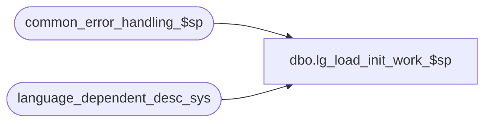

# dbo.lg_load_init_work_$sp

**Database:** auditworks  
**Server:** bedrockdb01  

## Architecture Diagram



## Table Dependencies

| Referenced Table |
|---|
| common_error_handling_$sp |
| language_dependent_desc_sys |

## Stored Procedure Code

```sql
create proc dbo.lg_load_init_work_$sp 
AS
/* 
PROC NAME:   lg_load_init_work_$sp
     DESC:   To delete system supplied translations from the base list of language translations prior to the reload.
             Used by cbuilds and ibuilds prior to loading the language tbdat into the system table.

  Same version for 5.0 and 5.1.
  Note: must copy any proc changes to upgr lg_init_work_tables_$upgr (create new version) because the upgr creates the proc and then executes it.

HISTORY
Note:  unicode compliant version

Date     Name              Def# Desc
Mar11,14 Vicci           150527 Add support for Chinese -People's Republic of China (2052).
Feb27,13 Vicci           142092 Add support for Mexican Spanish (2058).
Jun10,11 Vicci           127716 Replace usage of language_dependent_desc_eng, _fre, _uk with language_dependent_desc_sys
May05,10 Paul            117568 trap case where language_dependent_desc_eng table does not exist
Jul29,08 Paul                   author

*/

DECLARE @errmsg 			nvarchar(255),
	@errno				int,
	@language_id			smallint,
	@log_error_flag			tinyint,
	@message_id			int,
	@object_name			nvarchar(255),
	@operation_name     		nvarchar(100),
	@process_no			int,
	@process_name			nvarchar(100),
	@sql_command                    nvarchar(2000),
	@table_exists			smallint

SELECT @log_error_flag = 1, -- called by smartload
       @process_no = 0, -- Table Maintenance
       @process_name = 'lg_load_init_work_$sp',
       @message_id = 201068,
       @errno = 0

PRINT ' *** Clearing staging table language_dependent_desc_sys prior to data load.'

DELETE language_dependent_desc_sys
 WHERE resource_id < 10000000
   AND language_id in (1033, 3084, 2057, 2058, 2052)  --the languages for which translations are supplied.
 SELECT @errno = @@error
IF @errno != 0
BEGIN
  SELECT @errmsg = 'Failed to remove system supplied language translations from system language-dependent description table',
         @object_name = 'language_dependent_desc_sys',
   	 @operation_name = 'DELETE'
  GOTO error
END

RETURN

error:   /* Common error handler. */
  EXEC common_error_handling_$sp @process_no, @errno, @errmsg, 0, @message_id, 
       @process_name, @object_name, @operation_name, @log_error_flag 
  RETURN
```

